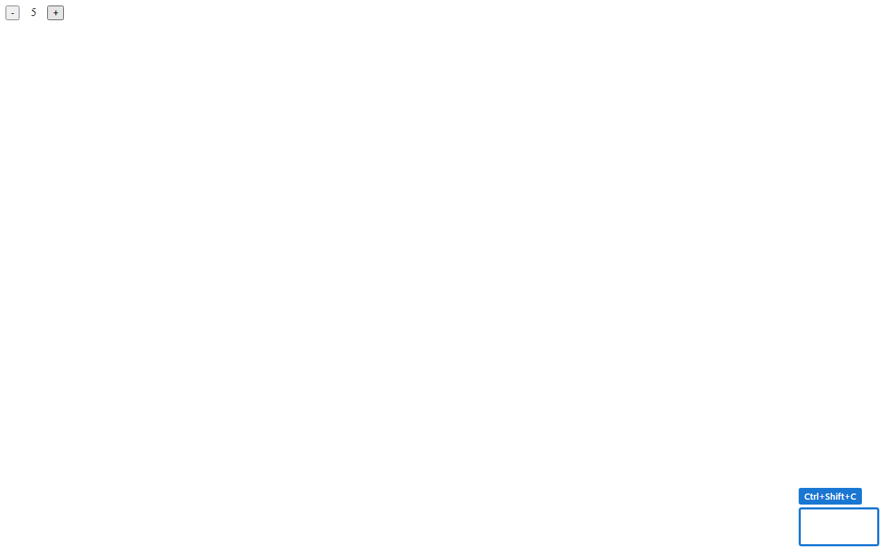
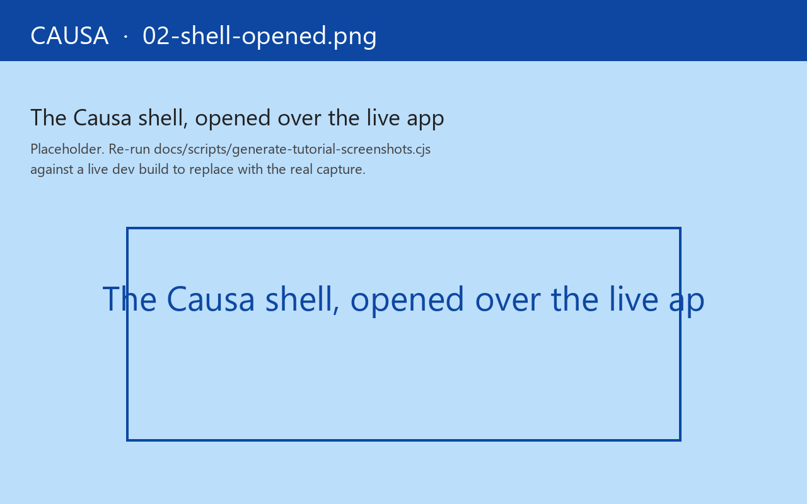

# 1. Installation

Five minutes, two edits.

## 1. Add the dependency

Causa lives at [`tools/causa/`](https://github.com/day8/re-frame2/tree/main/tools/causa) under coord `day8/re-frame2-causa`. While re-frame2 is in alpha, use the `:local/root` route from a clone of the repo:

```clojure
;; deps.edn — a dev alias only; Causa must NEVER appear in production deps
{:aliases
 {:dev
  {:extra-deps {day8/re-frame2-causa {:local/root "tools/causa"}}}}}
```

Once we publish to Clojars, the dev-deps coord will be `day8/re-frame2-causa {:mvn/version "0.0.1.alpha"}` (tracking the repo's [`VERSION`](https://github.com/day8/re-frame2/blob/main/VERSION) file). Until then, vendor through a checkout.

## 2. Wire the preload

```clojure
;; shadow-cljs.edn — dev build only
{:builds
 {:app
  {:devtools {:preloads [day8.re-frame2-causa.preload]}}}}
```

That's it. The preload registers Causa's listeners, attaches the `Ctrl+Shift+C` keybinding, and mounts a hidden DOM root. **No code change in your app**. No `(require '[day8.re-frame2-causa.core])`. No `init!` call. The preload is the entire integration surface.

A re-frame2 dev build with that preload, reloaded, is the precondition for the rest of this tutorial.

## 3. Launch

Open your app in dev. You'll see a small **floating pill** in the bottom-right corner:



Press `Ctrl+Shift+C` (or click the pill). The shell mounts:



The shell is a three-region layout:

- **Sidebar** (left): the panel list.
- **Canvas** (right): the selected panel.
- **Bottom rail**: the time-travel scrubber.

The first paint happens lazily on this first keypress — the preload only registers listeners; the React tree pays construction cost only here. The published target is **&lt;80 ms** from press to interactive paint; in practice it's usually well under that.

## Keybindings

The shell wires four global keybindings:

| Action | Keys |
|---|---|
| Open / close | `Ctrl+Shift+C` |
| Pop to second window | `Ctrl+Shift+P` |
| Toggle AI co-pilot rail | `Ctrl+Shift+/` |
| Command palette | `Ctrl+K` |

The popout uses `window.opener` to reach the host's runtime — same listeners, same registrar — so the popped window shows everything the main window does. Useful when the panel is competing with the app for screen space.

## Disable

Two ways out:

```edn
;; 1. Remove the preload entirely (recommended for prod builds)
{:builds {:app {:devtools {:preloads []}}}}

;; 2. Or keep the preload but force the shell off
{:builds {:app {:compiler-options
                {:closure-defines
                 {day8.re-frame2-causa.config/enabled? false}}}}}
```

Option 2 is for the rare case where you want to disable Causa in a specific dev build (say, when profiling raw render cost). Option 1 is the canonical way to keep Causa out of a release.

## Production: nothing ships

Causa is **dev-only** by construction. Under `:advanced` compilation with `goog.DEBUG=false`:

- The preload entry, by Closure DCE rules, is reachable only through dev-build paths; production builds don't `:require` it.
- The framework's trace bus is gated on `re-frame.interop/debug-enabled?`. With `goog.DEBUG=false`, every `register-trace-cb!` registration is elided at the source.
- Source-coord stamping (`data-rf2-source-coord` on every rendered element) is gated on the same `debug-enabled?`. The rendered HTML in a production bundle carries no source-coord bytes.

A CI gate at [`implementation/scripts/check-bundle-isolation.cjs`](https://github.com/day8/re-frame2/blob/main/implementation/scripts/check-bundle-isolation.cjs) greps the plain `examples/counter` production bundle for Causa-internal sentinel strings; any hit is a PR-failing regression. The elision holds whether you remember to remove the preload or not.

## Quick sanity check

The counter example bundle is the smallest thing that exercises the full pipeline. Inside this repo:

```bash
cd implementation
npx shadow-cljs watch examples/counter   # dev build with Causa preloaded
npx http-server -p 8080 out/examples/counter
# then browser: http://localhost:8080 and press Ctrl+Shift+C
```

Click the `+` button a few times, press `Ctrl+Shift+C`, and you should see the Event-detail panel painting the cascade your clicks produced. That's the smoke test.

When that works on your own app, you're ready for the [panel tour](02-panel-tour.md).
