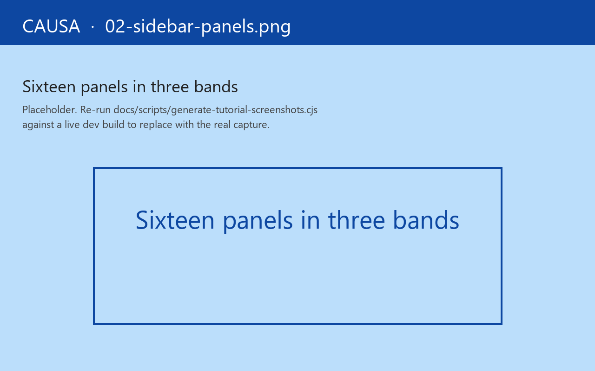
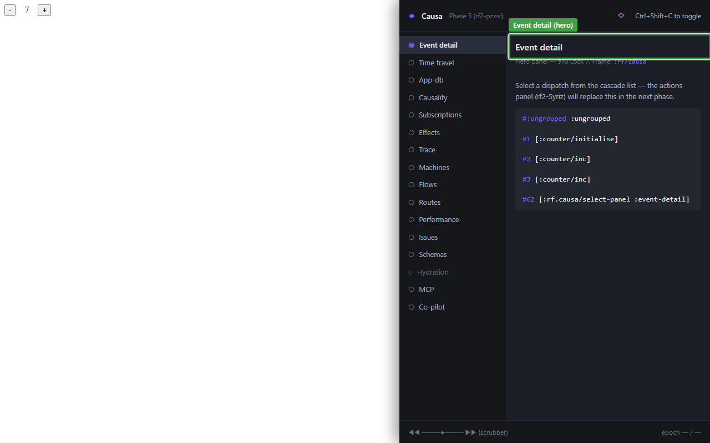

# 2. Panel tour

Fourteen panels. You'll use four of them daily, six of them weekly, and the rest the occasional Tuesday afternoon when something exotic breaks.

This chapter is the map. Each panel gets a one-paragraph "when you'd open this" answer; the chapters that follow take the four hero panels — Event detail, Time travel, Trace, Click-to-source — and unpack them depth-first.

The sidebar groups panels into two bands:

- **Always-active** (top) — Event detail, Time travel, App-DB, Subscriptions, Effects, Trace, Machines. These render whether you've configured anything or not.
- **Conditional-with-activity** (bottom) — Flows, Routes, Performance, Issues, Schemas, Hydration. These light up only when the app is using the relevant subsystem (the *Hydration* panel only appears when SSR hydration actually runs, etc.).

## Event detail — the landing panel

Lands on every open. Renders the *most recent* epoch — the event vector, the `app-db` diff, the inline mini-graph of what cascaded, the subs that recomputed, the views that re-rendered, the fxs that fired, and the duration. If you're answering "what did the user just do?", this is the panel.

Five questions every event answers, all on first paint:

1. **What was dispatched?** Event vector, top of the panel.
2. **What changed?** App-db diff, expanded.
3. **What rendered?** Render list, keyed by view-id.
4. **What fxs fired?** Effects list, with `:outcome ∈ {:ok :error :skipped-on-platform}`.
5. **How long?** Total cascade duration.

That's the daily answer set. Anything deeper, you click through to a peer panel.

## Time travel — the bottom rail

The scrubber is always visible at the bottom of the shell — even when you're on a different panel. Drag it backwards to *passively* re-render against a prior epoch's `:db-after`; click *restore* to make it sticky (the runtime calls `restore-epoch` and the live app rewinds).

See the dedicated [chapter 3](03-time-travel.md).

## App-DB — slice-centric

Not a full `app-db` tree dump. **The slices that changed in the current epoch**, plus any slices you've pinned with a *watch* gesture. Read-only — Causa never writes to `app-db` for you (use `re-frame2-pair` for that, or dispatch a real event).

See [chapter 9](09-app-db-diff.md).

## Subscriptions

Every registered sub: id, layer (extractor / derivation), current value, hit-rate badge (TanStack-style — stale / fresh / inflight), and the recompute count this session. Click an edge to walk to a parent sub. Click an id to jump to its `reg-sub`.

The TanStack-style badge is unusual for a re-frame tool — it's there because sub recomputation cost is one of the four canonical performance hot-spots, and the panel surfaces it where you'd reach for it anyway.

## Effects

Every fx the app has issued in the current session, keyed by `fx-id`, with `:outcome` chips and full `:tags` payload. Errors get red rows; aborts get yellow. Click a row to see the full trace event.

## Trace — the raw stream

Every emitted trace event, in order. Filterable by `:op-type`, by tag, by free-text. The Trace panel is what you'd write yourself with `register-trace-listener!` if Causa didn't exist — it's the bus's most direct rendering.

See [chapter 4](04-trace-stream.md).

## Machines — Stately-grade state-charts

For every registered machine, the panel renders a Stately-quality state-diagram: nodes for states, edges for transitions, guards on edges, actions on entry/exit, parallel regions as side-by-side boxes, hierarchical states nested. The current state is highlighted live; transitions paint as they fire. (Screenshot in [chapter 8](08-machine-inspector.md).)

Embedded under the hood is [`tools/machines-viz/`](https://github.com/day8/re-frame2/tree/main/tools/machines-viz) — a separate visualiser library that Causa composes in.

See [chapter 8](08-machine-inspector.md).

## Flows

Registered [flows](../guide/18-from-re-frame-v1.md#flows--the-replacement-for-on-changes) — re-frame2's reactive-derivation primitive. Per-flow status, last value, the inputs it watches, the last few recomputes. Only lights up if your app registers any.

## Routes

Static route table, plus the current route, plus the per-frame route history. Useful when "the URL changed and the page didn't" or vice versa.

## Performance

The `rf:`-prefixed User Timing entries (event / sub / fx / render) plotted on a millisecond scale. Off by default — it's the channel covered in [Guide 16 — Performance](../guide/16-performance.md). Turn it on when you're looking at a specific slow render.

## Issues

The unified feed: errors, warnings, schema violations, hydration mismatches. One row per issue, with severity chip, source coord, and the underlying trace event one click away. This is where you check first when "something looks off."

## Schemas

The schema-violation timeline. One row per registered schema (`app-db` slot, sub return, event payload, cofx). Coloured dots per failure with recovery mode. Lit up only if you've registered any Malli schemas — see [Guide 04a — Schemas](../guide/04a-schemas.md).

See [chapter 6](06-schema-timeline.md).

## Hydration

The server-vs-client hydration debugger. Only visible when SSR hydration actually runs in the page. Side-by-side render trees with the diff highlighted.

See [chapter 7](07-hydration.md).

---

## Resizing Causa

Drag the left edge of the Causa panel to resize horizontally. Width persists across reloads (per-Causa-instance, stored in localStorage). Double-click the handle to reset to default width.

For full-screen inspection, change `Settings → General → Panel position` to `fullscreen`. For an out-of-window view, change it to `popout` — the browser's window controls then govern size.

## How the panels share state

Every panel reads the same store. Selecting an event in *Event detail* highlights the corresponding row in *Trace* and pins the *App-DB* diff to that epoch. Dragging the time-travel scrubber retargets every panel at the historical epoch. Clicking a sub in *Subscriptions* opens its source in your editor (next chapter), pins it in *App-DB*, and highlights its incoming edge in the static sub-graph.

The state is **one big sub-graph rooted at Causa's app-db** — a separate frame from your app's. That separation is what lets Causa survive `restore-epoch` on the host frame: the historical view is a projection over the rewound host, not a rewound Causa.

You don't have to know any of this to use the tool. But it's how the panel composition is so cheap to extend — adding a fifteenth panel is "register one slot, render one view"; the substrate is already there.

Next: [time-travel scrubbing](03-time-travel.md) — the rail at the bottom of every panel.
