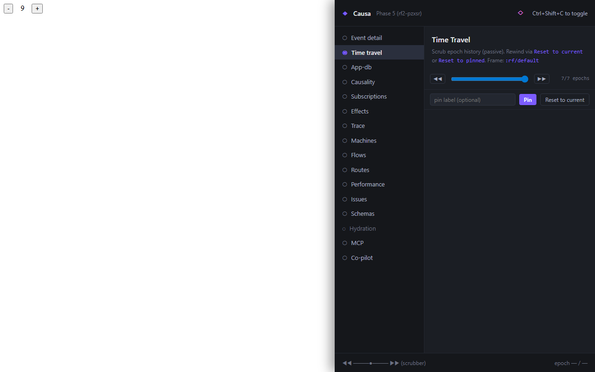

# 3. Time-travel scrubbing

A user reports a bug. "I clicked three things and then the page went wrong." They can't reproduce it on demand. You can't either.

In a mutable-state app, this is the worst class of bug — you're chasing a sequence of writes you can't replay. In re-frame2, **every drain-to-empty is recorded**: the event that triggered it, the `:db-before`, the `:db-after`, the subs that recomputed, the renders, the fxs. That's an *epoch*. The runtime keeps a ring buffer of them — fifty per frame, configurable — and Causa renders the buffer as a scrubber.

You walk backwards. Find the cascade that broke the invariant. Rewind to before it ran. The bug isn't a story you reconstruct from logs; it's a `:db-after` you can pprint.



## The rail

The scrubber sits at the bottom of every panel — it doesn't go away when you switch from *Event detail* to *Trace* to *Subscriptions*. That's deliberate: time-travel is *cross-cutting*. Whatever panel you're looking at, you can rewind the rest of the world out from under it.

Three controls:

- **Drag the cursor backwards** — *passive scrub*. The other panels retarget at the historical epoch, but the live `app-db` is unchanged. You're previewing.
- **Click *restore*** — *active rewind*. The runtime calls `restore-epoch`, the host frame's `app-db` swaps to the historical `:db-after`, and the live views re-render against it. The runtime emits a `:rf.epoch/restored` trace event so other tools (your own listeners, `re-frame-pair2`, an in-house APM bridge) see it land.
- **Click *jump-to-event*** — when you know the *event* you want to rewind past, you don't have to find the epoch by index; you type the event-id and the scrubber positions to the most recent matching cascade.

Passive scrub is the one you reach for most. It's read-only — you can run the entire investigation without ever mutating live state.

## How the buffer fills

Every drain-to-empty produces one epoch record. The record carries:

- `:epoch-id`, `:frame`, `:committed-at`, `:event-id`, `:trigger-event`
- `:db-before`, `:db-after`
- `:sub-runs` — every sub recomputation in this cascade (cache-hit subs are absent)
- `:renders` — every view that re-rendered, keyed `[<view-id> <instance-token>]`
- `:effects` — every fx that fired, with `:outcome` ∈ `{:ok :error :skipped-on-platform}`
- `:trace-events` — the raw trace slice, optionally

This is what tools route diagnostics off — Causa's epoch-grouping, `re-frame-pair2`'s "show me the last five cascades" command, the post-mortem path that captures a session for review. Same record, three consumers.

The default buffer depth is 50 epochs per frame. To deepen:

```clojure
(rf/configure :epoch-history {:depth 1000})
```

Two-million epoch slots and you've got a memory leak; fifty is a comfortable default for the "I just want to scrub backwards through the last few minutes" workflow.

## Redacted records

If you've installed an `:epoch-history` `:redact-fn` to keep secrets out of recorded `:db-before` / `:db-after` (`(rf/configure :epoch-history {:redact-fn (fn [record] …)})`), Causa renders the **redacted** shape. The runtime invokes your fn once per epoch *before* the ring buffer is appended, so every panel — App-DB Diff, Event detail, the scrubber preview — sees the same redacted record. Slots your fn rewrote appear as the `:rf/redacted` sentinel (or whatever shape you substituted); there is no separate raw copy to recover from. One consequence for time-travel: a confirmed rewind to a record whose `:db-after` was redacted will land `app-db` in the redacted state — the rewind structurally succeeds but the resulting state is not what the user observed at record time. Apps that need restore fidelity should leave `:db-before` / `:db-after` alone in the fn and redact only `:trace-events` / `:trigger-event`.

## The six failure modes of `restore-epoch`

Active rewind can fail. Six modes, each with a structured error trace event:

| Failure | When |
|---|---|
| **Unknown frame** | The frame-id doesn't name a registered frame. |
| **Unknown epoch** | The epoch-id isn't in the frame's current history (aged out, or never recorded). |
| **Schema mismatch** | The recorded `:db-after` doesn't validate against the currently-registered schemas (someone added a stricter schema since the snapshot). |
| **Missing handler** | The recorded `app-db` references a registered id (a machine, a route) that's no longer in the registrar. |
| **Version mismatch** | The frame's recorded `:rf/snapshot-version` is incompatible with the currently-loaded machine definition. |
| **Concurrent-drain rejection** | Called while the frame's drain is still in flight; retry after settle. |

`restore-epoch` returns `true` on success, `false` on any failure. Causa renders the failure mode inline at the scrubber — a red toast carrying the `:reason` (unknown / concurrent-drain), the `:explain` Malli output (schema mismatch), the `:missing-id` (missing handler), or the `:expected`/`:got` versions (version mismatch). You don't have to know what went wrong from a stack trace; the runtime told you.

## Effects already fired

One caveat. `restore-epoch` rewinds the frame's `app-db` — *state*. It does **not** un-fire effects that already left the system. The HTTP request was sent. The navigation was pushed. The Sentry event landed. Rewinding to before those fxs ran rewinds the *record* of them; it doesn't un-send them.

Causa surfaces this with an *Effects already fired* chip when you rewind past an epoch that contained non-`:skipped-on-platform` fxs. The chip is advisory — it doesn't block the rewind, just makes the asymmetry visible.

In practice, most of the time the asymmetry doesn't bite: you rewind to investigate, you read the new state, you make a fix, you don't keep the rewound state around to ship from. But it matters when you're chasing "we got two confirmation emails for one order" — the rewind doesn't unsend the second email, and Causa is correct to remind you of that.

## Reset to an arbitrary state

Sometimes the state you want never existed: a bug repro arrives as serialised `app-db`, an agent has hot-swapped a handler that needs an evolved shape, a story-tool wants to render a specific snapshot. `reset-frame-db!` is the bypass:

```clojure
(rf/reset-frame-db! :app/main {:cart {:items [{:sku "abc" :qty 2}]}
                                :checkout/state :ready})
```

It replaces the frame's `app-db` directly, **records a synthetic epoch** (so `restore-epoch` can later rewind past the injection), and emits a `:rf.epoch/db-replaced` trace event. The synthetic epoch carries empty `:sub-runs` / `:renders` / `:effects` projections — those are the visible signal that no cascade ran.

Causa renders the synthetic epoch differently in the scrubber — a small star marker — so you can tell which entries came from real dispatches and which from direct injection.

`reset-frame-db!` is not a substitute for `dispatch`. Use it only when bypass-the-cascade is required.

## When the scrubber isn't the right tool

Two cases where you'd reach for something else:

1. **You want to debug the cascade *as it happens*, not after.** Time-travel rewinds; it doesn't pause. For pause-on-event behaviour, hot-swap the relevant handler with a `js/debugger` line via `re-frame-pair2` and replay the event.
2. **You want to reproduce a bug a customer saw in production.** Time-travel works on the *current* runtime's epoch history. Customer sessions are off-box; you'd need their epoch record exported, then imported into a local frame via `reset-frame-db!`. That round-trip is the [Story](../story/index.md) playground's job — it can mount any `app-db` snapshot as a variant.

Next: [the trace stream](04-trace-stream.md) — the raw bus underneath everything you've seen so far.
