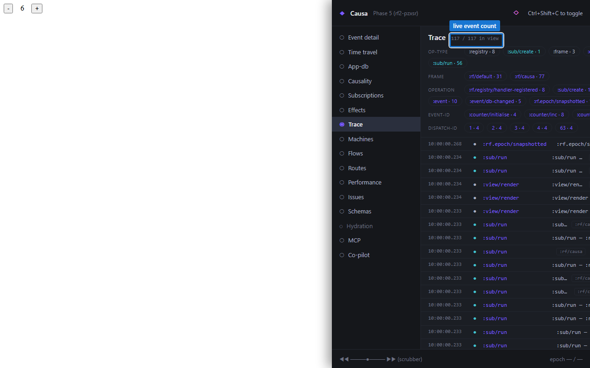

# 4. Trace stream

The Trace panel is the raw rendering of the bus. Every event the runtime emits — dispatches, handler invocations, fx applications, sub computations, errors, machine transitions, registrations, hot-swaps — flows through one channel, and this panel is what the channel looks like when you point a UI at it directly.



The counter at the top — *N in view / M total* — is live. Every dispatch in your app appends here as the cascade walks. Watch it tick over as you click around.

## What's in a trace event

Each row is a structured map. The load-bearing field is `:op-type` — the universal discriminator. Every other panel in Causa filters off `:op-type`. So does every listener you'd write yourself.

| `:op-type` | Emitted for |
|---|---|
| `:event`         | Event handler invocation; one event = one row |
| `:sub/run`       | Sub recomputation (cache miss); one per sub fire |
| `:fx`            | Fx applied; carries `:outcome` and `:tags` |
| `:flow`          | Flow lifecycle — registered / computed / skipped / cleared / failed |
| `:machine`       | Machine transitions, guards, entries/exits |
| `:render`        | View re-render boundary |
| `:registration`  | A `reg-*` macro fired |
| `:hot-swap`      | A handler / sub / view was redefined live |
| `:rf.epoch/restored` | A `restore-epoch` call landed |
| `:error`         | Anything `:rf.error/*` — schema failures, missing handlers, etc. |

The list is **additive-only**. A future op-type appears for a future subsystem; listeners and panels that don't recognise it ignore it without breaking. The panel renders unknown op-types as a generic row so you can still see them go by.

Every row carries `:timestamp`, `:operation`, `:tags`, and category-specific keys. The panel's *Expand* affordance opens the full map.

## Filters

Three filter modes:

- **Op-type chips** at the top of the panel. Click `event`, `sub`, `fx`, `error` to mask the rows.
- **Tag filter** — type any namespaced keyword and the panel keeps only rows where that key is in `:tags`. Useful for `:rf.http/managed`, `:cart`, `:auth/*` patterns.
- **Full-text search** — substring match across the JSON-printed row. The escape hatch.

Filters compose. The *in-view* count in the header reflects the filtered total; the *total* count is the underlying buffer size, which monotonically grows up to the 1000-event default cap (configurable via `(rf/configure :trace-buffer {:depth N})`).

## Why a buffer

Tools that subscribe via `register-trace-listener!` see every event as it lands. But the buffer is for **late-attaching tools** — you press `Ctrl+Shift+C` after the cascade has already run, and you still want to read what happened. Without a buffer, "open the panel after the bug" would mean "rerun the bug first." With the buffer, you open the panel and the last N events are already there.

The buffer is dev-only. Production builds DCE it at the source.

## Writing your own listener

Causa is a 16-panel listener over the same surface. A bespoke one fits in fifteen lines.

```clojure
(ns my-app.debug-panel
  (:require [re-frame.core :as rf]
            [reagent.core :as r]))

(defonce recent-events (r/atom []))

(rf/register-trace-listener!
  :my-app/debug-panel
  (fn [ev]
    (when (= :event (:op-type ev))
      (swap! recent-events (fn [evs] (->> (cons ev evs) (take 10) vec))))))

(rf/reg-view debug-panel []
  (let [events @recent-events
        epochs (take-last 5 (rf/epoch-history :rf/default))]
    [:aside.debug-panel
     [:h3 "Recent events"]
     [:ul (for [e events] ^{:key (:dispatch-id e)} [:li (str (:operation e))])]
     [:h3 "Recent epochs"]
     [:ul (for [ep epochs] ^{:key (:epoch-id ep)}
            [:li
             [:button {:on-click #(rf/restore-epoch :rf/default (:epoch-id ep))}
              (str (:event-id ep))]])]]))
```

That's the whole shape. The trace listener is a function. The epoch list is a query. The restore is a single call. No framework extension, no plugin contract. The panel composes from the same surfaces Causa consumes — the difference is that Causa is a much richer renderer of the same data.

A few notes:

- The id `:my-app/debug-panel` is the listener's handle; pass it to `unregister-trace-listener!` to detach. Tools coexist on the bus by giving themselves a unique namespaced id.
- The filter `(= :event (:op-type ev))` keeps this listener cheap. New op-types are additive; tools that don't recognise an op-type ignore it without breaking.
- `restore-epoch` rewinds the frame's `app-db` to the named epoch's `:db-after`. **Effects already fired** (HTTP sent, navigation pushed) are not reversed — restore is a state operation, not a universe operation.

## Two listener shapes: trace vs epoch

The trace bus is the **raw** stream — one row per emit. There's a sibling listener for **assembled** records — one row per drain-settle, with the cascade's projections already computed:

```clojure
(rf/register-epoch-listener!
  :my-tool/dashboard
  (fn [{:keys [frame event-id epoch-id sub-runs renders effects] :as record}]
    (record-recomputes! frame event-id (count sub-runs))
    (doseq [{:keys [render-key elapsed-ms]} renders]
      (record-render! frame (first render-key) elapsed-ms))
    (doseq [{:keys [fx-id outcome error-trace]} effects]
      (when (= :error outcome)
        (surface-fx-error! frame epoch-id fx-id error-trace)))
    nil))
```

The record carries the same shape the time-travel scrubber walks: `:db-before`, `:db-after`, `:sub-runs`, `:renders`, `:effects`, optionally `:trace-events`.

Two listener shapes coexist by design:

- **`register-trace-listener!`** is the raw stream — used by tools that need per-emit detail (custom recorders, error-monitor forwarders, timing aggregators). This is the bus the Trace panel renders.
- **`register-epoch-listener!`** is the assembled stream — one fully-shaped record per drain-settle, used by tools that route diagnostics off "what happened in this cascade" rather than re-folding the raw stream each time. This is what Causa's Event-detail panel reads.

Most pair-shaped tools prefer the assembled stream and reach for the raw stream only when they need detail the projection drops.

A throw inside an epoch-cb does not propagate to the framework or other listeners — the framework catches and continues. The throwing listener is **not** auto-evicted; eviction is the consumer's call.

## Privacy: sensitive events filtered by default

Trace events stamped `:sensitive? true` are **filtered out by default** before they reach panels. The Trace panel renders a small *N redacted* indicator at the bottom — advisory, just so you know the bus emitted events the panel chose not to show.

You opt in to seeing redacted events when you're debugging the redaction policy itself (you want to confirm the `^{:sensitive? true}` metadata on your event handler is being honoured end-to-end):

```clojure
(re-frame.causa.config/set-show-sensitive! true)
```

The flag is read at the head of every listener body, so toggling it takes effect on the next trace event without re-registering anything. Reset to the default (`false`) by passing `false` or `nil`.

For the wider picture — how events are stamped `:sensitive?`, the HTTP redaction surface, and the per-path `:large?` size-elision pathway — see [Guide 23a — Privacy](../guide/23a-privacy-secrets.md) and [Guide 23b — Large blobs](../guide/23b-large-blobs.md).

## When you'd open the Trace panel

- "What did the runtime just do, in order?" — every other panel filters; this one doesn't.
- "I'm writing a new tool that subscribes to the trace bus, what's the shape?" — read live shapes here, click *Expand* to see field-by-field.
- "I think a particular fx fired but the panel says it didn't" — filter by op-type `fx` and search.
- "I want to capture a session for a bug report" — the *Copy as transit* button serialises the current buffer slice for paste-into-issue.

Next: [click-to-source](05-click-to-source.md) — the hero feature.
