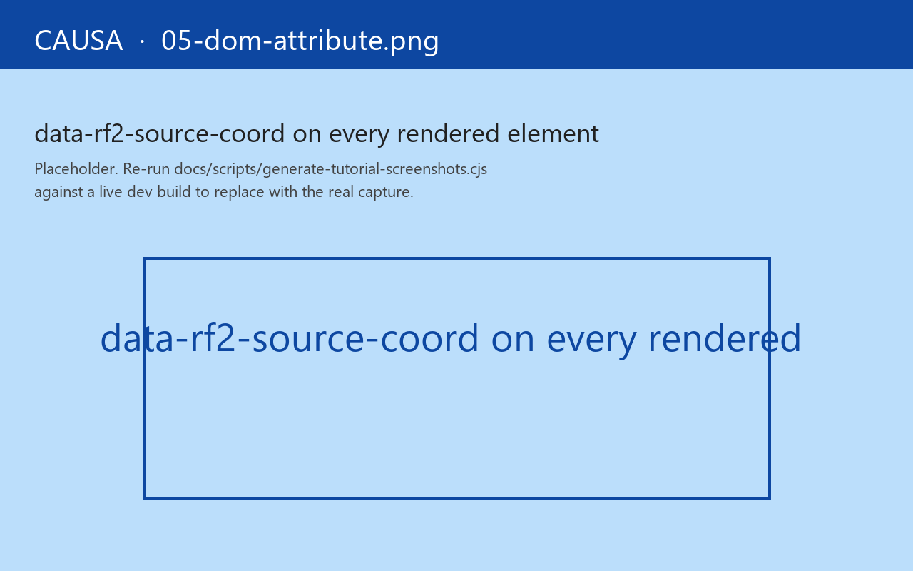

# 5. Click-to-source

The hero feature.

In practice, this is the surface you reach for when a tester drops a screenshot on your desk and says "the wrong number is showing here." You don't grep. You don't binary-search the view tree. You point Causa at the rendered element, read the coord off the DOM node, and you're inside the function that produced it.

## Every element knows where it came from

Open any re-frame2 app in dev mode and inspect any rendered element:



```html
<button data-rf2-source-coord="counter.core:counter:48:5" ...>+</button>
```

Four colon-separated segments: `<ns>:<sym>:<line>:<col>`. Public, parseable, forward-compatible. Tools split on the colon and recover the four pieces directly. Every `reg-view`-rendered DOM element has one. **Click any pixel in your app, walk back to the line of code that put it there.**

This isn't a Causa feature. It's a framework feature. Causa is just one of several tools that consume the attribute — `re-frame-pair2` reads it through nREPL to scope a `dom/source-at` query; Playwright specs in test runs use it to assert "this rendered element came from view `:cart/total`"; future tools nobody's built yet can do the same.

## The Causa gesture

Inside Causa, the gesture is one click. Three places it shows up:

1. **In the Event-detail panel's *Renders* list** — every view that re-rendered in the cascade has a click-target.
2. **In any panel that names a registered id** — Subscriptions, Effects, Machines, Flows, Routes. Click the id, jump to its registration.
3. **From the host page directly** — switch Causa into *pick mode* (`Ctrl+Shift+S`), hover any DOM element, and the panel highlights the coord. Click to commit the gesture.

The jump uses your editor's URL handler — VS Code (`vscode://`), IntelliJ (`idea://`), Emacs (`emacs://`), or a generic `file://` fallback. Configure the handler in Causa's settings panel; the default tries VS Code first.

## The contract — `data-rf2-source-coord`

The four colon-separated segments are `<ns>:<sym>:<line>:<col>`:

- `<ns>` — the registration's namespace (`counter.core`)
- `<sym>` — the **registered handler-id** (the symbol passed to `reg-view`, here `counter`). Not a file path.
- `<line>` — source line at `reg-view` macro-expansion time
- `<col>` — source column

The format is a **public, parseable contract**. Tools split on the colon and recover the four pieces directly.

To recover the file path too, follow the parsed handler-id back to the registration metadata via `:rf/source-coord-meta`:

```clojure
(:rf/source-coord-meta (rf/handler-meta :view :counter.core/counter))
;; → {:ns "counter.core", :file "counter/core.cljs", :line 48, :column 5}
```

The DOM attribute is the cheap-on-the-wire form; the registration metadata is the rich form.

The annotation is **dev-only** — gated on the universal `re-frame.interop/debug-enabled?`. Production builds elide via DCE; the rendered HTML in production carries no `data-rf2-source-coord` bytes.

Documented exemption: components whose outermost return is a React Fragment, a `:>` host-component head, or another non-DOM root are exempt. Pair tools fall back to `(rf/handler-meta :view id)` for those nodes.

## Beyond views: state machines

The same idea generalises to state machines. `reg-machine` is a macro that walks its literal spec form at expansion time and attaches a flat coord index under `:rf.machine/source-coords`, keyed by spec-path tuples:

```clojure
(:rf.machine/source-coords (rf/machine-meta :auth/login))
;; {[:guards :form-valid?]                {:ns ... :line ... :column ... :file ...}
;;  [:actions :commit]                    {...}
;;  [:states :form :on :submit]           {...}}
```

A pair-tool or a state-diagram visualiser reads this index for two distinct gestures: **jump to definition** (a click on `:form-valid?` in the diagram reads `[:guards :form-valid?]`) and **jump to call site** (a click on a transition arrow reads `[:states :form :on :submit]`).

The framework commits to **the index shape and the keyword-reference rule**:

- **Definition-site stamping for keyword references.** A keyword reference (`{:guard :form-valid?}`) is stamped at its definition site (`[:guards :form-valid?]`), not at the call site — the call site is the keyword itself, which is identity-free.
- **Reference-site stamping for inline-fn literals.** An inline `(fn [...] ...)` is stamped where it appears.

The keyword-reference rule means call-site clicks on a keyword-named slot (`{:guard :form-valid?}`) fall back to the enclosing transition's coord, which IS stamped.

Like `data-rf2-source-coord`, the stamping is gated on debug-enabled and elides under production build flags.

## What re-frame2 does not ship

The framework commits to the attribute format and the index shape — both are parseable public contracts. The framework does **not** ship `dom-source-at` / `find-by-src` / `fire-click-at-src` helpers; those depend on host-specific DOM access that re-frame2 the framework doesn't assume.

Causa ships its own pick-mode helper, its own coord-to-editor handler, its own batch "highlight every node from this view" toggle. `re-frame-pair2` ships its own helpers over the same attribute. They could diverge in implementation; they can't diverge in contract — the attribute is the wire.

## Two recent landmarks

Click-to-source has been on the spec roadmap since before re-frame2 was named. Two recent shipments matter:

- **PR #1106 (rf2-g5q8d)** — open-in-editor wired through the panel's allowlist. The shipped tool *opens a file in your editor when you click* without prompting you for confirmation on every click. The allowlist is a security gate, not a UX gate; once configured, the gesture is friction-free.
- **The `data-rf2-source-coord` contract was rolled into the spec proper** — `<ns>:<sym>:<line>:<col>` is locked. Future tools that grew up after Causa can rely on it.

Causa's click-to-source is what closed the loop between "the framework knows where every line came from" and "the developer's first gesture in a debugging session is a *click*, not a grep."

Next: [the AI co-pilot rail](06-ai-copilot.md).
