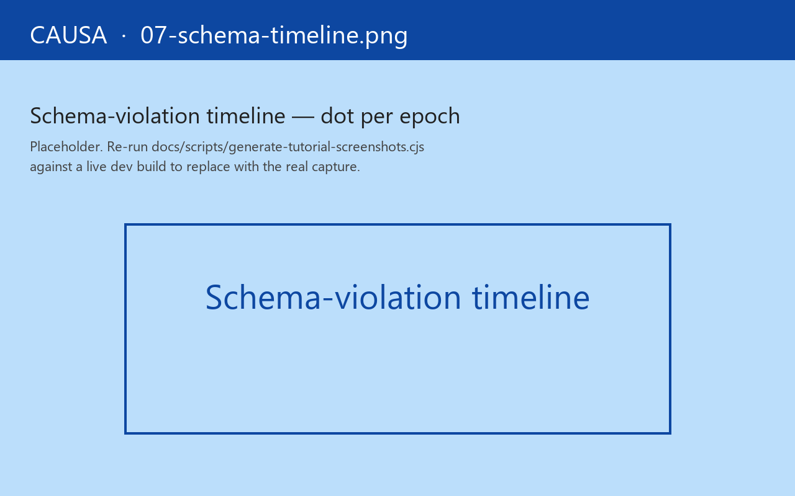

# 6. Schema-violation timeline

You shipped a refactor on Monday — a small change to the `:cart/items` shape, added a `:line-id` slot, nothing your tests caught. By Wednesday afternoon Sentry has three rows that look like the same problem on three different users' machines: a red error toast on the checkout page. You can't reproduce locally. The stack trace is in a sub two hops downstream of the slot you touched.

This is what schemas are for, and the Schemas panel is what you open. You'd registered a Malli schema on `:cart/items` weeks ago. The runtime has been validating against it on every crossing the whole time — and the moment the refactor landed, that boundary started failing on the shapes the old discount code emits. The Issues ribbon is showing the count. The Schemas panel is where you see *when* the contract drift started and *which* slot broke first.

The panel lights up only when you've registered at least one schema. The companion narrative is [Guide 04a — Schemas](../guide/05-schemas.md).

## What you see

One row per registered schema. Across each row, a coloured dot per epoch:

- **Green** — the boundary crossed clean.
- **Red** — Malli `validate` returned `false`. The dot expands to show the `:explain` map.
- **Yellow** — the schema's recovery mode kicked in (the runtime restored a previous-valid value, or substituted a default, or aborted the cascade — whichever the schema declared).

Below the timeline, an inline filter: *show only failures*, *show only the last N epochs*, *group by schema name*.

The point is at-a-glance pattern detection. A single red dot in a sea of green is usually a one-off; a red column down a whole epoch is "every schema in scope just failed at the same time" — usually a coercion bug at an event handler that's polluted everything downstream.

## The contract

Schemas in re-frame2 are **opt-in, production-elidable**. You register a schema; the runtime validates against it on every boundary cross; the schema-validation cost DCEs under `:advanced` with `goog.DEBUG=false`. Pay for what you turn on.

The validation taxonomy:

| Boundary | Schema slot | What's validated |
|---|---|---|
| `app-db` slot | `(rf/reg-app-db-schema ...)` | The value at the registered path on every cascade-settle. |
| Event payload | `(rf/reg-event-schema ...)` | The event vector at dispatch time. |
| Sub return | `(rf/reg-sub-schema ...)` | The sub's computed value on every recompute. |
| Cofx | `(rf/reg-cofx-schema ...)` | The cofx map handed into a handler. |

When validation fails, the runtime emits a trace event with `:op-type :error`, `:operation :rf.error/schema-validation-failure`, and `:tags` carrying `:schema-id`, `:value`, `:explain`, and (where applicable) `:recovery`.

## Recovery modes

A failing schema doesn't necessarily halt the cascade. Each schema declares its recovery mode:

- `:reject` — abort the dispatch; emit a `:rf.error/schema-validation-failure` row; leave `app-db` untouched.
- `:revert` — replace the offending value with the last-known-valid snapshot.
- `:default` — substitute a registered default value.
- `:warn-and-continue` — emit the failure trace but let the cascade proceed.

The mode is per-schema, not global. A speculative experimental schema can `:warn-and-continue` while a critical invariant `:reject`s. Causa's panel paints yellow for recovery, red for outright failure.

## Why a timeline

Schemas catch contract drift over time. A schema that's been green for a week and then goes red on epoch 14,032 is usually a deploy artefact — a new event handler that doesn't honour an old invariant, or a migration that nibbled a slot. The timeline view makes the temporal pattern obvious; a list view would not.

## What you'd open this panel for

- "I've just refactored a cofx and I want to see if anything downstream broke." — register the cofx schema, work normally, watch the panel.
- "The Issues ribbon is showing a schema failure but I don't know which dispatch caused it." — Schemas panel groups by epoch, so the cascade is one click away.
- "I want to validate that my SSR-hydrated `app-db` matches the client schema." — register the schema at the hydration boundary; the panel records each hydration as a row.
- "I'm running an experimental schema." — set its recovery to `:warn-and-continue`, ship to dev, watch the failure rate on the timeline before promoting to `:reject`.

The point isn't to ship a panel that handles schemas; it's that schemas were already going to fail visibly through the bus, and the panel just paints what's there.

Next: [the hydration debugger](07-hydration.md).
