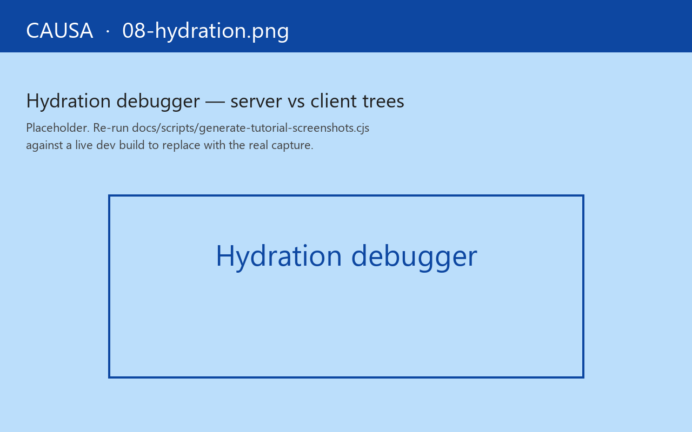

# 7. Hydration debugger

Your tester refreshes the page and the count flips from 12 to 0. Server-rendered HTML said one number; the client booted up and said another. They send you a screenshot of the half-second of flicker — the SSR'd value visible until the React reconciler stamps over it with the wrong one.

That's a hydration mismatch, and the Hydration panel is the focused view. The Issues ribbon will already have a `:rf.error/hydration-mismatch` row; click into it and the panel paints both render trees side-by-side with the offending node highlighted. The diagnosis isn't "the trees don't agree" — it's "the view at `cart.views:cart-total:73` rendered `$12.00` on the server and `$0.00` on the client, because the cofx that seeds `:cart/items` read `(js/Date.)` in a way the JVM-side renderer couldn't."

The panel **only appears in the sidebar when hydration actually runs in the page**. A SPA-only build won't see it at all. SSR ships at [Guide 11](../guide/13-server-side.md).

## What it shows

Two columns side-by-side: the *server* render tree and the *client* render tree. The mismatch is highlighted — a node that exists on one side and not the other, an attribute that differs, a textual delta. Click any mismatched node to inspect the diff in detail.

Below, a *mismatch reason* chip — the runtime classifies hydration mismatches into a fixed taxonomy:

| Reason | Meaning |
|---|---|
| `:rf.hydrate/missing-handler` | The server `app-db` references an id not registered on the client. |
| `:rf.hydrate/schema-mismatch` | The hydrated `app-db` doesn't validate against a client-registered schema. |
| `:rf.hydrate/dom-divergence` | The two render trees differ structurally. |
| `:rf.hydrate/attribute-drift` | Same DOM, different attribute values (commonly `data-*`, `key`, dates). |

The classification is the wire-level signal that an APM bridge would also see. Causa is the human-friendly renderer of the same fact.

## What hydration is, briefly

re-frame2's SSR adapter renders the same views to HTML on the JVM. Per request, the runtime allocates a frame, runs the cascade, serialises the resulting `app-db` into the response (transit, embedded in a `<script>`), and ships the HTML.

In the browser, the client `init!` reads the embedded `app-db`, dispatches `:rf/hydrate`, and runs the same views. The expectation is that the two trees agree — same `app-db`, same handlers, same view code, same output.

When they don't, it's almost always one of:

- An event handler that read `(js/Date.)` or `(rand)` somewhere it shouldn't have.
- A view that called `js/window` from inside the body (no SSR-shape guard).
- A cofx that returned different data on the server (the request-id wasn't seeded the same way).

The panel surfaces *which view* mismatched, *which attribute*, *with what values* — at the resolution of a single line of source. That's why the opener's diagnosis sentence reads as one specific call-out rather than the generic "the trees don't agree."

## The fix loop

1. Note the mismatch reason chip. Most chips name the diagnosis.
2. Click the offending node — read the server value and the client value side-by-side.
3. The click-to-source affordance applies; jump to the view's source.
4. Fix the divergence (push the non-deterministic call out of the view body, into an event handler or a cofx).
5. Reload. The panel goes green.

The runtime emits a `:rf.error/hydration-mismatch` trace event for every detected mismatch, so the Issues ribbon also surfaces them — Hydration is the *focused* view; Issues is the *unified* view.

## What this panel isn't

It's not a server-side renderer profiler. SSR performance is JVM-side; Chrome DevTools can't see it. Use the JVM host's profilers for that.

It's not a hydration *prevention* — re-frame2 doesn't try to stop you from writing a view that mismatches. The Boundary contract is "writers honour the schema; consumers validate." Causa is on the validation side.

For when *not* to hydrate at all — view components that should opt out of SSR entirely — see the SSR chapter's coverage of the `:client-only?` view metadata. The panel respects that flag; opted-out views don't show up as mismatches.

Next: [the machine inspector](08-machine-inspector.md).
