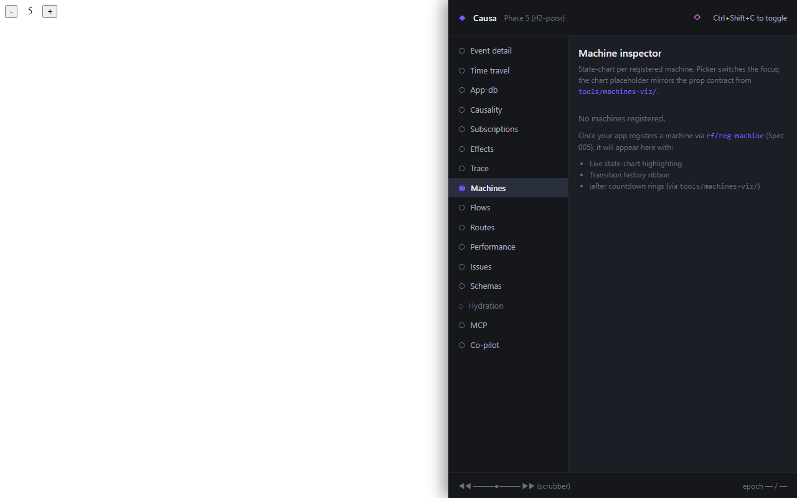

# 8. Machine inspector

You have a login flow with six states — `:idle`, `:submitting`, `:error`, `:submitting-retry`, `:authenticated`, `:locked-out` — and the user reports they can't get back from `:error` to `:submitting-retry`. The retry button is wired; the click fires; nothing transitions. You squint at the machine spec; the guard looks fine.

You open Causa, click *Machines*, and there it is: the diagram paints the attempted edge in grey, with the `false` return from `:enough-attempts?` rendered inline. The guard you wrote last week checks `(< attempts 3)`, but the variant your test is running through has `:attempts 4` — and you can read it right there in the snapshot column without recompiling, because the machine's first-class on the same six-step pipeline as every other event ([Guide 09 — State machines](../guide/11-machines.md) is the narrative).

The panel renders each registered machine as a Stately-quality state-chart. Live.

## What you see

For every machine your app registers:

- A **state-chart** — nodes for states, edges for transitions, hierarchy nested, parallel regions side-by-side. Guards on edges, actions on entry/exit. The current state is highlighted.
- An **event log** — every event the machine consumed, with the transition it took (or didn't), with `:guard` results, with `:tags`.
- A **snapshot** — the current machine value, including any deep-state cursors and parallel-region states.

When the user clicks a button and an event fires, you see the transition arrow paint in real time. When a guard rejects an event, the diagram shows the attempted edge in grey and the guard's `false` return inline.

## The two click-targets per node

Every node and every edge has two distinct gestures:

- **Click on a state name** → jump to the `:states` entry in your machine spec.
- **Click on a guard / action keyword** → jump to its definition. If the guard is `:form-valid?`, you land on `(rf/reg-machine-guard :form-valid? ...)`. If it's an inline `(fn [...] ...)`, you land at the line of the inline literal.

This is the [click-to-source contract](05-click-to-source.md) at machine resolution. The framework commits to the source-coord index shape; the panel renders it.

## Hierarchical, parallel, history

Three shapes the diagram has to handle, all common in real machines:

- **Hierarchical states.** A state can have substates. The diagram nests them; the current substate is highlighted within its parent.
- **Parallel regions.** `:fsm/parallel` regions render side-by-side. Each region's current state is highlighted independently.
- **History pseudo-states.** Where the machine declares `:fsm/history :shallow` or `:fsm/history :deep`, the diagram marks the slot and renders the remembered substate.

re-frame2's machines support a strict superset of XState's surface (modulo XState's history states, which re-frame2 replaces with snapshot-as-value capture — every machine state is restorable through the same `restore-epoch` pathway as the rest of the runtime).

## The Invokes column

Machines ca `:spawn` actors — HTTP requests, WebSocket lifecycles, child machines. The Invokes column on the right of the panel lists every active invoke for the current machine state: actor id, status (running / resolved / errored / aborted), elapsed time, the result value when settled.

When the machine transitions out of the state that owns an invoke, the runtime aborts the actor and emits a `:rf.machine/invoke-aborted` trace event; the column reflects the abort immediately.

## Driving a machine from the panel

There's no *send-event* affordance on the panel. Driving the machine is what your app does; Causa observes. If you want to drive a machine to test a transition path, that's `re-frame2-pair`'s job — open a pair session, dispatch the event, watch the diagram paint.

This is a deliberate split: the panel is a *read* tool. The runtime exposes the state-chart query and the trace stream; the panel renders both. *Writing* — driving transitions, hot-swapping guards, resetting state — is the pair tool's domain because writes need allowlists, session context, and explicit gates.

## What this panel doesn't show

- **Implicit state machines.** A handler that walks `cond`/`case` over `app-db` slots isn't a registered machine; the panel doesn't see it. (The fix is to register it.)
- **Machines in stopped frames.** If a frame has been destroyed, its machines are gone too. The panel only shows live frames.
- **History across `restore-epoch`.** Rewinding the host frame rewinds the machine too — that's the snapshot-as-value contract. The diagram retargets at the historical state without "playing back" the transitions; if you want the played-back transitions, walk the trace stream around the rewind.

Next: [the app-DB diff](09-app-db-diff.md).
