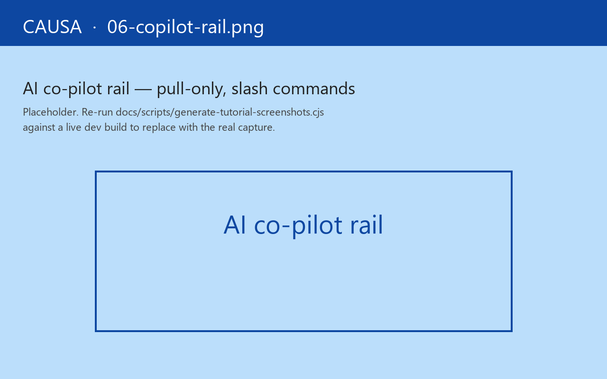

# 10. AI co-pilot rail

A slide-in rail on the right side of the shell. `Ctrl+Shift+/` toggles it.

The rail is **pull-only**. The agent never volunteers a thought, never interrupts your investigation, never proposes a fix you didn't ask for. You ask; it answers. The rail is for the moments when you want an extra pair of eyes on the cascade, not a co-author.

## Two modes

- **Free-text Q&A** — type a question; the agent answers using Causa's read surface (the current epoch, the trace buffer, `(rf/sub-topology)`, registered machines, app-db at the current scrubber position) plus the project's `CLAUDE.md` if one is in scope.
- **Slash commands** — pre-shaped queries that always return the same shape. `/explain` (this epoch), `/diff` (between two epochs), `/trace` (around an error), `/sub` (what depends on this sub?), `/machine` (current machine state), `/render` (why did this view re-render?), `/where` (find the source coord). The commands are not handlers in your app — they're declared by the co-pilot module itself; you don't have to add anything.

## What it sees

The agent runs in your dev build's process. It reads:

- The current epoch (event, app-db diff, sub-runs, renders, effects).
- The last N epochs from the buffer (default 50).
- The trace stream from the last `:event` cascade.
- Registered subs, machines, fxs, views, routes — all of it through the public registrar query API.
- The sub-graph topology.
- Source coordinates (it can paste a `<ns>:<sym>:<line>:<col>` and the editor opens the file).
- Optionally, your project's `CLAUDE.md` and any skill files declared by `claude.md` references.

It does **not** see:

- `:sensitive?`-flagged trace events (filtered before the agent's listener).
- Anything outside the dev runtime (no fetching, no shell access, no file writes from the panel — distinct from the `re-frame-pair2` skill, which is editor-side and explicitly gated).
- Production traffic. The rail is dev-only.

## What it can't do

The rail won't dispatch events, hot-swap handlers, or rewrite `app-db`. That's deliberate: the rail is for understanding what's already happened, not for driving the app. For "drive the app" gestures, switch to [`re-frame-pair2`](../skills/re-frame-pair2.md) — same wire vocabulary, different host, with explicit write gates.

## Ephemeral by design

The rail's conversation history clears on Causa close. No persistence, no transcript export from the panel itself. (If you want a session log, the `re-frame-pair2` skill keeps one; the rail is the lightweight cousin.)

The rationale: the rail's job is *in-flight clarification* — you're staring at an epoch and you want a second opinion *right now*. The transcript isn't valuable after the bug is fixed. Keeping it ephemeral keeps the panel honest about what it's for.

## When to reach for it

- "Why did this sub recompute?" — `/sub :cart/total`
- "What's different between epoch 47 and epoch 51?" — `/diff 47 51`
- "Where did this fx come from?" — click the row, then `/explain`
- "I don't understand this Malli explain output" — paste it; the agent walks it in plain English
- "Which view is rendering this DOM node?" — paste the source coord; the agent opens the file at the line

## Configuration

The agent host is configurable. The default is Claude Code's bundled model; alternative hosts (a local Llama, a hosted GPT, a custom MCP-connected agent) plug in through the shared `re-frame.causa.config/copilot-host` slot. The pull-only contract is enforced at the rail's edge — switching hosts can't override the no-write rule.

## When the rail isn't the right tool

Three escape routes:

- **You want a long-form retro on a debugging session.** Use [`re-frame-pair-retro2`](../skills/re-frame-pair-retro2.md) instead — it reads the structured transcripts the editor-side pair skill keeps, and the retro skill is designed for "let's review what we tried and what we learned."
- **You want the agent to *do* something** (dispatch, hot-swap, reset-frame-db!). The rail won't; `re-frame-pair2` will. The skill's recipe is "open a session, the agent dispatches a probe, you read the trace, you ask the agent to refine." The skill is editor-side because the writes are editor-anchored.
- **You want to drive Causa from an external agent**. That's what the planned `causa-mcp` server is for — same surfaces, MCP-protocol wrapper. See [chapter 11](11-mcp-server.md).

Next: [the MCP-server panel](11-mcp-server.md).
