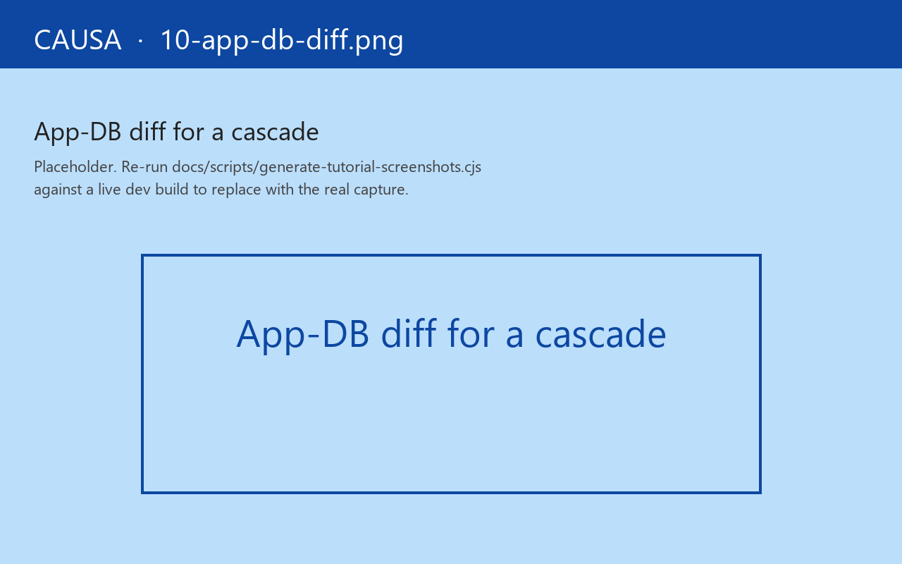

# 10. App-DB diff

`app-db` is a value. Two epochs are two values. The diff is the difference between them.

The App-DB panel renders the diff of the **current epoch** (the one selected in Event detail or the time-travel scrubber) — `:db-before` and `:db-after`, slice-aware.

## Slice-centric, not tree dump

The panel does not render the full `app-db` tree on every epoch. That would be hostile to read — a 200-line tree where one leaf changed.

It renders **only the slices that changed**, plus any slices you've explicitly *pinned*. The diff is shown:

- Inline JSON-ish (clojure pretty-printed with diff markers).
- Side-by-side `:db-before` / `:db-after` toggle.
- *Just the delta* — paths and value-pairs only.

You pick the rendering mode that fits the diff size. The first cascade after app boot is a big diff (everything went from `{}` to seeded); subsequent cascades are usually a single nested update.

## Pinning slices

Click the pin icon next to a slice header (or use the *watch path* affordance) and that slice will render on every epoch — even when it didn't change. Useful for "I want to keep an eye on `:auth/state` while I work through a checkout flow."

Pinned slices show as `unchanged` rows in epochs where they didn't move. The signal is "still the same value," which is itself diagnostically useful when you expected it to change.

## The underlying contract

The panel reads the epoch record's `:db-before` and `:db-after` slots, and computes the diff in-panel. The runtime doesn't pre-compute diffs — it just stores the two value references. The diff fold is cheap (Clojure values are persistent; structural equality is fast) and tool-local. Production builds DCE the whole pathway.

## Read-only

The panel never writes `app-db`. There's no inline editor. No "save changes" button.

Two reasons:

1. **Causa is an observation tool.** Writes belong to dispatch (or, for bypass cases, `reset-frame-db!` from a pair session). Mixing observation and mutation makes Causa hard to trust during an investigation.
2. **A typed `app-db` edit would race the runtime.** While you're typing, dispatches keep firing. Saving a half-typed edit would clobber whatever the runtime had just written. The pair tool's pathway handles this with explicit lock-the-drain semantics; baking it into the panel would force every panel session to think about drain locks.

If you want to inject an `app-db` value — bug repro shipping, an experimental shape — call `(rf/reset-frame-db! :frame-id new-db)` from a pair session or the dev console. The runtime records a synthetic epoch and Causa renders the synthetic epoch in the scrubber so the injection is visible.

## Wedge cases

Three patterns the diff handles distinctively:

- **Large blobs.** Slots tagged `:large?` (see [Guide 23b — Large blobs](../guide/23b-large-blobs.md)) render as `:rf/elided` placeholders in the diff. The diff still flags "this slot changed"; it doesn't expand the value. The *show large* toggle is per-session — useful when you actually need to look.
- **Sensitive values.** Slots whose schema declares `:sensitive? true` render as `:rf/redacted` by default, with a *N redacted* count at the bottom of the panel. Toggle on to inspect — same opt-in as the trace panel.
- **Bigint and date types.** Values that don't pretty-print well in the default Clojure printer get a type chip — `[bigint]`, `[date]`, `[uuid]` — with the underlying value reachable through *expand*.

## When you'd open it

- "I just dispatched something — did `app-db` change?" — Event detail's mini-diff is enough for one-leaf updates; the App-DB panel is what you escalate to for "this cascade rewrote half the tree, and I want to see exactly which half."
- "I think a sub is stale, but `app-db` says the value's right." — pin both the slot and the sub's recompute marker; watch them tick together.
- "I want a session-long watch on `:auth/state`." — pin it; the panel paints it on every epoch.

Next: [the MCP-server panel](11-mcp-server.md).
