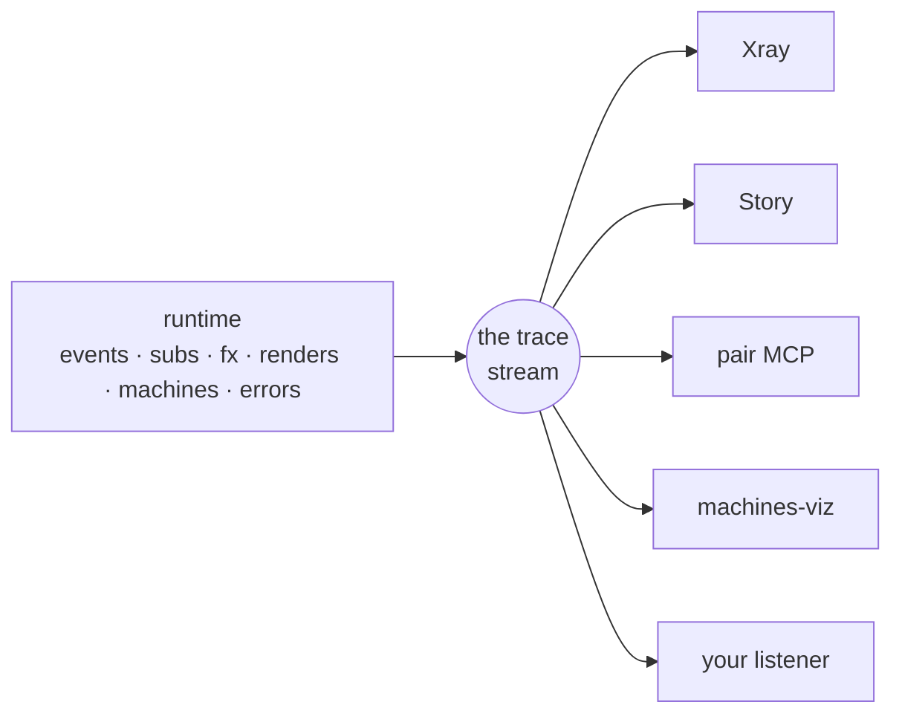

# Observability

You clicked a button and the app is now subtly wrong. You want to know what the click
did: which handler ran, what changed in [app-db](glossary.md#app-db), which
subscriptions recomputed, which views re-rendered, which effects ran.

Every event goes through the same [event pipeline](glossary.md#event-pipeline): the
[event handler](glossary.md#event-handler), the [commit](glossary.md#commit), then the
[effects](glossary.md#effect). As it runs, the framework emits a small data record at
each step. That stream of records is the [trace stream](glossary.md#trace-stream).
Each [frame](glossary.md#frame) also keeps a buffer of recent trace events and a
history of [epochs](glossary.md#epoch), one record per run.

The dev tools — [Xray](glossary.md#xray) (the inspector), Story (a view workbench),
the pair MCP (a server that lets an AI inspect the running app) — are readers of
that stream and history, and so is any listener you write. None of them has a
private data source, so if two of them disagree about a run, one of them is broken.

This page starts with a single trace event, then the buffer that keeps recent ones,
then a listener you write yourself, then what survives into production, and finally
the tools.

## One wire: the trace stream

A [trace event](glossary.md#trace-event) is a map. The runtime emits one whenever
something happens: an event dispatched, a handler run, app-db changed, a subscription
recomputed, a view rendered, an effect run, a
[machine](../machines/glossary.md#machine) transition, an error caught.

```clojure
{:id        18342                       ;; auto-incrementing, unique per process
 :operation :rf.event/dispatched        ;; what specifically happened
 :op-type   :rf.event                   ;; which family it belongs to
 :time      1716800000000               ;; host clock, ms
 :tags      {:rf.trace/event-id    :cart/add-item
             :rf.trace/dispatch-id 4711
             :frame                :app
             ,,,}}                      ;; the open bag of specifics
```

You never construct these; the runtime emits them and you (or a tool) read them.

`:op-type` is the coarse field, a small set of families you filter on:

| `:op-type` | What it covers |
|---|---|
| `:rf.event` | An event was queued, started, ran a handler, settled. |
| `:rf.sub` | A subscription was created, recomputed, skipped (its inputs were unchanged), or disposed. |
| `:rf.fx` | An effect was handled. |
| `:rf.view` | A view rendered. |
| `:rf.machine` | A [state machine](../machines/concepts.md) transitioned, raised, spawned, or stopped. |
| `:flow` | A [flow](flows.md) re-derived or skipped. (The op-type is bare `:flow`; the operations under it are `:rf.flow/*`.) |
| `:rf.cofx` | A [coeffect](glossary.md#coeffect) was injected. |
| `:rf.frame` | A [frame](glossary.md#frame) was created or destroyed. |
| `:rf.registry` | A handler was registered (the `reg-*` calls themselves trace). |
| `:error` / `:warning` / `:info` | Severity tiers: something failed, something is suspect, something worth noting. [Errors](errors.md) covers the error records. |

`:operation` is the specific emit site within a family, such as
`:rf.event/dispatched`, `:rf.sub/skip` or `:rf.machine/transition`. Everything else is
in `:tags`, an open map.

New `:op-type` values and new tag keys can appear in later versions, so a tool should
ignore what it does not recognise.

??? info "Coming from OpenTelemetry?"

    The idea is the same — structured events with interchangeable consumers — with two
    differences. Delivery is synchronous and in-process (no collector, no network), and
    the whole stream is [elided](glossary.md#elide) from production builds. There are
    no spans: re-frame2 emits one map per moment, with no separate start and end
    records. Correlation is carried in the tags instead, as the next section shows.

### Synchronous delivery and correlation

**Delivery is synchronous.** When the runtime emits, every registered listener runs
immediately, mid-run, on the same call stack. There is no queue, batching or
reordering. So a listener must be cheap: take the event, store it, and return. Do
anything expensive later, on a timer you own.

**Runs are correlated.** Every trace event emitted during one event's run carries the
same `:rf.trace/dispatch-id` in its tags, so "everything that click did" is a filter.
When a handler's effects dispatch a child event, the child's `:rf.event/dispatched`
carries `:rf.trace/parent-dispatch-id` pointing at its parent. Following those links
gives you the causal tree. One dispatch is one [run](glossary.md#run) is one
[epoch](glossary.md#epoch), the record of the run's before-and-after state
([below](#the-epoch-history-what-the-app-was)).

A tool can add its own milestones to the same stream with
`(rf/emit-trace-event! op-type operation tags)`. The runtime stamps `:id` and `:time`,
records it in the in-flight frame's buffer, and delivers it to every listener. Use
your own namespace for `:op-type` and tag keys; the `:rf.*` namespaces belong to the
framework. Like every trace emit, the call is elided in production.

## The buffer: the last fifty things your app did

A listener only hears events emitted while it is registered. A tool that attaches
*after* the interesting thing happened — a devtools panel opened three clicks too
late, an AI called in because the app is already broken — needs the recent past.

So each [frame](glossary.md#frame) keeps a ring buffer of recent history. Read it
with `rf/trace-buffer`:

```clojure
(rf/trace-buffer :app)
;; => vector of event bundles, oldest first — one per dispatched event:
;;    {:dispatch-id 4711  :parent-dispatch-id nil  :frame :app
;;     :event [:cart/add-item {:sku "BK-1"}]  :dispatched {,,,}
;;     :handler {,,,}  :fx {,,,}  :effects [,,,]  :subs [,,,]  :renders [,,,]
;;     :other [,,,]  :trace-events [,,,]}
```

A late-attaching tool reads the buffer to learn what just happened, then registers a
listener ([below](#your-listener-in-eight-lines)) to stay current.

The buffer keeps the last N *events*, not trace events: one dispatch takes one slot
whether its run emitted five trace events or fifty thousand, so a busy run cannot push
out the one you care about. The buffer is per frame, so a devtool running in its own
frame does not fill your app frame's history.

Set the depth with `configure!`:

```clojure
(rf/configure! {:trace-buffer {:events-retained 50}})   ;; the default
```

That sets the process default; a frame can set its own with
`:rf.trace/events-retained` in its frame config. `(rf/clear-trace-buffer! :app)`
empties one frame's buffer and `(rf/clear-trace-buffer!)` empties every frame's.
Clearing removes the recorded events only; the retention settings stay in force.

??? info "Coming from Redux DevTools?"

    This buffer is the action log you scroll back through after something looks wrong,
    except that the framework keeps it itself, per frame, rather than a browser
    extension recording dispatches. The epoch history below adds state diffs and time
    travel.

Each bundle already sorts the run's trace events into `:handler`, `:fx`, `:subs`,
`:renders` and the other slots, because that is the shape a tool usually renders. If
you want the raw trace events instead, pass `{:flat true}`.

### Reading a slice

`(rf/trace-buffer frame-id opts)` takes a filter map, so a tool does not have to read
the whole buffer and filter it itself. Keys combine with AND; a missing key means no
constraint, and an unrecognised key is ignored (so a tool can use a newer key and
still work on an older runtime):

```clojure
;; Just the runs dispatched from a :user/login event:
(rf/trace-buffer :app {:event-id :user/login})

;; Polling — remember the last :id you saw and ask for what's newer
;; (requires :flat, since :id is on individual trace events):
(rf/trace-buffer :app {:flat true :since last-seen-id})

;; Only error events, flat:
(rf/trace-buffer :app {:flat true :op-type :error})

;; Anything your own predicate accepts (it receives a bundle, or an event with :flat):
(rf/trace-buffer :app {:pred (fn [run] (< 100 (count (:effects run))))})
```

The keys: `:event-id`, `:origin`, `:dispatch-id`, `:between [t0 t1]`, `:since-ms`
and `:pred` work on bundles and on flat reads; `:operation`, `:op-type`,
`:severity`, `:since`, `:source`, `:handler-id` and `:sensitive?` need `:flat true`.

Reading a frame that does not exist, or has been destroyed, returns `[]` rather than
an error, just as `(rf/app-db-value <unknown>)` returns `nil`. `{:events-retained 0}`
turns retention off while listeners keep firing: `trace-buffer` returns `[]`. Use that
when you only consume the live stream.

### The epoch history: what the app *was*

Next to the trace buffer (what the app *did*) is the **epoch history** (what the app
*was*): one record per run with `:db-before` and `:db-after` snapshots, plus
`:sub-runs`, `:renders` and `:effects` summaries. Read it with
`(rf/epoch-history :app)`. It has its own settings:

```clojure
(rf/configure! {:epoch-history {:depth            50    ;; how many epochs to keep (default)
                                :trace-events-keep 50}}) ;; how many keep their raw trace events
```

`:depth` is how far back time travel reaches. `:trace-events-keep` caps how many of
the most recent records keep their raw trace events beside the summaries; older
records drop them to save memory. It defaults to `:depth`. Set it lower, `5` say, to
keep a long dev session's heap down.

The history stores the *raw* record. Redaction happens when a record leaves the
process, not when it is stored, because a record is replay material and changing it
would break `restore-epoch!`. `rf/project-egress` applies the frame's
[data classification](glossary.md#data-classification) to a record (it recognises an
epoch record by its `:kind`). If a forwarder needs to scrub something no
classification covers, compose it after projection: `(-> record rf/project-egress my-scrub)`.
Ordinary redaction should go through classification.

Because each record holds real before-and-after state,
[time travel](glossary.md#time-travel) needs no replay:
`(rf/restore-epoch! frame-id epoch-id)` puts a frame back in the state it held after
that epoch — both [app-db](glossary.md#app-db) and
[runtime-db](glossary.md#runtime-db) (machine snapshots, the route), in one atomic
write.

??? info "Coming from Redux DevTools?"

    This is the state-diff and time-travel feature, without re-running reducers from a
    recorded action log. Each epoch record holds the actual immutable value, before
    and after, so a rewind is one assignment. That follows from [app-db](app-db.md)
    being a single immutable value per frame.

`restore-epoch!` refuses an epoch whose `:outcome` is not `:ok` (a run stopped by the
depth guard or by the frame being destroyed), because it has no coherent after-state.
It returns `false` and emits an error trace instead. `:outcome` is described
[with the `:epoch` stream](#the-epoch-stream-assembled-runs).

## Your listener in eight lines

Every tool starts with `register-listener!`, and your listener sees everything Xray
sees. The first argument names the stream; `:trace` is the raw trace stream:

```clojure
(rf/register-listener! :trace
  :my-app/error-logger
  (fn [trace-event]
    (when (and (= :error (:op-type trace-event))
               (not (:sensitive? trace-event)))   ;; see below
      (println (:operation trace-event)
               (-> trace-event :tags :reason)))))
```

That listener receives every trace event and prints the errors.
`(rf/unregister-listener! :trace :my-app/error-logger)` removes it.

The `:sensitive?` check matters. A listener receives values in the clear; the runtime
does not redact what it hands you. If your listener sends data off-box (a network call,
a third-party logger, even a console that is captured into a log), check `:sensitive?`
and drop or scrub marked events.
[Keep secrets out of traces](how-to/keep-secrets-out-of-traces.md) covers this.

Notes:

1. **Registering the same key again replaces the callback**, between two emits and
   never during one. Hot reload relies on this.
2. **A throwing listener is caught.** The app and the other listeners carry on, so an
   experimental tool can fail without breaking the app.
3. **Listener order is unspecified.** Every listener sees every event, but do not rely
   on yours running first.

Application code removes its own listeners by key. Removing every listener at once is
a test-fixture concern: `re-frame.test-support`'s reset clears the registries through
lower-level functions (`re-frame.trace.tooling/clear-listeners!` and others), and
there is no public function for it.

!!! warning "Gotcha — guard dev-only listeners"

    The `:trace` and `:epoch` streams are elided in production, so registering against
    them there does nothing. Guard the registration with the same flag the runtime
    uses, so the whole call is removed from an `:advanced` build:

    ```clojure
    (when ^boolean re-frame.interop/debug-enabled?
      (rf/register-listener! :trace :my-app/recorder my-callback))
    ```

    Do the same around `trace-buffer`, `clear-trace-buffer!`, the epoch reads, and the
    `configure!` calls for them.

### The `:epoch` stream: assembled runs

The only other stream is `:epoch`. It delivers one assembled epoch record per run,
*after* the run settles, with `:db-before` / `:db-after` and the `:sub-runs` /
`:renders` / `:effects` summaries. Use it when you think in runs rather than in
individual trace events. It needs the `day8/re-frame2-epoch` artefact; without it,
`register-listener!` returns `nil` for this stream.

```clojure
(rf/register-listener! :epoch
  :my-app/epoch-logger
  (fn [epoch-record]
    (println (:event-id epoch-record)
             "→" (count (:effects epoch-record)) "fx"
             "/" (count (:sub-runs epoch-record)) "sub-runs")))
```

The callback fires once per *dequeued event*, not once per drain. If a handler's `:fx`
dispatched a child event, the parent and the child are two epochs and the callback
fires twice. The exception is a [state machine](../machines/concepts.md) working on
itself: when a transition raises an internal event or takes an immediate automatic
transition, those steps are part of the triggering event's epoch.

The same epoch can be delivered more than once. A late render, sub-run or unmount
that arrives after the run settled re-publishes the record with the same
`:epoch-id`, and a `replace-frame-state!` write or a halt publishes a record that no
dequeued event produced. An `:epoch-id` is unique only within its frame, so key any
cache by `[(:frame record) (:epoch-id record)]` and let a re-publication replace the
entry.

Each record's `:outcome` says how the run ended: `:ok` for a normal settle,
`:halted-depth` if the run hit the re-entrancy depth guard, `:halted-destroy` if the
frame was destroyed mid-run. A halted record carries what was captured up to the halt
plus a `:halt-reason`. A `:halted-destroy` record reaches listeners only; a destroyed
frame keeps no history, so it never appears in `epoch-history`. A handler that threw
still settles `:ok`: nothing was committed, and the error is in the record's
`:trace-events`. To skip halted runs, check `(= :ok (:outcome record))` first.

`re-frame.epoch/register-epoch-listener!` exists, but it is the internal function the
`:epoch` stream calls. Use `(rf/register-listener! :epoch …)`.

Both streams are dev-only. Production observation uses an `:observability` sink,
described next.

## Production: the wire disappears — errors don't

Everything above is development machinery, and none of it ships. The trace and epoch
streams, the buffers, the epoch history and the listener registries are all
[**elided**](glossary.md#elide) from production builds. They sit behind one
compile-time flag, `goog.DEBUG`, which the ClojureScript toolchain sets to `false` for
production. In an `:advanced` build the Closure compiler sees that the flag is always
`false` and removes every branch guarded by it, so the bundle contains no trace code
at all.

On the JVM there is no Closure compiler, so the flag defaults to *on*, which is right
for tests and the REPL. A production JVM process, an SSR host especially, must set
`-Dre-frame.debug=false`. The `RE_FRAME_DEBUG` environment variable works too; `false`,
`0`, `no`, `off` and the empty string all count as false, in any case. See
[Configure dev and production builds](how-to/configure-dev-and-prod.md).

What survives is an always-on error channel, separate from the trace stream. It
produces one compact [error record](glossary.md#error-record) per production-reachable
failure: the error category, the event and frame, but no raw values. That is how a
handler exception in production reaches Sentry or Datadog with the event that caused
it, instead of arriving as a bare `window.onerror`. A second always-on channel
produces one record per handled event, for throughput and latency dashboards.

Before any record leaves the process, the runtime applies
[data classification](glossary.md#data-classification): values your app marked
`:sensitive` or `:large` (tokens, passwords, large blobs) are redacted or elided.
[Keep secrets out of traces](how-to/keep-secrets-out-of-traces.md) shows how to mark
them.

### Consuming production telemetry: declare a sink

A frame declares sinks in its `:observability` config — `:errors` for error records,
`:handled-events` for the per-event stream — and you register each sink function with
`rf/register-observability-sink!`:

```clojure
;; The frame config names which sink id handles each stream,
;; and under what egress profile:
(rf/make-frame
  {:id :app
   :observability {:errors         [{:sink :my-app/sentry
                                     :rf.egress/profile :rf.egress/off-box-observability}]
                   :handled-events [{:sink :my-app/metrics}]}})

;; Register the function for that sink id:
(rf/register-observability-sink!
  :my-app/sentry
  (fn [record]                 ;; already projected through the frame's
    (sentry/capture record)))  ;; classification; no scrubbing needed
```

Most apps declare the policy **once for the process** instead:

```clojure
(rf/configure! {:observability {:errors [{:sink :my-app/sentry}]}})
```

A frame's own `:observability` then only says how that frame differs. The two combine
**per stream**: a frame that declares `:errors` still inherits the process default's
`:handled-events`, and `{:errors []}` (the stream named with no sinks) opts one frame
out. Only one source is used per record, so a sink named in both is called once. A
frame inherits the sink list, not the redaction: its records are still projected under
its own classification.

The process default also receives records that have **no frame**: an error raised with
no frame in scope, a pre-frame SSR hydration parse, a teardown report from a frame that
is already gone. These are projected as if no frame vouched for them: the ids survive,
the payload arrives as `:rf/redacted`, and a destroyed frame's id is kept for
diagnosis but never routed to a new frame registered under the same id.

The `:rf.egress/profile` says how far the data may travel, and so how much the
runtime projects before your sink sees it:

- `:rf.egress/off-box-observability` (the default) redacts sensitive paths and elides
  large values, but keeps the host exception and its stack, which is what a hosted
  monitor needs.
- `:rf.egress/public-error` also drops the exception.
- `:rf.egress/local-raw` keeps sensitive paths and large values, for a trusted local
  destination.

A profile only changes projection options; your sink always receives the same kind of
projected record. This is the difference from a `:trace` listener, which gets
everything in the clear and leaves the gating to you.

Which app-db paths count as sensitive is declared by the handler that writes them, as
a `:sensitive` entry beside its `:db`:

```clojure
(rf/reg-event :app/login-succeeded
  (fn [{:keys [db]} [_ token]]
    {:db        (assoc-in db [:auth :token] token)
     :sensitive [[:auth :token]]}))   ;; this path is sensitive; redact it on egress
```

On the `:handled-events` stream, each record's `:status` says how the dispatch ended:

- `:ok` — committed, flows ran, `:fx` processed.
- `:error` — the handler or an interceptor threw.
- `:rejected` — a `:boundary? true` handler's `:schema` refused the payload, so the
  handler never ran.
- `:rolled-back` — schema validation rejected the new app-db before it was installed.
- `:flow-error` — a flow threw and halted the run.

`:rolled-back` never occurs in a release build, because app-db schema validation is
elided: a dispatch that violates a schema installs and reports `:ok`. `:rejected` does
occur, because the boundary check runs in every build.
[Errors](errors.md#schema-validation-failures) covers both, and
[Report errors in production](how-to/report-errors-in-production.md) shows the exact
records your sinks receive.

??? info "Coming from the Sentry / Datadog SDKs?"

    The trace stream is rich and dev-only; the production error channel is narrow and
    always on. Don't feed a hosted monitor from a `:trace` listener: it works in dev and
    receives *nothing* in production, because the code that would emit to it is gone.
    Use a sink, which also redacts for you.

### Timing in production

A third production channel measures performance. It is off by default. When enabled,
it wraps the four hot paths (event dispatch, sub recompute, fx processing, render) in
`performance.mark` / `performance.measure` calls. Turn it on at build time with
`:closure-defines {re-frame.performance/enabled? true}`, and any
`PerformanceObserver`, including your APM's, reads the User Timing entries. The flag is
separate from `goog.DEBUG`, so you can ship timing without the trace stream.
[Find and fix a slow view](how-to/fix-a-slow-view.md) shows the entries in use.

## The tools: four presentations, zero second truths

In many ecosystems the state tool keeps its own action log, the profiler its own
timeline and the error reporter its own breadcrumbs, and they disagree. re-frame2's
tools read the stream, buffer and epoch history described above. None of them has a
private channel, patches the framework, or instruments your handlers, so they agree.



**Xray answers "what happened?"** It is the Redux DevTools of re-frame2, covering the
whole run: the epoch list, app-db diffs per event, which subscriptions recomputed,
which views rendered, effects, machine transitions, schema failures, and time travel
with `restore-epoch!`. It also draws the
[derivation graph](derivations-and-algebra-views.md) from the registrations, so you
can see where a value comes from. Start with [Debug with Xray](../xray/index.md).

**Story answers "what states should this thing have?"** It is re-frame2's Storybook.
You render a [view](glossary.md#view)'s loading, empty, error and happy states as named
variants, each in its own frame, without driving the whole app there by hand, and then
turn good examples into tests. Story embeds Xray's panels for diagnosis. It has
[its own docs](../story/index.md).

**The pair MCP answers "can an agent help?"** It is an MCP server that lets an AI
attach to your *running* app: read frames and app-db, follow epochs, dispatch events,
dry-run a pipeline run, time-travel. Mutating tools are flagged so the agent host can
gate them. The agent sees the same evidence a human debugger would, instead of
guessing from source.

**machines-viz answers "what does this machine look like?"** It renders a
[machine definition](../machines/concepts.md) as an interactive statechart (like
Stately Studio) with the current state highlighted. Xray's machine inspector and Story
both embed it.

| Question | Open | Why |
|---|---|---|
| "What did that event do?" | Xray | Epochs, traces, app-db diffs, renders, effects. |
| "What states should this view support?" | Story | Named states and variants in isolated frames. |
| "Is this example actually a regression test?" | Story | A good variant becomes an executable expectation. |
| "Where did this failed assertion come from?" | Story, then Xray | Story holds the expectation; Xray shows the diagnosis. |
| "What does this state machine look like?" | machines-viz (inside Xray/Story) | The chart over the definition plus the live state. |
| "Can an AI inspect the live app?" | the pair MCP | The agent reads the same frame, trace and epoch data you do. |
| "Can I ship telemetry to my APM?" | none of these | Use an `:observability` sink; production has no dev tools. |

If you write your own tool — a domain monitor, a recorder, a release-health dashboard
— build it on the same data: trace and epoch records for what happened, the
[registrar](glossary.md#registrar) for what exists, and frame-scoped reads that
respect classification. One listener registration is a complete integration.

## Advanced

If your tool *dispatches its own events* — a recorder that stores captured events in
its own app-db, an inspector that drives a panel — its listener creates a loop: the
listener fires mid-run, its bookkeeping dispatch emits trace events, those reach the
listener, which dispatches again. Two flags turn tracing off for tool code. Xray,
Story and the pair MCP use them.

**Silence one handler with `:rf.trace/no-emit?` in its registration metadata.** The
handler still runs, commits and runs its effects; it just emits no trace events. The
innermost handler decides, so a normal handler dispatched from inside a silenced one
is traced again.

```clojure
(rf/reg-event :my-tool/note-trace-event
  {:rf.trace/no-emit? true}                 ;; this handler's run emits nothing
  (fn [{:keys [db]} [_ ev]]
    {:db (update db :captured (fnil conj []) ev)}))
```

The production handled-event channel honours this flag too: a `:rf.trace/no-emit?`
handler produces no handled-event record, since a tool's bookkeeping is not app
activity. The always-on error channel ignores the flag, so a real error in that
handler still reaches your `:errors` sink.

**Silence a whole frame with `:rf.trace/frame-no-emit?` in the frame config.** An
inspector renders its own UI in its own frame, and that UI's subscriptions and renders
emit `:rf.sub/run` / `:rf.view/render` like any other. On a busy panel that floods the
trace stream the inspector is reading with the inspector's own activity. A frame with
this flag emits nothing, and application frames are unaffected.

```clojure
(rf/make-frame
  {:id :my-tool/inspector
   :rf.trace/frame-no-emit? true})          ;; a tool frame: no trace from here
```

The per-frame buffer keeps a tool frame's history separate from yours; this flag
stops the tool frame emitting at all. Both flags are inside the dev-only elision guard, so they
cost nothing in production.

??? note "Going deeper"

    The trace stream is an append-only sequence, and every tool is a fold over it: Xray
    folds it into an epoch list, a metrics sink into counters, `trace-buffer` into
    bundles. Two correct folds over the same sequence cannot disagree about a question
    both can answer; they can only show different facets. The dispatch-id links add a
    second structure: the stream is a forest, each run a tree rooted at its dispatched
    event with child runs hanging off `:parent-dispatch-id`, so causal questions are
    tree walks rather than scans.
