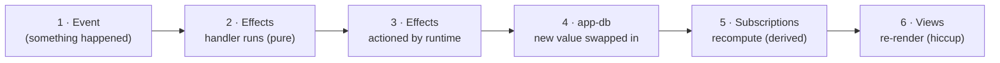

# 01 — Introduction

This chapter is your foot in the door. By the end of it you'll understand maybe 80% of the basics, you'll have run a real re-frame2 program in your browser without installing a single thing, and — if I've done my job — you'll have a working theory of *why* the framework is shaped the way it is, which is the part that actually sticks. The other 20% is the rest of the guide. The 80% is right here, and it's mostly one idea wearing several hats.

## Let me tell you about the gravity well

I want to start with a complaint, because that's how every good engineering essay starts, and because the complaint is load-bearing.

For about ten years now — call it since hooks landed, though the rot set in earlier — the React world has organised itself around a single gravitational centre: the component. State? Lives in the component, in a `useState`. Data fetching? In the component, in a `useEffect`, or in some hook a library plumbed in. Routing? Hooks. Subscriptions to your store? A `useSelector`, which is a hook, which lives in — say it with me — the component. The component is the sun, and everything else is in orbit around it, and the orbit has been decaying *toward the sun* for a decade.

And here's the thing: everyone knows this is a problem. That's the funny part. The entire history of React state management is a series of increasingly elaborate attempts to get state *out* of the component tree without anyone having to admit out loud that the component tree was the wrong place to put it. Redux showed up and said "fine, we'll have one store, off to the side, with reducers" — and it was *right*, it was genuinely a good idea, and then over the next five years the ecosystem slowly, lovingly, migrated all the Redux bits back into hooks because the gravity was just too strong. `useReducer`. `useContext`. "Co-location." MobX tried. Zustand showed up wearing a tiny disguise and pretending it wasn't going to attach state to components and then, well. Recoil, Jotai, signals, server components, the whole parade — every single one of them is, when you squint, another attempt to bolt state onto the component tree while maintaining deniability about it.

I'm not even mad. It's a *reasonable* mistake. The component tree is the thing the framework can see, so the component tree is where everything ends up living. Water flows downhill. Effects colocate with views because views are what's legible to the runtime. It's not stupidity; it's gravity. But it means that in a mature React app, the answer to "where does this piece of state live?" is "somewhere in a tree of three hundred components, possibly in four of them, possibly out of sync between two of them, good luck," and the answer to "what changed it?" is a shrug and a debugger.

re-frame — the original, the one this is the sequel to — looked at that gravity well in 2015 and said: no. We're not doing that. We're going to turn the whole thing inside out.

## Inside out

Here's the inversion, and it's the one idea the rest of the chapter is consequences of, so read it twice.

**State is not in your views. State is in one place. Views are the last thing that happens, not the first.**

In re-frame2 there is exactly one blob of application state, called `app-db`. It's an immutable map. (If you've used Redux: yes, it's the store. If you haven't: it's a big map holding everything your app knows.) Things happen — a click, a server reply, a timer fires, a websocket burps — and each of those becomes an **event**, which is just a little vector of data describing what happened. An **event handler** — a pure function, no funny business — takes the current `app-db` and the event and computes the *next* `app-db`. Then **subscriptions**, which are derivations, recompute the slices of state that views care about. Then, and only then, at the very end of the line, your **views** re-render to match.

Notice what's *not* in that loop. There's no `useState`. There's no `useEffect`. There's no "lifting state up," because the state was never down in the components to begin with — there's nothing to lift. A view in re-frame2 is a render function over some reactive inputs that fires when its inputs change, and that is the *entire* job it has. It's not causal. It doesn't fetch. It doesn't own anything. It's derivative, in the precise sense that it is *derived from* state rather than being the home of state.

This is the part that bites every React-shaped brain on first contact, so let me just say it plainly: **your views are going to be boring.** Gloriously, structurally, can't-get-this-into-a-weird-state boring. That's not a limitation we apologise for. That's the entire point. We took the most bug-infested real estate in your application — the place where state and effects and rendering all got tangled together — and we evicted everybody. Views render. Full stop.

> *Your language of choice should be Turing complete; your architecture shouldn't be.*

That's the snarky version of the thesis, and I'll stand behind it. ClojureScript, the language this is written in, is plenty Turing complete — go wild. But the *architecture* — the shape your app's behaviour flows through — is deliberately not a free-for-all. It's a small, fixed pipeline that every event walks through, the same way, every time. Which brings me to the dominoes.

## A virtual machine made of dominoes

Here's the framing that made it click for me, and I think it's the truest one: **a re-frame2 app is, quite literally, a little virtual machine.**

The handlers you register are the instruction set. The events you dispatch are the instructions. The stream of events your app sees over its whole lifetime — every click, every reply, every tick — is, collectively, the program. And `app-db` is the machine's memory. That's not a cute analogy I'm stretching for a paragraph; it's structurally what's going on, and once you see it you can't unsee it.

Every event runs through the same six-step pipeline. People draw it as a line of dominoes falling, because that's what it is — knock the first one over and the cascade runs to the end, deterministically, every time:



One pass through that pipeline is one **epoch**. (The dominoes and the epoch are the same picture with two names; you'll hear both.) Pure data flows in at the left, pure data flows out, and at exactly *one* point — domino 3 — the runtime takes the data-described effects your handler asked for and actions them against the messy real world: fires the HTTP request, writes to localStorage, pushes the route. Everything else is just values turning into other values.

I want to flag why that one-impure-spot discipline matters so much, because it's not aesthetics. When effects only happen at one known place, and they're *described as data* before they're actioned, then a single bus can watch the whole thing go by. Every event, every effect, every state transition, on one wire. That trace bus is what makes time-travel debugging possible. It's what lets you scrub your app backwards. It's what lets an AI pair-programmer attach to your *running* application and replay the exact cascade that broke. Six different tools — the devtools panel, the component playground, the MCP pair server, the linter, the migration agent, the log shipper — all read that one stream and tell consistent stories about it, *because there is one stream*. You don't get that surveillance state for free in an architecture where anything can change anything from anywhere. You get it precisely *because* you gave up that freedom. Less flexibility, more inspectability. That trade is the whole game.

Okay. That's the theory. I promised you'd run something. Let's run something.

## The smallest interesting program

The smallest program worth writing is a counter: a number, a plus button, a minus button. Click plus, number goes up. It is *aggressively* unimpressive, and that's deliberate, because the shape we use to build this trivial thing is the *exact same shape* we'd use for a trading desk. If the small case feels clean, the large case will too. (And if the small case feels like ceremony — well, hold that thought, we'll come back to it.)

Here's the whole thing, live. This is a real re-frame2 program running in your browser right now — there's no toolchain, no install, nothing hidden off-screen. Click into the cell, then hit **`Ctrl-Enter`** (or **`Cmd-Enter`** on a Mac) to evaluate it. The first run takes a second while the engine wakes up; after that it's instant. Then click the buttons.

```cljs-rf2
(require '[reagent2.core :as r]
         '[re-frame.core :as rf])

;; ---- Events: pure functions of (db, event) -> next db ----
(rf/reg-event-db :counter/initialise
  (fn [_db _event] {:counter/value 5}))

(rf/reg-event-db :counter/inc
  (fn [db _event] (update db :counter/value inc)))

(rf/reg-event-db :counter/dec
  (fn [db _event] (update db :counter/value dec)))

;; ---- Subscription: a derivation from app-db ----
(rf/reg-sub :counter/value
  (fn [db _query] (:counter/value db)))

;; ---- View: hiccup that subscribes and dispatches ----
(defn counter []
  [:div
   [:button {:on-click #(rf/dispatch [:counter/dec])} "-"]
   [:span {:style {:margin "0 1em" :font-size "1.4em"}}
    @(rf/subscribe [:counter/value])]
   [:button {:on-click #(rf/dispatch [:counter/inc])} "+"]])

;; ---- Seed app-db, then hand the view back to be rendered ----
(rf/dispatch-sync [:counter/initialise])
[counter]
```

That's the entire program. Every line is load-bearing and every line is on the page. Roughly thirty lines, and four of those are comments. Let me walk it, because each piece is one of the things you came here to understand, and they're all *right there*.

**The three events** are `reg-event-db` registrations. Each one maps an event id — `:counter/inc`, say — to a pure function. The function takes the current `db` and the event vector, and returns the *new* `db`. That's it. `:counter/inc` is `(fn [db _event] (update db :counter/value inc))` — read a state, return a state, no side effects, no DOM, no network, no `console.log`. The `_` prefixes mean "I'm ignoring this argument." `update` is the Clojure idiom for "transform the value at this key with this function," and crucially it returns a *new* map and leaves the old one alone. Immutability everywhere; nobody mutates `db` in place because *you can't*, it's a value.

A thing to notice while it's in front of you: the ids are **namespaced**. `:counter/inc`, not `:inc`. Every event id starts with the feature it belongs to. In a thirty-line counter this looks like fussiness. In a thirty-thousand-line app it's the difference between "I can grep for everything the counter feature does" and "good luck." The habit costs nothing and starts now.

**The subscription** is a derivation: a function from `app-db` to some value a view wants. Ours is the simplest one that exists — `(fn [db _query] (:counter/value db))`, just read the key. Why bother naming a derivation this trivial? Because once `:counter/value` is a registered, queryable *thing*, your view can ask for it without knowing where it lives in `app-db`. Move the value into some richer slice later and only the subscription changes; the view never notices. (Subscriptions also *chain* — you can build a `:counter/doubled` on top of `:counter/value` and the framework wires up the dependency graph so it only recomputes when something's actually looking. That's chapter 5's whole job. Park it.)

**The view** is the only piece with real shape, and even it is boring on purpose. It's a function returning **hiccup** — a Clojure data structure that describes a DOM tree. `[:div ...]` is a `<div>`; `[:button {:on-click ...} "-"]` is a `<button>` with a click handler and the label `-`. Two interesting bits:

- `@(rf/subscribe [:counter/value])` reads the current value of the subscription. The `@` is "unwrap this reactive thing to its current contents" — it's the hook that makes the view re-render when the value changes. The view doesn't poll, doesn't get told to update; it just declared a dependency and the runtime handles the rest.
- `#(rf/dispatch [:counter/dec])` is the click handler. It puts the `:counter/dec` event on the queue and returns. That's *all* a click does in re-frame2 — it announces that something happened. It does not reach into state. It does not touch the DOM. It dispatches an event and walks away, and the cascade takes it from there.

Notice the view never imperatively pokes a DOM node. There's no `element.textContent = ...`. It *declares what the screen should look like given the current state*, and the runtime makes the DOM match. That's the derivative-not-causal thing, made concrete: the view is a pure-ish function of subscription values, and it just so happens to paint pixels.

**The last two lines** are the mount. `(rf/dispatch-sync [:counter/initialise])` runs the initialiser *synchronously and right now* — by the time the next line executes, `app-db` is `{:counter/value 5}`, so the first render shows `5` instead of flickering through empty. (`dispatch-sync` is the seed-before-render hammer; you'll reach for it at app boot and in tests, and almost nowhere else. Everywhere else, plain `dispatch` — fire and forget, let the runtime order things.) Then the bare `[counter]` hands the view back to be mounted.

> **Try it.** In the cell above, change the `inc` in `:counter/inc` to `(partial + 10)`, re-evaluate (`Ctrl-Enter`), then click `+`. The counter now jumps by ten. You just changed your program's behaviour by editing one pure function — no rebuild, no reload, no ceremony. Now try adding a reset button: drop `[:button {:on-click #(rf/dispatch [:counter/initialise])} "reset"]` in among the others, re-evaluate, click `+` a few times, then `reset`. It snaps back to `5`. You added a feature by *dispatching an event that already existed.* No new handler. That's the shape paying off, in miniature.

## What just happened, in slow motion

When you clicked `+`, here is the cascade, all six dominoes, in order:

1. The button's `:on-click` fired `(rf/dispatch [:counter/inc])`. The event — the vector `[:counter/inc]` — joined the queue. The click handler's job is now over.
2. The runtime popped the event and ran the `:counter/inc` handler: it read `{:counter/value 5}`, returned `{:counter/value 6}`.
3. There were no external effects to action this time — the only effect was "the new db" — so the runtime swapped `app-db`'s reference to the new value, atomically. One instant it's the old state, the next it's the new state, nothing in between for anyone to catch mid-update.
4. The `:counter/value` subscription noticed its input changed and recomputed to `6`.
5. The `counter` view, which had declared a dependency on that subscription via `@subscribe`, re-rendered. The new hiccup is `[:div [:button "-"] [:span 6] [:button "+"]]`.
6. The runtime patched the DOM to match. The `<span>` now reads `6`.

Five named steps you can point at, no surprises, no magic. The same cascade runs whether the app is this counter or something with ten thousand events an hour. *That's* the claim. The machine doesn't get more complicated as your app does; you just register more instructions.

## "This is a lot of ceremony for a counter"

Yeah. It is. I'm not going to pretend otherwise — a counter in plain React is `useState(5)` and two `onClick`s, and it's six lines, and here we are with thirty. If your whole app is a counter, use `useState`. Godspeed. Close the tab.

But your whole app is not a counter, and the ceremony you're paying for here is *amortised over the entire lifetime of a real application*, which is where it stops being ceremony and starts being the only thing keeping you sane. Here's the actual claim, the one this whole guide is in service of:

**The cost of adding a feature is bounded by the size of the feature, not the size of the app.**

Sit with that, because it's the opposite of how most codebases age. In a normally-shaped app, adding a feature means first *reading a substantial fraction of the existing code* to figure out where on earth to wire it in, which components own the relevant state, which effects might fire, what'll break. The marginal cost of a feature grows with the app. That's the death spiral every large frontend eventually circles. In a re-frame2 app, you read the events, the subs, and the one view that touches the area you're changing — and that's *enough*, because there's nowhere else for the relevant logic to hide. State is in one place. Changes happen in one place. Effects are described as data in one place. The "extension" you tried above — adding reset by reusing an existing event — is the small version of that property. It scales up.

So the counter is ceremony, and the ceremony is the point, and the point only becomes visible at scale. You'll have to take that partly on faith for now. The rest of the guide is me earning it back.

## What you now know, and what's coming

You came in cold and you've already got the spine of it: events are data describing what happened; handlers are pure functions computing the next state; `app-db` is the one place state lives; subscriptions derive what views need; views are boring derivative render functions; and the whole thing is a little virtual machine running every event through the same six-domino cascade. You ran it. You changed it. You added a feature to it. That's the 80%.

The 20% is depth and breadth: what happens when a handler genuinely *needs* a side effect (you describe it as data — chapter 7); how subscriptions form a graph that's cheap when nobody's looking and fast when they are (chapter 5); how you test all of this with no browser and no mocks because the handlers are *just functions* (chapter 13); state machines for the flows where "what state are we even in?" is the real question (chapter 12); HTTP that survives contact with a flaky network (chapter 10); and the tooling that turns your running app into something you can scrub backwards through (chapter 17).

Next door, [chapter 02](02-app-db.md) zooms all the way in on the one noun everything else orbits — `app-db` — because ten minutes understanding *where the data actually lives* saves you an afternoon of confusion later. After that, [chapter 03](03-first-app.md) builds this same counter for real, in a project, on your own toolchain, so you can stop borrowing my browser.

A housekeeping note before you go: every line of code in this guide is ClojureScript. If you can already read a Lisp you're fine; if you can't, the [ClojureScript reading guide](../cljs/index.md) is a thirty-minute investment that gets you to "reads it but doesn't write it yet" comfort, which is all the guide assumes. You don't need to be able to *write* Clojure to follow along. You need to be able to look at `(update db :counter/value inc)` and read it left to right as "take db, transform the `:counter/value` key with `inc`." That's the bar. You just cleared it twice.
