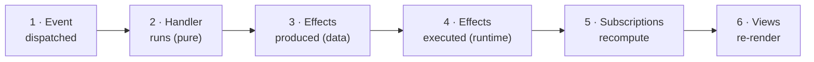

# 04 — Events and the cascade

A click happened. Now what? Between the user's finger leaving the button and the screen showing a new number, six things happen, in order, every time, and not one of them is magic. This chapter walks a single event through all six dominoes — the machine that runs under every re-frame2 app — and along the way answers the question the counter quietly dodged: what happens when a handler needs to do something *impure*, like fetch from a server, without giving up the purity that made it testable in the first place.

The counter in chapter 03 was pure state changes. No fetches, no timers, no localStorage. Real apps are not like that — they ask servers for data, persist tokens, navigate, log to external services. Those are **side effects**, and how re-frame2 handles them is the second load-bearing decision after "where does state live." The whole chapter follows from one rule, so let me put it up front and then spend the rest of the page earning it:

> **Side effects are not *performed* by event handlers. They are *described* by event handlers, as data, and performed by the runtime.**

That sounds like bureaucracy. The payoff is enormous. Here's why.

## Causing versus doing

Look again at the counter's increment handler:

```clojure
(rf/reg-event-db :counter/inc
  (fn [db _event] (update db :counter/value inc)))
```

We called this pure, and it is: `db` and event in, new `db` out, no I/O, tested in one line. But stop and ask the awkward question — *somebody* has to actually swap app-db to the new value so the view re-renders. That swap is a mutation. That's a side effect. It happened. So in what sense is the handler pure?

The answer is the whole trick: **the handler *caused* the state change; the runtime *did* it.** The handler returned a value — "here's the new db" — and the runtime took that value and performed the impure swap on the handler's behalf. The handler stays pure precisely *because* the runtime volunteered for the dirty work.

You've actually seen this exact trade before, in React, and it's worth naming because it makes the re-frame2 move feel less exotic. You write a view that returns a hiccup vector — a pure description of UI. You never imperatively `appendChild` or `setAttribute`. React (via Reagent) takes your description, diffs it against the previous tree, and mutates the real DOM for you. Your view *caused* the rendering; React *did* it. That's the only reason "your view is a pure function of state" is true at all — somebody else signed up for the impure part.

re-frame2 takes that one trade — the one React already makes for the DOM — and generalises it to *every* side effect. Your handler doesn't fetch HTTP; it returns a value that *says* "an HTTP request should happen." It doesn't write localStorage; it returns a value that says "this key should be written." It doesn't navigate; it returns a value that says "the URL should change." In every case: the handler causes, the runtime does. And the result is that the handler is the cleanest layer in the entire system — every function it calls is pure, every value it touches is immutable, every test it has runs in a millisecond with no browser, no network, no clock. The price is that "do X" becomes "return a value describing X," paid once, at one boundary.

## What goes wrong if you cheat

The temptation, the moment the counter wants to reach outside itself, is to just *do the obvious thing right there in the handler*:

```clojure
;; Don't do this.
(rf/reg-event-db :counter/inc-from-server
  (fn [db _event]
    (.then (js/fetch "/api/inc.json")
           (fn [resp]
             ;; ...and now what, exactly?
             ))
    (assoc db :counter/loading? true)))
```

This is wrong in at least three ways, and they're worth spelling out because they're the *reasons* the rule exists, not just rule-following for its own sake.

**The handler isn't pure anymore.** It calls `js/fetch`. You can't test it without mocking the network, and now the test result depends on whether the network's up, which test runner you're using, and whether some other test monkey-patched `fetch` globally. You took the most testable thing in the codebase and made it the least.

**The async path is genuinely awkward.** That `.then` callback fires *after* the handler has already returned. By the time it runs, the `db` it closed over is the *previous* state — stale. The callback can't update app-db directly; the only legal way back in is to dispatch another event. So the function ends up half-pure, half-effectful, the worst possible mix, and you wrote it that way by accident.

**The chain of state changes goes invisible.** You cannot, by reading this handler, predict what the app looks like after the event resolves. You have to trace into the `.then`, see what it dispatches, find *that* handler, trace *its* `.then`, and so on. The dynamic story — the picture of what happens between one state and the next — gets harder to see with every async hop. That's the thing re-frame2 is most determined to protect, and inline `fetch` is exactly how you lose it.

## Effects as data

Here's the same fetch-an-increment event written the re-frame2 way:

```clojure
(rf/reg-event-fx :counter/inc-from-server
  (fn [{:keys [db]} _event]
    {:db (assoc db :counter/loading? true)
     :fx [[:rf.http/managed
           {:request    {:url "/api/inc.json"}
            :on-success [:counter/inc-loaded]}]]}))
```

Three things changed, and each is doing real work:

1. **The registration is `reg-event-fx`, not `reg-event-db`.** The `fx` is "effects" — this handler returns a *map of effects*, not a bare new db. (And here's the lovely part: `reg-event-db` is just sugar for `reg-event-fx` where the handler's return value gets automatically wrapped as `{:db <return>}`. Same machine underneath, two spellings for two ergonomics.)
2. **The handler is still pure.** It returns a Clojure map. Every value in that map is *data* — strings, keywords, vectors. No `js/fetch`, no callbacks, no promises. You can test it as a function: pass in coeffects and an event, assert on the map that comes out.
3. **The map describes everything that should happen.** "Set the db to this *and also* fire a managed HTTP request to that URL, and on success dispatch this event." The handler doesn't fire anything. It writes down what should be fired.

That first argument — `{:keys [db]}` — is the **coeffects map**, the symmetric twin of the effect map going out. `:db` is the standard input every handler gets for free; the matching surface for handlers that need *other* inputs (the current time, a fresh UUID, a value from localStorage) is `inject-cofx`, and [chapter 07 — Effects and coeffects](07-effects-and-coeffects.md) is the chapter where coeffects get the full treatment. The cascade doesn't need them yet, so for now just read `{:keys [db]}` as "give me the current db."

The follow-up handler is pure again — it just folds the server's reply back into state:

```clojure
(rf/reg-event-db :counter/inc-loaded
  (fn [db [_ {:keys [value]}]]
    (-> db
        (assoc :counter/loading? false)
        (update :counter/value + (:delta value)))))
```

The *runtime* is what actually does the HTTP. It looks at the effect map, sees `[:rf.http/managed {...}]`, looks the fx up by id in the registry, and hands it the args. When the request resolves, the fx dispatches `[:counter/inc-loaded {...}]`, which goes through the queue exactly like any other event, and the cascade runs again. (`:rf.http/managed` is the canonical HTTP effect — managed decoding, retry-with-backoff, abort, frame-aware reply addressing. This chapter uses it to make effects-as-data concrete; [chapter 10 — HTTP](10-http.md) is the full surface.)

Read what that bought you: the entire fetch flow is *two pure handlers you read top to bottom, in order.* No callbacks. No `.then` chains. No stale-`db` trap. Data in, data out, data in again. The dynamic story is legible because the impurity got evicted to the one place it's allowed to live.

## Walking one event through every domino

Now the slow-motion version. Chapter 03 left the counter mounted: app-db is `{:counter/value 5}`, the view shows `5`, the user is looking at `[-] 5 [+]`. They click `[+]`. Six things happen, in order. Each has a name. Each is observable. Each is testable in isolation. People draw this as a row of dominoes because that's what it is — knock the first over and the cascade runs to the end, deterministically.



One pass through that pipeline is one **epoch**. (Dominoes and epoch are the same picture under two names; you'll hear both.) Read it once now; refer back whenever something downstream feels mysterious.

### Domino 1 — Event dispatched

The button's `on-click` fires:

```clojure
[:button {:on-click #(dispatch [:counter/inc])} "+"]
```

`dispatch` puts the event vector `[:counter/inc]` onto the runtime's queue and returns immediately. No handler has run. The click handler's job is *over* — the browser's event loop is free to move on. The event is *data*: a vector with a keyword id and, optionally, more args. That's all a dispatch is — announcing that something happened and walking away.

### Domino 2 — Handler runs

The runtime pops `[:counter/inc]` off the queue and looks up its registered handler:

```clojure
(rf/reg-event-db :counter/inc
  (fn [db _event] (update db :counter/value inc)))
```

It runs as a pure function — same `db` and event in, same new `db` out, no side effects, no I/O. Testable in one line: `(handler {:counter/value 5} [:counter/inc]) ;=> {:counter/value 6}`.

### Domino 3 — Effects produced

The handler returned `{:counter/value 6}`. Because this was a `reg-event-db`, the runtime wraps that bare return into an effect map:

```clojure
{:db {:counter/value 6}}
```

That's the entire effect map for this event. No `:fx` vector — no HTTP, no localStorage, no follow-up dispatch. Just "replace app-db with this value." This is the `reg-event-db`-is-sugar point made concrete: the runtime sees `{:db ...}` whether you wrote `reg-event-db` and returned a bare map, or wrote `reg-event-fx` and returned `{:db ...}` yourself.

### Domino 4 — Effects executed

The runtime walks the effect map. It sees `:db` and resets app-db to `{:counter/value 6}` as a *single atomic swap* — no intermediate state is ever visible (the chapter-02 transactionality, in action). If there were an `:fx` vector, the runtime would walk it next, looking up each effect by id and invoking it with its args. For this event there's none, so the queue is now empty and the cascade moves to the read side.

### Domino 5 — Subscriptions recompute

app-db changed. The `:counter/value` subscription is watching:

```clojure
(rf/reg-sub :counter/value
  (fn [db _query] (:counter/value db)))
```

It re-runs against the new `db`, gets `6`, and — because `6` differs from its previous value `5` — marks itself dirty. Any view that derefs this sub is now queued to re-render. (If the value *hadn't* changed, the sub would notice that too, and nothing downstream would re-render. Cheap when nothing changed; that's chapter 05's whole subject.)

### Domino 6 — Views re-render

The view derefs `:counter/value`:

```clojure
(reg-view counter []
  [:div
   [:button {:on-click #(dispatch [:counter/dec])} "-"]
   [:span @(subscribe [:counter/value])]
   [:button {:on-click #(dispatch [:counter/inc])} "+"]])
```

Reagent re-runs the body. `@(subscribe [:counter/value])` now returns `6`. The new hiccup tree is `[:div [:button "-"] [:span 6] [:button "+"]]`. Reagent diffs it against the previous tree, sees that only the `<span>`'s text changed, and patches that one node. The screen shows `6`.

One event, six dominoes, the app stays consistent the whole way. That's the machine. Every event your app ever sees walks this exact path.

## The cascade, made visible

The dominoes are easy to *say* and easy to nod along to. They land harder when you watch them fire. So here's a counter that keeps a running **log of its own cascade** in app-db — every event appends a row recording what it did — and a view that prints the log underneath the buttons. There's no special trace API in play here; this is just the chapter's own point turned into code: because every state change goes through a handler, and every handler is pure, you can record the cascade *as ordinary app-db state* and read it back like anything else.

Click into the cell and press **`Ctrl-Enter`** (or **`Cmd-Enter`** on a Mac). First run takes a beat while the engine wakes up. Then click `+` and `-` and watch the log grow — each click is one trip through the dominoes, and the log is the cascade leaving footprints.

As in chapter 03, the cell is functions-only: the view is a plain `defn` calling the qualified `rf/dispatch` / `rf/subscribe` (the `reg-view` macro is sugar over exactly this).

```cljs-rf2
(require '[reagent2.core :as r]
         '[re-frame.core :as rf])

;; A tiny helper: append a one-line record of what just happened
;; to a :log vector that lives in app-db like any other state.
(defn log-step [db msg]
  (update db :log (fnil conj []) msg))

;; --- Events: each is a pure fn of (db, event) -> next db,
;;     and each leaves a footprint in the log. ---
(rf/reg-event-db :counter/initialise
  (fn [_db _event]
    {:counter/value 5
     :log ["initialise -> db is {:counter/value 5}"]}))

(rf/reg-event-db :counter/inc
  (fn [db _event]
    (-> db
        (update :counter/value inc)
        (log-step (str "inc -> " (inc (:counter/value db)))))))

(rf/reg-event-db :counter/dec
  (fn [db _event]
    (-> db
        (update :counter/value dec)
        (log-step (str "dec -> " (dec (:counter/value db)))))))

;; --- Subscriptions: pure derivations from app-db. ---
(rf/reg-sub :counter/value (fn [db _q] (:counter/value db)))
(rf/reg-sub :counter/log   (fn [db _q] (:log db)))

;; --- View: subscribes to the value AND the cascade log. ---
(defn counter []
  [:div
   [:div {:style {:font-size "1.4em" :margin-bottom "0.6em"}}
    [:button {:on-click #(rf/dispatch [:counter/dec])} "-"]
    [:span {:style {:margin "0 1em"}} @(rf/subscribe [:counter/value])]
    [:button {:on-click #(rf/dispatch [:counter/inc])} "+"]]
   [:div {:style {:font-family "monospace" :font-size "0.85em"
                  :background "#f4f4f4" :padding "0.6em" :border-radius "4px"}}
    [:div {:style {:opacity 0.6 :margin-bottom "0.3em"}} "cascade log:"]
    (for [[i line] (map-indexed vector @(rf/subscribe [:counter/log]))]
      ^{:key i} [:div line])]])

;; --- Seed app-db synchronously, then mount the view. ---
(rf/dispatch-sync [:counter/initialise])
[counter]
```

> **Try it.** The log shows you the cascade leaving a record in state — but the real lesson is how *cheaply* you can add a new event to the same machine. Add a doubling button. First the handler:
>
> ```clojure
> (rf/reg-event-db :counter/double
>   (fn [db _event]
>     (-> db
>         (update :counter/value * 2)
>         (log-step (str "double -> " (* 2 (:counter/value db)))))))
> ```
>
> then a button that dispatches it — `[:button {:on-click #(rf/dispatch [:counter/double])} "×2"]` — into the top row. Re-evaluate, click it. A new event id, a new pure handler, a new line in the log, and it walked the same six dominoes the others did. You extended the instruction set; the machine didn't change.

## The standard effect map

The map a `reg-event-fx` handler returns is intentionally narrow — two top-level keys, and that's the whole grammar:

| Key | Meaning |
|---|---|
| `:db` | Replace app-db with this value. |
| `:fx` | A vector of `[fx-id args]` pairs. *Every other effect* — dispatch, dispatch-later, HTTP, navigation, your own — goes through here. |

That deliberate narrowness is load-bearing. re-frame v1 had top-level `:dispatch`, `:dispatch-later`, `:dispatch-n` as separate keys; in v2 they all fold into `:fx` as ordinary rows (`[:dispatch ...]`, `[:dispatch-later {...}]`). One grammar instead of two parallel ones means the runtime, the tests, and the tooling each see *one* consistent shape. (Migrating a v1 app? The migration agent rewrites the old top-level forms into `:fx` rows for you.)

A busier handler, to show the shape carrying weight:

```clojure
{:db (assoc db :counter/saved? true)
 :fx [[:rf.http/managed
       {:request {:method :post :url "/api/counter"
                  :body {:count (:counter/value db)} :request-content-type :json}}]
      [:localstorage/set {:key "counter" :value (:counter/value db)}]
      [:rf.nav/push-url  "/saved"]
      [:dispatch         [:notification/show "Saved!"]]]}
```

Five effects in one handler — a state change, an HTTP POST, a localStorage write, a navigation, and a follow-up dispatch — and the handler is *still a pure function*. The order is well-defined (runtime applies `:db` first, then walks `:fx` top to bottom). Test it as a function: hand it coeffects and an event, assert on the map. Done. No network, no DOM, no clock.

## Registering your own effect

You're not limited to the framework's built-in effects. Whatever side effect you need, you register it once:

```clojure
(rf/reg-fx :localstorage/set
  {:doc       "Write a value to localStorage."
   :platforms #{:client}}
  (fn [_frame-ctx {:keys [key value]}]
    (.setItem js/localStorage key (pr-str value))))
```

Three things to notice, because each is a small payoff of the effects-as-data discipline:

1. **This is the *only* place in your whole codebase that calls `js/localStorage`.** The handler that triggered the write didn't. The handler that reads the value back later doesn't. The imperative browser call appears exactly once, here, and that's the entire surface for the effect.
2. **The fx receives a runtime context and the args** the handler put in the effect map. Most fxs only use the args; ones that re-dispatch follow-up events thread the context through so the dispatch routes to the right frame.
3. **`:platforms` says where the effect is allowed to run.** `#{:client}` means it's silently skipped during server-side rendering (with a `:rf.fx/skipped-on-platform` trace event) — the handler that *described* the write doesn't have to branch on platform. [Chapter 20 — Server-side](20-server-side.md) is where that pays off.

So *why does returning a map make things happen?* Every `reg-event-fx` handler runs inside an interceptor chain, and the runtime silently inserts a built-in interceptor — `do-fx` — at the front. After your handler returns, `do-fx` walks the effect map and, for each entry, looks up the registered fx by id and invokes it. `:db`, `:fx`, `:dispatch`, `:rf.http/managed`, your `:localstorage/set` — all entries in the same registry, executed by the same loop. That's why registering one new fx is enough to make *every* event handler in the app able to use it: there's one dispatcher reading the registry and calling whatever it finds. [Chapter 09 — Interceptors](09-interceptors.md) opens up that chain — how `do-fx` is just one interceptor among others, and how you slot in your own.

> **A trap worth its own warning: registrations don't fire if the namespace isn't required.** Every `reg-*` form is a top-level side effect — it writes into the registry *when the namespace loads*. If no reachable namespace `(:require)`s your `events.cljs`, the dependency tracker never loads it, the `reg-*` forms never run, and your handler silently *doesn't exist*. Your `dispatch` goes out to `:counter/inc` and nothing answers. The fix is one line: have your boot namespace require every namespace that registers anything — `(:require [my-app.events] [my-app.subs] [my-app.views] ...)`. Those requires look unused (no symbol referenced), but they aren't decorative — they anchor the dep graph and force the registrations to run.

## Run-to-completion: why you never see a half-updated screen

One detail in the cascade deserves a hard stop, because it's an opinionated choice most frameworks make the other way. The runtime drains the *entire queue* before subscriptions update. If you dispatch an event whose handler dispatches three follow-up events, each of which dispatches one more, the view does not see the state after each one. It sees the state *once*, after all of them have settled.

This is **run-to-completion drain semantics**, and the alternative — letting each event update the view independently — is what most React apps do. It's marginally faster in microbenchmarks. It's also exactly why React apps occasionally flicker, show a half-updated state, or render things out of order during fast interactions: the view caught a glimpse of an intermediate state that was never meant to be seen.

Run-to-completion says: *the user sees coherent states, not transitions.* Either the form is submitting or it's in error — never both for one paint. Either the page navigated or it didn't — never the in-between. The cost is a little developer flexibility; the gain is dramatically more predictable behaviour for the person using your app. That trade — give up flexibility, get inspectability and predictability — is the same trade as immutable app-db and effects-as-data. It's the framework's whole personality, showing up a third time.

## Why the verbosity is worth it

It *is* more verbose. The fetch-an-increment flow is one `async`/`await` function in idiomatic React; in re-frame2 it's two handlers plus a registered fx. More places. I'm not going to pretend the counter's effectful cousin is shorter than the React version, because it isn't. What it is, is *legible at scale*, and here's the ledger:

- **Tests need no network.** The handler that produces the effect map is a pure function — test it as one. So are the success and error handlers. The fx itself you test by stubbing one call. None of it needs React, JSDOM, or a running server.
- **You can swap any effect's implementation.** Effects are looked up by id, so a test that wants `:rf.http/managed` to return a canned reply just overrides the registry entry for the test's duration. It's a registry redirect, not a mock — the *same* dispatch shape the real fx produces lands in your handler. The framework ships `with-managed-request-stubs` for exactly this. [Chapter 13 — Testing](13-testing.md) is the full story; effects-as-data is what makes the override possible at all.
- **You can record, replay, and ship what happened.** Because effects are data, the runtime can log them, replay them, store them in a fixture, ship them over the wire. The trace stream surfaces every effect that fired, in order, with its args. Debugging an async interaction stops being archaeology and starts being reading a list.
- **New effects need no runtime changes.** Want a `:fluent-bit/log` effect? `reg-fx` it; every handler in the app can use it immediately. No special case in the dispatch loop, no middleware-ordering puzzle.
- **SSR comes for nearly free.** The same handler that fires `:rf.http/managed` in the browser fires it on the JVM during SSR, with the same code. Effects that don't make sense server-side (`:localstorage/set`) are gated by `:platforms` and skipped quietly. SSR isn't a parallel codebase; it's the same code under a different platform flag — [chapter 20](20-server-side.md).

That last cluster of properties — testable without a network, recordable, replayable, swappable, observable on one stream — is the experience that drove people to re-frame in the first place, and every one of them is a direct dividend of "effects are data the runtime interprets" rather than "effects are things handlers do."

## One value, captured and restored

Worth one closing beat, because it ties the chapter back to chapter 02. Because state lives in one place and updates atomically, **the entire app's state at any instant is a single value.** That value can be captured, stored, diffed, and restored — and any prior value can be restored as a single pointer swap, with no out-of-band state left dangling, because there *is* no out-of-band state. App-level undo is a thin interceptor. Time-travel debugging records values, not events. SSR ships a value. An AI experimenting against your running app can try a change, observe the cascade, and revert — clean — without polluting the registry. Each of those is the same property cashed in a different till: state is a value, the cascade is the only thing that moves it, and the runtime is the only thing that touches the world. Get those three straight and you've got the machine. The rest of the guide is what you build on top of it.
