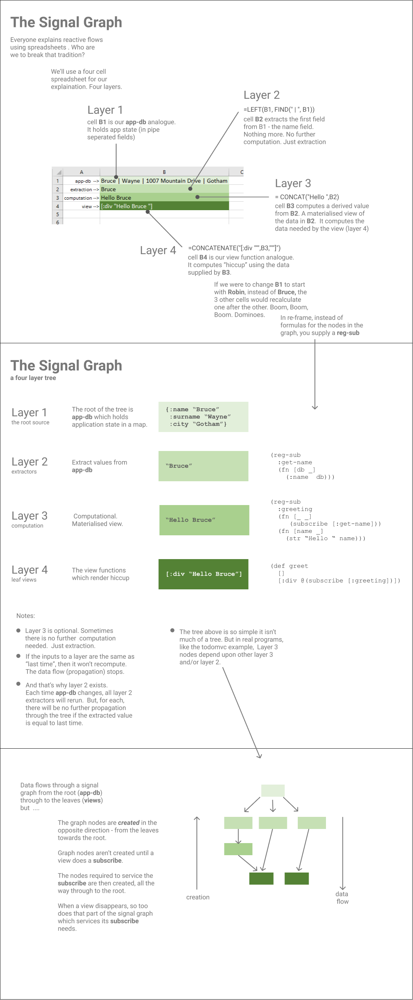

# 06 — Views and frames

Two questions matter for the screen:

1. **What goes on it?** That's the view layer.
2. **Whose state is it showing?** That's the frame layer.

In the simplest case (one app, one page) these collapse together: there's *the* view tree showing *the* state. As soon as you have a story tool, a server-side render, two windows, or anything that involves rendering "the same component but with different state," the two questions diverge. re-frame2 keeps them separate from the start so that when you need the more complex case, the architecture is already there.

## Views

A **view** is a function. It takes some inputs (props, mostly) and returns a description of what should be on the screen. In re-frame2, that description is **hiccup**: nested Clojure vectors that look like the DOM tree they describe.

```clojure
[:div.counter
 [:h1 "Apples"]
 [:p "Count: " [:strong "5"]]]
```

Hiccup is *just data*. You can `pprint` it. You can build it programmatically. You can ship it across the wire. You can write a hiccup → HTML emitter that runs on the JVM (which is exactly what server-side rendering uses).

The fact that hiccup is data, rather than JSX-flavoured pseudo-HTML or a templating-language string, is one of the deeper architectural choices. JSX is *almost* data, but the language extensions and component objects make it not-quite. Templating languages are strings, which means computing them involves string concatenation, which is where SQL injection lives. Hiccup is data the whole way down.

### Plain views vs registered views

The chapter-02 counter view was the simplest case — no arguments, all state read through a sub. A small step up is a view that takes an argument. Suppose we want the counter to display a label alongside its number:

```clojure
(defn labelled-counter [label]
  [:div.counter
   [:h1 label]
   [:span @(rf/subscribe [:count])]])
```

You can use it anywhere by referencing the var: `[labelled-counter "Apples"]` inside another piece of hiccup. Reagent (the underlying view substrate in the CLJS reference) calls the function and substitutes its return value into the tree.

For most apps, this works fine. There's no ceremony, no registration, nothing to register or look up.

But there's a sharper version: **registered views**.

```clojure
(rf/reg-view labelled-counter [label]
  [:div.counter
   [:h1 label]
   [:span @(subscribe [:count])]])
```

Two things change:

1. The view is registered under an auto-derived keyword, `(keyword *ns* "labelled-counter")`. It's now in the registry alongside events, subs, fx. Tooling can list it. AIs can introspect it. You can query its `:doc`/`:spec` metadata.

2. **Inside the view's body, `dispatch` and `subscribe` are bound to the surrounding frame.** This is the load-bearing reason to register views. Without it, plain Reagent functions read state from a hard-coded default frame; you can't put two instances of the same view next to each other showing different state.

For a single-frame app, plain views are fine. For anything else — and "anything else" includes story tools, SSR, devcards, and multi-window apps — register your views. The cost is a few extra characters; the win is that the view-side architecture supports the multi-frame case as soon as you need it.

### `dispatch` and `subscribe` are auto-injected

Inside a `reg-view` body, two names are available that you didn't import: `dispatch` and `subscribe`. They look like the global functions but are **lexically bound**, frame-aware versions that the macro injects.

```clojure
(rf/reg-view counter []
  [:div
   [:button {:on-click #(dispatch [:counter/inc])} "+"]
   [:span @(subscribe [:count])]])
;; ↑                  ↑
;; injected           injected
```

What that buys you: the view's body never says "this frame" out loud. The injected `dispatch`/`subscribe` capture the surrounding frame from the React tree (when wrapped by `frame-provider`) or fall back to the dynamic-var tier or `:rf/default`. The view fn doesn't know which frame it's been instantiated under; the framework routes correctly.

The macro errors at compile time if you hand it a Form-3 (`reagent.core/create-class`) or a non-literal-fn body — the message points you at the underlying fn `reg-view*` for those rare cases. The compile-time check is the load-bearing piece: it stops the auto-inject from silently doing the wrong thing when the body shape isn't what the macro can rewrite.

??? note "Advanced: which Reagent forms `reg-view` supports (skip on first read)"
    If you're already familiar with Reagent's Form-1 / Form-2 / Form-3 distinction, this is how the macro handles each. If not, you don't need this yet — come back when the compile-time error above sends you here.

    Form-1 views — render fns whose body is a literal hiccup expression — get the auto-inject via the macro's expansion. Form-2 views — render fns that return another fn (the "outer fn closes over args, inner fn does the work" Reagent idiom) — also work, and are the canonical shape when the view needs to capture per-instance state in the closure or maintain a Reagent-local atom for transient UI state. Form-3 (`reagent.core/create-class`) is not supported by the macro; use the underlying `reg-view*` fn for those rare cases.

    ```clojure
    ;; Form-1 — direct render
    (rf/reg-view counter []
      [:div @(subscribe [:count])])

    ;; Form-2 — captures args; useful for setup-once-then-render
    (rf/reg-view labelled-counter [label]
      (let [mounted-at (js/Date.now)]
        (fn render [label]
          [:div label ": " @(subscribe [:count]) " (mounted " mounted-at ")"])))
    ```

### Views compute hiccup only

Ask any view what its job is and the answer should be a single sentence: *all I want this view to do is render the product list*. *All I want this view to do is display the time.* That's it. Take some already-shaped data; lay it out as hiccup. Anything else — sorting, filtering, formatting a number, deriving a percentage, joining two values — is the view forgetting what it's for.

The temptation is constant. A view reads from a subscription, and the data it gets back is *almost* what the screen needs; one little `sort-by` here, one `.toFixed` there, and we're done. Resist. There's a rule that pays for itself almost immediately:

> **Views compute hiccup only.** Anything else — sorting, formatting, filtering, deriving — happens in a subscription. Views should ask `@(subscribe [:something/already-shaped])` and return hiccup. The boundary keeps views cheap to re-render and reactivity precise.

Why it pays: subs are cached per-frame and re-run only when their inputs change. A view re-renders any time *any* deref'd input changes. If the sort lives in the view, the sort re-runs on every re-render. If the sort lives in a sub, it re-runs only when the underlying list changes — and every view that needs the sorted list shares one cached computation.

The before/after is small enough to read at a glance.

```clojure
;; Before — the view computes.
(rf/reg-view product-list []
  [:ul
   (for [p (sort-by :name @(subscribe [:products]))]
     ^{:key (:id p)} [:li (:name p) " — $" (.toFixed (:price p) 2)])])
```

The view holds the `sort-by`, holds the price-formatting. Two responsibilities the view shouldn't have; both re-run on every re-render of any ancestor.

```clojure
;; After — the sub computes; the view renders.
(rf/reg-sub :products/sorted
  :<- [:products]
  (fn [products _]
    (->> products
         (map #(update % :price (fn [n] (.toFixed n 2))))
         (sort-by :name))))

(rf/reg-view product-list []
  [:ul
   (for [p @(subscribe [:products/sorted])]
     ^{:key (:id p)} [:li (:name p) " — $" (:price p)])])
```

And we're back where we started: *all this view does is render the product list*. The sort and the price-formatting run once per change to `:products`, in the sub cache, and every view that wants the sorted-and-formatted list shares the cached value. The view's job collapses to "walk the list, emit hiccup."

Keep views as simple as possible. Don't give them knowledge or tasks outside their remit. If it isn't structurally turning data into hiccup, it belongs upstream. v1 has the canonical worked example — see [`correcting-a-wrong.md`](https://github.com/day8/re-frame/blob/master/docs/correcting-a-wrong.md) for the clock-display refactor that established this rule. The performance angle — what compute-in-views actually costs, and the other three shapes of slowness it composes with — is in [16 — Performance](16-performance.md).

### A note on what views don't do

> **Views are derivative.** They're pure functions of state to hiccup. They don't dispatch from their render bodies, they don't attach native DOM listeners (`addEventListener`, `setTimeout`, raw `requestAnimationFrame`), and they don't own imperative library lifecycles. Each of those would lose the frame context that the substrate adapter is keeping for you while render is running.

The mechanism, briefly: when you write `:on-click #(dispatch [:inc])` in hiccup, the substrate adapter wraps that lambda at render time so the eventual callback closes over the surrounding frame. That's what makes `dispatch` inside a `:on-click` frame-correct without you ever writing `:frame` explicitly. The same wrapper covers `:on-change`, `:on-key-down`, `:on-animation-end`, `:on-transition-end`, and every other React-synthetic event prop.

What's *not* wrapped is anything attached imperatively from inside the render body — `(.addEventListener el "animationend" ...)`, `(js/setTimeout ...)`, raw `requestAnimationFrame`. Those fire on a fresh stack with no frame in scope; a bare `(rf/dispatch [...])` from inside them silently routes to `:rf/default`. The view "works" in a single-frame app and breaks the first time it lands inside a `frame-provider`.

```clojure
;; WRONG — dispatch fires from a callback attached outside render;
;; loses frame; silently routes to :rf/default.
(rf/reg-view tile [props]
  [:div {:ref (fn [el]
                (when el
                  (.addEventListener el "animationend"
                    #(dispatch [:tile/finished]))))}])
```

```clojure
;; RIGHT — :on-animation-end is a React-synthetic prop; the adapter
;; wraps it; the dispatch closes over the surrounding frame.
(rf/reg-view tile [props]
  [:div {:on-animation-end #(dispatch [:tile/finished])}])
```

If there is no synthetic-event surface for what you need — `setTimeout`, `fetch`, `requestAnimationFrame`, `IntersectionObserver`, a WebSocket — the right shape is a **registered fx**. The fx captures the frame at registration; the per-event reply is a registered event the fx dispatches with the frame already resolved. [Chapter 10](10-doing-http-requests.md) walks through the HTTP instance. For mount-time imperative attach to a specific DOM node (a third-party library, a chart, a map), the substrate's lifecycle hook is the escape hatch — `reagent.core/create-class` via `reg-view*` in Reagent, `use-effect` in UIx / Helix.

### Animations

Animation is a view-layer concern, but it follows the same rule the rest of this chapter has been making: **state is the truth; the view animates the transition; animation completion is silent unless explicitly modelled in state.** Three regimes cover the space; the regime is chosen by what state actually needs to know.

> **Skim on first read** — animations split into three regimes; come back when you reach for one.

> **Transitions — the 95% case.** State changes; the view re-renders with a different `:class` or `:style`; CSS (or the substrate's animation engine) completes the visual transition silently. No completion event needed — by the time the animation kicks off, `app-db` has already moved on; the visual is catching up. Opacity fades, slide-in / slide-out, accordion expand, list reorder, modal scrim, route transitions all fit. The view binds `:class` / `:style` from a sub; CSS does the interpolation.

> **Continuous loops — physics, games, scroll inertia.** Per-frame state mutation IS the truth. The right shape is a registered fx (e.g. `:ui/raf-loop`) that owns the `requestAnimationFrame` cycle and dispatches a per-frame event carrying delta-time. The fx captures the frame at registration; the event handler updates state; the view renders. Cancellation is a sibling fx that cancels the RAF handle. The shape is the same async-effect six-step structure used for HTTP, with `requestAnimationFrame` substituted for the network round-trip — same frame-capture discipline.

> **Library bridges — Framer Motion, React-Spring, GSAP, AutoAnimate.** The library is component-shaped — it owns its own imperative timing inside its own component tree. The wrapping shape is **outer/inner**: the outer is a registered view that reads subs and produces props; the inner is a `reagent.core/create-class` Form-3 (via `reg-view*`) or a `use-effect` wrapper that hands the library the state-derived props. The view layer never imperatively dispatches; the library's internal completion callbacks bridge at the inner boundary using the same lifecycle-hook discipline.

Most animations are Regime A. Reach for B only when state genuinely advances per-frame. Reach for C only when a third-party library owns the timing. Genuine "the state must wait for an exact `animationend`" cases are rare, and usually signal that "state is truth, visual catches up" wasn't fully exploited. When the case is genuine, the lifecycle hook is the escape hatch — it attaches the listener after commit, cleans up on unmount, and carries the frame correctly because the dispatcher closure was built during render.

### The Signal Graph

A UI is just derived data. The screen is a function of `app-db`; the question worth asking is the one that makes the rest of this chapter snap into focus:

> When this frame's `app-db` changes, who finds out, in what order?

That question is what the Signal Graph answers. A view that derefs `@(subscribe [:products/sorted])` is the leaf of a small dataflow. Walk back from the view: `:products/sorted` derefs `:products`; `:products` derefs the frame's `app-db`. That walk is a graph — the **Signal Graph** — and every re-frame2 app has one per frame. The graph is a DAG rooted at the frame's `app-db`, with view functions at the leaves, and chained `reg-sub`s as the interior nodes. Data flows root-to-leaves; the graph itself is built leaves-first (a view that derefs a sub causes that sub's sub-graph to be instantiated, all the way back to `app-db`).

<p align="center"></p>

*The canonical four-layer Signal Graph (ported from re-frame v1). The bottom `app-db` is **the frame's** `app-db` under re-frame2 — each frame has its own graph rooted in its own store. The diagram's structure is otherwise unchanged.*

So: when `app-db` changes, every layer-2 extractor *in this frame* re-runs, and the news propagates outward through layer 3 to the views — pruning at each step where the value didn't actually move. To see that propagation cleanly, it's instructive to name four conceptual layers.

| Layer | Role | What it does |
|---|---|---|
| **1 — Ground truth** | The frame's `app-db` | The root. One immutable map per frame. |
| **2 — Extractors** | `reg-sub`s that read `app-db` directly | Project a slice. No further computation. |
| **3 — Materialised views** | `reg-sub`s that compose other subs via `:<-` | Shape, sort, filter, derive. Never read `app-db` directly. |
| **4 — Leaves** | View functions | Subscribe to layer 2 or 3 and emit hiccup. |

The simplest Signal Graph has no layer 3 — extractors flow straight into views. As soon as a view needs *shaped* data (the sorted-and-formatted product list above), layer 3 appears.

#### Why extractors should be small

The Signal Graph is reactive. When `app-db` changes, **every** layer-2 extractor re-runs — they all have `app-db` as an input, so they all have to be reconsulted. But here's the load-bearing rule:

> **Propagation pruning.** A layer fires its downstream nodes only if its computed value differs from last time, equality-checked with `=`. If the extractor's slice didn't actually change, propagation stops at that layer — downstream subs and views don't re-run.

That makes layer 2 the **circuit breaker** for the whole graph. If extractors stay tiny — a `get-in`, a key lookup, nothing more — they cost almost nothing to re-run on every `app-db` change, and they prune aggressively. The expensive work in layer 3 (sorts, joins, derivations) and layer 4 (hiccup) only runs when a relevant slice has genuinely moved.

Put computation in an extractor and you've blunted the circuit breaker: a sort that runs on every `app-db` change, regardless of whether the underlying list moved. Push the sort into layer 3 and it runs only when the extracted slice changes. Same code, much sharper reactivity.

#### Why `:<-` exists

The chaining syntax —

```clojure
(rf/reg-sub :products/sorted
  :<- [:products]
  (fn [products _] (sort-by :name products)))
```

— exists so that layer 3 subs can name their layer-2 inputs without reaching back into `app-db`. Two payoffs. First, **shared cache.** Every view that wants `:products/sorted` shares one cached computation; the sort runs once per change to `:products`, not once per view. Second, **the layering is enforced by shape.** A sub that uses `:<-` is, by construction, reading other subs — never `app-db`. A sub that takes `(fn [db _] ...)` is, by construction, an extractor. The framework can read the registry and tell you which layer each sub is on, which is how `sub-topology` (see the [Causa tutorial](../causa/index.md)) draws the graph.

The discipline is small: keep extractors tiny, put derivation in layer 3, let `:<-` wire the layers together. The reward is a reactivity story where adding a new view never costs more than the work that view's actually new slice required.

### `<sub` and `>evt` — the LIN aliases

You'll see two short names in v1 code in the wild — `<sub` and `>evt`. They're the **Lambda Island Naming** convention: arrow-shaped aliases that read as "value coming from a sub" and "event going to dispatch."

```clojure
(def <sub  (comp deref rf/subscribe))   ;; @(rf/subscribe [...])  →  (<sub [...])
(def >evt  rf/dispatch)                 ;; (rf/dispatch [...])    →  (>evt [...])
```

The win is purely readability: `(<sub [:products/sorted])` is shorter than `@(rf/subscribe [:products/sorted])`, and the `<`/`>` glyphs hint at the direction of data flow. Inside a `reg-view`, the equivalent local pair is `(comp deref subscribe)` and `dispatch` — the frame-bound versions.

These are **optional ergonomics**, not the canonical idiom in this guide; the examples here use `@(subscribe …)` and `dispatch` directly so the underlying primitive stays visible. If you're reading v1 code, or porting a v1 app, recognising the aliases is enough.

### The Var-reference idiom

`reg-view` is defn-shape: it auto-defs the symbol you supply. Reference that var like any other Reagent component:

```clojure
(rf/reg-view labelled-counter [label] ...)

;; ... elsewhere
[:div
 [labelled-counter "Apples"]
 [labelled-counter "Oranges"]]
```

This reads exactly like Reagent. There's nothing to learn. It just happens to work for the multi-frame case because of the registration that's also happening.

An alternative form exists — `(rf/view :my-ns/labelled-counter)` for runtime-id'd dispatch and late-binding (cross-module reference, hot-reload-sensitive call sites) — but the Var idiom is what you'll see most. `view` is the escape hatch for those specific cases.

## Frames

A **frame** is the boundary that holds an app's runtime state. Each frame has:

- An `app-db` (a single immutable map).
- A queue of events to process.
- A subscription cache.
- An id (a keyword).

In a single-frame app, all of these are implicit. The default frame, `:rf/default`, gets registered automatically. Every dispatch goes to it. Every subscribe reads from it. You don't think about frames at all.

In multi-frame apps, you care.

### When you need multiple frames

You need multiple frames when you want **multiple instances of the same app's handlers** with different state. The headline cases:

- **Story tools.** "Show me this view in the loaded state, the loading state, and the error state, side by side." Each story is a frame. They share the same registered events / subs / views; their `app-db` values differ.
- **Server-side rendering.** Each HTTP request creates a frame, runs setup events, renders, ships state, destroys the frame. Concurrent requests don't pollute each other.
- **Devcards / Storybook-style isolated rendering.** Same reason as story tools: render the component, in isolation, in a known state.
- **Multi-window or split-screen UIs.** If you've got two panels showing related data with shared events, give each panel its own frame.
- **Per-test fixtures in unit tests.** Each test runs in a fresh frame, gets its own `app-db`, doesn't leak state to the next test.

What you don't need multiple frames for:

- **Different *apps* on one page.** That's a different problem (micro-frontends), explicitly out of scope. Use iframes.
- **State for different routes.** Routing puts different data in `app-db` over time, but it's all the same app — one frame is correct.
- **State for different components.** You don't isolate by component. You compose subs/events to read and write the slices each component cares about.

### Creating a frame

Two ways:

```clojure
;; Named, registered up-front.
(rf/reg-frame :counter
  {:doc "An isolated counter frame."
   :on-create [:counter/initialise]})

;; Anonymous, gensym'd id.
(let [f (rf/make-frame {:on-create [:counter/initialise]})]
  ...)
```

`reg-frame` is for frames you'll dispatch into by name (story variants, well-known runtime instances). `make-frame` is for frames whose lifecycle is controlled by surrounding code — typically tests and per-mount story instances.

Both end with the same shape: a frame is in the global frame registry under its keyword id, with its `app-db` initialised by the `:on-create` event.

### Frame presets

Most frames you'll register fall into one of four shapes: a normal client app, a per-test fixture, a story variant, a per-request SSR frame. Writing the metadata for each by hand each time would be repetitive *and* would make the intent of the call site invisible. So re-frame2 ships a closed set of four canonical **presets**:

```clojure
(rf/reg-frame :test/counter-flow      {:preset :test})
(rf/reg-frame :story.counter/loading  {:preset :story})
(rf/reg-frame :ssr.req/abc123         {:preset :ssr-server})
(rf/reg-frame :app/main               {:preset :default})  ;; same as omitting :preset
```

Each preset expands at registration time into a fixed bundle — `:test` redirects `:rf.http/managed` to the canned-success stub (so HTTP fx don't reach the network in tests) and stamps `:drain-depth 100`; `:story` does the same redirect and tightens `:drain-depth` to 16 so runaway dispatch cascades fail fast under a story; `:ssr-server` sets `:platform :server` and wires the server-projection error path. User-supplied keys override the expansion (so you can opt out of any one default), but the preset's name stays in the metadata and is queryable. The expansions are locked — every `:test` frame is configured the same way, every `:story` frame is configured the same way. Adding a fifth preset would be a Spec-change.

This matters because the call site now declares its intent — "this is a test frame" — and tooling (test runners, story runners, SSR adapters) reads that declaration without inferring it from the surrounding code.

### Targeting a specific frame

Every dispatch and every subscribe takes a frame argument when targeting a specific frame from outside a registered view:

```clojure
(rf/dispatch [:counter/inc] {:frame :left})   ;; dispatch — opts map
(rf/subscribe :right [:count])                 ;; subscribe — frame-id positional
```

The shapes differ for historical reasons: `dispatch` carries opts beyond `:frame` (e.g. `:fx-overrides` for tests), while `subscribe`'s only out-of-view callers are tooling-shaped, where a positional frame-id is enough.

This is the **explicit-frame addressing** form. It's the canonical way to target a frame from outside a registered view — REPL sessions, test code, event-handler effects (fx).

Inside a registered view's body, you don't write the `:frame` argument explicitly — `dispatch` and `subscribe` are already bound to the surrounding frame. That's what the registration buys you: the view's body is frame-blind, and the framework routes correctly.

### `frame-provider` — scoping a frame to a subtree

In CLJS, the way to put a registered view inside a particular frame's subtree is `frame-provider`:

```clojure
[:div.app
 [rf/frame-provider {:frame :left}
  [counter-view]]                     ;; reads/writes :left
 [rf/frame-provider {:frame :right}
  [counter-view]]]                    ;; reads/writes :right, same view fn
```

Two instances of the same registered view, different frames. Each subtree's `dispatch`/`subscribe` resolves to its own frame. The view fn doesn't know it's been instantiated twice with different state.

The propagation mechanism is **React context** — wrapping a subtree with `[rf/frame-provider {:frame :left} ...]` makes the frame id available to every registered view rendered underneath, and the auto-injected `dispatch`/`subscribe` resolves against it. The full resolution chain is dynamic-var → React context → `:rf/default`; this is part of `reg-view`'s contract, and the split-counter example below exercises it end-to-end.

`frame-provider` is a Reagent-specific (React context-driven) construct. The pattern itself doesn't require it — what the *pattern* requires is that every dispatch/subscribe targets a specific frame, by whatever mechanism the host language provides. In TypeScript, you might use a hooks-flavoured `useFrame()`. In Python, you might pass the frame as an argument. In Clojure, React context happens to be ergonomic. The contract — every view targets a specific frame — is the part that survives across hosts.

## Source coordinates on rendered DOM

One small detail to recognise when you see it in the inspector: every `reg-view`-rendered DOM element carries a `data-rf2-source-coord="<ns>:<sym>:<line>:<col>"` attribute pointing back to the registration that produced it. It's how pair tools and devtools resolve a clicked DOM node back to the source line. The annotation is dev-only — production builds elide it via DCE.

You don't need to do anything to get it. `reg-view` does it. The full story — format, recovery to file path, exemptions, machine-spec equivalents — is in the [Causa click-to-source tutorial](../causa/05-click-to-source.md).

## Routing as state

Routing is just another slice of `app-db`. The current route lives at `:route` (a `{:id :params :query :fragment :transition :nav-token}` map); navigation is an event; the active route is a sub. There's no separate routing runtime — it's data that happens to be reflected in the address bar. The full story (deterministic ranking, navigation tokens, `:can-leave` guards, multi-frame routing) is in [chapter 17](17-routing.md). For this chapter, the load-bearing fact is that routing doesn't break the one-app-db model.

## A small example: split counter

Two counters, side by side, isolated:

```clojure
;; Registered events/subs/views (same for both counters)
(rf/reg-event-db :counter/initialise (fn [_ _] {:count 0}))
(rf/reg-event-db :counter/inc        (fn [db _] (update db :count inc)))
(rf/reg-sub      :count              (fn [db _] (:count db)))

(rf/reg-view counter []
  [:div
   [:button {:on-click #(dispatch [:counter/inc])} "+"]
   [:span @(subscribe [:count])]])

;; Two frames, one for each side.
(rf/reg-frame :left  {:on-create [:counter/initialise]})
(rf/reg-frame :right {:on-create [:counter/initialise]})

;; Mount both, scoped.
(defn ^:export run []
  (rdc/render root
    [:div.split
     [rf/frame-provider {:frame :left}  [counter]]
     [rf/frame-provider {:frame :right} [counter]]]))
```

That's the whole thing. Same registered handlers. Same registered view. Two frames. Each click increments only its own side. The handlers don't know there are two of them.

What this would look like in idiomatic React would be three or four `useState`s, plus prop-drilling to keep them separate, plus a careful audit to ensure the click handler isn't accidentally closed over the wrong state. In re-frame2, the architecture handles isolation; the developer doesn't.

## Frames are not "components with state"

There's a temptation, when you first see frames, to use them like React components: each component gets its own frame. **Don't do this.** Frames are heavyweight — they have their own `app-db`, queue, and sub-cache. They exist for cases where the *whole app* runs in isolation (story variants, SSR requests, multi-window). For "component-level state," you do what re-frame has always done: put the data in `app-db`, write events to update it, write subs to read it.

A useful test: if two instances might want to share state under any circumstance, they're not separate frames. They're separate slices of the same frame's `app-db`.

## Beyond this chapter

Two adjacent topics deserve a pointer before you leave views and frames, but neither is needed up front:

- **Flows — computed values stored in `app-db`** (rather than the per-frame sub-cache). A niche convenience for derived values that need to be visible to other handlers, survive SSR/hydration, or carry a schema. Reach for it only when a sub won't do. The canonical introduction lives at [18 — From re-frame v1 §Flows](18-from-re-frame-v1.md#flows--the-replacement-for-on-changes) (flows are the migration target for v1's `on-changes`).
- **Nine-states UI checklist** — `Nothing` / `Loading` / `Empty` / `One` / `Some` / `Too Many` / `Incorrect` / `Correct` / `Done`. Modelled as one parallel state machine with three regions; introduced once you've met parallel regions in [08 — State machines §Parallel regions](08-state-machines.md#parallel-regions).

## What we covered

- The view layer is plain functions (or registered views) returning hiccup.
- Registered views are the canonical form because they bring frame-routing and registry introspection.
- Frames are runtime boundaries: each has its own state, queue, sub-cache.
- Most apps are single-frame; multi-frame is for story tools, SSR, devcards, multi-window.
- The pattern requires every view to target a specific frame; the CLJS reference uses React context (`frame-provider`) to make that ergonomic.
- Routing is just `app-db` state, like everything else — multi-frame doesn't change that.

## Next

- [08 — State machines](08-state-machines.md) — when an event handler's logic is a flow, model it as a state machine.
