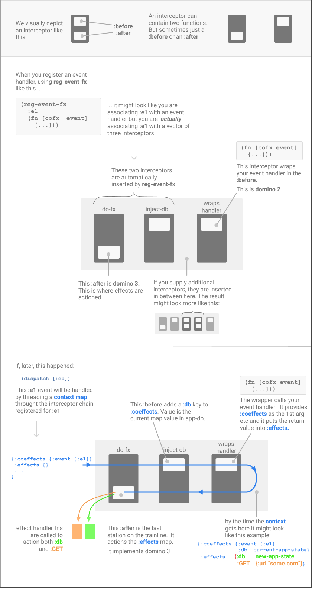

# 07 — Interceptors

You'll see `:interceptors` in `reg-frame`, the positional middle slot of `reg-event-*`, the `event-recorder` test pattern in [chapter 13](13-testing.md), the auth guard in [chapter 17a](17a-routing-reference.md#worked-example--the-realworld-scaffold). All of it bottoms out on one concept this chapter teaches.

This is a deep-dive. The core path doesn't need it — every counter, form, and HTTP request you've seen so far works without you writing a single interceptor. But the moment you want to *wrap* a handler — capture every event for a recorder, snapshot `app-db` for undo, validate input on the way in, log timing on the way out — interceptors are the surface for it.

The good news: there's exactly one primitive (`->interceptor`), one shape (a map with `:before` and `:after`), and one rule for how they compose. Once you see the sandwich, the rest is mechanics.

## The sandwich

<p align="center"></p>

*The interceptor pipeline (ported from v1).* `:before` functions stack on the way in; the handler runs in the middle; `:after` functions unwind on the way out in reverse declaration order. Per-frame interceptors are new in re-frame2 — every frame can carry its own pipeline — but the per-interceptor `:before` / `:after` shape and the reverse-order unwind are unchanged.

A handler does one thing: takes the current state plus an event, produces a new state plus effects. That's the meat.

An **interceptor** wraps a handler from the outside. Each interceptor is a pair of functions — `:before`, which runs *on the way in*, and `:after`, which runs *on the way out*. The handler is the filling. Each interceptor is a pair of bread slices: one slice goes on top, one on bottom, before and after the meat.

```
                ┌──────────────────────┐
        :before │                      │ :after
   ─────────────┤      interceptor     ├───────────►
                │                      │
                └──────────────────────┘

                ┌──────────────────────┐
        :before │     interceptor      │ :after
   ─────────────┤   ┌──────────────┐   ├───────────►
                │   │   handler    │   │
                │   └──────────────┘   │
                └──────────────────────┘
```

Stack two interceptors around the same handler and you get a sandwich of a sandwich — each one's `:before` runs before the next, each one's `:after` runs *after* the next. Three of them, four, however many: the pattern is the same. Each interceptor adds a layer on the way in and a layer on the way out.

This is the same pattern Pedestal uses for HTTP request middleware, and the pattern most Ring middleware ends up rediscovering. re-frame inherited it from there. The reason it survived: it's the smallest construct that lets a handler stay *pure* while still being decorated with cross-cutting concerns. The handler doesn't know there are interceptors around it; the interceptors don't know which handler is in the middle. They communicate through one shared value — the *context map*.

## The context map

Everything threaded through the sandwich is one Clojure map. That map has two load-bearing keys:

| Key | What's in it | Set by |
|---|---|---|
| `:coeffects` | The handler's **inputs**: the event vector, the current `app-db`, plus any registered cofx values (current time, browser language, a localStorage value …). | Cofx interceptors on the way in. |
| `:effects` | The handler's **outputs**: the new `:db`, the `:fx` vector. | The handler itself; modified by `:after` interceptors on the way out. |

A typical context map mid-pipeline looks like this:

```clojure
{:coeffects {:event [:cart.item/add {:sku "abc-123" :qty 2}]
             :db    {:cart {:items [...]} :auth {...}}
             :now   1747008000}                       ;; injected by an inject-cofx interceptor
 :effects   {:db    {:cart {:items [... new-item]} :auth {...}}
             :fx    [[:rf.http/managed {...}]]}}
```

`:coeffects` is what the handler reads. `:effects` is what the handler writes. Interceptors live in the gap: their `:before` sees only `:coeffects` (the handler hasn't run yet), their `:after` sees both (the handler has filled in `:effects`).

You'll occasionally see two more keys on the context — `:rf/skip-handler?` (set by validation cofx when a schema check fails), and `:rf/interceptor-error` (set by the chain runtime when a `:before` or `:after` throws). These are framework-internal. Your interceptors won't usually touch them; the chain runtime owns them.

> **Note on v1's `:queue` and `:stack`.** Readers coming from re-frame v1 may remember the context map carrying `:queue` (the interceptors still to run) and `:stack` (the interceptors that have run). re-frame2's interceptor runtime executes the chain as a straight forward sweep followed by a reverse sweep over a fixed vector — there's no in-flight queue to consult, no stack to inspect. The interceptors-as-data view is preserved (each interceptor is still a plain map you can construct and inspect), but the chain runtime doesn't expose internal scheduling state on the context. The result: more orthogonal, fewer hidden levers. If you wrote an interceptor in v1 that read `:queue` or popped `:stack`, that interceptor needs rewriting; the migration agent flags it.

## `->interceptor` — the primitive

`->interceptor` builds the map. That's it. Three keys:

```clojure
(rf/->interceptor
  :id     :my-app/logger             ;; required if you want override-by-id
  :before (fn [ctx] ...)             ;; optional — runs on the way in
  :after  (fn [ctx] ...))            ;; optional — runs on the way out
```

Both `:before` and `:after` receive the context map and return a (possibly modified) context map. If a slot returns `nil`, the runtime treats it as "return the context unchanged" — so a `:before` that's purely for side-effects (a log line, a metric emission) doesn't need a trailing `ctx`.

`:id` is conventionally a namespaced keyword. It's the handle for two things: trace events name your interceptor by id, and per-frame `:interceptor-overrides` substitute by id (see [chapter 13 §Disabling a logging interceptor](13-testing.md#disabling-a-logging-interceptor)). An anonymous interceptor (no `:id`) works but can't be overridden — tooling can't find it.

The whole construct is data. You can `pprint` it. You can compose it. You can store interceptors in a registry and look them up. v1 shipped a fistful of helpers (`debug`, `trim-v`, `enrich`, `after`, `on-changes`) that each wrapped `->interceptor` for one specific shape; v2 drops them. The principle: keep helpers that do non-trivial work (`path`, `unwrap`, `inject-cofx`); drop those that are just `(->interceptor :before f)` with a different name. Write custom `:before`/`:after` work using `->interceptor` directly — it's three lines.

## The threading flow

The chain runs in two sweeps. `:before` runs **in declaration order**. The handler runs in the middle. `:after` runs in **reverse declaration order**. That last detail — reverse — is the load-bearing one.

Suppose three interceptors `A`, `B`, `C` wrap a handler `H`. The chain looks like:

```
   declared:   [ A  B  C  H ]

   sweep 1 (:before, in order):
                A:before
                B:before
                C:before
                H:before  ←  the handler runs as the last :before
   sweep 2 (:after, in reverse):
                C:after
                B:after
                A:after
```

The handler runs as the last `:before` on the way in. That's not a quirk — it's how v2 implements "handler" uniformly: the handler is wrapped as an interceptor itself, with its `:before` doing the work. The trip back out (`:after` in reverse) is symmetric with the trip in: the outermost interceptor's `:before` ran first and its `:after` runs last, like a real sandwich's outer slice.

Why reverse on the way out? Because each `:after` is the dual of the corresponding `:before`. If `B:before` sets up some state on the context, `B:after` is the natural place to tear that state down. Putting them in reverse order means `B:after` runs *after* `C:after` has finished — `B` was outside `C` on the way in, so it's outside `C` on the way out. The `path` interceptor (covered below) and the framework-provided `unwrap` interceptor both lean on this symmetry — they stash on the way in, restore on the way out.

> **Forward link — the diagram.** A canonical adaptation of v1's `interceptors.png` (the pipeline visualisation showing one event traversing the sandwich) is in flight. When it lands, it'll sit here.

## A worked example — a logger

A logger is the simplest interceptor that actually does something useful. It records the event on the way in, the elapsed time on the way out.

```clojure
(def logger
  (rf/->interceptor
    :id     :my-app/logger
    :before (fn [ctx]
              (let [event (get-in ctx [:coeffects :event])]
                (js/console.log "→" (pr-str event))
                (assoc ctx ::logger-start (js/performance.now))))
    :after  (fn [ctx]
              (let [event (get-in ctx [:coeffects :event])
                    elapsed (- (js/performance.now)
                               (::logger-start ctx))]
                (js/console.log "←" (pr-str event) (str elapsed "ms"))
                ctx))))
```

Three things to notice.

**The context is the only channel.** The `:before` stashes the start time under a namespaced key (`::logger-start`); the `:after` reads it from the same key. No closures, no thread-locals — every interceptor invocation has its own context map.

**The `:id` is namespaced.** That's the handle for `:interceptor-overrides` — a test frame can do `{:interceptor-overrides {:my-app/logger nil}}` to silence the logger for that frame, or substitute a different one (e.g. a recorder that writes to an atom instead of the console).

**Both slots return the context.** Even when the slot only side-effects (the `js/console.log` calls), it must return the ctx so the next sweep stage has something to work with. Forgetting this is the most common interceptor bug — the runtime treats a `nil` return as "no change," which works by accident in many cases but breaks the moment you also `assoc` something on the way in.

Wire it onto an event handler in the positional middle slot:

```clojure
(rf/reg-event-db :counter/inc
  [logger]                       ;; ← the interceptors slot
  (fn [db _] (update db :count inc)))
```

When `:counter/inc` fires, you see the log entry on the way in, the handler runs, the log entry on the way out. The handler itself has no idea the logger is there.

## A second worked example — the event recorder

This is the pattern [chapter 13](13-testing.md#recording-dispatched-events-without-firing-them) uses for tests. An atom collects every event that fires; afterward the test asserts on the sequence.

```clojure
(def recorded (atom []))

(def event-recorder
  (rf/->interceptor
    :id :test/event-recorder
    :before (fn [ctx]
              (swap! recorded conj (-> ctx :coeffects :event))
              ctx)))
```

No `:after` — there's nothing to do on the way out. The `:before` reaches into `:coeffects` for the event vector, appends it to the atom, returns the context unchanged.

Attached to a *frame* instead of an event:

```clojure
(rf/reg-frame :test/recorder-frame
  {:interceptors [event-recorder]})       ;; prepended to every event in the frame
```

Every event handled in `:test/recorder-frame` gets the recorder prepended to its chain. The test runs a sequence of dispatches; `@recorded` is the list of events that fired. No mocks; no global state to clean up between tests; no special-casing of "should I capture this event."

## A third worked example — undo

The Circle Drawer in `examples/reagent/7Guis/circle_drawer/` uses an interceptor for per-event undo. It captures the pre-handler value of the `:circles` slice and pushes it onto an `:undo` stack if the handler actually changed something.

```clojure
(def undoable
  (rf/->interceptor
    :id    :undoable
    :before (fn [ctx]
              ;; Snapshot taken from coeffects (the pre-handler db).
              (let [db    (get-in ctx [:coeffects :db])
                    prior (get-in db [:drawer :circles])]
                (assoc-in ctx [:coeffects :prior-circles] prior)))
    :after  (fn [ctx]
              ;; If the handler changed db, push the prior value to :undo.
              (let [prior    (get-in ctx [:coeffects :prior-circles])
                    db-after (get-in ctx [:effects :db])]
                (if (and db-after (not= prior (get-in db-after [:drawer :circles])))
                  (-> ctx
                      (update-in [:effects :db :drawer :undo] (fnil conj []) prior)
                      (assoc-in  [:effects :db :drawer :redo] []))
                  ctx)))))
```

The `:before` reads `:coeffects` (the inputs — `:db` is the pre-handler value). The `:after` reads `:effects` (the outputs — `:db` is the post-handler value, or absent if the handler didn't change state). The interceptor lives in the gap between input and output and uses both.

Wiring it on:

```clojure
(rf/reg-event-db :drawer/add-circle
  [undoable]
  (fn [db [_ x y]]
    (update-in db [:drawer :circles] conj
               {:id (random-uuid) :x x :y y :radius 30})))

;; Continuous events opt out — the slider drag doesn't pollute undo history.
(rf/reg-event-db :drawer/dialog-drag
  (fn [db [_ new-radius]]
    (assoc-in db [:drawer :dialog :draft-radius] new-radius)))
```

Same handlers as before; the `[undoable]` slot picks which events are undoable. No special undo registry, no opt-in macro, no metadata flag — just an interceptor in the chain.

## Per-handler vs per-frame — where interceptors attach

re-frame2 has two attachment points for interceptors, and the distinction is new in v2.

**Per-handler interceptors** live in the positional middle slot of `reg-event-*`:

```clojure
(rf/reg-event-db :cart.item/add
  {:doc "Add an item to the cart."}              ;; optional reflection metadata
  [undoable spec/validate-at-boundary]            ;; ← the interceptors slot
  (fn [db [_ item]] (update db :items conj item)))
```

They fire **only for this event**. Use per-handler when the interceptor is event-specific — e.g. `undoable` only on the events that should be reversible, `path` to focus a handler on a sub-slice, `unwrap` to flatten a single event's payload destructure.

**Per-frame interceptors** live on the frame's `:interceptors` key:

```clojure
(rf/reg-frame :app/main
  {:interceptors [logger app-db-validator]})       ;; prepended to every event in this frame
```

They fire **for every event handled in this frame**. Use per-frame when the interceptor is cross-cutting — a logger that should see every event, a validator that should run after every state change, a recorder for a story or test fixture.

The per-frame chain is **prepended** to the per-handler chain. So an event with three per-handler interceptors handled in a frame with two per-frame interceptors runs a five-deep sandwich: `[frame-1 frame-2 handler-1 handler-2 handler-3 (wrapped-handler)]`, with the `:before` and `:after` sweeps as described above.

**This is new in v2.** v1 had `reg-global-interceptor` for the cross-cutting case — a single process-global list that fired for every event in every frame. v2 doesn't ship that surface — the migration agent flags `reg-global-interceptor` and points at per-frame `:interceptors` as the replacement. For most cases per-frame is the right tool: it gives you the same convenience for the single-frame app (just attach to `:rf/default`), but in a multi-frame app each frame's `:interceptors` is independent. The two interceptor stacks don't bleed across SSR requests, across story variants, across test fixtures. Cross-frame *observation* (audit logging, tracing) goes through the trace bus, not through interceptors.

## What an interceptor can add to the context

The framework's three retained helpers — `path`, `unwrap`, `inject-cofx` — are good examples of what `:before` and `:after` can do.

**Adding a coeffect.** [`inject-cofx`](05-coeffects.md) is the canonical shape: a `:before` that runs a registered cofx fn and merges its result into `:coeffects`. The handler then reads the new value from its cofx map — `reg-event-fx` and `reg-event-ctx` see the full `:coeffects` map as their first argument; `reg-event-db` only sees `db` and the event vector, so it can't read injected cofx values directly (use `reg-event-fx` for any handler that needs them). [Chapter 05 — Coeffects](05-coeffects.md) is the deep-dive on the cofx surface itself; this section just locates it inside the interceptor model.

**Modifying an effect.** An `:after` that walks `[:effects :db]` and applies a transformation lets you write event-handler-agnostic state-shape policy. The `undoable` example above is exactly this: an `:after` that conditionally writes to `[:effects :db :drawer :undo]` after every change.

**Short-circuiting the handler.** Setting `:rf/skip-handler?` to truthy on the context from a `:before` causes the handler-interceptor (and any downstream `:before` stages it would have wrapped) to be a no-op. The downstream `:after` stages still run — they get the chance to clean up. The schema-validation interceptor uses this on a validation failure; a custom auth gate could do the same.

**Adding a follow-up dispatch.** An `:after` can `update-in [:effects :fx]` to append a `[:dispatch ...]` row. The event will be queued behind whatever the handler itself returned, in source order. This is how the auth guard in [chapter 17a](17a-routing-reference.md#worked-example--the-realworld-scaffold) redirects unauthorised navigations — the `:before` mutates the event coeffect to point at `:route/login` instead.

What an interceptor *should not* do:

- **Don't perform side-effects directly.** That's what effects are for. An interceptor that writes to `js/localStorage` is just an effect handler in disguise — register it with `reg-fx` instead. The runtime trace will be clearer, tests will be cleaner, the override-by-id surface from [chapter 13](13-testing.md) will apply.
- **Don't depend on chain position.** A well-behaved interceptor is composable: it works whether it's first in the chain or last. If your interceptor only works when wrapped by another specific interceptor, you're encoding a chain ordering as a precondition; that's fragile.

## When the chain throws

Each `:before` and `:after` is invoked inside a try/catch. If a slot throws, the exception is captured on the context under `:rf/interceptor-error` with the failing interceptor's `:id` and the phase (`:before` or `:after`). The chain *keeps running* — subsequent stages get the chance to do their cleanup with the error-bearing context.

After the chain completes, the runtime checks for `:rf/interceptor-error` and emits `:rf.error/handler-exception` with the failing interceptor's id (not the event's). [Chapter 14 §Scenario 5 — unhandled exception in an interceptor](14-errors.md#scenario-5--unhandled-exception-in-an-interceptor) walks through the full recovery semantics — a `:before` throw aborts the handler; an `:after` throw halts the cascade so the effects don't fire.

The takeaway for the chapter: write your `:before` and `:after` to be defensive — the context they receive may carry an error from a prior stage. If your `:after` is cleaning up resources, check for the error and clean up anyway.

## Composition rules — what to remember

Three rules cover most cases.

1. **`:before` runs in declaration order.** The first interceptor in the vector sees the context first.
2. **`:after` runs in reverse declaration order.** The first interceptor in the vector sees the *final* context last — symmetric with the trip in.
3. **Per-frame interceptors are prepended to per-handler interceptors.** Frame-wide concerns wrap event-specific concerns; event-specific ones wrap the handler.

If you need a fourth rule, you're probably overthinking it. Interceptors are deliberately small.

## What we covered

- The sandwich: interceptors wrap handlers from the outside; multiple interceptors stack as a sandwich-of-sandwiches.
- The context map: `:coeffects` holds the handler's inputs, `:effects` holds its outputs, interceptors live in the gap.
- `->interceptor`: the one primitive. `:id`, `:before`, `:after`.
- The threading: `:before` in order, handler in the middle, `:after` in reverse.
- Per-handler vs per-frame attachment — the per-frame surface is new in v2 and replaces v1's `reg-global-interceptor`.
- Three worked examples: a logger, an event recorder, an undo interceptor.

## Next

- [08 — State machines](08-state-machines.md) — when an event handler's logic is a flow, model it as a state machine.
- [16 — Performance](16-performance.md) — the framework's answers to the four common shapes of slowness; the `rf:event` measure bracket lives outside the interceptor chain, around it.
- [Chapter 13 §Stubbing fxs, recording events, replacing interceptors](13-testing.md#stubbing-fxs-recording-events-replacing-interceptors) — what overrides interceptors look like in test code.
- [Chapter 17a §Worked example — the realworld scaffold](17a-routing-reference.md#worked-example--the-realworld-scaffold) — an auth interceptor wired on `:rf.route/navigate`.
