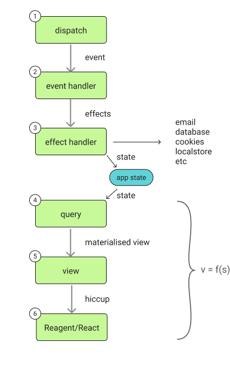

# The re-frame2 Guide

This is the human-facing guide for the ClojureScript reference implementation.

## Overview

**re-frame applications are a virtual machine.**

Registered handlers are the instruction set. Events — coming from user actions, FSM transitions, websocket frames, timers, whatever — are the program. The runtime executes every event through the same six-step pipeline, every time. We call one iteration an *epoch*. State is explicit and centralised, data is immutable, effects are isolated, and views sit at the edge of the flow.

*Derived data, flowing.* Water moves around a loop — sea to cloud to rain to river to sea — propelled by gravity, evaporation, and convection. Two phases, two directions, one cycle. Nothing in the loop has to decide *that* it moves; the forces handle that. What changes between turns of the cycle is only *what* is moving and *where*. A re-frame2 app is shaped the same way: data flows around a loop, and the runtime supplies the conveyance. You hang pure functions on it; the framework moves the data between them.

*The six dominoes.* Every event runs through the same six steps: dispatch, event handler, effects produced, effects executed, subscriptions, views. The central store labelled `app-db` in the diagram is **the frame's** `app-db` — each frame carries its own (the single-frame case is what most apps start with; see ch.06 for the multi-frame story). [Chapter 04 §Walking one event through every domino](04-events-state-cycle.md#walking-one-event-through-every-domino) walks one event through all six.

This guide walks you through what's in the box. Here's what the reference implementation gives you:

- **A single immutable store, `app-db`.** Every piece of state lives at a path in one map. You can `pprint` it, `diff` it, ship it across the wire for SSR, dump it on disk, reload tomorrow and inspect it in a REPL.
- **Pure event handlers.** `(state, event) → effects`. Tested as a function — no mocking, no JSDOM, no headless browser. Same shape for a counter and for a real-world feature with five fetches and two state machines.
- **Effects as data.** Handlers don't `fetch`, don't write `localStorage`, don't navigate — they return a value that *says* "this should happen." The runtime owns the doing. The same shape covers HTTP, WebSockets, state-machine invokes, SSR per-request fxs, and any new managed surface that inherits the pattern.
- **Time-travel debugging.** Because state is immutable and changes atomically, the framework records every `app-db` value the app ever had. **Causa** — the in-app devtools panel, the structural successor to v1's `re-frame-10x` — scrubs forwards and backwards through epochs, diffs `app-db` slices, and walks the causality graph.
- **Derived data through subscriptions.** Subs are pure derivations on top of `app-db`. They recompute when their inputs change and only then. Views deref subs; views re-render when the deref'd value changes. No `useEffect`, no dependency arrays.
- **Frames — isolated state and dispatch.** A frame is a unit of `app-db` + dispatch queue + registry view. One frame per request for SSR, one per variant in story playgrounds, one per pane for split views — without any of the substrate-leakage problems that come with multi-tenancy bolted on after the fact.
- **State machines, first-class.** Hierarchical states, parallel regions, `:after`, `:always`, declarative `:invoke`, spawn-and-join, actor model, `:tags` query layer. Transitions ride the same six-step pipeline every other event does; snapshots are values you can scrub, restore, and observe through the trace bus.
- **Schemas at every boundary.** Malli-backed validation — event vectors, sub returns, cofx, `app-db` slices. Opt-in. Production-elidable via Closure dead-code elimination; you pay for exactly what you turn on.
- **Routing — URL ↔ state.** Routes are registry entries; navigation is an event; `:route` is a sub. Per-pane routes work because frames are a thing. The same handler runs server- and client-side.
- **SSR and hydration that don't require a different mental model.** Pure hiccup → HTML emitter, JVM-runnable (no React-on-the-server). Per-request frame lifecycle. Hydration-mismatch detection with structured error projection. `:rf/hydrate` is an event like any other.
- **Story — a Storybook-class playground.** Storybook-9 parity on the chrome shape, plus EDN-first variants (round-trip through MCP and visual-regression services), schema-derived controls, per-variant frame isolation, machine-state visualisation, a time-travel scrubber, and Test Codegen — record canvas interactions as a `:play` body.
- **One trace bus, every tool consumes it.** Source-coord stamping on every registration and DOM element means click-to-source from any panel — a trace event, an epoch row, a story preview — lands you on the line in your editor where the handler was registered. Tests, stories, Causa, and the AI pair tool all read the same surface.
- **AI-pair-programmable at runtime.** The **`re-frame-pair2`** Claude skill pair-programs against your *running* application via nREPL + MCP. It dispatches events, scrubs epochs, hot-swaps handlers, reads your DOM tree. If something breaks, the AI does a full retrospective on the cascade leading up to the failure, patches in place, scrubs back, and retries the revision.
- **Three substrate adapters.** Reagent (canonical), UIx (modern hooks-based React layer), Helix (minimal React wrapper). The substrate-agnostic shape is the load-bearing piece; pick the one that matches your codebase.
- **Privacy + size elision.** `:sensitive?` (drop) and `:large?` (elide-with-fetch-handle) flags travel the same boundary walker. Sensitive things stay out of trace, story, MCP transports, and remote logs by default. Composition rule: sensitive wins.
- **Migration tooling.** re-frame v1.x → re-frame2 ships via the `re-frame-migration` Claude skill — 40+ mechanical rules, flagged-for-human-review for the rare cases where the rewrite depends on intent.

## Reading order

The guide has a **core path** (the chapters that build the mental model in sequence) and **optional deep dives** (à la carte — read them when the topic comes up).

Chapter **09 — Forms** sits between 08 and 10 as a side-track: not load-bearing for the mental model the way 08 is, but standard enough that most readers will want it before they reach 10. Skip it on a first read if you like; pick it up the first time you hit a non-trivial form.

Chapter **07 — Interceptors** is a similar side-track between 06 and 08: a deep-dive on the wrapping primitive every `:interceptors` slot in the guide bottoms out on. Most readers can skip it on a first pass — the core path doesn't require writing a custom interceptor. Pick it up the first time you want to wrap a handler (a logger, an undo interceptor, a recorder for tests).

Chapter **05 — Coeffects** is the matching side-track between 04 and 06: the *inputs* half of the handler's contract (`:db`, `:event`, and anything else `inject-cofx` injects). Skip it on a first read if your handlers only need `:db` and the event vector; pick it up the first time you hit `(inject-cofx :now)` in someone else's code, or want to test a handler that depends on the current time / a fresh UUID / a value from `localStorage`.

### Core path

Read these in order. Each chapter assumes the previous one.

| # | Chapter | What it covers |
|---|---|---|
| 02 | [app-db](02-app-db.md) | The single immutable map every re-frame2 app pivots around — what it is, why immutable, the consequences. |
| 03 | [Your first app](03-your-first-app.md) | The counter, walked through in narrative. |
| 04 | [Events, state, and the cycle](04-events-state-cycle.md) | The core loop, with side-effects-as-data. |
| 04a | [Schemas](04a-schemas.md) | The Malli warmup — `reg-app-schema`, event `:spec`, dev-vs-production timing. Read before forms or HTTP, where schemas show up in volume. |
| 05 | [Coeffects](05-coeffects.md) | The matching *inputs* half — `reg-cofx`, `inject-cofx`, the side-causes (current time, GUIDs, localStorage). Optional side-track. |
| 06 | [Views and frames](06-views-and-frames.md) | What you put on the screen, and how you isolate state. |
| 06a | [Frames](06a-frames.md) | The dedicated frames chapter — what a frame is, when you need more than one, `reg-frame` / `make-frame` / `frame-provider`, `:rf/default`. Read before testing, stories, or SSR if multi-frame is new. |
| 07 | [Interceptors](07-interceptors.md) | The sandwich, the context map, custom `:before` / `:after`. Optional deep-dive. |
| 08 | [State machines](08-state-machines.md) | When the answer to a flow is a finite state machine. |
| 09 | [Forms](09-forms.md) | The standard form slice, seven-event lifecycle, error-visibility rule. |
| 10 | [Doing HTTP requests](10-doing-http-requests.md) | `:rf.http/managed` — the canonical request fx, end-to-end. |
| 11 | [The server side](11-server-side.md) | SSR and hydration without losing your mind. |

If you're impatient, skip straight to [03 — Your first app](03-your-first-app.md). The counter walks every load-bearing primitive end-to-end.

### Optional deep dives

Read these when the topic comes up — not as part of the linear sequence. They're independent of one another.

| # | Chapter | When to read it |
|---|---|---|
| 12 | [The dynamic-model story](12-the-dynamic-model.md) | You want the long-form essay on *why* less-powerful is more. Skippable for "I just want to write code" readers. |
| 13 | [Testing](13-testing.md) | You're about to write tests — `re-frame.test-support`, frame fixtures, JVM-vs-CLJS boundary, conformance. |
| 14 | [Errors and how to handle them](14-errors.md) | The `:rf.error/*` taxonomy, the trace-listener surface, `:on-error` policy per frame, recovery semantics, error projectors, and testing error paths. |
| 15 | [Tooling](15-devtools-and-pair-tools.md) | The third-pillar pitch: trace bus, epochs, time-travel, source-coords, and the tools that consume them (`re-frame-pair2`, `re-frame2-story`, Causa). |
| 16 | [Performance](16-performance.md) | Your page feels slow — the four shapes of slowness (big props, deep `=`, inline callbacks, expensive subs), the framework's answers, and the `rf:` User Timing surface. |
| 17 | [Routing](17-routing.md) | Your app needs URL ↔ state — `reg-route`, navigation, the `:rf/route` slice, `:on-match`, the not-found route. Tutorial half of the routing surface. |
| 17a | [Routing: reference and advanced topics](17a-routing-reference.md) | The per-topic reference half — `:on-error`, the full nav-token walkthrough, the `:can-leave` protocol, query-string defaults, multi-frame routing, the pure `match-url` / `route-url` helpers, and a RealWorld worked example. Read sections when the topic comes up. |
| 18 | [From re-frame v1](18-from-re-frame-v1.md) | You're migrating an existing re-frame v1 app. Skip if re-frame2 is your starting point. The chapter is appendix-shaped — deps to bump, the migration skill to run, and the broad categories of breakage to expect. |
| 19 | [Adapters](19-adapters.md) | You're choosing or wiring a view-layer substrate — Reagent, UIx, or Helix. Covers the substrate-agnostic story, the `init!` call shape, the three adapter packages, and the slim-Reagent option for ship-size builds. |
| 21 | [Stories](21-stories.md) | You want a Storybook-flavoured playground for your components — `reg-story`, `reg-variant`, the four-phase lifecycle, the `:rf.assert/*` vocabulary, and the agent-facing MCP surface. |

### Useful patterns

Concrete real-world recipes that aren't core to the mental model — production observability and the two-axis wire-elision story. Read them when you're shipping.

| # | Chapter | When to read it |
|---|---|---|
| 22 | [Production observability](22-trace-to-datadog.md) | You need observability on a running app — forward trace events to Datadog (or Honeycomb, Sentry, Mezmo, your in-house pipeline) via the trace bus, honouring `:sensitive?` and `:large?` elision through `rf/elide-wire-value`. Datadog-shaped; the recipe is generic. |
| 23a | [Privacy — keeping secrets out of traces](23a-privacy-secrets.md) | Credentials, tokens, PII — the `:sensitive?` half of the elision story. One primary site (Malli schema-slot meta), one escape hatch (handler-meta `:sensitive?`), the `rf/elide-wire-value` walker's drop path, and the HTTP header / query-string denylists. |
| 23b | [Large blobs — keeping the wire small](23b-large-blobs.md) | 5MB payloads, file uploads, big collections — the `:large?` half of the elision story. Schema-slot meta, the `:rf.size/large-elided` marker, the opt-in fetch handle for consumers, and the dev-mode unschema'd-large-value warning. |

### Close-out

| # | Chapter | What it covers |
|---|---|---|
| 20 | [Where to go next](20-where-next.md) | A one-screen exit pointer — examples, pattern docs, the API ref, the runtime companion docs, the spec. Read this when you finish the chapters and want to know "now what?" |

### Worked examples

Once you've finished the core path, read the [worked examples](../../examples/README.md) — pedagogical sketches first (counter, login, routing, ssr, managed-http-counter, state-machine-walkthrough), then benchmarks (todomvc, 7GUIs, nine-states), then the RealWorld scaffold. Fifteen examples total, each with a Playwright smoke spec; the catalogue maps each one to the Specs it exercises.

## Voice

This guide is opinionated. It will tell you, with confidence, that a single source of truth is a good idea, that constrained execution models are easier to reason about than Turing-complete ones, and that putting state in 47 different React `useState` calls is a slow-motion accident. Where re-frame2 has made a choice, the chapter explains the choice and the alternatives we considered. Where the consensus in the broader SPA world is different from re-frame2's stance, we say so plainly.

## Pattern docs

A family of **Pattern docs** names the canonical answer for recurring shapes that bottom out on the framework's primitives. They're closer in voice to this guide than to API reference material, and they're the right next stop when you're building a feature whose shape matches one of them. The chapters cross-reference each pattern at the natural introduction point; the full catalogue with one-line summaries lives at [chapter 20 — Where to go next](20-where-next.md#look-up-a-pattern-by-name).
