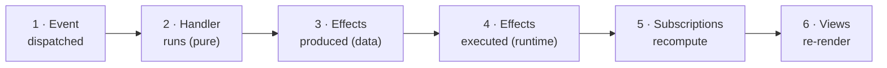

# The model: six dominoes, one loop

This page is the whole mental model. Every other page in this guide — every concept page, every how-to, every tutorial step — is a zoom-in on one piece of the picture here. Read it once now; come back whenever something downstream feels mysterious.

If you know Redux, you already have the skeleton: one store, one-way data flow, `dispatch → reducer → store → selector → render`. re-frame2 keeps that loop and changes two things: side effects are **data the handler returns** (not middleware you bolt on), and the loop **runs to completion** before anything re-renders. If you don't know Redux, no matter — the loop is small enough to hold in your head, and that's the point of it.

The takeaway, if you quote one sentence from this guide:

> **State is in one place; views are the last thing that happens, not the first.**

## State in one place, views last

In re-frame2 there is exactly one place application state lives: **app-db**, a single immutable map. Things happen — a click, a server reply, a timer fires — and each becomes an **event**, a small vector of data describing what happened. An **event handler**, a pure function, takes the current state and the event and computes what should change. **Subscriptions** — derivations over app-db — recompute the slices that views care about. Then, last of all, **views** re-render to match.

Notice what's absent. Views don't own state, don't fetch, don't decide anything: a view is a render function over subscription values, and that is its entire job. The most bug-prone real estate in a typical frontend — the place where state, effects, and rendering tangle — has been evicted. Views render. Full stop. (Why this inversion is worth its ceremony is its own essay: [Inside out: why views come last](../explanation/inside-out.md).)

## The six dominoes

Every event walks the same six-step pipeline, in order, every time. People draw it as a row of dominoes because that's what it is — knock the first one over and the cascade runs to the end, deterministically.



1. **Event dispatched.** `(rf/dispatch [:counter/inc])` puts the event vector on the runtime's queue and returns immediately. Nothing has run yet; the click handler's job is over.
2. **Handler runs.** The runtime pops the event off the queue and runs its registered handler — a pure function: same inputs, same output, no I/O.
3. **Effects produced.** The handler *returns a description* of everything that should happen, as data: `{:db <new-state> :fx [[effect-id args] ...]}`. It performs none of it.
4. **Effects executed.** The runtime walks that description and does the work. The app-db swap happens **inside this domino** — `:db` is itself an effect, applied as one atomic swap, with no half-updated state ever visible — and then any other effects fire: the HTTP request, the navigation, the storage write.
5. **Subscriptions recompute.** app-db changed, so the derivations watching the changed parts re-run. A subscription whose value comes out the same stops the propagation right there; nothing downstream of it re-renders.
6. **Views re-render.** Views that deref a changed subscription re-run, and the DOM is patched to match.

One pass through the pipeline is one **epoch**. Dominoes and epoch are the same picture under two names; you'll hear both.

In code, the simplest handler returns just a new state — `reg-event-db` is the spelling for that:

```clojure
(rf/reg-event-db :counter/inc
  (fn [db _event] (update db :counter/value inc)))
```

When the event also needs the world to do something, the handler graduates to `reg-event-fx` and returns the full effects map — still pure, still just data:

```clojure
(rf/reg-event-fx :feed/refresh
  (fn [{:keys [db]} _event]
    {:db (assoc db :feed/loading? true)
     :fx [[:rf.http/managed
           {:request    {:method :get
                         :url    "/api/articles"}
            :on-success [:feed/loaded]
            :on-failure [:feed/load-failed]}]]}))
```

These are one machine, two spellings: `reg-event-db` is sugar for `reg-event-fx` whose bare return gets wrapped as `{:db ...}`. The server's reply comes back as a new event — `[:feed/loaded ...]` — and walks the same six dominoes itself. The world coming *in* is symmetric: a handler that needs a fact from the world (the current time, a stored token) declares it and receives it as an input, rather than reaching out mid-function. Both directions live in [Effects and coeffects](effects-and-coeffects.md).

> **Coming from Redux?** Dominoes 3–4 replace the entire middleware question — thunks, sagas, observables — with a plain map the reducer-equivalent returns.

> **Coming from re-frame v1?** Same six dominoes; the deltas (effects grammar, coeffects, frames) are catalogued in [From re-frame v1](../25-from-re-frame-v1.md).

## A small virtual machine

Here's a framing that earns its keep: a re-frame2 app is, structurally, a small virtual machine. The handlers you register are its instruction set. The events you dispatch are instructions. The stream of events the app sees over its lifetime is the program, and app-db is the machine's memory. Growing the app means registering more instructions — the machine itself never gets more complicated. That's the scaling claim in one sentence: the cost of adding a feature is bounded by the size of the feature, not the size of the app, because there is nowhere else for the relevant logic to hide. (If your whole app really is a counter, this is ceremony and `useState` is six lines — the loop pays for itself when the app is bigger than the loop.)

## Run-to-completion

One scheduling rule does a lot of quiet work: the runtime drains the **entire event queue** before subscriptions recompute and views re-render. If a handler's effects dispatch three follow-up events, the screen does not flicker through each intermediate state — subscriptions and views see state once, after the whole batch settles. The user sees coherent states, not transitions: the form is submitting or it failed, never both for one paint. The price is a little scheduling flexibility; the gain is that fast interactions can't catch your UI mid-thought.

## One impure spot, one wire

Domino 4 is the only place the system touches the world, and everything that crosses it was first written down as data. That discipline isn't aesthetics — it's what makes the loop observable. Because every event, every effect, and every state change passes one known point in one known shape, a single trace wire can watch the whole app go by, and every dev tool reads that same wire: the Xray inspector, time-travel, scenario replay, an AI pair attached to your running app. You gave up "anything can change anything from anywhere," and inspectability is what you bought with it. ([Observability: one wire, every tool](observability.md) is the tour; the trade is stated as a framework principle in [Principles](../../../spec/Principles.md).)

## Where the loop runs

All of this — the queue, app-db, the subscription cache — lives inside a **frame**: an isolated world the loop runs in. Most apps have exactly one and never name it; `dispatch` and `subscribe` just work. But the frame is why a page can mount the same app several times without the copies sharing state, why every test gets a pristine world, and why a server can run one frame per request. [Frames: isolated worlds](frames.md) has the shape.

## The map

The rest of the concepts shelf zooms into the loop, one piece per page:

| The piece | Page |
|---|---|
| Events, the queue, and the cascade (dominoes 1–2) | [Events and the cascade](events-and-the-cascade.md) |
| The one place state lives | [app-db: the one place](app-db.md) |
| The world at the boundary (dominoes 3–4) | [Effects and coeffects](effects-and-coeffects.md) |
| The derivation graph (domino 5) | [Subscriptions](subscriptions.md) |
| Pure functions of data (domino 6) | [Views](views.md) |
| The isolated world the loop runs in | [Frames](frames.md) |

And everything else is built *on* the loop, never beside it:

| You want | Page |
|---|---|
| Derived values your handlers can read | [Flows](flows.md) |
| Modes and transitions made explicit | [State machines](machines.md) |
| The managed HTTP request | [HTTP](http.md) |
| Server data, cached and invalidated | [Server state: resources](server-state.md) |
| The URL as just another input | [Routing: the URL is a sub](routing.md) |
| Rendering on the server | [Server-side rendering](ssr.md) |
| Cross-cutting behaviour around handlers | [Interceptors](interceptors.md) |
| Failures as structured data | [Errors: dossiers, not log lines](errors.md) |
| Watching the loop run | [Observability: one wire, every tool](observability.md) |

Not sure whether a value belongs in app-db, a sub, a flow, a resource, or a machine? [Where should this value live?](../where-state-lives.md) is the decision guide.

---

**You can now:**

- name the six dominoes in order — dispatched, handler runs, effects produced, effects executed, subscriptions, views — and say which one touches the world (the fourth, app-db swap included)
- explain why a view can never be the source of a state bug: it's downstream of everything and decides nothing
- open any concepts page knowing exactly where its piece plugs into the loop

**Next:** watch the loop run in [the five-minute quick start](../quickstart.md), or go a level deeper into dominoes 1–2 with [Events and the cascade](events-and-the-cascade.md).
