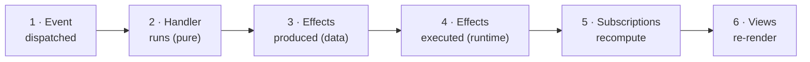

# The model: six dominoes, one loop

Welcome to the concepts shelf. This page is the whole mental model in miniature — one small loop that every other page on this shelf zooms into. Read it once now, slowly, and the rest of the shelf becomes "oh, that's just *this* piece up close." If something downstream ever starts to feel mysterious, come back here; the mystery is almost always a piece of this loop you didn't have a name for yet.

We'll build the picture one step at a time, starting from the smallest thing that does something, and add a piece only once you've seen the one before it work. By the end you'll be able to point at any concepts page and say exactly where its piece plugs in.

If you quote one sentence from this guide, quote this one:

> **State is in one place; views are the last thing that happens, not the first.**

## Start with one event

Here is the smallest useful thing in re-frame2: a [handler](../glossary.md#event-handler) that bumps a counter.

```clojure
(rf/reg-event :counter/inc
  (fn [{:keys [db]} _event]
    {:db (update db :counter/value inc)}))
```

That's a complete, working piece of an app. You [register](../glossary.md#register) a handler with `reg-event`, give it an id (`:counter/inc` — a keyword; the `counter/` part is just a namespace to keep ids from colliding), and the handler is a **pure function**.

The handler takes two arguments and returns a map. Don't let the Clojure shorthand throw you: `{:keys [db]}` is destructuring — it reaches into the first argument and pulls out its `:db` key as a local named `db`. That first argument is the [**coeffects**](../glossary.md#coeffect): everything from the outside world the handler is allowed to see, handed to it as data. For now it carries just one fact, `:db`, the current state. The second argument is the [**event**](../glossary.md#event) itself, and the leading `_` in `_event` is the Clojure convention for "I'm here, I'm just not using this one." The handler returns a map — an [**effect map**](../glossary.md#effect-map) — describing what should change. Here it says only one thing, `:db`, the next state.

Somewhere a button does this:

```clojure
(rf/dispatch [:counter/inc])
```

[`dispatch`](../glossary.md#dispatch) puts that little event vector — `[:counter/inc]`, a plain description of *what happened* — onto a queue and returns immediately. The click handler's job is over. Later, the runtime pops the event, runs your pure handler, and swaps [app-db](../glossary.md#app-db) to the value you returned. Done.

That's the entire shape of re-frame2: **something happens → an event describes it → a pure handler computes the next state → the screen catches up.** Everything else on this shelf is detail hung on that skeleton.

> **From re-frame v1.** This is the *one* event-registration form now. `reg-event-db` and `reg-event-fx` are gone — both collapsed into `reg-event`, whose handler always takes coeffects and returns an effect map. A bare `:db` update is just the `{:db …}` effect; reaching the world adds `:fx` beside it. The full list of v1→v2 deltas (effects grammar, coeffects, frames) lives in [From re-frame v1](../25-from-re-frame-v1.md).

> **Coming from Redux?** You already have the skeleton: one store, one-way flow, `dispatch → reducer → store → selector → render`. `reg-event` is your reducer; the [effect map](../glossary.md#effect-map) it returns is the reducer's output. re-frame2 changes exactly two things, and you'll meet both below.

## State in one place

Notice where the state lived: in `db`. State in re-frame2 lives in exactly one place — [**app-db**](../glossary.md#app-db), your app's single immutable state map. Not in components, not scattered across a dozen stores. One map.

That single fact pays off everywhere. A handler is a pure function *of* app-db, so it's trivial to test — feed it a map, check the map it returns, no mounting required. A [subscription](../glossary.md#subscription) is a derivation *over* app-db, so the view layer never has to ask "where did this value come from?" And because nothing else holds state, there's nowhere for a state bug to hide except the one map and the pure functions that transform it. When the truth is in one place, "where's the bug?" has one place to be.

> **For JavaScript developers.** If you've felt the pain of `useState` smeared across fifty components — the same logical value living in three places, drifting out of sync at 2am — app-db is the cure by construction. There is exactly one copy of the truth, and views read it; they never own it.

## Views come last

Here's the part that trips people coming from other frameworks, so it's worth saying flatly: **views don't own state, don't fetch, and don't decide anything.** A [**view**](../glossary.md#view) is a render function over subscription values, and that is its entire job.

A [subscription](../glossary.md#subscription) recomputes the slice of state a view cares about; a view renders that slice as [**hiccup**](../glossary.md#hiccup) — the plain Clojure data that describes your UI. When app-db changes, subscriptions recompute, and views re-render to match — last of all. In a typical frontend the most bug-prone real estate is where state, effects, and rendering tangle together. Here that place simply doesn't exist: views render, and nothing more.

> **Coming from React?** Keep your components — re-frame2 renders through Reagent, UIx, or Helix (your [substrate](../glossary.md#substrate)). What changes is that your components become pure functions of subscription values. No `useEffect` fetching, no local state machines hiding in `useReducer`; the component's only job is to turn data into DOM.

> **Going deeper.** This inversion — views *last*, derived from state, never the source of it — is the load-bearing design choice, and it earns its ceremony for reasons worth the longer read in [Inside out: why views come last](../explanation/inside-out.md).

## The six dominoes

You've now met every actor: an event, a handler, app-db, a subscription, a view. They run in a fixed order, every single time. People draw it as a row of dominoes because that's genuinely what it is — knock the first one over and the cascade runs to the end, deterministically. No actor decides to skip its turn; no actor runs out of order.



1. **Event dispatched.** `(rf/dispatch [:counter/inc])` puts the event on the queue and returns. Nothing has run yet.
2. **Handler runs.** The runtime pops the event and runs its registered pure [handler](../glossary.md#event-handler): same inputs, same output, no I/O.
3. **Effects produced.** The handler *returns a description* of everything that should happen, as data — `{:db <new-state> :fx [...]}` — and performs none of it.
4. **Effects executed.** The runtime walks that description and does the work. The app-db [**commit**](../glossary.md#commit) happens **here**, as one atomic swap, so no half-updated state is ever visible. Then any other effects fire.
5. **Subscriptions recompute.** app-db changed, so the derivations watching the changed parts re-run. If a subscription's value comes out equal (by `=`) to last time, propagation stops there.
6. **Views re-render.** Views that deref a *changed* subscription re-run, and the DOM is patched to match.

One pass through this fixed order — one dispatch, run to the end — is the [**event cascade**](../glossary.md#event-cascade) (or just *the cascade*). The six dominoes are its stages. Running the cascade leaves behind a before/after record called an [**epoch**](../glossary.md#epoch) — the unit you rewind to when you time-travel. (One dispatch = one cascade = one epoch; [Observability](observability.md) owns that identity.)

## Effects: telling the world what to do

The counter handler only touched `:db`. But most real handlers need the world to *do* something — fetch from a server, navigate, write to storage. The beautiful part is that in re-frame2 you don't *do* those things; you **return them as data**, right next to `:db`:

```clojure
(rf/reg-event :feed/refresh
  (fn [{:keys [db]} _event]
    {:db (assoc db :feed/loading? true)
     :fx [[:rf.http/managed
           {:request    {:method :get
                         :url    "/api/articles"}
            :on-success [:feed/loaded]
            :on-failure [:feed/load-failed]}]]}))
```

Same registration, same signature, still pure. The db update is the effect `{:db …}`; everything else rides in `:fx` beside it — a vector of [**effects**](../glossary.md#effect), each one a little `[effect-id config]` pair (hence the double brackets: the outer vector is the list, each inner vector is one effect). An effect is just such a data entry — a request for the world to do something. Returning a `[:rf.http/managed …]` entry no more fires an HTTP request than returning the string `"rm -rf /"` deletes your disk. It's a value until domino 4 chooses to run it, and what runs it is the [**effect handler**](../glossary.md#effect-handler) registered for that id.

The reply comes back as a *new* event — `[:feed/loaded …]` — which walks the same six dominoes itself. And the world coming *in* is symmetric: a handler that needs a fact from the world (the current time, a stored token) declares it up front with `:rf.cofx/requires` and receives it as an input — a [**coeffect**](../glossary.md#coeffect) — rather than reaching out mid-function. World *out* as effects, world *in* as coeffects; both directions live in [Effects and coeffects](effects-and-coeffects.md).

> **Gotcha — the effect map is a closed vocabulary.** Application code may return only `:db` and `:fx` at the top level. Return a third key — a stray `:dispatch` you meant to nest inside `:fx`, a typo'd `:fxx` — and the handler [fails loud](../glossary.md#fail-loud-not-silent) with a structured error the instant it runs, not a silent no-op three features downstream. The closed grammar means a mistake surfaces *at the handler*, where you can see it, instead of vanishing into a feature that mysteriously never happens.

> **Coming from Redux?** This is the first of the two changes. Dominoes 3–4 replace the entire middleware question — thunks, sagas, observables — with a plain map your reducer returns. There's no async machinery to wire up: side effects are [*data*](../glossary.md#effects-are-data), and one runtime executes them.

> **Going deeper.** Side-effects-as-returned-data is continuation-passing wearing plain clothes: the handler hands back a description of "what to do next" instead of doing it. That framing — and why it composes so cleanly — is [Continuations are data](../explanation/continuations-are-data.md).

## Run-to-completion: no flicker

The second change from Redux is a single scheduling rule, and it quietly does a lot of work: the runtime [**drains**](../glossary.md#drain--run-to-completion) the *entire* event queue before subscriptions recompute and views re-render.

If a handler's effects dispatch three follow-up events, the screen does not flicker through each intermediate state. Subscriptions and views see state once, after the whole batch has settled. The user sees coherent states — the form is submitting, or it has failed, never both for a single paint. You give up a little scheduling flexibility; in return, fast interactions can't catch your UI mid-thought.

> **For JavaScript developers.** Where React's batching is a rendering *optimisation* you mostly don't think about, run-to-completion is a *correctness guarantee* you can lean on: the view function never observes a partially-applied update, full stop. No "is this the render where the second update hasn't landed yet?" — there is no such render.

## Where the loop runs: a frame

All of this — the queue, app-db, the subscription cache — lives inside a [**frame**](../glossary.md#frame): an isolated world the loop runs in. Most apps have exactly one frame and never name it, so `dispatch` and `subscribe` just work.

But the frame is why a page can mount the same app several times without the copies sharing state, why every test gets a pristine world, and why a server can run one frame per request. A frame isolates *state*, not your code: the [**registrar**](../glossary.md#registrar) of handlers is process-global, so the same handlers and subscriptions run in every frame, each against that frame's own app-db. A frame always starts with `app-db = {}` and seeds itself by dispatching its `:initial-events` — the first dominoes that fall the moment it exists. So "load the app" is just the loop running on itself. [Frames: isolated worlds](frames.md) has the shape.

> **From re-frame v1.** v1 had one implicit global `app-db` atom and one event queue. v2 names that world a *frame* and lets you have more than one. A frame seeds itself with `:initial-events` (the old `:on-create` / `:initial-db` boot keys are retired) — and because seeding is itself an event, there's no back door for "the first state": it's the same cascade, all the way down.

## A few deeper truths, once the loop clicks

The loop above is the productive core — you can build real apps with exactly what's on this page. The callouts below are for the curious reader who wants to know *why* the design is shaped this way. Skip them freely; nothing downstream depends on them.

> **Going deeper — the app is a little virtual machine.** Structurally, a re-frame2 app is a small VM. The handlers you register are its instruction set — and the selected set a frame runs against is its [**image**](../glossary.md#image). The events you dispatch are instructions; the stream of events over the app's lifetime is the program; app-db is its memory. Growing the app means registering more instructions, so the machine itself never gets more complicated. The cost of a feature is bounded by the size of the feature, not the size of the app — there's nowhere else for the logic to hide. (Most apps load one implicit image and never name it; [Images](images.md) is for the day you want two machines on one page.)

> **Going deeper — one impure spot, one wire.** Domino 4 is the *only* place the system touches the world, and everything that crosses it was first written down as data. That isn't aesthetics — it's what makes the loop observable. Every event, effect, and state change passes one known point in one known shape, so a single [**trace stream**](../glossary.md#trace-stream) can watch the whole app go by. Every dev tool reads that same wire: the [Xray](../glossary.md#xray) inspector, [time-travel](../glossary.md#time-travel), scenario replay, an AI pair attached to your running app. You gave up "anything can change anything from anywhere," and inspectability is what you bought. ([Observability: one wire, every tool](observability.md) is the tour; the trade is a framework principle in [Principles](../../../spec/Principles.md).)

??? note "When the loop is overkill"

    If your whole app really is a counter, all of this is ceremony and `useState` is six lines. The loop pays for itself once the app is bigger than the loop — which, for anything you'll actually ship, it will be.

## The map

The rest of the concepts shelf zooms into the loop, one piece per page:

| The piece | Page |
|---|---|
| Events, the queue, and the cascade (dominoes 1–2) | [Events and the cascade](events-and-the-cascade.md) |
| The one place state lives | [app-db: the one place](app-db.md) |
| The world at the boundary (dominoes 3–4) | [Effects and coeffects](effects-and-coeffects.md) |
| The derivation graph (domino 5) | [Subscriptions](subscriptions.md) |
| Pure functions of data (domino 6) | [Views](views.md) |
| The isolated world the loop runs in | [Frames](frames.md) |

And everything else is built *on* the loop, never beside it:

| You want | Page |
|---|---|
| Derived values your handlers can read | [Flows](flows.md) |
| Modes and transitions made explicit | [State machines](machines.md) |
| The managed HTTP request | [HTTP](http.md) |
| Server data, cached and invalidated | [Server state: resources](server-state.md) |
| The URL as just another input | [Routing: the URL is a sub](routing.md) |
| Rendering on the server | [Server-side rendering](ssr.md) |
| Cross-cutting behaviour around handlers | [Interceptors](interceptors.md) |
| Which registrations a frame runs | [Images](images.md) |
| Failures as structured data | [Errors: dossiers, not log lines](errors.md) |
| Watching the loop run | [Observability: one wire, every tool](observability.md) |

Not sure whether a value belongs in app-db, a sub, a [flow](../glossary.md#flow), a [resource](../glossary.md#resource), or a [machine](../glossary.md#machine)? [Where should this value live?](../where-state-lives.md) is the decision guide — it's the one router every other page defers to for "which one do I use?"
