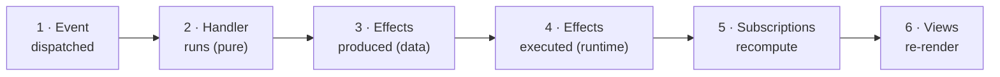

# The model: six dominoes, one loop

This page is the whole mental model. Every other page in this guide — every concept page, every how-to, every tutorial step — is a zoom-in on one piece of it. So it's worth reading once now, slowly, and coming back whenever something downstream starts to feel mysterious.

If you know Redux, you already have the skeleton: one store, one-way data flow, `dispatch → reducer → store → selector → render`. re-frame2 keeps that loop and changes two things. First, side effects are **data the handler returns**, not middleware you bolt on — no thunks, no sagas, no observables to wire up. Second, the loop **runs to completion** before anything re-renders, so the screen never flickers through a half-finished update. And if you don't know Redux, don't worry — the loop is small enough to hold in your head, which is rather the whole point.

If you quote one sentence from this guide, quote this one:

> **State is in one place; views are the last thing that happens, not the first.**

## State in one place, views last

State lives in exactly one place: **app-db**, your app's single immutable state map. Something happens — a click, a server reply, a timer fires. Each of those becomes an **event**, a small vector of data that simply describes what happened. An **event handler** — a pure function — takes the current state and that event and computes what should change. **Subscriptions** are derivations over app-db: they recompute the slices of state that views care about. And then, last of all, **views** (render functions that turn subscription values into UI) re-render to match.

Notice what's absent here, because this is the part that trips people coming from other frameworks. Views don't own state. They don't fetch. They don't decide anything. A view is a render function over subscription values, and that is its entire job. In a typical frontend, the most bug-prone real estate is the place where state, effects, and rendering tangle together — and here that place simply doesn't exist. Views render, and nothing more. (If you want the longer argument for why this inversion earns its ceremony, it's [Inside out: why views come last](../explanation/inside-out.md).)

## The six dominoes

Every event walks the same six-step pipeline, in order, every single time. People draw it as a row of dominoes because that's genuinely what it is: knock the first one over and the cascade runs to the end, deterministically.



1. **Event dispatched.** `(rf/dispatch [:counter/inc])` — dispatch puts the event vector on the runtime's queue and returns immediately. Nothing has run yet, and the click handler's job is already over. (For the rare moment you need the cascade to finish *before* the calling line continues — a test asserting on the result, a boot step that must settle first — `rf/dispatch-sync` runs the same pipeline inline rather than queueing it. Reach for it deliberately, not by default; `dispatch` is the right tool almost everywhere.)
2. **Handler runs.** The runtime pops the event off the queue and runs its registered handler, a pure function: same inputs, same output, no I/O.
3. **Effects produced.** The handler *returns a description* of everything that should happen, as data — `{:db <new-state> :fx [[effect-id args] ...]}` — and performs none of it itself. (An **effect** is just one of those data entries: a request for the world to do something. Returning a `[:rf.http/managed …]` entry no more fires an HTTP request than returning the string `"rm -rf /"` deletes your disk — it's just a value until something downstream chooses to run it.)
4. **Effects executed.** The runtime walks that description and actually does the work. The app-db swap happens **inside this domino**: `:db` is itself an effect, applied as one atomic swap, so no half-updated state is ever visible. Then any other effects fire — the HTTP request, the navigation, the storage write.
5. **Subscriptions recompute.** app-db changed, so the derivations watching the changed parts re-run. If a subscription's value comes out the same, propagation stops right there, and nothing downstream of it re-renders.
6. **Views re-render.** Views that deref a changed subscription re-run, and the DOM is patched to match.

One pass through the pipeline is one **epoch**. Dominoes and epoch are the same picture under two names — you'll hear both, so it's worth knowing they point at the same thing.

In code, every handler is registered with `reg-event`, and it returns a map: the next state under `:db`, plus anything else to do. The simplest handler only touches state, so the map has only `:db`:

```clojure
(rf/reg-event :counter/inc
  (fn [{:keys [db]} _event] {:db (update db :counter/value inc)}))
```

When the event also needs the world to *do* something, you add an `:fx` vector to the same map — same registration, same signature, still pure, still just data:

```clojure
(rf/reg-event :feed/refresh
  (fn [{:keys [db]} _event]
    {:db (assoc db :feed/loading? true)
     :fx [[:rf.http/managed
           {:request    {:method :get
                         :url    "/api/articles"}
            :on-success [:feed/loaded]
            :on-failure [:feed/load-failed]}]]}))
```

One form, one map: a db update is the effect `{:db …}`, and everything else rides in `:fx` beside it. The server's reply comes back as a new event — `[:feed/loaded ...]` — which walks the same six dominoes itself. And the world coming *in* is symmetric. A handler that needs a fact from the world — the current time, a stored token — declares it with `:rf.cofx/requires` and receives it as an input (that incoming fact is a **coeffect**), rather than reaching out for it mid-function. Both directions live in [Effects and coeffects](effects-and-coeffects.md).

> **Coming from Redux?** Dominoes 3–4 replace the entire middleware question — thunks, sagas, observables — with a plain map the reducer-equivalent returns.

> **Coming from re-frame v1?** Same six dominoes; the deltas (effects grammar, coeffects, frames) are catalogued in [From re-frame v1](../25-from-re-frame-v1.md).

## A small virtual machine

Structurally, a re-frame2 app is a small virtual machine. The handlers you register are its instruction set — and the selected set a given machine loads is its **image**. The events you dispatch are instructions. The stream of events the app sees over its lifetime is the program, and app-db is the machine's memory. Growing the app means registering more instructions, which means the machine itself never gets more complicated. So the cost of adding a feature is bounded by the size of the feature, not the size of the app — there's simply nowhere else for the relevant logic to hide. (Most apps load one implicit image and never name it; [Images](images.md) is for the day you want two machines on one page running different instruction sets.)

??? note "When the loop is overkill"

    If your whole app really is a counter, all of this is ceremony and `useState` is six lines. The loop pays for itself once the app is bigger than the loop — which, for anything you'll actually ship, it will be.

## Run-to-completion

The runtime drains the **entire event queue** before subscriptions recompute and views re-render. It's one scheduling rule, and it quietly does a lot of work for you. If a handler's effects dispatch three follow-up events, the screen does not flicker through each intermediate state; subscriptions and views see state once, after the whole batch has settled. The user sees coherent states rather than transitions — the form is submitting or it has failed, never both for a single paint. You give up a little scheduling flexibility, and in return fast interactions can't catch your UI mid-thought.

## One impure spot, one wire

Domino 4 is the only place the system touches the world, and everything that crosses it was first written down as data. That discipline isn't aesthetics — it's what makes the loop observable. Every event, every effect, and every state change passes one known point in one known shape, which means a single trace wire can watch the whole app go by. Every dev tool then reads that same wire: the Xray inspector, time-travel, scenario replay, an AI pair attached to your running app. You gave up "anything can change anything from anywhere," and inspectability is what you bought with it. ([Observability: one wire, every tool](observability.md) is the tour, and the trade is stated as a framework principle in [Principles](../../../spec/Principles.md).)

## Where the loop runs

All of this — the queue, app-db, the subscription cache — lives inside a **frame**: an isolated world the loop runs in. Most apps have exactly one frame and never name it, so `dispatch` and `subscribe` just work. But the frame is why a page can mount the same app several times without the copies sharing state, why every test gets a pristine world, and why a server can run one frame per request. A frame starts with an empty app-db and seeds itself by dispatching its `:initial-events` — the first dominoes that fall the moment it exists — so "load the app" is just the loop running on itself. [Frames: isolated worlds](frames.md) has the shape.

## The map

The rest of the concepts shelf zooms into the loop, one piece per page:

| The piece | Page |
|---|---|
| Events, the queue, and the cascade (dominoes 1–2) | [Events and the cascade](events-and-the-cascade.md) |
| The one place state lives | [app-db: the one place](app-db.md) |
| The world at the boundary (dominoes 3–4) | [Effects and coeffects](effects-and-coeffects.md) |
| The derivation graph (domino 5) | [Subscriptions](subscriptions.md) |
| Pure functions of data (domino 6) | [Views](views.md) |
| The isolated world the loop runs in | [Frames](frames.md) |

And everything else is built *on* the loop, never beside it:

| You want | Page |
|---|---|
| Derived values your handlers can read | [Flows](flows.md) |
| Modes and transitions made explicit | [State machines](machines.md) |
| The managed HTTP request | [HTTP](http.md) |
| Server data, cached and invalidated | [Server state: resources](server-state.md) |
| The URL as just another input | [Routing: the URL is a sub](routing.md) |
| Rendering on the server | [Server-side rendering](ssr.md) |
| Cross-cutting behaviour around handlers | [Interceptors](interceptors.md) |
| Which registrations a frame runs | [Images](images.md) |
| Failures as structured data | [Errors: dossiers, not log lines](errors.md) |
| Watching the loop run | [Observability: one wire, every tool](observability.md) |

Not sure whether a value belongs in app-db, a sub, a flow, a resource, or a machine? [Where should this value live?](../where-state-lives.md) is the decision guide.

---

**You can now:**

- name the six dominoes in order — dispatched, handler runs, effects produced, effects executed, subscriptions, views — and say which one touches the world (the fourth, app-db swap included)
- explain why a view can never be the source of a state bug: it's downstream of everything and decides nothing
- open any concepts page knowing exactly where its piece plugs into the loop
