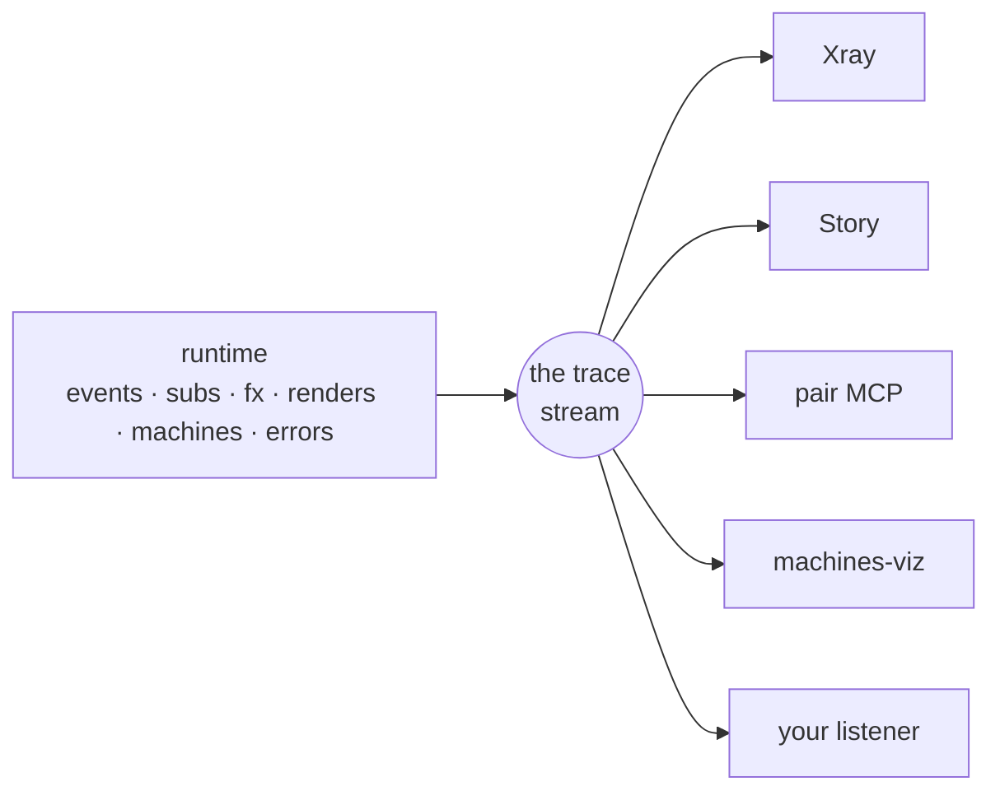

# Observability: one wire, every tool

You clicked a button and the app is now subtly wrong. You want to know one thing: what did that click actually *do*? Which handler ran, what changed in app-db (your app's single state map), which subscriptions recomputed, which views re-rendered, what effects escaped. In most frontends that question has no clean answer, because causality is smeared across a hundred components. In re-frame2 every event walks the same fixed pipeline — [the cascade](events-and-the-cascade.md), the ordered run from dispatched event through handler, db update, and effects — so there's a single place to stand and watch the runtime go past. This page is that place: the trace stream, the buffer that remembers the recent past, the small listener API, and the tools built on top.

Two anchors will help, both from tools you likely already know. **Redux DevTools** is your model for Xray: the action log, state diffs, and time travel you reach for when something looks wrong. Xray's log is richer — subscriptions, renders, effects, and machines are first-class entries too — and it isn't a browser-extension bolt-on; it's a thin window over data the framework emits natively. **OpenTelemetry** is your model for the substrate underneath: structured events on a wire, with interchangeable consumers reading them. The difference here is that delivery is synchronous and in-process, and the whole wire compiles out of production builds.

If you take one idea away, take this one:

> **Every tool is a thin presentation over the same runtime facts.** Xray, Story, the pair MCP, machines-viz, and any listener you write all read one trace stream and one epoch history. If two of them ever disagree about a cascade, one of them is broken — there is no second truth.



## One wire: the trace stream

A trace event is just a map. The runtime emits one at every moment worth noticing: an event dispatched, a handler run, app-db changed, a subscription recomputed, a view rendered, an effect fired, a machine transitioned, an error caught. Here's the shape:

```clojure
{:id        18342                       ;; auto-incrementing, unique per process
 :operation :rf.event/dispatched        ;; what specifically happened
 :op-type   :rf.event                   ;; which family it belongs to
 :time      1716800000000               ;; host clock, ms
 :tags      {:rf.trace/event-id    :counter/inc
             :rf.trace/dispatch-id 4711
             :frame                :app
             ,,,}}                      ;; the open bag of specifics
```

Two fields carry the routing, and it helps to know which is which. `:op-type` is the coarse one — a small vocabulary you branch on to grab a slice of the stream: `:rf.event`, `:rf.sub`, `:rf.fx`, `:rf.view`, `:rf.machine`, a few more families for frames, coeffects, flows, and the registry, plus the severity tiers `:error` / `:warning` / `:info`. New values get added over time, so a tool simply ignores what it doesn't recognise. `:operation` is the fine-grained identity within that slice. Everything else rides in `:tags`, an open map, so new fields can arrive later without breaking a tool that only reads the old ones. You never construct these yourself — the runtime emits them, and your job (far more often a tool's job) is just to read them. The full vocabulary lives in [Spec 009](../../../spec/009-Instrumentation.md).

Two properties of this wire shape everything downstream:

- **Delivery is synchronous.** When the runtime emits, every registered listener runs *right then*, mid-cascade, on the same call stack — no queue, no batching, no reordering. That gives you perfect fidelity, which comes with an obligation: a listener has to be cheap. Grab the event, stash it, and return; defer anything expensive to a timer you own, so you never stretch out the cascade you're watching.
- **Cascades are correlated, not inferred.** Every trace event emitted inside one event's cascade carries the same `:rf.trace/dispatch-id` in its tags. So "everything that click did" is a filter, not a guess. When a handler's effects dispatch a child event, the child cascade carries `:rf.trace/parent-dispatch-id` pointing back at its cause. Walk those links and you have the causal tree: *this* dispatch happened because *that* one did. One dispatch = one cascade = one [epoch](events-and-the-cascade.md) — the same unit seen from three vantage points.

## The buffer: the last fifty things your app did

Synchronous delivery has a catch. If you weren't listening when an event fired, you missed it — which is fatal for any tool that attaches *after* the interesting thing happened: the devtools panel you opened three clicks too late, or the AI you summoned precisely because the app is already broken.

So each [frame](frames.md) (an isolated runtime instance with its own app-db) also keeps a ring buffer of recent history. The unit of retention is the **cascade**, not the individual trace event, and that choice matters: one dispatch takes one slot whether its cascade emitted five events or fifty thousand, so a chatty cascade can't flood out the one you care about. One knob, one read:

```clojure
(rf/configure! {:trace-buffer {:cascades-retained 50}})   ;; the default

(rf/trace-buffer :app)
;; => vector of cascade bundles, oldest first — each one already grouped:
;;    {:dispatch-id 4711  :event [:counter/inc]
;;     :handler ,,,  :fx ,,,  :effects [,,,]  :subs [,,,]  :renders [,,,]
;;     :parent-dispatch-id nil  ,,,}
```

This is how a late-attaching tool bootstraps itself. Read the buffer to learn where the app just came from, then register a listener to stay current. The buffer is "what just happened"; the live stream is "what's happening now." It's per-frame on purpose, so a devtool mounted in its own frame can storm its own subscriptions without polluting your app frame's history.

Next to the trace ring (what the app *did*) sits the **epoch history** (what the app *was*). That's one assembled record per cascade, carrying `:db-before` and `:db-after` snapshots plus structured `:sub-runs` / `:renders` / `:effects` projections, retained to its own depth (`(rf/configure! {:epoch-history {:depth 50}})`, the default). Because each record holds real before-and-after state, time travel falls out for free: `(rf/restore-epoch! frame-id epoch-id)` rewinds a frame to exactly the state it held then — application state and runtime state (machine snapshots, the route slice) in one atomic write. This isn't a special debug build; it's the direct consequence of state being one immutable value per frame.

## Your listener in eight lines

Everything the fancy panels do starts with this one API, and the nice part is that anything Xray sees, your listener sees too:

```clojure
(rf/register-listener!
  :my-app/error-logger
  (fn [trace-event]
    (when (and (= :error (:op-type trace-event))
               (not (:sensitive? trace-event)))   ;; gate any off-box egress
      (println (:operation trace-event)
               (-> trace-event :tags :reason)))))
```

That's a working error logger. It receives *every* trace event and prints the errors; `(rf/unregister-listener! :my-app/error-logger)` removes it again. The `:sensitive?` guard there isn't decoration — and it earns its own callout.

!!! warning "Gate before anything leaves the box"

    A listener sees sensitive payloads in the clear — the runtime does not redact what it hands you. The moment your listener forwards data off-box (a network call, a third-party logger, a file), check `:sensitive?` and drop or scrub the marked events. [Keep secrets out of traces](../how-to/keep-secrets-out-of-traces.md) is the full story.

Three contract details start to matter once tools stack up:

- **Same key replaces, atomically.** Re-registering under an existing key swaps the callback between two emits, never mid-emit — which is exactly what hot reload needs.
- **Exceptions are isolated.** A throwing listener is caught; the app and the other listeners keep going. So you can attach a flaky experimental tool to a live app and the worst it can do is fail quietly.
- **Sibling order is unspecified.** Every listener sees every event, but never assume yours runs before another one.

There's a parallel registration one level up: `(rf/register-epoch-listener! key f)`. It delivers one fully-assembled epoch record per cascade, *after* it settles, with `:db-before`/`:db-after` included — the right shape when you think in cascades and don't want to re-fold the raw stream yourself.

## Production: the wire disappears — errors don't

Everything above is development machinery, and none of it ships. The entire trace surface — emit sites, rings, epoch history, listener registries — sits behind one compile-time flag (`goog.DEBUG`). In an `:advanced` production build the Closure compiler constant-folds that gate and dead-code-eliminates everything behind it. The emit calls don't just become no-ops; they evaporate, so production bundles carry zero trace code and zero trace cost.

!!! note "JVM builds default the gate on"

    There's no Closure compiler on the JVM, so the same gate defaults *on* there — which is right for tests and the REPL, but means a production JVM process, an SSR host especially, must set `-Dre-frame.debug=false` explicitly. See [configure dev and production builds](../how-to/configure-dev-and-prod.md).

What survives is deliberately narrow: an **always-on error substrate**, kept separate from the trace wire. It fires one tight structured record per production-reachable runtime failure — the error's id, the event and frame context, but never raw values. This is how a handler exception in production reaches Sentry or Datadog *knowing what the user was doing*, instead of arriving as a bare `window.onerror`. (A sibling substrate emits one record per processed event, for throughput-and-latency dashboards.) You consume both by declaring a sink in your frame's `:observability` config and registering it with `rf/register-observability-sink!`. The runtime hands your sink records *already projected* through the frame's privacy classification, so a sensitive field arrives redacted before your code sees it. The wiring recipe is [report errors in production](../how-to/report-errors-in-production.md); what counts as an error, and how the framework recovers, is [errors](errors.md).

Here's the split worth internalising: the dev trace wire is rich and elided, while the production error substrate is narrow and always-on. Don't reach for `register-listener!` to feed a hosted monitor — it works in dev and hears *nothing* in production, because the emit sites it would listen to no longer exist. **For production telemetry, you want a sink, not a listener.**

## The tools: four presentations, zero second truths

The point isn't that re-frame2 has tools — every framework has tools. The point is that these are thin presentations over the wire you just met. None has a private back-channel; none patches the framework or instruments your handlers. They bootstrap from the buffer, listen to the stream, and read the epoch history, so because they read the same facts, they tell consistent stories.

**Xray answers: what happened?** It's the Redux DevTools of this world, grown to the full cascade: the epoch ledger, app-db diffs per event, which subscriptions recomputed, which views rendered, effects, machine transitions, schema failures — and time-travel scrubbing via `restore-epoch`. It also assembles the registration facts into the [derivation graph](../derivations-and-algebra-views.md): "where does this value come from?" drawn as a picture. Reach for it when you're debugging the running app — start with [debug with Xray](../how-to/debug-with-xray.md).

**Story answers: what states should this thing have?** It's the Storybook of this world. You render a view's loading, empty, error, and happy states as named variants, each in its own isolated frame, without driving the whole app there by hand — then promote the good examples into tests. Story embeds Xray's panels for diagnosis rather than growing a second diff engine, and it has its own tutorial track in its docs.

**The pair MCP answers: can an agent help?** It's an MCP server that lets an AI attach to your *running* app: read frames and app-db, follow epochs, dispatch events, run a dry-run cascade, time-travel — all through the same structured surfaces, with the mutating tools flagged so the agent host can gate them. The agent sees the evidence a good human debugger would ask for, instead of guessing from source. The runtime contract it rides is [Tool-Pair](../../../spec/Tool-Pair.md).

**machines-viz answers: what does this machine look like?** It's a statechart renderer (think Stately Studio) that turns a [machine definition](machines.md) into an interactive chart with the live current state highlighted. It's presentation-only — both Xray's machine inspector and Story embed it.

| Question | Open | Why |
|---|---|---|
| "What did that event do?" | Xray | The diagnostic view over epochs, traces, app-db diffs, renders, effects. |
| "What states should this view support?" | Story | Named states and variants in isolated frames, no manual app-driving. |
| "Is this example actually a regression test?" | Story | A good variant becomes an executable expectation. |
| "Where did this failed assertion come from?" | Story, then Xray | Story owns the expectation; Xray owns the diagnosis. |
| "What does this state machine look like?" | machines-viz (inside Xray/Story) | The chart over the definition plus the live state. |
| "Can an AI inspect the live app?" | the pair MCP | The agent reads the same frame, trace, and epoch surfaces you do. |
| "Can I ship telemetry to my APM?" | none of these | That's the always-on sink path above — production never has the dev panels. |

And here's the rule for the tool you might write yourself — a domain monitor, a recorder, a release-health dashboard: consume the public substrate, don't invent a private one. What happened is in the trace and epoch records; what exists is in the registrar; state reads respect frame identity and privacy markings. The framework owns the data shape, and tools own the rendering. That division is why one listener registration is a complete tooling integration, and why the ecosystem stays one truth instead of a pile of almost-right panels.

---

**You can now:**

- say what rides the wire — one immutable map per runtime moment, routed by `:op-type`/`:operation`, correlated into cascades by dispatch-id,
- attach to a running app after the fact: read `(rf/trace-buffer :app)` for the recent past, `register-listener!` for the live stream,
- write a production-safe listener in eight lines, gating off-box egress on `:sensitive?`,
- state the production split: the trace wire compiles away; the narrow always-on error substrate ships, consumed through projected observability sinks,
- pick the right tool without ceremony: Xray for *what happened*, Story for *what states*, the pair MCP for *agent hands*, machines-viz for *the chart* — all thin presentations over the same runtime facts.
