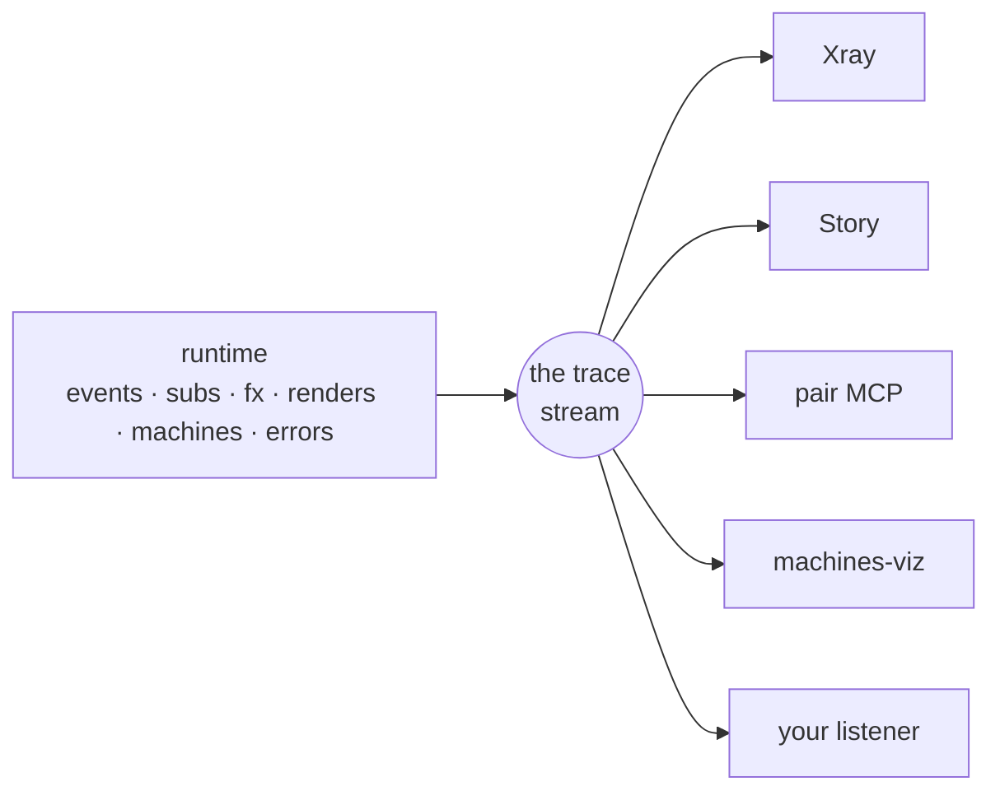

# Observability: one wire, every tool

You clicked a button and the app is now subtly wrong. You want to know one thing: what did that click actually *do*? Which handler ran, what changed in app-db (your app's single state map), which subscriptions recomputed, which views re-rendered, what effects escaped. In most frontends that question has no clean answer, because causality is smeared across a hundred components, each mutating its own little corner of state. In re-frame2 every event walks the same fixed pipeline — [the cascade](events-and-the-cascade.md), the ordered run from dispatched event through handler, db update, and effects — so there's a single place to stand and watch the runtime go past. This page is that place: the trace stream, the buffer that remembers the recent past, the small listener API, and the tools built on top.

Two anchors will help, both from tools you likely already know. **Redux DevTools** is your model for Xray: the action log, state diffs, and time travel you reach for when something looks wrong. Xray's log is richer — subscriptions, renders, effects, and machines are first-class entries too — and it isn't a browser-extension bolt-on; it's a thin window over data the framework emits natively. **OpenTelemetry** is your model for the substrate underneath: structured events on a wire, with interchangeable consumers reading them. The difference here is that delivery is synchronous and in-process, and the whole wire compiles out of production builds.

If you take one idea away, take this one:

> **Every tool is a thin presentation over the same runtime facts.** Xray, Story, the pair MCP, machines-viz, and any listener you write all read one trace stream and one epoch history. If two of them ever disagree about a cascade, one of them is broken — there is no second truth.



## One wire: the trace stream

A trace event is just a map. The runtime emits one at every moment worth noticing: an event dispatched, a handler run, app-db changed, a subscription recomputed, a view rendered, an effect fired, a machine transitioned, an error caught. Here's the shape:

```clojure
{:id        18342                       ;; auto-incrementing, unique per process
 :operation :rf.event/dispatched        ;; what specifically happened
 :op-type   :rf.event                   ;; which family it belongs to
 :time      1716800000000               ;; host clock, ms
 :tags      {:rf.trace/event-id    :counter/inc
             :rf.trace/dispatch-id 4711
             :frame                :app
             ,,,}}                      ;; the open bag of specifics
```

Two fields carry the routing, and it helps to know which is which. `:op-type` is the coarse one — a small closed vocabulary you branch on to grab a slice of the stream. The families you'll meet most:

| `:op-type` | What it covers |
|---|---|
| `:rf.event` | An event was queued, started, ran a handler, settled. |
| `:rf.sub` | A subscription was created, recomputed, skipped (short-circuited), or disposed. |
| `:rf.fx` | An effect was handled. |
| `:rf.view` | A view rendered. |
| `:rf.machine` | A [state machine](machines.md) transitioned, raised, spawned, or stopped. |
| `:rf.flow` | A [flow](../derivations-and-algebra-views.md) re-derived or skipped. |
| `:rf.cofx` | A coeffect was injected. |
| `:rf.frame` | A frame was created or destroyed. |
| `:rf.registry` | A handler was registered (the `reg-*` calls themselves trace). |
| `:error` / `:warning` / `:info` | The three severity tiers — anything caught, suspect, or worth a note. |

You branch on `:op-type` to grab a slice; new values get added over time, so a tool simply ignores what it doesn't recognise. `:operation` is the fine-grained identity within that slice — the specific emit site, like `:rf.event/dispatched`, `:rf.sub/skip`, or `:rf.machine/transition`. Everything else rides in `:tags`, an open map, so new fields can arrive later without breaking a tool that only reads the old ones. You never construct these yourself — the runtime emits them, and your job (far more often a tool's job) is just to read them. The full vocabulary lives in [Spec 009](../../../spec/009-Instrumentation.md).

> **Coming from OpenTelemetry?** A familiar instinct is to expect spans — a start/end pair with a `:duration` and a `:child-of` parent. re-frame2's trace is deliberately *event-at-a-time*, not span-shaped: one map per moment, no separate end record. Correlation rides in the tags instead (next section), which keeps the emit site cheap and the stream uniform — every entry is the same kind of thing.

Two properties of this wire shape everything downstream:

- **Delivery is synchronous.** When the runtime emits, every registered listener runs *right then*, mid-cascade, on the same call stack — no queue, no batching, no reordering. That gives you perfect fidelity, which comes with an obligation: a listener has to be cheap. Grab the event, stash it, and return; defer anything expensive to a timer you own, so you never stretch out the cascade you're watching.
- **Cascades are correlated, not inferred.** Every trace event emitted inside one event's cascade carries the same `:rf.trace/dispatch-id` in its tags. So "everything that click did" is a filter, not a guess. When a handler's effects dispatch a child event, the child cascade's opening `:rf.event/dispatched` carries `:rf.trace/parent-dispatch-id` pointing back at its cause. Walk those links and you have the causal tree: *this* dispatch happened because *that* one did. One dispatch = one cascade = one [epoch](events-and-the-cascade.md) — the same unit seen from three vantage points.

> **You can put your own events on the wire.** If a tool you're writing wants its own milestones in the same stream the framework emits to, call `(rf/emit-trace-event! op-type operation tags)`. The runtime stamps `:id` and `:time`, routes it into the in-flight frame's history, and fans it out to every listener — exactly like a framework emit. Stay in your own namespace for `:op-type` and the tag keys (the `:rf.*` namespaces are framework-owned, per [Conventions](../../../spec/Conventions.md)). Like every other trace emit, the call compiles away in production.

## The buffer: the last fifty things your app did

Synchronous delivery has a catch. If you weren't listening when an event fired, you missed it — which is fatal for any tool that attaches *after* the interesting thing happened: the devtools panel you opened three clicks too late, or the AI you summoned precisely because the app is already broken.

So each [frame](frames.md) (an isolated runtime instance with its own app-db) also keeps a ring buffer of recent history. The unit of retention is the **cascade**, not the individual trace event, and that choice matters: one dispatch takes one slot whether its cascade emitted five events or fifty thousand, so a chatty cascade can't flood out the one you care about. One knob, one read:

```clojure
(rf/configure! {:trace-buffer {:cascades-retained 50}})   ;; the default

(rf/trace-buffer :app)
;; => vector of cascade bundles, oldest first — each one already grouped:
;;    {:dispatch-id 4711  :parent-dispatch-id nil  :frame :app
;;     :event [:counter/inc]  :dispatched {,,,}
;;     :handler {,,,}  :fx {,,,}  :effects [,,,]  :subs [,,,]  :renders [,,,]
;;     :trace-events [,,,]}
```

This is how a late-attaching tool bootstraps itself. Read the buffer to learn where the app just came from, then register a listener to stay current. The buffer is "what just happened"; the live stream is "what's happening now." It's per-frame on purpose, so a devtool mounted in its own frame can storm its own subscriptions without polluting your app frame's history.

The depth is per-frame too, not just a process default. The `(rf/configure! ...)` call above sets the default for frames that don't say otherwise; a frame that wants its own retention sets `:rf.trace/cascades-retained` in its `reg-frame` metadata. And when you want to start a session from a clean slate — between two recordings, say — `(rf/clear-trace-buffer! :app)` empties the named frame's ring without touching anyone else's.

> **Why cascade bundles, not raw events?** The default `trace-buffer` return is already grouped into per-cascade maps — the raw events folded into `:handler` / `:fx` / `:subs` / `:renders` slots — because that's the shape a tool actually wants to render. If you need the pre-grouped raw stream (you're re-folding it yourself, or chasing one specific emit), pass `{:flat true}` and you'll get plain trace events back instead. The storage is genuinely cascade-keyed either way; `:flat` just flattens the slots on the way out.

### Reading a slice, not the whole ring

`(rf/trace-buffer frame-id opts)` takes a filter map, so a tool doesn't have to pull the whole ring and sift it in JavaScript. The keys compose AND-wise — an absent key means "no constraint on that axis," and an unrecognised key is ignored (so a tool can probe a newer axis and degrade gracefully on an older runtime). The ones you'll reach for:

```clojure
;; Just the cascades dispatched from a :user/login event:
(rf/trace-buffer :app {:event-id :user/login})

;; Cursor-based polling — read once, remember the last :id, ask for what's new
;; (requires :flat, since :id lives on individual events):
(rf/trace-buffer :app {:flat true :since last-seen-id})

;; Only error events, flat:
(rf/trace-buffer :app {:flat true :op-type :error})

;; Anything that matches your own predicate (the escape hatch):
(rf/trace-buffer :app {:pred (fn [cascade] (< 100 (count (:effects cascade))))})
```

The full vocabulary — `:event-id`, `:origin`, `:dispatch-id`, `:between [t0 t1]`, `:since-ms`, and the `:flat`-only `:operation` / `:op-type` / `:severity` / `:since` / `:source` / `:handler-id` keys — lives in [Spec 009 §Filter vocabulary](../../../spec/009-Instrumentation.md). Cascade-level keys (`:event-id`, `:origin`, `:dispatch-id`, `:between`, `:pred`) work on bundle reads; the per-event keys require `:flat true`.

> **The corner cases are forgiving by design.** Reading a frame that doesn't exist — or was already destroyed — returns `[]`, not an error, mirroring how `(rf/app-db-value <unknown>)` returns `nil`. And `{:cascades-retained 0}` turns the ring *off* without turning the surface off: `trace-buffer` returns `[]`, but live listeners keep firing. That's the right setting when you only ever consume the live stream and don't want to pay for retention.

Next to the trace ring (what the app *did*) sits the **epoch history** (what the app *was*). That's one assembled record per cascade, carrying `:db-before` and `:db-after` snapshots plus structured `:sub-runs` / `:renders` / `:effects` projections, retained to its own depth. Read it with `(rf/epoch-history :app)`. Its config map carries a few more knobs than the trace ring:

```clojure
(rf/configure! {:epoch-history {:depth            50    ;; how many epochs to keep (default)
                                :trace-events-keep 200   ;; per-record raw-event budget
                                :redact-fn        my-fn}});; runs before ring-append
```

`:depth` is the obvious one — how far back time-travel reaches. `:trace-events-keep` caps how many raw trace events each record carries alongside its assembled projections, so one pathological cascade can't bloat a record. `:redact-fn` is the safety valve: it runs on each record *before* it's stored, your chance to scrub sensitive payloads out of the snapshots that the devtools will display.

Because each record holds real before-and-after state, time travel falls out for free: `(rf/restore-epoch! frame-id epoch-id)` rewinds a frame to exactly the state it held then — application state and runtime state (machine snapshots, the route slice) in one atomic write. This isn't a special debug build; it's the direct consequence of state being one immutable value per frame.

> **Time travel only lands on clean states.** `restore-epoch!` refuses any epoch whose cascade didn't settle cleanly — a halted or rolled-back cascade has no coherent "after" to rewind to, so the runtime declines rather than restore a half-applied state. (Epoch records carry an `:outcome` field that says how the cascade ended; more on that below.)

## Your listener in eight lines

Everything the fancy panels do starts with this one API, and the nice part is that anything Xray sees, your listener sees too. The verb is `register-listener!`, and its first argument names which **stream** you want — `:trace` for the raw event-at-a-time feed:

```clojure
(rf/register-listener! :trace
  :my-app/error-logger
  (fn [trace-event]
    (when (and (= :error (:op-type trace-event))
               (not (:sensitive? trace-event)))   ;; gate any off-box egress
      (println (:operation trace-event)
               (-> trace-event :tags :reason)))))
```

That's a working error logger. It receives *every* trace event and prints the errors; `(rf/unregister-listener! :trace :my-app/error-logger)` removes it again. The `:sensitive?` guard there isn't decoration — and it earns its own callout.

> **Gate before anything leaves the box.** A listener sees sensitive payloads in the clear — the runtime does not redact what it hands you. The moment your listener forwards data off-box (a network call, a third-party logger, even a console that gets captured into a log), check `:sensitive?` and drop or scrub the marked events. [Keep secrets out of traces](../how-to/keep-secrets-out-of-traces.md) is the full story.

Three contract details start to matter once tools stack up:

- **Same key replaces, atomically.** Re-registering under an existing key on the same stream swaps the callback between two emits, never mid-emit — which is exactly what hot reload needs.
- **Exceptions are isolated.** A throwing listener is caught; the app and the other listeners keep going. So you can attach a flaky experimental tool to a live app and the worst it can do is fail quietly.
- **Sibling order is unspecified.** Every listener sees every event, but never assume yours runs before another one.

There's also a test-time helper, `(rf/clear-listeners! :trace)`, which drops *every* listener on a stream atomically — the framework's own test fixtures use it to hand each test a clean registry. Ordinary application code unregisters its own listeners by key; reach for `clear-listeners!` only from test setup.

The same verb drives three more streams, distinguished by that leading keyword. `:epoch` is the one you'll reach for most after `:trace`: it delivers one fully-assembled epoch record per cascade, *after* it settles, with `:db-before` / `:db-after` and the structured `:sub-runs` / `:renders` / `:effects` projection included — the right shape when you think in cascades and don't want to re-fold the raw stream yourself.

```clojure
(rf/register-listener! :epoch
  :my-app/cascade-logger
  (fn [epoch-record]
    (println (:event-id epoch-record)
             "→" (count (:effects epoch-record)) "fx"
             "/" (count (:sub-runs epoch-record)) "sub-runs")))
```

One subtlety the cascade-shaped view buys you: the `:epoch` callback fires once per *dequeued event*, not once per drain. If a handler's `:fx` dispatched a child event, the parent and the child are two epochs, and your callback fires twice — once each. A machine's internal `:raise` sub-events and `:always` microsteps ride *inside* the triggering event's epoch, so they don't fire it separately.

> **Halted cascades show up here too.** The `:epoch` stream is the devtools surface for *failed* cascades, not just clean ones — so the callback fires for halted drains as well, and each record's `:outcome` field tells you how it ended: `:ok` for a clean settle, `:halted-depth` if the cascade hit the re-entrancy depth guard, `:halted-destroy` if the frame was torn down mid-cascade. A partial record still carries whatever the runtime captured up to the halt, plus a `:halt-reason` descriptor. Consumers that only care about successful drains filter on `(= :ok (:outcome record))` at the top of the callback — and remember `restore-epoch!` refuses anything that isn't `:ok`.

> **Tool-Pair alias.** If you've read the Tool-Pair spec or the pair MCP code you'll also see `register-epoch-listener!` / `unregister-epoch-listener!`. Those are just named aliases for the `:epoch` stream of `register-listener!` — same machinery, same semantics. Use whichever reads better at the call site; the stream-keyword form keeps the four observation feeds under one verb.

The remaining two streams — `:events` and `:errors` — are different in kind: they're the **always-on** integration hooks that survive into production. We'll get to them next, because that's the whole story of what ships and what doesn't.

> **Wrap dev-only listeners in the elision guard.** The `:trace` and `:epoch` streams compile away in production (next section), so registering against them there is dead weight at best. Match the framework's own posture and gate your registration site on the same flag the runtime uses, so the whole call drops out of an `:advanced` build:
>
> ```clojure
> (when ^boolean re-frame.interop/debug-enabled?
>   (rf/register-listener! :trace :my-app/recorder my-callback))
> ```
>
> The same guard belongs around `trace-buffer`, `clear-trace-buffer!`, the epoch reads, and the `configure!` calls — every dev-only call site in user code.

## Production: the wire disappears — errors don't

Everything above is development machinery, and none of it ships. The entire dev trace surface — the `:trace` and `:epoch` streams, the rings, the epoch history, the listener registries behind them — sits behind one compile-time flag (`goog.DEBUG`). In an `:advanced` production build the Closure compiler constant-folds that gate and dead-code-eliminates everything behind it. The emit calls don't just become no-ops; they evaporate, so production bundles carry zero trace code and zero trace cost.

> **JVM builds default the gate on.** There's no Closure compiler on the JVM, so the same gate defaults *on* there — which is right for tests and the REPL, but means a production JVM process, an SSR host especially, must set `-Dre-frame.debug=false` explicitly. The flag also reads the `RE_FRAME_DEBUG` environment variable, and accepts the usual false-y vocabulary (`false`, `0`, `no`, `off`, empty) case-insensitively. See [configure dev and production builds](../how-to/configure-dev-and-prod.md).

What survives is deliberately narrow: an **always-on error substrate**, kept separate from the dev trace wire. It fires one tight structured record per production-reachable runtime failure — the error's id, the event and frame context, but never raw values. This is how a handler exception in production reaches Sentry or Datadog *knowing what the user was doing*, instead of arriving as a bare `window.onerror`. (A sibling substrate emits one record per processed event, for throughput-and-latency dashboards.)

These two always-on substrates are the `:events` and `:errors` streams of the same `register-listener!` verb — same shape, but they are *not* elided. Their records are intentionally tight, because they cross into production where the rich dev tags don't exist:

```clojure
;; :events — one record per processed event, after the cascade settles:
{:event [:user/login "alice"]  :event-id :user/login
 :frame :app  :time 1716800000000
 :outcome :ok                ;; :ok | :error | :rolled-back | :flow-error
 :elapsed-ms 3}

;; :errors — one record per catalogued production-reachable runtime failure:
{:error :rf.error/handler-exception
 :event [:user/login "alice"]  :event-id :user/login
 :frame :app  :time 1716800000000
 :exception #object[Error]  :elapsed-ms 7}
```

The `:outcome` on an event record reports across *every* cascade-failure path, so a dispatch that aborted is never mis-reported as a clean `:ok`: `:ok` (committed, flows ran, `:fx` walked), `:error` (the handler or an interceptor threw), `:rolled-back` (post-commit schema validation rejected the new db and it was restored), or `:flow-error` (a flow's output threw and halted the cascade). The `:event` vector in both records is run through the framework's wire-elider once before fan-out — a large value becomes `:rf.size/large-elided`, a sensitive one `:rf/redacted` — so the payload is safe to ship as-is. (The `:exception` object on an error record rides raw, deliberately, because off-box shippers need the host throwable and its stack.)

You consume both by declaring a sink in your frame's `:observability` config and registering it with `rf/register-observability-sink!`:

```clojure
;; frame config declares which sink id handles errors / events,
;; under what egress profile:
(rf/reg-frame :app
  {:observability {:errors         [{:sink :my-app/sentry
                                     :rf.egress/profile :rf.egress/off-box-observability}]
                   :handled-events [{:sink :my-app/metrics}]}})

;; you register the concrete sink fn against that id:
(rf/register-observability-sink!
  :my-app/sentry
  (fn [record]                 ;; already projected through the frame's
    (sentry/capture record)))  ;; privacy classification — no scrubbing needed here
```

The `:rf.egress/profile` says *how far the data is allowed to travel* — `:rf.egress/off-box-observability` is the profile for a hosted back-end, and it governs how aggressively the runtime projects the record before your sink sees it. The runtime hands your sink records *already projected* through the frame's privacy classification, so a sensitive field arrives redacted before your code sees it — that's the difference from a `:trace` listener, which hands you everything in the clear and trusts you to gate.

Which app-db paths count as sensitive isn't guessed — a handler classifies them as it writes, returning a `:sensitive` effect alongside its `:db` (the [data classification](../../../spec/Conventions.md) model, EP-0025):

```clojure
(rf/reg-event :app/login-succeeded
  (fn [_ [_ token]]
    {:db        (assoc-in {} [:auth :token] token)
     :sensitive [[:auth :token]]}))   ;; this path is sensitive; redact it on egress
```

The wiring recipe is [report errors in production](../how-to/report-errors-in-production.md); what counts as an error, and how the framework recovers, is [errors](errors.md).

> **Sink for production, listener for an advanced cross-frame hook.** The frame-owned `:observability :errors` sink is the normal production error route, and it's the safe one — projected per-frame before you see it. The raw `:errors` stream of `register-listener!` is the advanced corpus-wide alternative: one fan-out across *every* frame, delivering an *unprojected* record (the `:event` is elided but the `:exception` rides raw and no frame egress policy applies). Reach for it only when you genuinely need a single cross-frame hook or a record the sink route can't carry — and accept that you're then responsible for the trust boundary yourself.

Here's the split worth internalising: the dev trace wire is rich and elided, while the production error substrate is narrow and always-on. Don't reach for `register-listener!`'s `:trace` stream to feed a hosted monitor — it works in dev and hears *nothing* in production, because the emit sites it would listen to no longer exist. **For production telemetry, you want a sink, not a trace listener.**

> **Want timing in production, too?** There's a third production-survivable surface besides `:events` and `:errors`: a Performance API channel, off by default, that brackets the four hot paths (event dispatch, sub recompute, fx walk, render) in `performance.mark` / `performance.measure` calls. Flip it on at build time with `:closure-defines {re-frame.performance/enabled? true}` and any `PerformanceObserver` — including your APM's — reads the User-Timing entries. It's a compile-time flag distinct from `goog.DEBUG`, so you can ship timing without shipping the whole dev wire. See [Spec 009 §Performance instrumentation](../../../spec/009-Instrumentation.md).

## The tools: four presentations, zero second truths

The point isn't that re-frame2 has tools — every framework has tools. The point is that these are thin presentations over the wire you just met. None has a private back-channel; none patches the framework or instruments your handlers. They bootstrap from the buffer, listen to the stream, and read the epoch history, so because they read the same facts, they tell consistent stories.

**Xray answers: what happened?** It's the Redux DevTools of this world, grown to the full cascade: the epoch ledger, app-db diffs per event, which subscriptions recomputed, which views rendered, effects, machine transitions, schema failures — and time-travel scrubbing via `restore-epoch`. It also assembles the registration facts into the [derivation graph](../derivations-and-algebra-views.md): "where does this value come from?" drawn as a picture. Reach for it when you're debugging the running app — start with [debug with Xray](../how-to/debug-with-xray.md).

**Story answers: what states should this thing have?** It's the Storybook of this world. You render a view's loading, empty, error, and happy states as named variants, each in its own isolated frame, without driving the whole app there by hand — then promote the good examples into tests. Story embeds Xray's panels for diagnosis rather than growing a second diff engine, and it has its own tutorial track in its docs.

**The pair MCP answers: can an agent help?** It's an MCP server that lets an AI attach to your *running* app: read frames and app-db, follow epochs, dispatch events, run a dry-run cascade, time-travel — all through the same structured surfaces, with the mutating tools flagged so the agent host can gate them. The agent sees the evidence a good human debugger would ask for, instead of guessing from source. The runtime contract it rides is [Tool-Pair](../../../spec/Tool-Pair.md).

**machines-viz answers: what does this machine look like?** It's a statechart renderer (think Stately Studio) that turns a [machine definition](machines.md) into an interactive chart with the live current state highlighted. It's presentation-only — both Xray's machine inspector and Story embed it.

| Question | Open | Why |
|---|---|---|
| "What did that event do?" | Xray | The diagnostic view over epochs, traces, app-db diffs, renders, effects. |
| "What states should this view support?" | Story | Named states and variants in isolated frames, no manual app-driving. |
| "Is this example actually a regression test?" | Story | A good variant becomes an executable expectation. |
| "Where did this failed assertion come from?" | Story, then Xray | Story owns the expectation; Xray owns the diagnosis. |
| "What does this state machine look like?" | machines-viz (inside Xray/Story) | The chart over the definition plus the live state. |
| "Can an AI inspect the live app?" | the pair MCP | The agent reads the same frame, trace, and epoch surfaces you do. |
| "Can I ship telemetry to my APM?" | none of these | That's the always-on sink path above — production never has the dev panels. |

And here's the rule for the tool you might write yourself — a domain monitor, a recorder, a release-health dashboard: consume the public substrate, don't invent a private one. What happened is in the trace and epoch records; what exists is in the registrar; state reads respect frame identity and privacy markings. The framework owns the data shape, and tools own the rendering. That division is why one listener registration is a complete tooling integration, and why the ecosystem stays one truth instead of a pile of almost-right panels.

---

**You can now:**

- say what rides the wire — one immutable map per runtime moment, routed by `:op-type`/`:operation` (and name the families: `:rf.event`, `:rf.sub`, `:rf.fx`, `:rf.view`, `:rf.machine`, `:rf.flow`, …), correlated into cascades by dispatch-id,
- attach to a running app after the fact: read `(rf/trace-buffer :app)` for the recent past — and filter it (`{:event-id …}`, `{:flat true :since id}`) instead of sifting the whole ring — then `(rf/register-listener! :trace key f)` for the live stream,
- tune retention per process or per frame (`:cascades-retained`, `:rf.trace/cascades-retained`), and the epoch ring's `:depth` / `:trace-events-keep` / `:redact-fn`,
- write a production-safe listener in eight lines, gating off-box egress on `:sensitive?` and wrapping the registration in the `re-frame.interop/debug-enabled?` guard,
- reach for the `:epoch` stream when you want assembled cascades instead of raw events, and read `:outcome` to tell a clean settle from a halted one,
- state the production split: the dev trace wire compiles away; the narrow always-on `:events` / `:errors` substrates ship, consumed through projected observability sinks declared with an `:rf.egress/profile`,
- pick the right tool without ceremony: Xray for *what happened*, Story for *what states*, the pair MCP for *agent hands*, machines-viz for *the chart* — all thin presentations over the same runtime facts.
