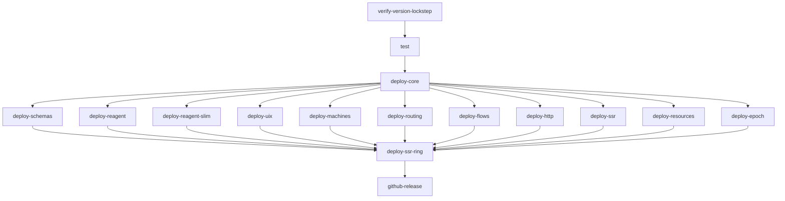

# Release process

> **Type:** Operational doc.
> **Audience:** maintainers cutting a re-frame2 release.
> **Authority:** the [release workflow](../.github/workflows/release.yml) is the source of truth; this doc is its narrative companion.

re-frame2 ships as a coordinated set of Maven artefacts, all driven from a single repo-root [`VERSION`](../VERSION) file. This doc is the operational guide for how a release flows through CI, what gates exist, and how to recover when something goes wrong mid-deploy.

Two tiers ship from this repo and they move on separate triggers. The **framework tier** is the thirteen artefacts under `implementation/`, and a `v*` tag ships all of them together — that is what §Topological deploy DAG below describes. The **tools tier** is the jars under `tools/`, which share the same lockstep VERSION but ship on their own per-tool tags and are not touched by a `v*` tag at all; [§The tools tier](#the-tools-tier) is their runbook.

## Policy

The release pipeline reflects a small set of decisions Mike made up front. They are recorded here so future contributors don't have to re-derive them from the workflow.

1. **Mechanism — tag-triggered CD, modeled on re-frame v1.** Push a tag matching the [tag glob](#tag-format); the [`release` workflow](../.github/workflows/release.yml) runs end-to-end. Same shape as [re-frame v1's `continuous-deployment-workflow.yml`](https://github.com/day8/re-frame/blob/master/.github/workflows/continuous-deployment-workflow.yml): tag-push trigger, gated test job, `clojure -M:clein deploy`, `softprops/action-gh-release` for the GitHub Release. The differences are structural — re-frame v1 ships one artefact, re-frame2 ships a coordinated set — and are documented in [§Topological deploy DAG](#topological-deploy-dag). The authoritative artefact roster is the [`release` workflow](../.github/workflows/release.yml)'s leaf declarations — the `deploy-leaf` matrix plus the `deploy-ssr-ring` stage it deliberately excludes ([§The one inter-leaf edge](#the-one-inter-leaf-edge)); the enumerations below mirror them.
2. **Channel gating — pre-1.0 = alpha/beta, post-1.0 = stable.** Pre-1.0 releases tag as `v0.0.1.alpha` (and `v0.0.1.alpha-N` / `v0.0.2.alpha` etc. for subsequent alphas; the same pattern with `.beta` once we promote). Post-1.0 releases tag as `vX.Y.Z` per Semantic Versioning. The release workflow flags any tag containing `beta`, `alpha`, or `rc` as a GitHub `prerelease` automatically.
3. **First publish — manual cut, all artefacts together.** Mike triggers the first `v0.0.1.alpha` deploy by hand once the policy text and the workflow have been reviewed against an actual tag. After the first cut, subsequent releases run automatically on tag push. The first cut ships the **full artefact set** — core plus every leaf: `schemas`, `reagent`, `reagent-slim`, `uix`, `machines`, `routing`, `flows`, `http`, `ssr`, `ssr-ring`, `resources`, `epoch`; no artefact "comes later" — they all ship together at every release per the lockstep contract below. The compiled-view substrate `re-frame.ui` is **not** in that set and never will be: Mike ruled on 2026-07-22 that `day8/re-frame2-ui` is not to be published, since it is donor-only code being absorbed into Freehand and the standalone artefact is deleted at the EP-0036 F6e gate (rf2-a32r7).
4. **Atomic rollback — NOT POLICY.** Clojars does not support yanking a published version, and re-frame2 does not invest in machinery that would make it look like it does. If a deploy fails part-way through, recovery is **bump VERSION + re-tag + re-run** (see [§Recovery from a partial deploy](#recovery-from-a-partial-deploy) for the procedure). The partial-release artefacts from a failed run remain on Clojars, tombstoned-by-supersession; consumers pin the bumped version and pull a coherent set. Manual recovery is acceptable; we do not build atomic-rollback or partial-deploy-replay machinery.
5. **Artefact set ships together at lockstep VERSION.** Every framework artefact ships at every release at the same VERSION, sourced from the repo-root [`VERSION`](../VERSION) file. The lockstep contract is enforced before any deploy by [`./.github/scripts/verify-version-lockstep.sh`](../.github/scripts/verify-version-lockstep.sh). Independent versioning is revisited post-1.0; until then, every published Maven coord moves in lockstep. The tool jars share that VERSION but not that trigger — they ship on per-tool tags at their own cadence, which is a difference of *when*, never of *what version* (see [§The tools tier](#the-tools-tier)).

## Tag format

| Channel | Tag pattern | VERSION file content | Example |
|---|---|---|---|
| Stable | `vX.Y.Z` | `X.Y.Z` | `v1.0.0` ↔ `1.0.0` |
| Alpha | `v0.0.1.alpha` (or `v0.0.1.alpha-N` for recovery / increments) | matches the tag minus the leading `v` | `v0.0.1.alpha-2` ↔ `0.0.1.alpha-2` |
| Beta | `v0.0.1.beta` (or `v0.0.1.beta-N` for recovery / increments) | matches the tag minus the leading `v` | `v0.0.1.beta-2` ↔ `0.0.1.beta-2` |
| Pre-release (alpha / rc) | `vX.Y.Z-alpha.N`, `vX.Y.Z-rc.N` | matches the tag minus the leading `v` | `v1.0.0-rc.1` ↔ `1.0.0-rc.1` |

The release workflow's tag glob is `v[0-9]+.[0-9]+.[0-9]+*`. Tag must match the contents of `VERSION` (prefixed with `v`); the release workflow's `verify-version-lockstep` job hard-fails if they disagree. The `prerelease` flag on the resulting GitHub Release is set automatically when the tag contains `beta`, `alpha`, or `rc`.

## Trigger

Tag push. Push a tag matching the pattern above and the release workflow runs end-to-end:

```bash
git tag v0.0.1.alpha-1
git push origin v0.0.1.alpha-1
```

There is no `workflow_dispatch` trigger by design: a release commit always carries an updated `VERSION` and a CHANGELOG entry, and the tag-push trigger keeps that coupling tight.

## Topological deploy DAG

Per the lockstep-versioning policy (every artefact ships at the same version each release), the DAG reflects the **published-pom** dependency graph (which is much narrower than the in-repo test-classpath graph): every per-feature artefact's published `:deps` declares only `day8/re-frame2` (core) — with one exception, `ssr-ring`, which also declares `day8/re-frame2-ssr`. Cross-feature references at runtime are otherwise wired through `re-frame.late-bind` per [Conventions §Packaging conventions §Independence rule](../spec/Conventions.md#independence-rule). That one exception is a real edge in the published graph, so the CI graph carries it as a real edge too: see [§The one inter-leaf edge](#the-one-inter-leaf-edge) below.


```mermaid
graph TD
  V[verify-version-lockstep] --> T[test]
  T --> C[deploy-core]
  C --> S[deploy-schemas]
  C --> R[deploy-reagent]
  C --> RS[deploy-reagent-slim]
  C --> U[deploy-uix]
  C --> M[deploy-machines]
  C --> RT[deploy-routing]
  C --> F[deploy-flows]
  C --> H[deploy-http]
  C --> SS[deploy-ssr]
  C --> RES[deploy-resources]
  C --> E[deploy-epoch]
  S --> SR[deploy-ssr-ring]
  R --> SR
  RS --> SR
  U --> SR
  M --> SR
  RT --> SR
  F --> SR
  H --> SR
  SS --> SR
  RES --> SR
  E --> SR
  SR --> GR[github-release]
```

The diagram shows the ordering constraints in reduced form. `github-release` actually lists `deploy-core`, `deploy-leaf` and `deploy-ssr-ring` in its `needs:`; the first two are reachable through `deploy-ssr-ring` anyway, since that stage already waits on the whole matrix.

ASCII fallback:

```
verify-version-lockstep ──► test ──► deploy-core
                                       │
                                       │   ── deploy-leaf: ONE matrix job,
                                       │      11 values, all in parallel ──
                                       ├── deploy-schemas
                                       ├── deploy-reagent
                                       ├── deploy-reagent-slim
                                       ├── deploy-uix
                                       ├── deploy-machines
                                       ├── deploy-routing
                                       ├── deploy-flows
                                       ├── deploy-http
                                       ├── deploy-ssr
                                       ├── deploy-resources
                                       └── deploy-epoch
                                                │
                                                ▼
                                        deploy-ssr-ring
                                                │
                                                ▼
                                        github-release
```

**Why fan-out (not strict serial).** A strict topological linearization would suffice; the deps-graph data is wider — every leaf but one has core as its only re-frame2 dependency, so the CI graph realises a valid topological sort that exploits the parallelism: the eleven independent leaves run concurrently after core, cutting wall-clock at the cost of a marginally wider failure surface (see Recovery below). The leaves group into per-feature artefacts (schemas, machines, routing, flows, http, ssr, ssr-ring, resources, epoch) and the view layer — the three substrate adapters (reagent, the default; reagent-slim; uix). The authoritative roster is always the `deploy-leaf` matrix in [`release.yml`](../.github/workflows/release.yml), plus the one leaf that job deliberately excludes, `ssr-ring`.

**The view layer, as consumers meet it.** The app template (`tools/template/`, `day8/re-frame2-template`) scaffolds against this released view layer through its substrate menu: `:reagent` (the default) and `:uix`. The menu is deliberately narrower than the adapter set — `day8/reagent-slim` is published but has no scaffold of its own, so a slim consumer starts from the Reagent variant and swaps the adapter coordinate. Adding a substrate to the `deploy-leaf` matrix does not automatically add a template variant; the two are decided separately.

### The one inter-leaf edge

`ssr-ring` is the exception, and the release DAG treats it as one. `implementation/ssr-ring/deps.edn` declares two in-repo coordinates in its published `:deps` — `day8/re-frame2` and `day8/re-frame2-ssr` — and the workflow rewrites both to `:mvn/version`, so the published pom for `day8/re-frame2-ssr-ring` depends on a `day8/re-frame2-ssr` version that has to exist on Clojars.

Two facts make that edge load-bearing on CI rather than merely descriptive. The `deploy-leaf` matrix runs `fail-fast: false`, and GitHub Actions cannot express an ordering edge between two values of one matrix — so while `ssr-ring` was a matrix value, a failed `ssr` value did not stop it deploying. And the job installs `ssr` into the runner's local `~/.m2` before packaging, so it never consults Clojars and cannot notice the miss itself. Since Clojars has no yank (see [Recovery](#recovery-from-a-partial-deploy)), the result would have been a permanent public artefact declaring a dependency that resolves to nothing: bump-and-supersede adds a good version but never removes the broken one.

So `ssr-ring` ships in a stage of its own, `deploy-ssr-ring`, with `needs: [deploy-core, deploy-leaf]`. A `needs` edge onto a matrix job waits for **every** value to succeed, which is exactly the invariant the DAG needs:

> If the `ssr` leaf does not publish successfully, `ssr-ring` does not publish at all.

That edge is stronger than the pom requires — it also blocks `ssr-ring` behind leaves it does not depend on — and deliberately so: under [Recovery](#recovery-from-a-partial-deploy) any leaf failure is resolved by bumping `VERSION` and re-shipping every artefact, so a leaf skipped because a sibling failed was going to be superseded regardless. Blocking costs nothing; publishing an unresolvable coordinate cannot be undone. `implementation/scripts/_release-dag-policy.test.cjs` parses the workflow's job graph on every PR and fails if a leaf carrying a second in-repo coordinate is placed back in the matrix, or if the ordering edge disappears (rf2-p4a93).

## The tools tier

`tools/` is versioned in lockstep with the framework — every tool jar reads the same repo-root `VERSION`, and [`verify-version-lockstep.sh`](../.github/scripts/verify-version-lockstep.sh) gates them alongside the framework artefacts — but **a `v*` tag publishes none of it.** Each tool ships on its own tag prefix, so a Xray-only fix does not republish thirteen framework artefacts and a framework release does not accidentally republish Xray. Five tool jars carry Clojars coordinates:

| Artefact | Coordinate | Tag | Workflow |
|---|---|---|---|
| `tools/xray/` | `day8/re-frame2-xray` | `xray-v*` | [`release-xray.yml`](../.github/workflows/release-xray.yml) |
| `tools/story/` | `day8/re-frame2-story` | `story-v*` | [`release-story.yml`](../.github/workflows/release-story.yml) |
| `tools/machines-viz/` | `day8/re-frame2-machines-viz` | `machines-viz-v*` | [`release-machines-viz.yml`](../.github/workflows/release-machines-viz.yml) |
| `tools/story-mcp/` | `day8/re-frame2-story-mcp` | — | none yet (see below) |
| `tools/mcp-base/` | `day8/re-frame2-mcp-base` | — | none yet (see below) |

Two further tools sit outside Clojars entirely and outside this runbook: the pair MCP server ships on npm as `@day8/re-frame2-pair-mcp`, and the app template ships as a git coordinate on a `template-v*` tag via [`template-release.yml`](../.github/workflows/template-release.yml). Neither carries a `:clein/build` alias, which is why the lockstep script's tools inventory excludes them.

### Release order

Tool jars pin their in-repo siblings at the lockstep VERSION, and those siblings have to be **on Clojars already** when the tool's tag lands. So for a given VERSION the tags go out in this order:

1. `v<VERSION>` — the framework tier: core and every leaf.
2. `machines-viz-v<VERSION>` and `xray-v<VERSION>` — both consume core only.
3. `story-v<VERSION>` — Story pins five siblings, Xray among them.

That ordering is enforced structurally rather than by this list. After each workflow rewrites `:local/root` → `:mvn/version`, `clojure -P` resolves the rewritten graph from Clojars, so a coordinate that has not published yet fails the job at classpath resolution — before `clein deploy` can touch Clojars. Story goes further and adds a package preflight that parses the *generated* pom and refuses to deploy unless all five coordinates are present at the exact VERSION. That gate reads the artefact rather than the inputs that were supposed to produce it, which is the right posture in front of an irreversible act.

> **Open question — Xray's pom (rf2-5dut1).** `tools/xray/deps.edn` declares ten in-repo runtime coordinates, but `release-xray.yml` rewrites only two of them and the lockstep inventory names only one. Since `clein pom` silently skips `:local/root`, a jar cut from that workflow today would ship a pom missing eight dependencies — and one of them, `day8/re-frame2-freehand`, cannot be pinned at all because `implementation/freehand/` is deliberately unpublished until the EP-0036 F6 gate. Treat `xray-v*` as unproven until that is settled.

### The two without a publish path

`story-mcp` and `mcp-base` carry Clojars coordinates and pass the lockstep gate, but neither can ship yet. Both declare `day8/de-dupe` as a runtime dependency via a git coordinate; `clein pom` drops git coordinates silently, and the library is not on Clojars, so a jar built today would publish a pom missing a runtime dep. Because story-mcp depends on mcp-base, neither moves until the other does. Publishing, vendoring or dropping `de-dupe` is the open decision — **rf2-2ii52, held pending an operator ruling.** Until it is settled, do not cut a tag for either.

### Recovery

Identical to the framework tier: Clojars has no yank, so recovery is bump-and-supersede. Do not re-run a failed tool deploy on the same tag — Clojars 409s on the duplicate upload. Bump `VERSION`, retag with the bumped value (`xray-v0.0.1.alpha-1`), rerun. See [§Recovery from a partial deploy](#recovery-from-a-partial-deploy) for the full procedure; the only difference is that bumping VERSION for a tool fix puts the framework tier out of lockstep until its next `v*` tag, which is expected and is what the per-tool cadence buys.

### First publish

Every tool workflow has the same first-publish protocol as the framework: Mike pushes the first tag by hand once the Clojars secrets are wired and the tags this tool depends on have published. Subsequent releases run automatically on tag push.

## Pre-flight checklist

Before tagging:

- [ ] All checks green on `main` (the `tests` workflow + any required reviews).
- [ ] [`VERSION`](../VERSION) file updated to the target version. Single line, no trailing whitespace.
- [ ] [`migration/from-re-frame-v1/README.md`](../migration/from-re-frame-v1/README.md) carries a fresh `M-NN` entry if the release contains a breaking change. (The migration corpus stays flat through 1.0; numbering is monotonic.)
- [ ] [`CHANGELOG.md`](../CHANGELOG.md) updated for the release, **including its artefact roster**. The GitHub Release body links to it, so it is the canonical narrative — and that link is pinned to the tag, not to `main`, so the CHANGELOG has to be right at the moment of tagging. A later correction on `main` will not reach a release body that has already been cut.
- [ ] The tag's commit is the same commit that updates VERSION + the migration corpus + CHANGELOG (one release commit).
- [ ] Locally green: `./.github/scripts/verify-version-lockstep.sh` passes. (The CI gate runs the same script; running locally first surfaces drift in seconds.)

## Recovery from a partial deploy

Clojars **does not support yanking** a published version. The recovery story is bump-and-replay, not rollback.

If a deploy job fails part-way through (e.g. `deploy-core` shipped, but `deploy-flows` failed):

1. **Diagnose.** Read the failing job's logs. Common causes: transient Clojars 5xx (re-runs cleanly on retry), credential rotation (CLOJARS_USERNAME / CLOJARS_PASSWORD secrets stale), pom-validation regression in the leaf's clein descriptor, network outage during the leaf's `clojure -M:clein deploy`.
2. **Decide whether the partial set is publishable as-is.** A consumer pinning the bumped version expects a coherent set; the partial set the failed run left on Clojars is not coherent. Do not promote it.
3. **Fix the cause locally.** Land the fix on `main` via the normal PR flow.
4. **Bump VERSION** in a release-recovery commit. For pre-releases, increment the suffix: `0.0.1.alpha` → `0.0.1.alpha-1`. For stable, bump the patch: `1.0.0` → `1.0.1`.
5. **Re-tag** with the bumped VERSION. The workflow ships every artefact at the new version, restoring the lockstep contract on the consumer side: a consumer pinning the bumped version pulls a coherent set; the partial-release artefacts from the failed run are tombstoned-by-supersession (still on Clojars, but nobody pins them).
6. **Note the abandoned version** in CHANGELOG.md so future readers don't try to pin it.

**Do NOT** attempt to re-run the failed workflow with the same tag. The `deploy-core` step will 409 on the duplicate jar upload to Clojars and the workflow will appear stuck.

**Do NOT** ask Clojars support to yank. The platform doesn't expose it; ad-hoc yanks would corrupt downstream caches anyway.

## Performance-instrumented prod bundles

Per [Spec 009 §Performance instrumentation](../spec/009-Instrumentation.md#performance-instrumentation), re-frame2 ships a default-off Performance API channel gated on the `re-frame.performance/enabled?` `goog-define`. Releases land both shapes:

- The published **artefact** (the `day8/re-frame2-*` Maven jars driven through this release pipeline) carries the bracket sites in source. Apps consuming the artefact decide at *their* `:advanced` build time whether to flip the flag.
- The **release verification** in CI runs `npm run test:perf-bundle`, which builds two `:examples/counter` variants under `:advanced` (one with the flag off, the default; one with it on via `:closure-defines {re-frame.performance/enabled? true}`) and asserts:
  - the off bundle carries zero `performance.mark` / `performance.measure` / `re-frame.performance` strings (bundle-isolation: shipped binaries that don't ask for timing have no User-Timing cost);
  - the on bundle carries those strings (bundle-presence: the toggle actually produces the measure entries).

The grep methodology mirrors `npm run test:elision` (the trace-surface elision contract). These gates run by changed surface in PR CI, in the scheduled/manual expensive workflow, and in the release workflow before deploy.

Apps that ship a perf-instrumented prod bundle alongside their default release set their own consumer config:

```edn
;; consumer's shadow-cljs.edn — perf-on prod build
{:builds {:app-perf {:target           :browser
                     :output-dir       "..."
                     :compiler-options {:closure-defines {goog.DEBUG                       false
                                                          re-frame.performance/enabled?    true}}}}}
```

`goog.DEBUG=false` elides the trace surface (per [Spec 009 §Production builds](../spec/009-Instrumentation.md#production-builds-zero-overhead-zero-code)); `re-frame.performance/enabled?=true` keeps the User-Timing brackets live. The two flags are independent — apps freely combine them per build target.

## Lockstep verification (drift detection)

[`./.github/scripts/verify-version-lockstep.sh`](../.github/scripts/verify-version-lockstep.sh) is the single source of truth for the lockstep contract. It is invoked by:

- the `tests` workflow on every PR (`verify-version-lockstep` job — fast, runs in parallel with the test jobs);
- the `release` workflow as the first gate before any deploy (`verify-version-lockstep` job — gates `test`, which gates `deploy-core`).

It covers **eighteen** artefacts — the thirteen under `implementation/` plus the five tool jars — and prints that count on success, so a summary line naming any other number is itself the drift signal.

The contract:

- Repo root has a non-empty `VERSION` file.
- Every artefact's `:clein/build` defers to that single source through a relative `:version` path. The path differs by tier: `"../../VERSION"` for core, the per-feature artefacts and the tool jars; `"../../../VERSION"` for the adapters, which sit one level deeper under `implementation/adapters/`.
- Every non-core artefact references core by `:local/root` — `"../core"` from a per-feature artefact, `"../../core"` from an adapter, `"../../implementation/core"` from a tool. The release workflow rewrites these to `:mvn/version` at deploy time.
- No artefact's committed `deps.edn` carries a literal `:mvn/version` for any `day8/re-frame2-*` artefact in a non-comment line.
- Every `implementation/*/deps.edn` declaring a `:clein/build` alias appears in the lockstep inventory **and** `release.yml`'s deploy jobs (the inventory guard), so a new publishable artefact cannot be omitted silently.
- Each tool jar is *packageable*, not merely version-pinned: `:clein/build` carries the `:main` key clein's spec requires, and no runtime coordinate is a form `clein pom` cannot express. Both classes had already shipped unnoticed before rf2-2ii52 added the checks — an artefact can be perfectly pinned and still impossible to build.

The tools half of the inventory is narrower than the implementation half: it asserts the coordinates listed in the script's `TOOLS_LOCAL_ROOTS`, which is a hand-maintained list rather than a scan of each tool's `:deps`. A coordinate absent from that list is a coordinate nothing asserts is rewritable — see the Xray caveat under [§The tools tier](#the-tools-tier).

Run locally any time:

```bash
./.github/scripts/verify-version-lockstep.sh
```

## Lockstep versioning policy through 1.0

Through 1.0, every artefact ships at the same VERSION. Independent versioning is revisited post-1.0. The mechanism:

- single root [`VERSION`](../VERSION) file;
- every artefact's `:clein/build :version` is the relative path `"../../VERSION"`;
- every non-core artefact references core via `:local/root "../core"`, swapped to `:mvn/version $VERSION` on the throwaway runner checkout at deploy time.

There is intentionally no per-artefact version override. Adding one would break the lockstep contract; the verify script flags it.

## Cross-references

- [.github/workflows/release.yml](../.github/workflows/release.yml) — the release pipeline for the framework tier.
- [.github/workflows/release-xray.yml](../.github/workflows/release-xray.yml), [release-story.yml](../.github/workflows/release-story.yml), [release-machines-viz.yml](../.github/workflows/release-machines-viz.yml) — the per-tool release pipelines; each header carries the rationale for its own rewrite set.
- [.github/workflows/template-release.yml](../.github/workflows/template-release.yml) — the app template's git-coordinate release.
- [tools/README.md](../tools/README.md) — what each tool is and which coordinate it publishes under.
- [.github/workflows/test.yml](../.github/workflows/test.yml) — PR-time tests including lockstep drift detection.
- [.github/scripts/verify-version-lockstep.sh](../.github/scripts/verify-version-lockstep.sh) — the lockstep contract script.
- [spec/Conventions.md §Packaging conventions](../spec/Conventions.md#packaging-conventions) — artefact naming, the independence rule, the bundle-isolation argument.
- [migration/from-re-frame-v1/README.md](../migration/from-re-frame-v1/README.md) — the migration prompt; flat through 1.0.
- [examples/real-apps/realworld_http/README.md](../examples/real-apps/realworld_http/README.md) — the canonical multi-artefact integration test.
