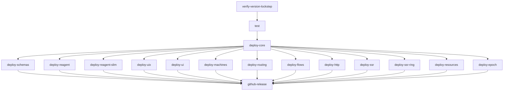

# Release process

> **Type:** Operational doc.
> **Audience:** maintainers cutting a re-frame2 release.
> **Authority:** the [release workflow](../.github/workflows/release.yml) is the source of truth; this doc is its narrative companion.

re-frame2 ships as a coordinated set of Maven artefacts, all driven from a single repo-root [`VERSION`](../VERSION) file. This doc is the operational guide for how a release flows through CI, what gates exist, and how to recover when something goes wrong mid-deploy.

## Policy

The release pipeline reflects a small set of decisions Mike made up front. They are recorded here so future contributors don't have to re-derive them from the workflow.

1. **Mechanism — tag-triggered CD, modeled on re-frame v1.** Push a tag matching the [tag glob](#tag-format); the [`release` workflow](../.github/workflows/release.yml) runs end-to-end. Same shape as [re-frame v1's `continuous-deployment-workflow.yml`](https://github.com/day8/re-frame/blob/master/.github/workflows/continuous-deployment-workflow.yml): tag-push trigger, gated test job, `clojure -M:clein deploy`, `softprops/action-gh-release` for the GitHub Release. The differences are structural — re-frame v1 ships one artefact, re-frame2 ships a coordinated set — and are documented in [§Topological deploy DAG](#topological-deploy-dag). The authoritative artefact roster is the [`release` workflow](../.github/workflows/release.yml)'s `deploy-leaf` matrix; the enumerations below mirror it.
2. **Channel gating — pre-1.0 = alpha/beta, post-1.0 = stable.** Pre-1.0 releases tag as `v0.0.1.alpha` (and `v0.0.1.alpha-N` / `v0.0.2.alpha` etc. for subsequent alphas; the same pattern with `.beta` once we promote). Post-1.0 releases tag as `vX.Y.Z` per Semantic Versioning. The release workflow flags any tag containing `beta`, `alpha`, or `rc` as a GitHub `prerelease` automatically.
3. **First publish — manual cut, all artefacts together.** Mike triggers the first `v0.0.1.alpha` deploy by hand once the policy text and the workflow have been reviewed against an actual tag. After the first cut, subsequent releases run automatically on tag push. The first cut ships the **full artefact set** — core plus every `deploy-leaf`: `schemas`, `reagent`, `reagent-slim`, `uix`, `ui`, `machines`, `routing`, `flows`, `http`, `ssr`, `ssr-ring`, `resources`, `epoch`; no artefact "comes later" — they all ship together at every release per the lockstep contract below. Per the ratified packaging decision (spec/006 §R-6) the compiled-view substrate `day8/re-frame2-ui` is a **required** member of the alpha train: `verify-version-lockstep.sh` refuses a core-only tag (rf2-vxgfnd.99.2).
4. **Atomic rollback — NOT POLICY.** Clojars does not support yanking a published version, and re-frame2 does not invest in machinery that would make it look like it does. If a deploy fails part-way through, recovery is **bump VERSION + re-tag + re-run** (see [§Recovery from a partial deploy](#recovery-from-a-partial-deploy) for the procedure). The partial-release artefacts from a failed run remain on Clojars, tombstoned-by-supersession; consumers pin the bumped version and pull a coherent set. Manual recovery is acceptable; we do not build atomic-rollback or partial-deploy-replay machinery.
5. **Artefact set ships together at lockstep VERSION.** Every artefact ships at every release at the same VERSION, sourced from the repo-root [`VERSION`](../VERSION) file. The lockstep contract is enforced before any deploy by [`./.github/scripts/verify-version-lockstep.sh`](../.github/scripts/verify-version-lockstep.sh) — which also asserts the required `day8/re-frame2-ui` substrate is publishable, so a core-only tag fails closed. Independent versioning is revisited post-1.0; until then, every published Maven coord moves in lockstep.

## Tag format

| Channel | Tag pattern | VERSION file content | Example |
|---|---|---|---|
| Stable | `vX.Y.Z` | `X.Y.Z` | `v1.0.0` ↔ `1.0.0` |
| Alpha | `v0.0.1.alpha` (or `v0.0.1.alpha-N` for recovery / increments) | matches the tag minus the leading `v` | `v0.0.1.alpha-2` ↔ `0.0.1.alpha-2` |
| Beta | `v0.0.1.beta` (or `v0.0.1.beta-N` for recovery / increments) | matches the tag minus the leading `v` | `v0.0.1.beta-2` ↔ `0.0.1.beta-2` |
| Pre-release (alpha / rc) | `vX.Y.Z-alpha.N`, `vX.Y.Z-rc.N` | matches the tag minus the leading `v` | `v1.0.0-rc.1` ↔ `1.0.0-rc.1` |

The release workflow's tag glob is `v[0-9]+.[0-9]+.[0-9]+*`. Tag must match the contents of `VERSION` (prefixed with `v`); the release workflow's `verify-version-lockstep` job hard-fails if they disagree. The `prerelease` flag on the resulting GitHub Release is set automatically when the tag contains `beta`, `alpha`, or `rc`.

## Trigger

Tag push. Push a tag matching the pattern above and the release workflow runs end-to-end:

```bash
git tag v0.0.1.alpha-1
git push origin v0.0.1.alpha-1
```

There is no `workflow_dispatch` trigger by design: a release commit always carries an updated `VERSION` and a CHANGELOG entry, and the tag-push trigger keeps that coupling tight.

## Topological deploy DAG

Per the lockstep-versioning policy (every artefact ships at the same version each release), the DAG reflects the **published-pom** dependency graph (which is much narrower than the in-repo test-classpath graph): every per-feature artefact's published `:deps` declares only `day8/re-frame2` (core); cross-feature references at runtime are wired through `re-frame.late-bind` per [Conventions §Packaging conventions §Independence rule](../spec/Conventions.md#independence-rule).


```mermaid
graph TD
  V[verify-version-lockstep] --> T[test]
  T --> C[deploy-core]
  C --> S[deploy-schemas]
  C --> R[deploy-reagent]
  C --> RS[deploy-reagent-slim]
  C --> U[deploy-uix]
  C --> UI[deploy-ui]
  C --> M[deploy-machines]
  C --> RT[deploy-routing]
  C --> F[deploy-flows]
  C --> H[deploy-http]
  C --> SS[deploy-ssr]
  C --> SR[deploy-ssr-ring]
  C --> RES[deploy-resources]
  C --> E[deploy-epoch]
  S --> GR[github-release]
  R --> GR
  RS --> GR
  U --> GR
  UI --> GR
  M --> GR
  RT --> GR
  F --> GR
  H --> GR
  SS --> GR
  SR --> GR
  RES --> GR
  E --> GR
```

ASCII fallback:

```
verify-version-lockstep ──► test ──► deploy-core
                                       │
                                       ├── deploy-schemas
                                       ├── deploy-reagent
                                       ├── deploy-reagent-slim
                                       ├── deploy-uix
                                       ├── deploy-ui
                                       ├── deploy-machines
                                       ├── deploy-routing
                                       ├── deploy-flows
                                       ├── deploy-http
                                       ├── deploy-ssr
                                       ├── deploy-ssr-ring (also deps ssr)
                                       ├── deploy-resources
                                       └── deploy-epoch
                                                │
                                                ▼
                                        github-release
```

**Why fan-out (not strict serial).** A strict topological linearization would suffice; the deps-graph data is wider — every leaf has core as its only re-frame2 dependency (the one exception is `ssr-ring`, which also depends on `ssr`; the release workflow rewrites both `:local/root` coordinates and resolves `ssr` from Clojars, so the leaves still fan out with no inter-leaf CI edge). The CI graph realises a valid topological sort that exploits the parallelism: leaves run concurrently after core, cutting wall-clock at the cost of a marginally wider failure surface (see Recovery below). The leaves group into per-feature artefacts (schemas, machines, routing, flows, http, ssr, ssr-ring, resources, epoch) and the view layer — the compiled-view substrate `ui` plus the adapter set (reagent default, reagent-slim, uix). The authoritative roster is always the `deploy-leaf` matrix in [`release.yml`](../.github/workflows/release.yml).

**The view layer, as consumers meet it.** The app template (`tools/template/`, `day8/re-frame2-template`) scaffolds against this released view layer through its substrate menu: `:reagent` (the default), `:uix`, and the experimental `:ui` (re-frame.ui, offered alongside the adapters). The template menu and the view-layer rows of the `deploy-leaf` matrix move together.

## Pre-flight checklist

Before tagging:

- [ ] All checks green on `main` (the `tests` workflow + any required reviews).
- [ ] [`VERSION`](../VERSION) file updated to the target version. Single line, no trailing whitespace.
- [ ] [`migration/from-re-frame-v1/README.md`](../migration/from-re-frame-v1/README.md) carries a fresh `M-NN` entry if the release contains a breaking change. (The migration corpus stays flat through 1.0; numbering is monotonic.)
- [ ] [`CHANGELOG.md`](../CHANGELOG.md) updated for the release. The GitHub Release body links to it, so it is the canonical narrative.
- [ ] The tag's commit is the same commit that updates VERSION + the migration corpus + CHANGELOG (one release commit).
- [ ] Locally green: `./.github/scripts/verify-version-lockstep.sh` passes. (The CI gate runs the same script; running locally first surfaces drift in seconds.)

## Recovery from a partial deploy

Clojars **does not support yanking** a published version. The recovery story is bump-and-replay, not rollback.

If a deploy job fails part-way through (e.g. `deploy-core` shipped, but `deploy-flows` failed):

1. **Diagnose.** Read the failing job's logs. Common causes: transient Clojars 5xx (re-runs cleanly on retry), credential rotation (CLOJARS_USERNAME / CLOJARS_PASSWORD secrets stale), pom-validation regression in the leaf's clein descriptor, network outage during the leaf's `clojure -M:clein deploy`.
2. **Decide whether the partial set is publishable as-is.** A consumer pinning the bumped version expects a coherent set; the partial set the failed run left on Clojars is not coherent. Do not promote it.
3. **Fix the cause locally.** Land the fix on `main` via the normal PR flow.
4. **Bump VERSION** in a release-recovery commit. For pre-releases, increment the suffix: `0.0.1.alpha` → `0.0.1.alpha-1`. For stable, bump the patch: `1.0.0` → `1.0.1`.
5. **Re-tag** with the bumped VERSION. The workflow ships every artefact at the new version, restoring the lockstep contract on the consumer side: a consumer pinning the bumped version pulls a coherent set; the partial-release artefacts from the failed run are tombstoned-by-supersession (still on Clojars, but nobody pins them).
6. **Note the abandoned version** in CHANGELOG.md so future readers don't try to pin it.

**Do NOT** attempt to re-run the failed workflow with the same tag. The `deploy-core` step will 409 on the duplicate jar upload to Clojars and the workflow will appear stuck.

**Do NOT** ask Clojars support to yank. The platform doesn't expose it; ad-hoc yanks would corrupt downstream caches anyway.

## Performance-instrumented prod bundles

Per [Spec 009 §Performance instrumentation](../spec/009-Instrumentation.md#performance-instrumentation), re-frame2 ships a default-off Performance API channel gated on the `re-frame.performance/enabled?` `goog-define`. Releases land both shapes:

- The published **artefact** (the `day8/re-frame2-*` Maven jars driven through this release pipeline) carries the bracket sites in source. Apps consuming the artefact decide at *their* `:advanced` build time whether to flip the flag.
- The **release verification** in CI runs `npm run test:perf-bundle`, which builds two `:examples/counter` variants under `:advanced` (one with the flag off, the default; one with it on via `:closure-defines {re-frame.performance/enabled? true}`) and asserts:
  - the off bundle carries zero `performance.mark` / `performance.measure` / `re-frame.performance` strings (bundle-isolation: shipped binaries that don't ask for timing have no User-Timing cost);
  - the on bundle carries those strings (bundle-presence: the toggle actually produces the measure entries).

The grep methodology mirrors `npm run test:elision` (the trace-surface elision contract). These gates run by changed surface in PR CI, in the scheduled/manual expensive workflow, and in the release workflow before deploy.

Apps that ship a perf-instrumented prod bundle alongside their default release set their own consumer config:

```edn
;; consumer's shadow-cljs.edn — perf-on prod build
{:builds {:app-perf {:target           :browser
                     :output-dir       "..."
                     :compiler-options {:closure-defines {goog.DEBUG                       false
                                                          re-frame.performance/enabled?    true}}}}}
```

`goog.DEBUG=false` elides the trace surface (per [Spec 009 §Production builds](../spec/009-Instrumentation.md#production-builds-zero-overhead-zero-code)); `re-frame.performance/enabled?=true` keeps the User-Timing brackets live. The two flags are independent — apps freely combine them per build target.

## Lockstep verification (drift detection)

[`./.github/scripts/verify-version-lockstep.sh`](../.github/scripts/verify-version-lockstep.sh) is the single source of truth for the lockstep contract. It is invoked by:

- the `tests` workflow on every PR (`verify-version-lockstep` job — fast, runs in parallel with the test jobs);
- the `release` workflow as the first gate before any deploy (`verify-version-lockstep` job — gates `test`, which gates `deploy-core`).

The contract:

- Repo root has a non-empty `VERSION` file.
- Every artefact's `:clein/build` declares `:version "../../VERSION"` (i.e. defers to the single source).
- Every non-core artefact references core via `day8/re-frame2 {:local/root "../core"}` (the release workflow rewrites this to `:mvn/version` at deploy time).
- No artefact's committed `deps.edn` carries a literal `:mvn/version` for any `day8/re-frame2-*` artefact in a non-comment line.
- Every `implementation/*/deps.edn` declaring a `:clein/build` alias appears in the lockstep inventory **and** the `release.yml` deploy matrix (the inventory guard), so a new publishable artefact cannot be omitted silently.
- The **required** `day8/re-frame2-ui` compiled-view substrate is publishable (the `REQUIRED_PUBLISHABLE` positive assertion, rf2-vxgfnd.99.2). Unlike the conditional inventory guard, this refuses a core-only tag — dropping ui's `:clein/build` fails the gate before any deploy. Proven by the hermetic `implementation/scripts/_release-ui-required-gate.test.cjs`.

Run locally any time:

```bash
./.github/scripts/verify-version-lockstep.sh
```

## Lockstep versioning policy through 1.0

Through 1.0, every artefact ships at the same VERSION. Independent versioning is revisited post-1.0. The mechanism:

- single root [`VERSION`](../VERSION) file;
- every artefact's `:clein/build :version` is the relative path `"../../VERSION"`;
- every non-core artefact references core via `:local/root "../core"`, swapped to `:mvn/version $VERSION` on the throwaway runner checkout at deploy time.

There is intentionally no per-artefact version override. Adding one would break the lockstep contract; the verify script flags it.

## Cross-references

- [.github/workflows/release.yml](../.github/workflows/release.yml) — the release pipeline.
- [.github/workflows/test.yml](../.github/workflows/test.yml) — PR-time tests including lockstep drift detection.
- [.github/scripts/verify-version-lockstep.sh](../.github/scripts/verify-version-lockstep.sh) — the lockstep contract script.
- [spec/Conventions.md §Packaging conventions](../spec/Conventions.md#packaging-conventions) — artefact naming, the independence rule, the bundle-isolation argument.
- [migration/from-re-frame-v1/README.md](../migration/from-re-frame-v1/README.md) — the migration prompt; flat through 1.0.
- [examples/real-apps/realworld_http/README.md](../examples/real-apps/realworld_http/README.md) — the canonical multi-artefact integration test.
