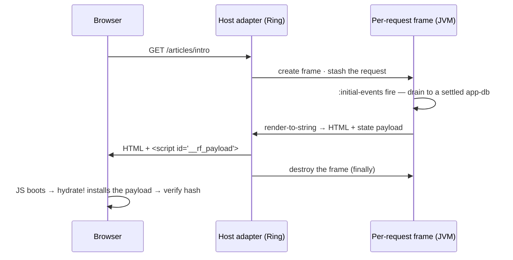

# Server-side rendering

You want three things from SSR. Real HTML on the wire before any JavaScript loads, so crawlers can read it and the first paint lands fast. A client that **hydrates** — takes over that already-painted HTML and wakes it into the live app, with no flash and no re-fetch. And you want both *without* maintaining a second, server-flavoured copy of your application — which is where most stacks quietly buckle.

re-frame2's answer: run the same [event handlers](../core/glossary.md#event-handler), the same [subscriptions](../core/glossary.md#subscription), and the same [views](../core/glossary.md#view) on the JVM, against a per-request [frame](../core/glossary.md#frame) — one isolated, running instance of your app. The only difference is the output: a string instead of a DOM. **There's one app. It runs twice.**

This page is the model, in the order the ideas depend on each other: why the same code can run on a server at all, what one request does from arrival to teardown, the two halves of the handshake (the server's payload, the client's hydrate), and then the production concerns one at a time — the mismatch detector, platform gating, response control, head metadata, error handling, streaming. If you'd rather *build* it first and read the model after, do the [tutorial](tutorial.md) — it wires everything on this page end to end, by hand.

??? info "For JavaScript developers"

    Coming from Next.js or Remix? You keep the capabilities — first-paint HTML, loaders, form actions, React-18-style streaming — and you drop the separate server layer. A "loader" is your ordinary event handlers running in a per-request frame. Streaming is one hiccup marker, not a component API. [Coming from Next.js](coming-from-nextjs.md) is the full translation.

## Why the same code runs on a JVM

SSR is hard in most stacks because the app is entangled with the browser: `window`, `document`, side effects firing in the middle of render. re-frame2 never had that entanglement — and not because of SSR. The framework committed to three properties for testing, replay, and observability, long before rendering on a server was on the table. SSR simply falls out of them:

- **Event handlers are pure.** An [event](../core/glossary.md#event) is an inert "something happened" fact; its [handler](../core/glossary.md#event-handler) is `(coeffects, event) → effect map`. No `window`, no lifecycle. A JVM runs them fine.
- **Subscriptions are pure derivations.** State in, value out — nodes on [the derivation graph](../core/glossary.md#the-derivation-graph), rooted at app-db.
- **The render-tree is data.** [Hiccup](../core/glossary.md#hiccup) is nested vectors and maps, and [`render-to-string`](glossary.md#render-to-string) is a pure function from hiccup to an HTML string — no React, no DOM, no JS runtime.

So the question "can this code run on the server?" is answered once, structurally — yes, all of it, because none of it can reach the browser directly. The only genuinely one-sided code is impure work (a `localStorage` write, a focus trap), and that is declared, not branched around — [`:platforms`](#platforms--one-handler-gated-per-runtime), below.

The SSR surface ships as its own artefact (`day8/re-frame2-ssr`, plus `day8/re-frame2-ssr-ring` for the Ring host adapter), so apps that never render server-side carry not one byte of it in their client bundle.

??? info "For JavaScript developers"

    In a typical Next.js codebase the same component renders on both sides, but you litter it with `typeof window === 'undefined'` guards because the *component itself* is entangled with the browser. Here the "does this run on the server?" question never reaches your components at all.

## A request, start to finish

One request, from arrival to teardown. The host adapter runs all of it for you; hold this shape and every section below slots into it:



In words:

1. An HTTP request arrives. The host adapter creates a **frame for this request** and stashes the request map where handlers can read it.
2. The frame's `:initial-events` fire in order: read the session, set the route, start data fetches.
3. The runtime **drains**: it keeps processing events — and every event those events dispatch — until the queue settles and app-db stops changing (the [run-to-completion](../core/glossary.md#drain--run-to-completion) guarantee). The settled state is what gets rendered, never a half-loaded intermediate.
4. The root view renders to hiccup; `render-to-string` turns it into HTML.
5. The server ships the HTML **plus** a serialised state payload.
6. The client boots, dispatches `:rf/hydrate` with that payload, and renders. Its first render matches the server's HTML, so the existing DOM is adopted, not replaced.
7. The per-request frame is destroyed — in a `finally`, on every exit path.

Steps 2–4 run the handlers, subs, and views you already wrote; there's no separate "server code" to keep in sync with the client. And the per-request frame is *exactly* the frame from [Frames: isolated worlds](../core/concepts/frames.md) — no SSR-only variant.

!!! note "Why this matters"

    Because each request gets its own frame, a hundred concurrent requests are a hundred isolated [app-dbs](../core/glossary.md#app-db) that cannot see, race, or corrupt one another. The isolation that made frames good for testing is the same thing that makes them safe under server load — request isolation comes free, not as a bolted-on server feature.

## The simplest server

Wire the Ring adapter once. It owns the whole lifecycle above — frame create, drain, render, payload, response, teardown:

```clojure
(require '[ring.adapter.jetty :as jetty]
         '[re-frame.ssr.ring  :as ssr-ring])

(def handler
  (ssr-ring/ssr-handler
    {:initial-events [[:rf/server-init]]
     :root-view      [:app/root]
     :payload        [:articles :session-user]}))   ;; allowlist of app-db keys to ship

(jetty/run-jetty handler {:port 3000 :join? false})
```

Three opts do the work:

- **`:initial-events`** — the per-request setup vector, lowered verbatim into the per-request frame's `:initial-events` (step 2 of the lifecycle). It accepts a vector of events, or a `(fn [request] → initial-events-vector)` when the setup must be derived from the Ring request.
- **`:root-view`** — the view ref the adapter renders once the frame settles (step 4).
- **`:payload`** — the allowlist of top-level app-db keys to serialise for the client (step 5). It's a security boundary with its [own section below](#payload--the-fail-closed-allowlist).

That's a working SSR server. Everything below refines one step of the lifecycle. (The [tutorial](tutorial.md) builds this same lifecycle by hand first — `set-request!`, `reg-frame`, `render-to-string`, `destroy-frame!` — which is the better order if the adapter feels like magic.)

??? info "From re-frame v1"

    v1 had no first-class SSR story — you reached for community libraries and hand-rolled the server/client split. Here it's one handler constructor over the *same* events and views the client runs. Also note: the old frame keys `:on-create` / `:initial-db` are retired; per-request setup is `:initial-events`, and supplying `:on-create` [fails loud](../core/glossary.md#fail-loud-not-silent) (`:rf.error/on-create-retired`).

### Reading the request

Handlers read the request the way they read any outside fact — through a declared [coeffect](../core/glossary.md#coeffect):

```clojure
;; Adapted from examples/capabilities/ssr/ssr/core.cljc
(rf/reg-event :rf/server-init
  {:platforms        #{:server}
   :rf.cofx/requires [:rf.server/request]}
  (fn [{:keys [db rf.server/request]} _]
    {:db db
     :fx [[:dispatch [:rf.route/handle-url-change (:uri request)]]
          [:rf.http/managed {:request    {:method :get :url "/api/articles"}
                             :decode     :json
                             :on-success [:articles/loaded]}]]}))
```

Declare `:rf.cofx/requires [:rf.server/request]` once, and the request map arrives flat under `:rf.server/request` — `:uri`, `:request-method`, `:headers`, `:query-params`, `:form-params`, `:session`, `:cookies`. The `[:rf.route/handle-url-change ...]` dispatch hands the URL to the same [routing](../routing/concepts.md) machinery the client uses, so the route resolves through the code you already trust.

!!! note "`:rf/server-init` is a reserved name you fill in"

    `:rf/server-init` is a pattern-reserved name the framework documents and you supply the body for. It is not licence to register your own events under the reserved `:rf/*` root.

One rule governs this coeffect, and it's worth stating plainly before the fine print: **use the request for decisions, but when a request-derived fact needs to live in app-db, put that fact on an event's payload rather than copying it from the ambient read.** The handler above obeys it — the URI it reads lands on the `[:rf.route/handle-url-change …]` event, so the value is recorded with the dispatch. The tempting shortcut it avoids is a direct copy into durable state, `(assoc db :session-user (-> request :session :user))`. Why that's a replay hole, and the two legal shapes for durable request-derived facts:

??? note "Going deeper — why a durable write must be recorded, and how to fix it"

    [Time-travel](../core/concepts/observability.md) replays a run only if every input a handler used was captured. The request coeffect is the exception: like `localStorage` or the wall clock, it reads a live per-request slot and its value is **never recorded** — an *[ambient](../core/glossary.md#recordable-vs-ambient-coeffects)* coeffect, not a *recordable* one stamped onto the [event envelope](../core/glossary.md#event-envelope).

    An ambient read is fine for a **non-durable** decision (branch on `:request-method`, peek at a header to pick a code path). It is **not** fine for a value you fold into durable state: on replay the framework re-runs the live supplier rather than re-presenting the value the recorded run saw — and after the per-request frame is torn down, that supplier reads `nil`. So `(assoc db :session-user (-> request :session :user))` is a durable write whose input was never recorded, and a replay reconstructs a different app-db.

    The fix is to make the durable fact **recordable** — move the sanitised projection (never the whole request map, which carries `Cookie` / `Authorization` / raw bodies) onto the dispatch itself. Two shapes are legal:

    ```clojure
    ;; (a) ride the derived fact in on the event payload — recorded as part of :event.
    ;;     The host computes the projection at the boundary and dispatches it:
    ;;     :initial-events [[:auth/server-init {:user (extract-user request)}]]
    (rf/reg-event :auth/server-init
      {:platforms #{:server}}
      (fn [{:keys [db]} [_ {:keys [user]}]]
        {:db (assoc db :auth/user user)}))           ;; durable write, recorded input

    ;; (b) declare a provided recordable cofx the host stamps onto the boot token.
    ;;     A record missing it fails LOUD with :rf.error/missing-required-cofx,
    ;;     never a silent re-read of the host.
    (rf/reg-cofx :auth.session/user {:recordable? true :provided? true} ...)
    ```

    The whole request map must **never** ride the causal token — recording a secret makes it durable, not safe. Stamp only the sanitised derived projection, and keep `:rf.server/request` for the reads that don't fold into durable state.

### `:payload` — the fail-closed allowlist

`:payload` decides what crosses the wire to the client, and — this is the important word — it **fails closed**. A vector is an allowlist of top-level app-db keys; everything else stays on the server, *including keys you haven't written yet*. Add a `:secrets/api-token` to app-db next year and forget to update the allowlist, and the worst that happens is it doesn't reach the client.

Forget to set `:payload` at all and you get a loud error at boot (`:rf.error/ssr-missing-payload-policy`) — not a quiet leak on the first request. If you genuinely want to ship the whole app-db, you say so out loud with the explicit keyword `:rf.ssr.payload/whole-app-db`.

!!! note "Why this matters"

    A *denylist* ("ship everything except these") was considered and rejected on purpose: it leaks every new server-only key the instant you introduce one, which is exactly the bug an allowlist exists to prevent. This is [fail-closed](../core/glossary.md#fail-loud-not-silent) at a security boundary — the framework would rather stop you cold at boot than surprise you in production.

??? note "The three boot-time payload errors, kept distinct"

    The allowlist accepts any sequential of keywords — a literal vector is canonical, but a computed `(filterv …)` or `(keep …)` works too. Three boot-time errors keep three different mistakes distinct, so you can tell them apart at construction time:

    - an **empty** allowlist (`[]`) falls into the missing-policy bucket (`:rf.error/ssr-missing-payload-policy`) — shipping zero keys is almost certainly a slip, not intent;
    - an **unknown** policy keyword surfaces as `:rf.error/ssr-unknown-payload-policy`;
    - a **string typo for a keyword** — `["public/articles"]` instead of `[:public/articles]` — fails loud as `:rf.error/ssr-malformed-payload-allowlist` (carrying the offending entries under `:bad-entries`) rather than silently shipping a wrong slice.

    A **set** is rejected on purpose; the allowlist is an *ordered* key selection, not a set. The selector is collection-vs-keyword — a sequential can never be confused with the whole-app-db keyword — so there's nothing to arbitrate.

The same constructor accepts the rest of the lifecycle opts: the two error opts (`:error-view`, `:on-error`, [covered below](#when-the-server-throws)) and the caller-trusted shell hooks for bespoke head/body fragments (`:head`, `:body-end`, `:script-src`, `:app-element-id`).

## The client side: hydrate, then verify

The client's job is to land in the state the server finished in, without redoing the work. What it has to work with is the **payload** — the last thing the server shipped, sitting in the page as a `<script id="__rf_payload">` of EDN:

```clojure
{:rf/version     1                ;; pattern-protocol version (deploy-drift check, below)
 :rf/app-db      {…}              ;; your state, filtered by the allowlist
 :rf/runtime-db  {…}              ;; the framework's serialisable slice — the route, machine snapshots
 :rf/render-hash "a3f29c01"}      ;; a structural fingerprint of the server's render tree
```

[`ssr/hydrate!`](glossary.md#hydration) (from `re-frame.ssr`) consumes it in three steps, in a mandated order: **read** the embedded payload, **hydrate** — dispatch `[:rf/hydrate payload]` *before* the first render — and **verify** the render-tree hash against the server's:

```clojure
;; Adapted from examples/capabilities/ssr/ssr/core.cljc — requires, alongside rf and ssr:
;;   [reagent.dom.client :as rdc]  [re-frame.adapter.reagent :as reagent-adapter]
(defonce react-root
  (rdc/create-root (js/document.getElementById "app")))

(defn ^:export run []
  (rf/init! reagent-adapter/adapter)          ;; installs the adapter — creates no frame
  (rf/reg-frame :app {:platform :client})
  (let [payload (ssr/hydrate! {:frame          :app
                               :render-tree-fn (fn [] ((rf/view :app/root)))})]
    (when-not payload
      ;; No payload script — a client-only first load. Seed normally.
      (rf/dispatch-sync [:app/client-bootstrap] {:frame :app})))
  (rdc/render react-root
    [rf/frame-provider {:frame :app}
     [(rf/view :app/root)]]))
```

Two rules to hold onto:

- **The hydration target is carried, never guessed.** `:frame` is required, and the *same* frame goes to `hydrate!` and the root `frame-provider {:frame …}`. That's [frame identity is carried, not found](../core/glossary.md#frame-identity-is-carried-not-found), applied at boot. An absent `:frame` raises `:rf.error/no-frame-context`; the runtime never invents a default.
- **Hydration replaces; the server is authoritative.** `:rf/hydrate` installs the server's [app-db](../core/glossary.md#app-db) *and* its serialisable [runtime-db](../core/glossary.md#runtime-db) slice in one atomic step — [both partitions](../core/glossary.md#the-two-partitions) at once — replacing whatever the client pre-seeded. A malformed payload is rejected wholesale (fail-closed); a missing one just means a normal client-only load — the `when-not` branch above.

??? note "Going deeper — replace-not-merge, frame-id evidence, and the malformed-payload rules"

    **Why replace, not merge.** The merge policy is locked to *replace the whole frame-state* (app-db **and** the serialisable runtime-db projection) because a defaulting merge would bury "which side won?" bugs at every key. If you need client-only state to survive hydration, the customisation point is *re-registering* `:rf/hydrate` with your own explicit merge — you own the order and the semantics.

    **The payload is untrusted transport input.** A non-map payload, or a present-but-not-a-map app-db / runtime-db slice, is rejected wholesale (`:rf.error/malformed-hydration-payload`) and the client's existing state is left untouched. A *wholly absent* slice is not malformed — it's the documented client-only first-load fallback.

    **`:rf/frame-id` is evidence, not a target.** The payload may carry the frame id the *server* rendered under. It's validation evidence: if present and it disagrees with the `:frame` you passed, hydration fails closed with `:rf.error/hydration-frame-id-mismatch` rather than installing the server's slice into the wrong frame. If absent — the common case, since the server renders under a per-request frame the client can't name ahead of time — your explicit `:frame` just stands.

??? info "Coming from React?"

    This is `hydrateRoot` with the gloss removed. React hydrates by walking the DOM and reattaching listeners, and trusts that your component re-renders the same tree. Here the server's *state* rides along explicitly in the payload, `:rf/hydrate` installs it before the first render, and then the substrate [adapter](../core/glossary.md#adapter) attaches listeners to the existing DOM. You never re-fetch on the client to "catch up" — the state the server computed is already in app-db.

Server state declared as a [resource](../resources/glossary.md#resource) makes the round trip too. The server preloads it, the payload carries the entries, and a fresh hydrated entry renders immediately without firing a duplicate fetch — see the [resources SSR example](../../examples/capabilities/ssr/resources_ssr).

A resource a route declares **blocking** does more than ride the payload — it gives the server a *wait point before render*. The runtime drains the route's blocking resources until they settle, **then** renders, so the HTML never captures a half-loaded `:loading` skeleton for data the server was always going to have. Non-blocking route resources don't hold up the render: whatever's settled at render time serialises, and anything still in flight refetches on the client.

??? note "Going deeper — the render budget"

    The wait has a deadline, because a server has one render moment. A blocking fetch that hangs past the render budget settles as a structured first-load failure — the resource enters `:error` with `{:kind :rf.http/timeout :reason :ssr-blocking-timeout}`, so the view renders a clean error state rather than a hung page — and the runtime records `:rf.error/resource-ssr-blocking-timeout`. A blocking resource that can't resolve in time fails closed instead of stalling the request.

### Deploy-drift checks come along for free

The payload also carries a couple of stamps that catch the classic "the server and the client are running different code" bug. As part of `:rf/hydrate`'s effects, the framework fires two client-only compatibility checks, and both are **best-effort** — they emit a trace and let hydration proceed; they never throw and never block the page:

- **`:rf.ssr/check-version`** compares the payload's pattern-protocol version (`:rf/version`, an integer) against the client's. A mismatch emits a `:rf.ssr/version-mismatch` trace — your "the server bundle is a deploy ahead of the client" alarm.
- **`:rf.ssr/check-schema-digest`** (fired only when the payload carries a digest) hashes the client's registered `app-schema` set and compares it to the server's. A mismatch emits `:rf.ssr/schema-digest-mismatch` — the server is validating against a different schema set than the client's bundle.

If the runtime can't find the client-side value to compare against (no version hook registered, say), the check emits `:rf.ssr/compatibility-check-skipped` and no-ops rather than crashing. Degraded-but-running is the deliberate posture: a version stamp should never be what stops a page from loading. These three categories ride the dev trace surface, so wire an [observability](../core/concepts/observability.md) listener on them if you want deploy-drift visibility in CI.

## When the renders disagree

Sometimes the client's first render *doesn't* match the server's HTML. This is the classic SSR bug — a [hydration mismatch](glossary.md#hydration-mismatch) — and in most stacks it produces a content flash and a console warning nobody reads. The causes are almost always mundane: a date rendered in two timezones, a bit of state the server set but the client never read, an unordered map that happens to serialise in two different orders.

re-frame2 treats it as a structured, first-class failure. The server embeds a structural hash of its render-tree (the `:rf/render-hash` you saw in the payload); the client computes the same hash on its own first render and compares. On disagreement, a structured [trace event](../core/glossary.md#trace-event) fires:

```clojure
{:operation :rf.ssr/hydration-mismatch
 :op-type   :error
 :tags      {:server-hash "a3f29c01"          ;; the tree the server shipped…
             :client-hash "0b77e4d2"          ;; …vs the client's first render
             :frame       :app
             :failing-id  :rf/hydrate
             :recovery    :warned-and-replaced}}
```

The default recovery is **warn and replace**: log it, render the client's view, so the user never sees a broken page. Per-frame strict mode (`:ssr {:on-mismatch :hard-error}`) escalates it to a thrown structured exception for dev and CI. (The [tutorial's Step 5](tutorial.md) trips this on purpose, which is the fastest way to internalise it.)

Be clear about what the hash buys you: it proves *that* the renders diverged — on which frame, and what the runtime did about it — not *which node*. Locating the node is a tree-diff, and that's deliberately left to tooling: the trace carries an optional `:first-diff-path` tag (a path into the render tree, e.g. `[:body 0 :children 0]`) that a host running its own diff supplies through [`verify-hydration!`](../api/re-frame.ssr.md)'s opts; the bundled runtime emits the hashes and leaves the slot empty. What the detector itself guarantees is cheap, always-on, and loud: a mismatch is never a warning you scroll past.

!!! note "The mismatch trace is dev-only — instrument deliberately for production"

    That trace rides the dev trace surface, so it's [elided](../core/glossary.md#elide) from production client builds like the rest of the trace stream. The hash comparison itself still runs (disable it with `:ssr {:detect-mismatch? false}` to reclaim the first-render work). To watch for drift in production you instrument deliberately: the strict-mode exception carries both hashes, so the boot site can catch it around `hydrate!` and ship it through your [observability](../core/concepts/observability.md) sinks.

??? note "Going deeper — the hash is structural, not textual"

    Byte-for-byte HTML equality is *not* required: different serialisers emit semantically-equivalent strings that differ in attribute order or whitespace. The contract is structural — the FNV-1a hash runs over a canonical-EDN traversal of the render-tree (depth-first, attribute maps in sorted-key order, nil pruned). FNV-1a is fast and carries zero platform dependencies (no `crypto`). The hash is a tamper-evident structural marker between *one* server and *one* client of the same build, not a security primitive.

## `:platforms` — one handler, gated per runtime

A real init flow mixes work that's fine on the server (fetching over HTTP) with work that's meaningless there (writing `localStorage`, which the JVM has never heard of). You don't branch in handler bodies. Instead, the [effect](../core/glossary.md#effect) itself declares where it's allowed to run:

```clojure
;; Adapted from examples/capabilities/ssr/ssr/core.cljc
(rf/reg-fx :auth.session/store
  {:doc       "Persist a session token in localStorage."
   :platforms #{:client}}              ;; server-side dispatches skip this
  (fn [_ {:keys [token]}]
    (.setItem js/localStorage "auth/token" token)))
```

The default is universal (`#{:server :client}`). When a server-side drain meets a `#{:client}` effect, the resolver skips it and emits a `:rf.fx/skipped-on-platform` trace, and the handler that returned it never learns which runtime it's on. One single-purpose handler, two platforms, zero `if (typeof window === 'undefined')`.

The same gate runs on the *input* side. A [coeffect](../core/glossary.md#coeffect) can carry `:platforms` too — `:rf.server/request` is `#{:server}` — so on the client (after hydration, when the same handler runs again) the runtime simply doesn't supply it, emitting `:rf.cofx/skipped-on-platform`. That coeffect's key is absent from the coeffects map; the rest of the handler runs as normal. So a setup handler that reads the request server-side doesn't blow up client-side — it just doesn't see a request there, which is exactly right.

??? info "For JavaScript developers"

    This is the declarative answer to the `typeof window === 'undefined'` guards scattered through a Next.js codebase. Instead of *branching inside* every component or handler that touches the browser, you tag the *effect* once with the platforms it's allowed on, and the resolver enforces it. There is no `if (isServer)` anywhere in your business logic.

## Controlling the response — `:rf.server/*`

A real response carries a status, headers, cookies, sometimes a redirect. Handlers control all of it with data — these are server-only [effects](../core/glossary.md#effect), so the response logic stays as pure and testable as the rest of the [effect map](../core/glossary.md#effect-map). Each one writes to a per-request accumulator, and the adapter materialises it onto the wire:

| fx-id | args | does |
|---|---|---|
| `:rf.server/set-status` | `<int>` | set the HTTP status (last write wins; a conflict emits a `:rf.warning/multiple-status-set` trace) |
| `:rf.server/set-header` | `{:name :value}` | set a header, **replacing** any prior value (case-insensitive name) |
| `:rf.server/append-header` | `{:name :value}` | **append** another instance — for multi-value headers (`Set-Cookie`, `Vary`) |
| `:rf.server/set-cookie` | a structured cookie map | the adapter does the wire encoding |
| `:rf.server/delete-cookie` | `{:name :path}` | expire a cookie (sugar over `set-cookie` with `:max-age 0`) |
| `:rf.server/redirect` | `{:status :location}` | short-circuit the render with a redirect (`:status` defaults to `302`; use `303` for POST success) |
| `:rf.server/safe-redirect` | `{:location :relative-only? :allow}` | a validated redirect for user-supplied locations — the open-redirect guard |

A few things worth knowing before you reach for these.

**Cookies are structured maps, never hand-built header strings.** You hand the framework the attributes; the adapter does the RFC 6265 wire encoding, which is exactly where raw-string cookie APIs grow quoting bugs:

```clojure
{:fx [[:rf.server/set-cookie
       {:name      "session"
        :value     session-token
        :max-age   3600
        :secure    true
        :http-only true
        :same-site :lax            ;; one of :strict :lax :none
        :path      "/"}]]}
```

**`:rf.server/redirect` truncates the render.** If a redirect fires anywhere in the drain — a setup step, a route handler, a downstream pipeline run — the runtime sets `:redirect`, **skips the HTML render entirely** (no body), and skips the hydration payload (there's no client to hydrate). The host emits a status-and-`Location` response with no body. Last-write-wins on multiple redirects, with a `:rf.warning/multiple-redirects` trace.

!!! warning "Gotcha — header injection fails loud"

    A `\r` or `\n` smuggled into a header value is a response-splitting attack, so the framework does **not** quietly strip it: `:rf.server/set-header` / `:rf.server/append-header` throw `:rf.error/header-invalid-value`, `:rf.server/redirect` throws `:rf.error/redirect-invalid-location` on CRLF/NUL in `:location`, and `:rf.server/set-cookie` CRLF-checks *every* attribute (`:name`, `:value`, `:domain`, `:path`, …) before the adapter serialises the line. Build a cookie from a partner-supplied tenant string and the check has your back. The policy is fail-fast over strip-and-warn — silent normalisation masks the bug and lets the downstream-encoded vector through.

`:rf.server/redirect` **trusts its caller**, which is fine for a location you control.

!!! warning "Use `:rf.server/safe-redirect` for user-supplied locations"

    For a `:location` built from user input (`?next=...`), use `:rf.server/safe-redirect` instead. It runs the gauntlet in order: the URL must parse (`:rf.error/safe-redirect-invalid-url`), `javascript:` / `data:` / `vbscript:` schemes are rejected (`:rf.error/safe-redirect-scheme-rejected`), and `:relative-only? true` or an `:allow ["app.example.com"]` allowlist gates the host (`:rf.error/safe-redirect-host-disallowed`). That's the open-redirect guard — an attacker-controlled `?next=…` cannot bounce a freshly-authed user off-origin to a phishing page.

## Head metadata — `<title>`, `<meta>`, OpenGraph, JSON-LD

Crawlers and link-unfurlers don't run JS, so the head metadata has to land on the first byte. The commitment is the same one views and subs already make: **the head model is data derived from app-db**, not an imperative DOM API. You register a head function and a route names it:

```clojure
;; reg-head is on the rf/ facade; route-url lives in re-frame.routing.
(rf/reg-head :head/article
  {:doc "Article-page head — derives title/meta/og from the article."}
  (fn [db {:keys [params] :as route}]
    (let [{:keys [title summary image]} (get-in db [:articles (:id params)])]
      {:title   (str title " — Example")
       :meta    [{:name "description" :content summary}
                 {:property "og:title" :content title}
                 {:property "og:image" :content image}]
       :link    [{:rel "canonical" :href (routing/route-url :route/article params)}]
       :json-ld [{"@context" "https://schema.org"
                  "@type"    "Article"
                  "headline" title}]})))

(rf/reg-route :route/article
  {:path "/articles/:id"
   :head :head/article})            ;; the route declares which head to use
```

The head fn has the exact shape and discipline of a [sub](../core/glossary.md#subscription) — `(db, route) → head-model`, pure, with any subs inside it evaluating against the static app-db. A handful of details round it out:

- **Output order is canonical.** The emitter writes the head in a fixed order (`<title>`, then `<meta>`, `<link>`, `<script>`, JSON-LD); `:html-attrs` / `:body-attrs` populate `<html>` / `<body>`.
- **One head per route, shared by id.** There's no parent/child head composition in v1 — routes that want the same metadata just name the same head id.
- **No `:head` is fine.** Routes without one get a sensible default: `<title>` from frame metadata, plus `charset` and `viewport`.
- **It's covered by the mismatch detector, on both sides.** The head rides the same render-tree hash as the body, so a head mismatch surfaces through the same detector you met above. And on the client the head recomputes from the hydrated app-db plus the route slice — so an SPA that changes routes after load keeps its `<title>` and `<meta>` current.

!!! warning "Gotcha — JSON-LD escaping is handled for you"

    String values inlined into a `<script type="application/ld+json">` body have every `<` re-encoded so an attacker-supplied product title can't close the script tag and pivot into HTML. You write data; the emitter applies the position-correct escape at every leaf.

## When the server throws

A server-side exception must never reach the wire as a stack trace — crawlers and unauthenticated users would read your internals. So a thrown handler, fx, sub, or render-time view is run through a **registered error projector** that maps the rich internal trace to a sanitised, client-safe `:rf/public-error` shape:

```clojure
{:status 500 :code :internal-error :message "Something went wrong" :retryable? false}
```

The framework ships a default projector that maps the obvious cases — a routing miss to `404 :not-found`, a *client-surface* schema-validation failure to `400 :bad-request`, anything else to `500 :internal-error`. You register your own to add app conventions (`401`/`403` for auth):

```clojure
(rf/reg-error-projector :myapp/public-error
  {:doc "Project internal error traces to public response shapes."}
  (fn [trace-event]
    (case (:operation trace-event)
      :auth/unauthorised {:status 401 :code :unauthorised :message "Sign in"  :retryable? false}
      {:status 500 :code :internal-error :message "Something went wrong" :retryable? false})))
```

The wiring facts, one at a time:

- **The projector is named per frame** — `:ssr {:public-error-id :myapp/public-error}` on the frame's metadata — so a server-rendering frame and a dev-tooling frame in one process can run different ones.
- **The error page cannot leak.** It's a registered view that receives the *public* shape only; the internal trace never reaches it, so there's nothing to leak.
- **Dev builds can carry detail.** With `:ssr {:dev-error-detail? true}` the public shape gains an extra `:details` key holding the full trace; in prod that key is simply absent.
- **Monitoring keeps the rich trace.** Projection governs the HTTP boundary only — the full trace still flows unchanged to your sinks and the always-on [error records](../core/glossary.md#error-record) your listeners depend on.

The full error story lives in the [error dossier](../core/concepts/errors.md).

!!! note "Why this matters — two error opts, two jobs"

    The Ring handler exposes `:error-view` *and* `:on-error`, and a robust deployment wires both. `:error-view` is the **projected page** — it fires for a failure the projector caught (drain or render), takes the sanitised `:rf/public-error` map, and renders hiccup. `:on-error` is the **transport net** — it fires for a Ring-layer failure the projector can't see (per-request frame setup throw, a header-materialise throw), takes the raw `(request throwable)`, and returns a verbatim Ring response. Both are bug-contained: a buggy `:error-view` falls back to the default template, a buggy `:on-error` falls back to the locked topology-safe 500 — neither can bypass the error boundary.

## Streaming: `:rf/suspense-boundary`

This is the advanced slice — the direct analogue of React 18 streaming and Next.js's `loading.js`. The idea is the same: don't make the whole page wait on its slowest subscription. Ship a usable shell on the first byte, with skeletons where the slow regions will be, then stream each region in as its data resolves. In React that's a `<Suspense>` boundary with a `fallback`. In re-frame2 it's one declarative hiccup marker. Here's a Conduit article page whose body lands fast but whose comment thread and author-feed sidebar are slow:

```clojure
;; Adapted from examples/capabilities/ssr/ssr_streaming/core.cljc
(rf/reg-view ^{:rf/id :article/page} article-page []
  [:main.article-page
   [:header [:h1 @(rf/subscribe [:article/title])]]
   [:div.article-body @(rf/subscribe [:article/body])]
   [:section.article-extras
    [:rf/suspense-boundary
     {:id :region.comments :fallback [:article/comments-skeleton]}
     [:article/comments]]
    [:rf/suspense-boundary
     {:id :region.author-feed :fallback [:article/author-feed-skeleton]}
     [:article/author-feed]]]])
```

The streaming walker emits the shell with each `:fallback` in place and flushes it immediately — that's your first byte. Each boundary's subtree then renders and streams in as its own chunk, and that chunk carries a per-subtree app-db delta, so the subscriptions in that region see the right state the moment they land.

Failure isolation comes for free with the boundaries. If one boundary's render throws, *that region* keeps its fallback (with a `:rf.ssr/suspense-boundary-failed` trace) and the rest of the page streams on. A flaky comments service stops being able to 500 your entire page — the blast radius is exactly one boundary.

The wiring mirrors what you've already seen, with streaming counterparts: `stream-handler` (from `re-frame.ssr.ring.streaming`) in place of `ssr-handler`, and an opt-in client install (`ssr/streaming-install!`, same carried `:frame`) that swaps fallbacks for resolved chunks as they arrive.

??? note "Going deeper"

    Each streamed chunk carries a speculative per-subtree app-db delta so the region paints early. The *final* chunk is the canonical full payload, and that's the safety net: if the speculative deltas and the canonical payload ever disagree, the payload wins, every time. You get the latency of streaming with the correctness guarantee of a single authoritative `:rf/hydrate`.

!!! warning "Gotcha — each boundary `:id` must be unique"

    The `:id` is how the client matches a streamed-in chunk to its placeholder, so you pick it (the runtime never autogenerates one) and it must be stable across the render. Reuse the same `:id` on two boundaries and the runtime can't tell them apart on the wire: it emits `:rf.error/suspense-boundary-duplicate-id`, keeps only the last-registered subtree's chunk, and leaves the earlier boundary stuck on its fallback. It's fail-soft (no 500, just a visible trace and one region that never resolves) — but it's a bug worth catching in dev.

!!! note "Don't reach for streaming by default"

    A page without independently-slow regions gains nothing over plain `ssr-handler`. And a `:rf/suspense-boundary` that reaches the non-streaming emitter fails loudly rather than rendering a phantom element.

## Two patterns, in brief

Two compositions of these primitives are common enough to deserve names. They're conventions over what you already know, not new machinery:

- **The SSR loader** — N parallel data fetches before render. A [state machine](../machines/glossary.md#machine) spawned from the frame's `:initial-events` fans out HTTP-fetching children with `:spawn-all`, joins when all complete, and writes the slices — so the wall-clock cost drops from the *sum* of the fetches to the *max*. The same machine drives the fetch on client-side navigation; only the spawn site moves. It's also what a route's [loader](../routing/glossary.md#loader) compiles down to when it runs server-side. (For Next.js readers: this is the `Promise.all` loader.)
- **The form action** — form POSTs that work before JS loads. The form renders with a real `method="POST"` and `action`, and the server routes that POST to the *same* domain event the client's `:on-submit` dispatches after hydration — one handler tree, both entry points. Validation runs server-side via the event's schema; success answers with `[:rf.server/redirect {:status 303 ...}]`. Where the pattern reads the request, the spelling is the one you saw above: `:rf.cofx/requires [:rf.server/request]` on the registration, the value flat in the coeffects map.

## What you give up

SSR isn't free of rules, and pretending otherwise would just move the surprise downstream. So here are the constraints, plainly:

- **Views must be deterministic given the state.** A view that reads `(js/Date.)` renders differently on each side. Put time in app-db at init.
- **Views must have no render-time side effects.** The render-tree is a function of state. Anything else *is* a hydration mismatch waiting for the detector.
- **Browser-only work waits for hydration.** Focus traps, scroll restoration, observers — these are `:platforms #{:client}` effects, fired after the client takes over. The user can't interact before JS loads anyway.

Good React developers follow these by instinct. Here they're architecture: enforced by the platform gate and caught by the hash.

The API-level surface — every `:rf.server/*` effect with its args schema, the handler constructor options, and the hydration functions — is catalogued in [re-frame.ssr](../api/re-frame.ssr.md) and [re-frame.ssr.ring](../api/re-frame.ssr.ring.md).
