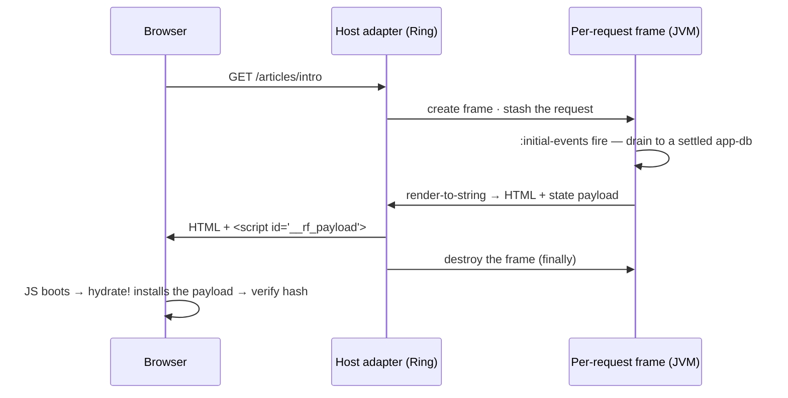

# The model

This page is the **SSR model** — why one app runs twice, what one request does end to
end, the payload allowlist, hydrate-then-verify, platform gating, and error
projection. Response headers, head metadata, and streaming each have their own page.

To *build* the lifecycle by hand (REPL → frame → payload → hydrate → Ring), use the
[tutorial](tutorial.md).

??? info "For JavaScript developers"

    Coming from Next.js or Remix? Keep first-paint HTML, loaders, form actions,
    streaming — drop the separate server layer. A "loader" is ordinary events in a
    per-request frame. Streaming is one hiccup marker. Full map:
    [Coming from Next.js](coming-from-nextjs.md).

!!! note "Optional artefact"

    Require `re-frame.ssr` once at boot (Maven `day8/re-frame2-ssr`; Ring adapter
    `day8/re-frame2-ssr-ring`). Forget the require and the first `render-to-string` /
    `reg-head` / related call throws `:rf.error/ssr-artefact-missing`.

## Why the same code runs on a JVM

SSR is hard in most stacks because the app is entangled with the browser: `window`, `document`, side effects firing in the middle of render. re-frame2 never had that entanglement — and not because of SSR. Three properties were already there for testing, replay, and observability; SSR falls out of them:

- **Event handlers are pure.** An [event](../core/glossary.md#event) is an inert "something happened" fact; its [handler](../core/glossary.md#event-handler) is `(coeffects, event) → effect map`. No `window`, no lifecycle. A JVM runs them fine.
- **Subscriptions are pure derivations.** State in, value out — nodes on [the derivation graph](../core/glossary.md#the-derivation-graph), rooted at app-db.
- **The render-tree is data.** [Hiccup](../core/glossary.md#hiccup) is nested vectors and maps, and [`render-to-string`](glossary.md#render-to-string) is a pure function from hiccup to an HTML string — no React, no DOM, no JS runtime.

So the question "can this code run on the server?" is answered once, structurally — yes, all of it, because none of it can reach the browser directly. The only genuinely one-sided code is impure work (a `localStorage` write, a focus trap), and that is declared, not branched around — [`:platforms`](#platforms--one-handler-gated-per-runtime), below.

??? info "For JavaScript developers"

    In a typical Next.js codebase the same component renders on both sides, but you litter it with `typeof window === 'undefined'` guards because the *component itself* is entangled with the browser. Here the "does this run on the server?" question never reaches your components at all.

## A request, start to finish

One request, from arrival to teardown. The host adapter runs all of it for you; hold this shape and every section below slots into it:



In words:

1. An HTTP request arrives. The host adapter creates a **frame for this request** and stashes the request map where handlers can read it.
2. The frame's `:initial-events` fire in order: read the session, set the route, start data fetches.
3. The runtime **drains**: it keeps processing events — and every event those events dispatch — until the queue settles and app-db stops changing (the [run-to-completion](../core/glossary.md#drain--run-to-completion) guarantee). The settled state is what gets rendered, never a half-loaded intermediate.
4. The root view renders to hiccup; `render-to-string` turns it into HTML.
5. The server ships the HTML **plus** a serialised state payload.
6. The client boots: `ssr/hydrate!` installs the payload (dispatches `:rf/hydrate`) *before* the first render, then the substrate **hydrates** the existing DOM (React's `hydrateRoot`, via the adapter). Because the first render matches the server's HTML, the DOM is adopted, not replaced.
7. The per-request frame is destroyed — in a `finally`, on every exit path.

Steps 2–4 run the handlers, subs, and views you already wrote; there's no separate "server code" to keep in sync with the client. And the per-request frame is *exactly* the frame from [Frames: isolated worlds](../core/frames.md) — no SSR-only variant.

!!! note "Why this matters"

    Because each request gets its own frame, a hundred concurrent requests are a hundred isolated [app-dbs](../core/glossary.md#app-db) that cannot see, race, or corrupt one another. The isolation that made frames good for testing is the same thing that makes them safe under server load — request isolation comes free, not as a bolted-on server feature.

## The simplest server

Wire the Ring adapter once. It owns the whole lifecycle above — frame create, drain, render, payload, response, teardown:

```clojure
(require '[ring.adapter.jetty :as jetty]
         '[re-frame.ssr.ring  :as ssr-ring])

(def handler
  (ssr-ring/ssr-handler
    {:initial-events [[:rf/server-init]]
     :root-view      [(rf/view :app/root)]
     :payload        [:articles :session-user]}))   ;; allowlist of app-db keys to ship

(jetty/run-jetty handler {:port 3000 :join? false})
```

Three opts do the work:

- **`:initial-events`** — the per-request setup vector, lowered verbatim into the per-request frame's `:initial-events` (step 2 of the lifecycle). It accepts a vector of events, or a `(fn [request] → initial-events-vector)` when the setup must be derived from the Ring request.
- **`:root-view`** — the render tree the adapter renders once the frame settles (step 4). Its head is a **callable** view reference — the Var `rf/reg-view` defs, or `(rf/view :id)`. A bare keyword head is an HTML element, never a view.
- **`:payload`** — the allowlist of top-level app-db keys to serialise for the client (step 5). It's a security boundary with its [own section below](#payload--the-fail-closed-allowlist).

That's a working SSR server. Everything below refines one step of the lifecycle. (The [tutorial](tutorial.md) builds this same lifecycle by hand first — `set-request!`, `make-frame`, `render-to-string`, `destroy-frame!` — which is the better order if the adapter's options don't yet read as a sequence you already know.)

??? info "From re-frame v1"

    v1 had no first-class SSR story — you reached for community libraries and hand-rolled the server/client split. Here it's one handler constructor over the *same* events and views the client runs. Also note: the old frame keys `:on-create` / `:initial-db` are retired; per-request setup is `:initial-events`, and supplying `:on-create` [fails loud](../core/glossary.md#fail-loud-not-silent) (`:rf.error/on-create-retired`).

### Reading the request

Handlers read the request the way they read any outside fact — through a declared [coeffect](../core/glossary.md#coeffect):

```clojure
;; Adapted from examples/capabilities/ssr/ssr/core.cljc
(rf/reg-event :rf/server-init
  {:platforms        #{:server}
   :rf.cofx/requires [:rf.server/request]}
  (fn [{:keys [db rf.server/request]} _]
    {:db db
     :fx [[:dispatch [:rf.route/handle-url-change (:uri request)]]
          [:rf.http/managed {:request    {:method :get :url "/api/articles"}
                             :decode     :json
                             :on-success [:articles/loaded]}]]}))
```

Declare `:rf.cofx/requires [:rf.server/request]` once, and the request map arrives flat under `:rf.server/request` — `:uri`, `:request-method`, `:headers`, `:query-params`, `:form-params`, `:session`, `:cookies`. The `[:rf.route/handle-url-change ...]` dispatch hands the URL to the same [routing](../routing/concepts.md) machinery the client uses, so the route resolves through the code you already trust.

!!! note "`:rf/server-init` is a reserved name you fill in"

    `:rf/server-init` is a pattern-reserved name the framework documents and you supply the body for. It is not licence to register your own events under the reserved `:rf/*` root.

One rule governs this coeffect, and it's worth stating plainly before the fine print: **use the request for decisions, but when a request-derived fact needs to live in app-db, put that fact on an event's payload rather than copying it from the ambient read.** The handler above obeys it — the URI it reads lands on the `[:rf.route/handle-url-change …]` event, so the value is recorded with the dispatch. The tempting shortcut it avoids is a direct copy into durable state, `(assoc db :session-user (-> request :session :user))`. Why that's a replay hole, and the two legal shapes for durable request-derived facts:

??? note "Why a durable write must be recorded — and how to fix it"

    [Time-travel](../core/observability.md) replays a run only if every input a handler used was captured. The request coeffect is the exception: like `localStorage` or the wall clock, it reads a live per-request slot and its value is **never recorded** — an *[ambient](../core/glossary.md#recordable-vs-ambient-coeffects)* coeffect, not a *recordable* one stamped onto the [event envelope](../core/glossary.md#event-envelope).

    An ambient read is fine for a **non-durable** decision (branch on `:request-method`, peek at a header to pick a code path). It is **not** fine for a value you fold into durable state: on replay the framework re-runs the live supplier rather than re-presenting the value the recorded run saw — and after the per-request frame is torn down, that supplier reads `nil`. So `(assoc db :session-user (-> request :session :user))` is a durable write whose input was never recorded, and a replay reconstructs a different app-db.

    The fix is to make the durable fact **recordable** — move the sanitised projection (never the whole request map, which carries `Cookie` / `Authorization` / raw bodies) onto the dispatch itself. Two shapes are legal:

    ```clojure
    ;; (a) ride the derived fact in on the event payload — recorded as part of :event.
    ;;     The host computes the projection at the boundary and dispatches it:
    ;;     :initial-events [[:auth/server-init {:user (extract-user request)}]]
    (rf/reg-event :auth/server-init
      {:platforms #{:server}}
      (fn [{:keys [db]} [_ {:keys [user]}]]
        {:db (assoc db :auth/user user)}))           ;; durable write, recorded input

    ;; (b) declare a provided recordable cofx the host stamps onto the boot token.
    ;;     A record missing it fails LOUD with :rf.error/missing-required-cofx,
    ;;     never a silent re-read of the host.
    (rf/reg-cofx :auth.session/user {:recordable? true :provided? true} ...)
    ```

    The whole request map must **never** ride the causal token — recording a secret makes it durable, not safe. Stamp only the sanitised derived projection, and keep `:rf.server/request` for the reads that don't fold into durable state.

### `:payload` — the fail-closed allowlist

`:payload` decides what crosses the wire to the client, and — this is the important word — it **fails closed**. A vector is an allowlist of top-level app-db keys; everything else stays on the server, *including keys you haven't written yet*. Add a `:secrets/api-token` to app-db next year and forget to update the allowlist, and the worst that happens is it doesn't reach the client.

Forget to set `:payload` at all and you get a loud error at boot (`:rf.error/ssr-missing-payload-policy`) — not a quiet leak on the first request. If you genuinely want to ship the whole app-db, you say so out loud with the explicit keyword `:rf.ssr.payload/whole-app-db`.

!!! note "Why this matters"

    A *denylist* ("ship everything except these") was considered and rejected on purpose: it leaks every new server-only key the instant you introduce one, which is exactly the bug an allowlist exists to prevent. This is [fail-closed](../core/glossary.md#fail-loud-not-silent) at a security boundary — the framework would rather stop you cold at boot than surprise you in production.

??? note "The three boot-time payload errors, kept distinct"

    The allowlist accepts any sequential of keywords — a literal vector is canonical, but a computed `(filterv …)` or `(keep …)` works too. Three boot-time errors keep three different mistakes distinct, so you can tell them apart at construction time:

    - an **empty** allowlist (`[]`) falls into the missing-policy bucket (`:rf.error/ssr-missing-payload-policy`) — shipping zero keys is almost certainly a slip, not intent;
    - an **unknown** policy keyword surfaces as `:rf.error/ssr-unknown-payload-policy`;
    - a **string typo for a keyword** — `["public/articles"]` instead of `[:public/articles]` — fails loud as `:rf.error/ssr-malformed-payload-allowlist` (carrying the offending entries under `:bad-entries`) rather than silently shipping a wrong slice.

    A **set** is rejected on purpose; the allowlist is an *ordered* key selection, not a set. The selector is collection-vs-keyword — a sequential can never be confused with the whole-app-db keyword — so there's nothing to arbitrate.

The same constructor accepts the rest of the lifecycle opts: the two error opts (`:error-view`, `:on-error`, [covered below](#when-the-server-throws)) and the caller-trusted shell hooks for bespoke head/body fragments (`:head`, `:body-end`, `:script-src`, `:app-element-id`).

## The client side: hydrate, then verify

The client's job is to land in the state the server finished in, without redoing the work. What it has to work with is the **payload** — the last thing the server shipped, sitting in the page as a `<script id="__rf_payload">` of EDN:

```clojure
{:rf/version     1                ;; pattern-protocol version (deploy-drift check, below)
 :rf/app-db      {…}              ;; your state, filtered by the allowlist
 :rf/runtime-db  {…}              ;; the framework's serialisable slice — the route, machine snapshots
 :rf/render-hash "a3f29c01"}      ;; a structural fingerprint of the server's render tree
```

[`ssr/hydrate!`](glossary.md#hydration) (from `re-frame.ssr`) consumes it in three steps, in a mandated order: **read** the embedded payload, **hydrate** — dispatch `[:rf/hydrate payload]` *before* the first render — and **verify** the render-tree hash against the server's:

```clojure
;; Adapted from examples/capabilities/ssr/ssr/core.cljc — requires, alongside rf and ssr:
;;   [reagent.dom.client :as rdc]  [re-frame.adapter.reagent :as reagent-adapter]
(defn ^:export run []
  (rf/init! reagent-adapter/adapter)          ;; installs the adapter — creates no frame
  (rf/make-frame {:id :app :platform :client})
  (let [el      (js/document.getElementById "app")
        payload (ssr/hydrate! {:frame          :app
                               :render-tree-fn (fn [] ((rf/view :app/root)))})
        tree    [rf/frame-provider {:frame :app} [(rf/view :app/root)]]]
    (if payload
      ;; Server-rendered: ADOPT the existing DOM. `hydrate-root` reconciles
      ;; React against the server markup — same nodes, listeners attached, no
      ;; re-paint. (`create-root` + `render` would throw the server HTML away.)
      (rdc/hydrate-root el tree)
      ;; No payload script — a client-only first load. Fresh root, fresh render.
      (do
        (rf/dispatch-sync [:app/client-bootstrap] {:frame :app})
        (rdc/render (rdc/create-root el) tree)))))
```

`hydrate!` does the **state** half — read, install, verify — and returns the payload
it applied (or `nil`). It deliberately does *not* touch the DOM mount. Adopting the
server's painted DOM is the **substrate's** job and a separate call: hand the existing
container to the adapter's `hydrate-root` (React's `hydrateRoot`), *not* `create-root`
+ `render`. The latter discards the server markup and mounts fresh — correct only for
the no-payload, client-only branch.

Two rules to hold onto:

- **The hydration target is carried, never guessed.** `:frame` is required, and the *same* frame goes to `hydrate!` and the root `frame-provider {:frame …}`. That's [frame identity is carried, not found](../core/glossary.md#frame-identity-is-carried-not-found), applied at boot. An absent `:frame` raises `:rf.error/no-frame-context`; the runtime never invents a default.
- **Hydration replaces; the server is authoritative.** `:rf/hydrate` installs the server's [app-db](../core/glossary.md#app-db) *and* its serialisable [runtime-db](../core/glossary.md#runtime-db) slice in one atomic step — [both partitions](../core/glossary.md#the-two-partitions) at once — replacing whatever the client pre-seeded. A malformed payload is rejected wholesale (fail-closed); a missing one just means a normal client-only load — the `when-not` branch above.

??? note "Replace-not-merge, frame-id evidence, and the malformed-payload rules"

    **Why replace, not merge.** The merge policy is locked to *replace the whole frame-state* (app-db **and** the serialisable runtime-db projection) because a defaulting merge would bury "which side won?" bugs at every key. If you need client-only state to survive hydration, the customisation point is *re-registering* `:rf/hydrate` with your own explicit merge — you own the order and the semantics.

    **The payload is untrusted transport input.** A non-map payload, or a present-but-not-a-map app-db / runtime-db slice, is rejected wholesale (`:rf.error/malformed-hydration-payload`) and the client's existing state is left untouched. A *wholly absent* slice is not malformed — it's the documented client-only first-load fallback.

    **`:rf/frame-id` is evidence, not a target.** The payload may carry the frame id the *server* rendered under. It's validation evidence: if present and it disagrees with the `:frame` you passed, hydration fails closed with `:rf.error/hydration-frame-id-mismatch` rather than installing the server's slice into the wrong frame. If absent — the common case, since the server renders under a per-request frame the client can't name ahead of time — your explicit `:frame` just stands.

??? info "Coming from React?"

    This is `hydrateRoot` with the gloss removed. React hydrates by walking the DOM and reattaching listeners, and trusts that your component re-renders the same tree. Here the server's *state* rides along explicitly in the payload, `:rf/hydrate` installs it before the first render, and then the substrate [adapter](../core/glossary.md#adapter) attaches listeners to the existing DOM. You never re-fetch on the client to "catch up" — the state the server computed is already in app-db.

Server state declared as a [resource](../resources/glossary.md#resource) makes the round trip too. The server preloads it, the payload carries the entries, and a fresh hydrated entry renders immediately without firing a duplicate fetch — see the [resources SSR example](../../examples/capabilities/ssr/resources_ssr).

A resource a route declares **blocking** does more than ride the payload — it gives the server a *wait point before render*. The runtime drains the route's blocking resources until they settle, **then** renders, so the HTML never captures a half-loaded `:loading` skeleton for data the server was always going to have. Non-blocking route resources don't hold up the render: whatever's settled at render time serialises, and anything still in flight refetches on the client.

??? note "The render budget"

    The wait has a deadline, because a server has one render moment. A blocking fetch that hangs past the render budget settles as a structured first-load failure — the resource enters `:error` with `{:kind :rf.http/timeout :reason :ssr-blocking-timeout}`, so the view renders a clean error state rather than a hung page — and the runtime records `:rf.error/resource-ssr-blocking-timeout`. A blocking resource that can't resolve in time fails closed instead of stalling the request.

### Deploy-drift checks come along for free

The payload also carries a couple of stamps that catch the classic "the server and the client are running different code" bug. As part of `:rf/hydrate`'s effects, the framework fires two client-only compatibility checks, and both are **best-effort** — they emit a trace and let hydration proceed; they never throw and never block the page:

- **`:rf.ssr/check-version`** compares the payload's pattern-protocol version (`:rf/version`, an integer) against the client's. A mismatch emits a `:rf.ssr/version-mismatch` trace — your "the server bundle is a deploy ahead of the client" alarm.
- **`:rf.ssr/check-schema-digest`** (fired only when the payload carries a digest) hashes the client's registered `app-schema` set and compares it to the server's. A mismatch emits `:rf.ssr/schema-digest-mismatch` — the server is validating against a different schema set than the client's bundle.

The version check always has a client-side value to compare against — it reads the SSR artefact's compiled-in pattern-protocol constant, the same fact the server stamped, so it never skips. The schema-digest check is the one that can come up empty: when the client's `app-schema` digest isn't available (the schemas artefact isn't on the classpath), it emits `:rf.ssr/compatibility-check-skipped` and no-ops rather than crashing. Degraded-but-running is the deliberate posture: a version stamp should never be what stops a page from loading. These three categories ride the dev trace surface, so wire an [observability](../core/observability.md) listener on them if you want deploy-drift visibility in CI.

## When the renders disagree

Sometimes the client's first render *doesn't* match the server's HTML. This is the classic SSR bug — a [hydration mismatch](glossary.md#hydration-mismatch) — and in most stacks it produces a content flash and a console warning nobody reads. The causes are almost always mundane: a date rendered in two timezones, a bit of state the server set but the client never read, an unordered map that happens to serialise in two different orders.

re-frame2 treats it as a structured, first-class failure. The server embeds a structural hash of its render-tree (the `:rf/render-hash` you saw in the payload); the client computes the same hash on its own first render and compares. On disagreement, a structured [trace event](../core/glossary.md#trace-event) fires:

```clojure
{:operation :rf.ssr/hydration-mismatch
 :op-type   :error
 :tags      {:server-hash "a3f29c01"          ;; the tree the server shipped…
             :client-hash "0b77e4d2"          ;; …vs the client's first render
             :frame       :app
             :failing-id  :rf/hydrate
             :recovery    :warned-and-replaced}}
```

The default recovery is **warn and replace**: log it, render the client's view, so the user never sees a broken page. Per-frame strict mode (`:ssr {:on-mismatch :hard-error}`) escalates it to a thrown structured exception for dev and CI. (The [tutorial's Step 5](tutorial.md) trips this on purpose, which is the fastest way to internalise it.)

Be clear about what the hash buys you: it proves *that* the renders diverged — on which frame, and what the runtime did about it — not *which node*. Locating the node is a tree-diff, and that's deliberately left to tooling: the trace carries an optional `:first-diff-path` tag (a path into the render tree, e.g. `[:body 0 :children 0]`) that a host running its own diff supplies through [`verify-hydration!`](../api/re-frame.ssr.md)'s opts; the bundled runtime emits the hashes and leaves the slot empty. What the detector itself guarantees is cheap, always-on, and loud: a mismatch is never a warning you scroll past.

!!! note "The mismatch trace is dev-only — instrument deliberately for production"

    That trace rides the dev trace surface, so it's [elided](../core/glossary.md#elide) from production client builds like the rest of the trace stream. The hash comparison itself still runs (disable it with `:ssr {:detect-mismatch? false}` to reclaim the first-render work). To watch for drift in production you instrument deliberately: the strict-mode exception carries both hashes, so the boot site can catch it around `hydrate!` and ship it through your [observability](../core/observability.md) sinks.

??? note "The hash is structural, not textual"

    Byte-for-byte HTML equality is *not* required: different serialisers emit semantically-equivalent strings that differ in attribute order or whitespace. The contract is structural — the FNV-1a hash runs over a canonical-EDN traversal of the render-tree (depth-first, attribute maps in sorted-key order, nil pruned). FNV-1a is fast and carries zero platform dependencies (no `crypto`). The hash is a tamper-evident structural marker between *one* server and *one* client of the same build, not a security primitive.

## `:platforms` — one handler, gated per runtime

A real init flow mixes work that's fine on the server (fetching over HTTP) with work that's meaningless there (writing `localStorage`, which the JVM has never heard of). You don't branch in handler bodies. Instead, the [effect](../core/glossary.md#effect) itself declares where it's allowed to run:

```clojure
;; Adapted from examples/capabilities/ssr/ssr/core.cljc
(rf/reg-fx :auth.session/store
  {:doc       "Persist a session token in localStorage."
   :platforms #{:client}}              ;; server-side dispatches skip this
  (fn [_ {:keys [token]}]
    #?(:cljs (.setItem js/localStorage "auth/token" token))))
```

The default is universal (`#{:server :client}`). When a server-side drain meets a
`#{:client}` effect, the resolver skips it and emits a `:rf.fx/skipped-on-platform`
trace — the handler never learns which runtime it's on. Zero
`if (typeof window === 'undefined')`.

The same gate on inputs: `:rf.server/request` is `#{:server}`, so after hydration
the client simply doesn't receive that coeffect (`:rf.cofx/skipped-on-platform`).
A setup handler that reads the request server-side doesn't blow up client-side.

??? info "For JavaScript developers"

    Declarative answer to scattered `typeof window` guards: tag the *effect* once,
    not every import. No `if (isServer)` in business logic.

## When the server throws

A server-side exception must never reach the wire as a stack trace — crawlers and unauthenticated users would read your internals. So a thrown handler, fx, sub, or render-time view is run through a **registered error projector** that maps the rich internal trace to a sanitised, client-safe `:rf/public-error` shape:

```clojure
{:status 500 :code :internal-error :message "Something went wrong" :retryable? false}
```

The framework ships a default projector that maps the obvious cases — an unroutable URL to `404 :not-found`, a *client-surface* schema-validation failure to `400 :bad-request`, anything else to `500 :internal-error`. Both of those specific arms fire on a release server as well as in dev; the one category that reaches the projector in dev alone is noted under **What reaches the projector in a release build** below. You register your own projector to add app conventions — mapping *thrown* auth failures to `401`/`403`, say:

```clojure
(rf/reg-error-projector :myapp/public-error
  {:doc "Project internal error traces to public response shapes."}
  (fn [trace-event]
    (case (:operation trace-event)
      :auth/unauthorised {:status 401 :code :unauthorised :message "Sign in"  :retryable? false}
      {:status 500 :code :internal-error :message "Something went wrong" :retryable? false})))
```

!!! note "Route-level refusal is not a projector concern"

    A projector maps a **thrown** error. A route whose `:can-enter` guard simply
    *refuses* throws nothing — it is the app working correctly — so the runtime
    stamps `403` on the response directly, before your `:rf.route/entry-denied`
    handler drains. Nothing for you to project; see
    [the entry-denial `403` floor](response.md#a-status-the-framework-writes-for-you-the-entry-denial-403).

The wiring facts, one at a time:

- **The projector is named per frame** — `:ssr {:public-error-id :myapp/public-error}` on the frame's metadata — so a server-rendering frame and a dev-tooling frame in one process can run different ones.
- **4xx keeps your app; 5xx gets the error page.** Classification is by the *projected status*. A projected **4xx** (a routing miss, an auth `401`/`403`, a `400` your own handler produced) is the app *working correctly* — it renders your own not-found / bad-request UI and ships the hydration payload, so the client hydrates into a working SPA. A projected **5xx** means the app broke mid-drain and app-db is in a partial state — so the framework discards the half-drained body and hydration payload and renders your `:error-view` (or the default template) instead of presenting a half-populated page as if real. An app-set `500` with no error projected stays on your own page (status alone isn't a projected error).
- **The error page cannot leak.** It's a registered view that receives the *public* shape only; the internal trace never reaches it, so there's nothing to leak. Only exactly the four public keys cross the boundary — a projector that returns an out-of-range status or any extra key (even its own `:details`) takes the locked generic-500 fallback.
- **What reaches the projector in a release build.** Both of the specific arms above do. The `404` rides `:rf.error/no-such-handler` — an unroutable URL — and that category is always-on. The `400` rides `:rf.error/schema-validation-failure` from the `:rf.schema/at-boundary` interceptor: an ordinary registration diagnostic is a development-build assertion ([Spec 010 §Production builds](../../spec/010-Schemas.md#production-builds)), but a check the framework relies on to keep a promise of its own is ungated in every build — the boundary interceptor is one of those, and the one whose failures reach the projector — and since the rejection also fans an always-on record the projector really is handed something to map. Note that the boundary interceptor validates against the handler's *own* `:schema`, the same declaration that elides at step 1: what survives is the check the framework runs at the ingress it promised to guard, not a separate framework-authored schema. So a handler registered `{:interceptors [:rf.schema/at-boundary]}` answers a malformed request body with `400` under `-Dre-frame.debug=false`, not a silent `200` — which is what [RFC 9110 §15.5.1](https://www.rfc-editor.org/rfc/rfc9110#section-15.5.1) asks of a refused payload. Two categories do *not* reach the projector on a release server: `:rf.error/no-such-route` (handing `route-url` a route id nobody registered — caller misuse, not hostile input, so it stays on the dev-gated trace stream), and every *other* `:where` surface of `:rf.error/schema-validation-failure`, which are the elided development assertions. A validation rule that needs to shape the *response* — field-level errors, submitted values preserved — still belongs in the handler body with `[:rf.server/set-status 400]`; the projector's arm gives you the status, not the page. [Pattern-FormAction §Validation is the handler's job](../../spec/Pattern-FormAction.md#validation-is-the-handlers-job) has the worked shape.
- **Dev builds can carry detail.** With `:ssr {:dev-error-detail? true}` the public shape gains an extra `:details` key holding the full trace; in prod that key is simply absent. This knob governs how much a projected error *says*; it is the bullet above, not this one, that governs whether an error gets projected at all.
- **Monitoring keeps the rich trace.** Projection governs the HTTP boundary only — the full trace still flows unchanged to your sinks and the always-on [error records](../core/glossary.md#error-record) your listeners depend on.

The full error story lives in the [error dossier](../core/errors.md).

!!! note "Why this matters — two error opts, two jobs"

    The Ring handler exposes `:error-view` *and* `:on-error`, and a robust deployment wires both. `:error-view` is the **projected page** for a **5xx** server fault the projector caught (a drain-time exception, a render-time throw) — it takes the sanitised `:rf/public-error` map and renders hiccup (a projected 4xx keeps your own app body instead). `:on-error` is the **transport net** — it fires for a Ring-layer failure the projector can't see (per-request frame setup throw, a header-materialise throw), takes the raw `(request throwable)`, and returns a verbatim Ring response. Both are bug-contained, and `:error-view` is one-way: a buggy `:error-view` — whether it throws OR depends on a reactive sub that recovers to `nil` — falls back once to the default template without re-projecting; a buggy `:on-error` falls back to the locked topology-safe 500 — neither can bypass the error boundary.

## Two patterns, in brief

<a id="two-patterns-in-brief"></a>

Two compositions of these primitives are common enough to name. Conventions, not new
machinery:

- **The SSR loader** — N parallel data fetches before render. A
  [machine](../machines/glossary.md#machine) from `:initial-events` fans out with
  `:spawn-all`, joins, writes slices — wall-clock cost is the *max* of the fetches,
  not the *sum*. The same machine drives client-nav fetch; only the spawn site moves.
  A route [loader](../routing/glossary.md#loader) compiles to this server-side.
- **The form action** — form POSTs that work before JS loads. Real `method="POST"` +
  `action`; the server routes that POST to the *same* event the client's
  `:on-submit` dispatches. Success often answers with
  `[:rf.server/redirect {:status 303 …}]` ([response control](response.md)).

## What you give up

SSR isn't free of rules:

- **Views must be deterministic given the state.** `(js/Date.)` / two timezones →
  [mismatch](#when-the-renders-disagree). Put time in app-db at init.
- **No render-time side effects.** The tree is a function of state.
- **Browser-only work waits for hydration.** Focus traps, observers —
  `:platforms #{:client}` after the client takes over.

Enforced by the platform gate and caught by the hash.

## Troubleshooting

| Symptom | Error / behaviour | Fix |
|---|---|---|
| First `render-to-string` / `reg-head` throws at boot | `:rf.error/ssr-artefact-missing` | Require `re-frame.ssr` (`day8/re-frame2-ssr`) |
| `ssr-handler` construction throws | `:rf.error/ssr-missing-payload-policy` (also empty `[]`) | Set `:payload` allowlist, or `:rf.ssr.payload/whole-app-db` |
| Unknown / string allowlist entries | `:rf.error/ssr-unknown-payload-policy` or `:rf.error/ssr-malformed-payload-allowlist` | Keywords only; sequential, not a set |
| `hydrate!` without `:frame` | `:rf.error/no-frame-context` | Pass the same `:frame` as `frame-provider` |
| Bad payload shape | `:rf.error/malformed-hydration-payload` — client state left untouched | Fix the server payload; never ship a non-map |
| Payload frame id disagrees | `:rf.error/hydration-frame-id-mismatch` | Treat `:rf/frame-id` as evidence, not a target |
| Client first render ≠ server HTML | `:rf.ssr/hydration-mismatch` trace; default warn-and-replace | Deterministic views; `:ssr {:on-mismatch :hard-error}` in CI |
| `#{:client}` fx during JVM drain | `:rf.fx/skipped-on-platform` trace — skipped, not thrown | Expected; declare `:platforms` on the fx/cofx |
| Blocking resource hangs past budget | `:rf.error/resource-ssr-blocking-timeout` — resource enters `:error` | Fix the fetch or accept the structured first-load failure |
| Retired frame boot key | `:rf.error/on-create-retired` | Use `:initial-events`, not `:on-create` |

## A complete loop (server + client)

Copy-paste shape. The adapter owns create / drain / render / payload / teardown;
the client installs the payload before the first paint, then `hydrate-root` adopts
the server's DOM.

```clojure
(ns app.ssr
  (:require [re-frame.core :as rf]
            [re-frame.ssr :as ssr]
            [re-frame.ssr.ring :as ssr-ring]
            [re-frame.http.managed]
            #?(:cljs [reagent.dom.client :as rdc])
            #?(:cljs [re-frame.adapter.reagent :as reagent-adapter])
            #?(:clj  [ring.adapter.jetty :as jetty])))

(rf/reg-event :rf/server-init
  {:platforms        #{:server}
   :rf.cofx/requires [:rf.server/request]}
  (fn [{:keys [db rf.server/request]} _]
    {:db db
     :fx [[:dispatch [:rf.route/handle-url-change (:uri request)]]
          [:rf.http/managed
           {:request    {:method :get :url "/api/articles"}
            :decode     :json
            :on-success [:articles/loaded]}]]}))

#?(:clj
   (def handler
     (ssr-ring/ssr-handler
       {:initial-events [[:rf/server-init]]
        :root-view      [(rf/view :app/root)]                 ;; hiccup vector or 0-arity fn
        :payload        [:articles :session-user]})))  ;; required allowlist

#?(:cljs
   (defn ^:export run []
     (rf/init! reagent-adapter/adapter)
     (rf/make-frame {:id :app :platform :client})
     (let [el      (js/document.getElementById "app")
           payload (ssr/hydrate! {:frame          :app
                                  :render-tree-fn (fn [] ((rf/view :app/root)))})
           tree    [rf/frame-provider {:frame :app} [(rf/view :app/root)]]]
       (if payload
         (rdc/hydrate-root el tree)                      ;; server-rendered: adopt the DOM
         (do (rf/dispatch-sync [:app/client-bootstrap] {:frame :app})
             (rdc/render (rdc/create-root el) tree)))))) ;; client-only: fresh root
```

Same `:frame` on `hydrate!` and `frame-provider`. Full walk-through:
[tutorial](tutorial.md). APIs: [re-frame.ssr](../api/re-frame.ssr.md),
[re-frame.ssr.ring](../api/re-frame.ssr.ring.md).

## Advanced

<a id="when-the-table-grows"></a>
<a id="controlling-the-response--rfserver"></a>
<a id="head-metadata----opengraph-json-ld"></a>
<a id="streaming-rfsuspense-boundary"></a>
<a id="streaming-ssrboundary"></a>

Same model, more keys — open a page only when a need appears:

| Need | Page |
|---|---|
| Status, headers, cookies, redirects | [Control the response](response.md) |
| `<title>` / OpenGraph / JSON-LD | [Head metadata](head.md) |
| First-byte shell + slow regions | [Streaming](streaming.md) |
| Prove renders and boot guards | [Testing](testing.md) |
| Runnable trees in the repo | [Examples](examples.md) |
