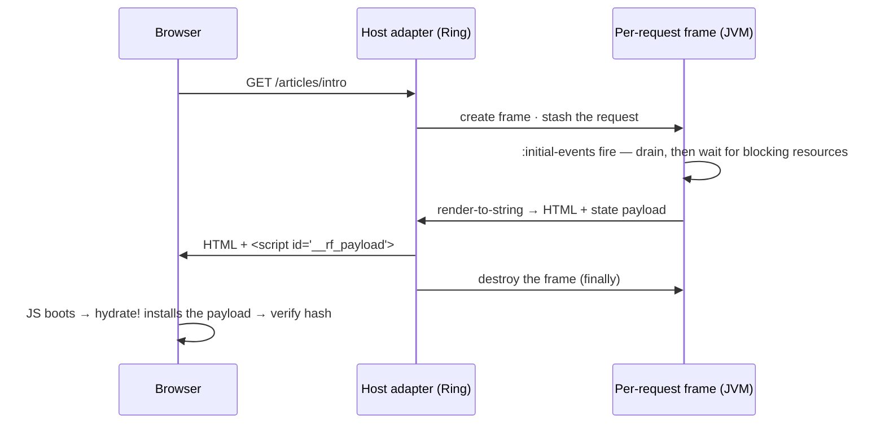

# The model

Server-side rendering in re-frame2 runs your app's events, subscriptions and
views on the JVM, once per request, in a frame created for that request. The
server ships the HTML together with the state it rendered from, and the browser
installs that state and adopts the HTML instead of rendering from scratch. This
page explains how those parts fit together; the [tutorial](tutorial.md) builds
them step by step.

<a id="when-the-table-grows"></a>
<a id="controlling-the-response--rfserver"></a>
<a id="head-metadata----opengraph-json-ld"></a>
<a id="streaming-rfsuspense-boundary"></a>
<a id="streaming-ssrboundary"></a>

Status codes, headers and redirects are on [Control the response](response.md),
`<title>` and social metadata on [Head metadata](head.md), and progressive
delivery on [Streaming](streaming.md).

??? info "For JavaScript developers"

    Coming from Next.js or Remix? You keep first-paint HTML, loaders, form
    actions and streaming, without a separate server layer. A "loader" is
    ordinary events in a per-request frame, and streaming is one hiccup marker.
    Full map: [Coming from Next.js](coming-from-nextjs.md).

!!! note "Optional artefact"

    Require `re-frame.ssr` once at boot (Maven `day8/re-frame2-ssr`; Ring adapter
    `day8/re-frame2-ssr-ring`). Forget the require and the first `rf/reg-head` or
    `rf/reg-error-projector` call throws `:rf.error/ssr-artefact-missing`.

## Why the same code runs on a JVM

A render uses three kinds of code, and none of them touches the browser:

- **Event handlers are pure.** An [event](../core/glossary.md#event) is a fact; its [handler](../core/glossary.md#event-handler) is `(coeffects, event) → effect map`. No `window`, no lifecycle, so a JVM runs it.
- **Subscriptions are pure derivations.** State in, value out — nodes on [the derivation graph](../core/glossary.md#the-derivation-graph), rooted at app-db.
- **The render tree is data.** [Hiccup](../core/glossary.md#hiccup) is nested vectors and maps, and [`render-to-string`](glossary.md#render-to-string) is a pure function from hiccup to an HTML string. It needs no React, no DOM and no JS runtime.

So every handler, subscription and view you have already written can run on the server. Work that needs the browser — a `localStorage` write, a focus trap — is an effect you declare as client-only, rather than a branch in your code ([`:platforms`](#platforms--one-handler-gated-per-runtime), below).

??? info "For JavaScript developers"

    In a typical Next.js codebase the same component renders on both sides, and you guard it with `typeof window === 'undefined'` because the component itself touches the browser. Here your components never ask that question.

## A request, start to finish

The host adapter runs this whole sequence for you. Every section below refines one step of it:



1. An HTTP request arrives. The host adapter creates a **frame for this request** and stashes the request map where handlers can read it.
2. The frame's `:initial-events` fire in order: read the session, set the route. Entering the route starts its [resource](../resources/glossary.md#resource) loads.
3. The runtime **drains**: it processes events, and every event those events dispatch, until the queue settles (the [run-to-completion](../core/glossary.md#drain--run-to-completion) guarantee). Then it waits for the route's **blocking** resources to load. That is the only wait, so data the first render needs comes from a [blocking resource](#data-the-first-render-needs).
4. The root view renders to hiccup, and `render-to-string` turns it into HTML.
5. The server sends the HTML **plus** a serialised state payload.
6. The client boots. `ssr/hydrate!` installs the payload (it dispatches `:rf/hydrate`) *before* the first render, then the substrate **hydrates** the existing DOM (React's `hydrateRoot`, via the adapter). Because the first render matches the server's HTML, React adopts the DOM instead of replacing it.
7. The per-request frame is destroyed, in a `finally`, on every exit path.

Steps 2–4 run the handlers, subscriptions and views you already wrote. The per-request frame is an ordinary frame, exactly as in [Frames: isolated worlds](../core/frames.md), so a hundred concurrent requests are a hundred separate [app-dbs](../core/glossary.md#app-db) that cannot see or corrupt one another.

## The simplest server

Wire the Ring adapter once. It runs the whole lifecycle above — frame create, drain, render, payload, response, teardown:

```clojure
(require '[ring.adapter.jetty :as jetty]
         '[re-frame.core      :as rf]
         '[re-frame.ssr       :as ssr]
         '[re-frame.ssr.ring  :as ssr-ring])

(rf/init! ssr/adapter)                             ;; once, at boot: the server-side render adapter

(def handler
  (ssr-ring/ssr-handler
    {:initial-events [[:rf/server-init]]
     :root-view      (fn [] ((rf/view :app/root)))
     :payload        [:articles :session-user]}))   ;; allowlist of app-db keys to ship

(jetty/run-jetty handler {:port 3000 :join? false})
```

Three options do the work:

- **`:initial-events`** — the per-request setup, passed as the per-request frame's `:initial-events` (step 2). It takes a vector of events, or a `(fn [request] → initial-events-vector)` when the setup depends on the Ring request.
- **`:root-view`** — what the adapter renders once the frame settles (step 4). Use the fn form shown, with a root view that returns an element such as `[:main …]`: that is what lets the client [check its first render](#what-the-hash-covers) against the server's. The vector form `[(rf/view :app/root)]` renders the same HTML but ships no hash. The head of the tree must be a callable view reference — the Var `rf/reg-view` defines, or `(rf/view :id)`. A bare keyword head is an HTML element.
- **`:payload`** — the allowlist of top-level app-db keys to send to the client (step 5). It is a security boundary, covered [below](#payload--the-fail-closed-allowlist).

That is a working SSR server. The other options have defaults you rarely change; they are summarised under [Other handler options](#other-handler-options), and the [`ssr-handler`](../api/re-frame.ssr.ring.md#ssr-handler) reference lists every option with its errors. The [tutorial](tutorial.md) builds the same lifecycle by hand first — `set-request!`, `make-frame`, `render-to-string`, `destroy-frame!` — if you would rather see each step before the adapter runs them.

??? info "From re-frame v1"

    v1 had no built-in SSR; you used community libraries and split server and client code by hand. Here it's one handler over the same events and views the client runs. The frame keys `:on-create` / `:initial-db` are retired: per-request setup is `:initial-events`, and supplying `:on-create` [fails loud](../core/glossary.md#fail-loud-not-silent) with `:rf.error/on-create-retired`.

### Mounting in a Ring app

A real server also serves static files, an API and form posts. `ssr-middleware` takes the same options plus a `:match?` predicate. It sends the requests it matches to the SSR handler and everything else to the handler it wraps:

```clojure
(require '[clojure.string :as str]
         '[ring.middleware.params   :refer [wrap-params]]
         '[ring.middleware.cookies  :refer [wrap-cookies]]
         '[ring.middleware.session  :refer [wrap-session]]
         '[ring.middleware.resource :refer [wrap-resource]])

(def app
  (-> api-handler                                  ;; your own Ring handler for /api/…
      ((ssr-ring/ssr-middleware
         {:initial-events [[:rf/server-init]]
          :root-view      (fn [] ((rf/view :app/root)))
          :payload        [:articles :session-user]
          :match?         (fn [req] (and (#{:get :post} (:request-method req))
                                         (not (str/starts-with? (:uri req) "/api/"))))}))
      (wrap-resource "public")                     ;; /main.js and CSS never reach the renderer
      wrap-session
      wrap-cookies
      wrap-params))
```

`:match?` defaults to every GET request. Widen it, as here, when the SSR handler must also take a form POST ([the form action](#two-patterns-in-brief)).

The SSR handler passes the Ring request through unchanged and parses nothing itself. `:query-params` and `:form-params` exist only if `wrap-params` ran first, `:cookies` only after `wrap-cookies`, and `:session` only after `wrap-session`. Put that middleware outside the SSR handler, as above.

### Reading the request

Handlers read the request through a declared [coeffect](../core/glossary.md#coeffect), like any other outside fact:

```clojure
;; Adapted from examples/capabilities/ssr/ssr/core.cljc
(rf/reg-event :rf/server-init
  {:platforms        #{:server}
   :rf.cofx/requires [:rf.server/request]}
  (fn [{:keys [rf.server/request]} _]
    {:fx [[:dispatch [:rf.route/handle-url-change (:uri request)]]]}))
```

Declare `:rf.cofx/requires [:rf.server/request]` and the request map arrives under `:rf.server/request`: `:uri`, `:request-method`, `:headers`, and `:query-params`, `:form-params`, `:session` and `:cookies` as far as [your middleware](#mounting-in-a-ring-app) added them. The `[:rf.route/handle-url-change ...]` dispatch hands the URL to the same [routing](../routing/concepts.md) code the client uses. The page's data then comes from the route, as [blocking resources](#data-the-first-render-needs).

`:rf/server-init` is a name the framework reserves and you supply the body for. It does not license registering your own events under the `:rf/*` root.

Use the request for decisions. When a request-derived fact must live in app-db, put it on an event's payload instead of copying it from the request. The handler above does that: the URI it reads lands on the `[:rf.route/handle-url-change …]` event, so the value is recorded with the dispatch. The shortcut to avoid is `(assoc db :session-user (-> request :session :user))`, for the reason below.

??? note "Why a durable write must be recorded, and how to fix it"

    [Time-travel](../core/observability.md) replays a run only if every input a handler used was captured. The request coeffect, like `localStorage` or the wall clock, reads a live per-request slot and its value is **never recorded** — it is an *[ambient](../core/glossary.md#recordable-vs-ambient-coeffects)* coeffect, not a *recordable* one stamped onto the [event envelope](../core/glossary.md#event-envelope).

    An ambient read is fine for a **non-durable** decision: branch on `:request-method`, or check a header to pick a code path. It is not fine for a value you write into durable state. On replay the framework re-runs the live supplier instead of re-presenting the value the recorded run saw, and after the per-request frame is torn down that supplier reads `nil`. So `(assoc db :session-user (-> request :session :user))` is a durable write whose input was never recorded, and a replay reconstructs a different app-db.

    The fix is to make the fact **recordable** by putting a sanitised projection on the dispatch itself — never the whole request map, which carries `Cookie`, `Authorization` and raw bodies. Two shapes work:

    ```clojure
    ;; (a) pass the derived fact in the event payload — recorded as part of :event.
    ;;     The host computes the projection and dispatches it:
    ;;     :initial-events [[:auth/server-init {:user (extract-user request)}]]
    (rf/reg-event :auth/server-init
      {:platforms #{:server}}
      (fn [{:keys [db]} [_ {:keys [user]}]]
        {:db (assoc db :auth/user user)}))           ;; durable write, recorded input

    ;; (b) declare a provided recordable cofx the host stamps onto the boot token.
    ;;     A record missing it throws :rf.error/missing-required-cofx rather than
    ;;     silently re-reading the host.
    (rf/reg-cofx :auth.session/user {:recordable? true :provided? true} ...)
    ```

    Never record the whole request map: recording a secret makes it durable, not safe. Record only the sanitised projection, and keep `:rf.server/request` for reads that don't end up in durable state.

### Data the first render needs

The server renders once, so the data a page needs must be loaded before that render. Declare it as a route [resource](../resources/glossary.md#resource) with `:blocking? true`. The runtime waits for the route's blocking resources to settle and then renders, so the HTML never shows a `:loading` state for data the server was always going to have:

```clojure
;; cf. docs/resources/tutorial/02-server-data.md — needs the resources artefact
(rf/reg-resource :articles/one
  {:params-schema [:map [:id :string]]
   :scope         :rf.scope/global}
  (fn [{:keys [id]} _ctx]
    {:request {:method :get :url (str "/api/articles/" id)}
     :decode  :json}))

(rf/reg-route :articles/show
  {:params    [:map [:id :string]]
   :resources [{:resource  :articles/one
                :params    (fn [route] {:id (get-in route [:params :id])})
                :blocking? true}]}                 ;; the server waits for this before rendering
  "/articles/:id")
```

`:rf/server-init` hands the URL to routing, entering the route starts the resource, and the handler waits for it. Several blocking entries load in parallel, so the wait is the slowest fetch rather than the sum, and the same declaration drives the fetch on client navigation. This is the route's [loader](../routing/glossary.md#loader). Non-blocking route resources don't hold up the render: whatever has settled by render time is serialised, and anything still in flight refetches on the client.

Only blocking route resources are waited for. The drain after `:initial-events` covers synchronous work. A fetch those events start — an `:rf.http/managed` request, or one a route's `:on-match` events fire — is usually still in flight when the render begins, so the page renders without its data. For the same reason, don't build a loader as a [machine](../machines/glossary.md#machine) that fans out HTTP requests: the render would catch the machine still loading.

??? note "The render budget"

    The wait has a 5-second deadline. A blocking fetch that runs past it settles as a first-load failure: the resource enters `:error` with `{:kind :rf.http/timeout :reason :ssr-blocking-timeout}`, the view renders its error state instead of hanging the request, and the runtime records `:rf.error/resource-ssr-blocking-timeout`.

### `:payload` — the fail-closed allowlist

`:payload` decides what is sent to the client, and it **fails closed**. The vector is an allowlist of top-level app-db keys; every other key stays on the server, including keys you add later. Add a `:secrets/api-token` to app-db next year and forget the allowlist, and the token still stays on the server. A denylist would do the opposite and leak each new server-only key.

Leave `:payload` out and the handler throws `:rf.error/ssr-missing-payload-policy` when it is constructed, before any request is served. To ship the whole app-db, say so with the keyword `:rf.ssr.payload/whole-app-db`.

??? note "The three boot-time payload errors"

    The allowlist accepts any sequential of keywords. A literal vector is the usual form, but a computed `(filterv …)` or `(keep …)` works too. Three construction-time errors tell three mistakes apart:

    - an **empty** allowlist (`[]`) is treated as a missing policy (`:rf.error/ssr-missing-payload-policy`), because shipping zero keys is almost certainly a slip;
    - an **unknown** policy keyword throws `:rf.error/ssr-unknown-payload-policy`;
    - a **string instead of a keyword** — `["public/articles"]` for `[:public/articles]` — throws `:rf.error/ssr-malformed-payload-allowlist`, with the offending entries under `:bad-entries`.

    A **set** is rejected: the allowlist is an ordered key selection. Because the policy is either a sequential or a keyword, the two forms can't be confused.

#### Numbers that change on the way

The payload is printed as EDN on the JVM and read back by the browser, where every number is a double. Some JVM numbers would read back as a different value — an order id landing on its neighbour, money becoming a float — so the handler refuses them. A Long or BigInt past 2^53, a BigDecimal, a Ratio or a Float anywhere in the payload, map keys included, fails the request with `:rf.error/ssr-hydration-payload-invalid`, naming the path. The check runs in every build, because the failure depends on the data.

Convert those values before they reach an allowlisted key: send ids as strings and money as integer cents. Or leave the key off `:payload` if the client doesn't need it.

Values you have [classified](../core/how-to/keep-secrets-out-of-traces.md) as sensitive are redacted inside allowlisted keys; [Classified values inside the allowlist](#classified-values-inside-the-allowlist) covers the exceptions.

## The client side: hydrate, then verify

The client has to start in the state the server finished in, without redoing the work. It reads that state from the **payload**, an EDN `<script id="__rf_payload">` in the page:

```clojure
{:rf/version     1                ;; pattern-protocol version (deploy-drift check)
 :rf/app-db      {…}              ;; your state, filtered by the allowlist
 :rf/runtime-db  {…}              ;; the framework's serialisable slice — the route, machine snapshots
 :rf/render-hash "a3f29c01"}      ;; a structural fingerprint of the server's render tree
```

[`ssr/hydrate!`](glossary.md#hydration) handles it in three steps, in this order: **read** the payload, **install** it by dispatching `[:rf/hydrate payload]` *before* the first render, and **verify** the client's render-tree hash against the server's:

```clojure
;; The core of the client boot. Tutorial Step 4 has the whole `run` fn, and
;; A complete loop below has it in context. app-root is a
;; (reagent-adapter/client-root) created once with defonce.
(let [el      (js/document.getElementById "app")
      payload (ssr/hydrate! {:frame          :app
                             :render-tree-fn (fn [] ((rf/view :app/root)))})
      tree    [rf/frame-provider {:frame :app} [(rf/view :app/root)]]]
  (when-not payload                               ;; no payload: a client-only first load
    (rf/dispatch-sync [:app/client-bootstrap] {:frame :app}))
  ;; payload: adopt the server's DOM; no payload: mount a fresh root
  (reagent-adapter/render! app-root tree el {:hydrate? (some? payload)}))
```

`hydrate!` handles the **state** and returns the payload it applied, or `nil`. It does not touch the DOM. Adopting the server's DOM is a separate call to the adapter's `render!` with `{:hydrate? true}` (React's `hydrateRoot` underneath): React reconciles against the server markup, keeps the nodes and attaches listeners. Without that option the same call mounts a fresh root and discards the server markup, which is right only for the client-only branch. [Tutorial Step 4](tutorial.md#step-4--hydrate-on-the-client) builds this boot function step by step.

| `hydrate!` option | What it's for |
|---|---|
| `:frame` | Required. The frame to hydrate — the same one the root `frame-provider` names. |
| `:render-tree-fn` | A 0-arity fn returning the client's tree, called under `:frame` for the verify step. Pass it for Reagent and reagent-slim roots; omit it for UIx and Fresco roots, which report mismatches through React's own hydration. |
| `:payload` | The payload map, when you already have it. Omit it in the browser and `hydrate!` reads `__rf_payload` from the DOM. |
| `:element-id` | Read the payload from a script with a different id (default `"__rf_payload"`). |

Calling it twice for one frame with the same payload is harmless: the second call finds the state installed, skips the install and the verify, and returns the payload again. To ask "was this page server-rendered?" without booting anything, call `ssr/read-server-payload`, which returns the parsed payload or `nil`. The [`hydrate!`](../api/re-frame.ssr.md#hydrate) entry lists every option and error.

Two rules:

- **Name the frame.** `:frame` is required, and the same frame goes to `hydrate!` and to the root `frame-provider {:frame …}` ([frame identity is carried, not found](../core/glossary.md#frame-identity-is-carried-not-found)). An absent `:frame` raises `:rf.error/no-frame-context`; the runtime never picks a default.
- **Hydration replaces client state.** `:rf/hydrate` installs the server's [app-db](../core/glossary.md#app-db) *and* its serialisable [runtime-db](../core/glossary.md#runtime-db) slice in one atomic step — [both partitions](../core/glossary.md#the-two-partitions) at once — replacing whatever the client seeded. A malformed payload is rejected whole; a missing one means a normal client-only load, the `when-not` branch above.

??? note "Replace-not-merge, frame-id evidence, and malformed payloads"

    **Why replace, not merge.** Hydration replaces the whole frame state (app-db **and** the serialisable runtime-db projection) because a defaulting merge would hide "which side won?" bugs at every key. If client-only state must survive hydration, re-register `:rf/hydrate` with your own explicit merge, where you control the order and the semantics.

    **The payload is untrusted input.** A non-map payload, or a present-but-not-a-map app-db or runtime-db slice, is rejected whole (`:rf.error/malformed-hydration-payload`) and the client's existing state is left untouched. A wholly absent slice is not malformed; it is the client-only first-load case.

    **`:rf/frame-id` is a check, not a target.** The payload may carry the frame id the server rendered under. If present and it disagrees with the `:frame` you passed, hydration throws `:rf.error/hydration-frame-id-mismatch` instead of installing the server's state into the wrong frame. If absent — the common case, since the server renders under a per-request frame the client can't name in advance — your `:frame` stands. The server writes it only when you give `ssr-handler` a `:client-frame-id`, for a deployment where both sides agree on one id in advance, such as `:app`. Never set it to a per-request gensym: the client would refuse every page.

??? info "Coming from React?"

    This is `hydrateRoot` with the server's state passed explicitly. React hydrates by walking the DOM and attaching listeners, and trusts that your component renders the same tree. Here the payload carries the server's *state*, `:rf/hydrate` installs it before the first render, and then the substrate [adapter](../core/glossary.md#adapter) attaches listeners to the existing DOM. The client never re-fetches to catch up.

[Resources](../resources/glossary.md#resource) make the round trip too. The server preloads them, the payload carries the entries, and a fresh hydrated entry renders immediately without a duplicate fetch — see the [resources SSR example](../../examples/capabilities/ssr/resources_ssr).

## When the renders disagree

Sometimes the client's first render doesn't match the server's HTML — a [hydration mismatch](glossary.md#hydration-mismatch). The causes are usually mundane: a date rendered in two timezones, state the server set but the client never read, an unordered map that serialises in two different orders.

The server hashes its render tree and ships the result as `:rf/render-hash` in the payload (and as a `data-rf-render-hash` attribute on the root element). The client hashes its own first render and compares. When they differ, a structured [trace event](../core/glossary.md#trace-event) fires:

```clojure
{:operation :rf.ssr/hydration-mismatch
 :op-type   :error
 :tags      {:server-hash "a3f29c01"          ;; the tree the server shipped…
             :client-hash "0b77e4d2"          ;; …vs the client's first render
             :frame       :app
             :failing-id  :rf/hydrate
             :recovery    :warned-and-replaced}}
```

The default recovery is **warn and replace**: log it and render the client's view, so the user sees a working page. Per-frame strict mode, `:ssr {:on-mismatch :hard-error}`, throws a structured exception instead, for dev and CI. The [tutorial's Step 5](tutorial.md) triggers a mismatch on purpose.

### What the hash covers

The hash is computed over the hiccup, not the HTML, and the walk that computes it never calls a view: a view reference in the tree — `[(rf/view :pages/articles)]`, or a component fn — is not expanded, so it hashes the same whatever it renders (its arguments still count). Three rules follow:

- **Pass `:root-view` in the fn form**, `(fn [] ((rf/view :app/root)))`. The fn calls the root view, so the handler has its hiccup to hash. The vector form `[(rf/view :app/root)]` is a view reference, renders the same HTML, and ships no hash.
- **Have the root view return an element**, such as `[:main …]`. A root whose body is only another view, `[(rf/view :pages/articles)]`, would hash to the same constant for every app, so the Ring handler ships no hash for it either.
- **Only the root view's own markup is compared.** Views nested inside it are not expanded, so a mismatch inside a nested view goes undetected by the hash.

On the client, `:render-tree-fn (fn [] ((rf/view :app/root)))` is the matching call ([hydrate, then verify](#the-client-side-hydrate-then-verify)). When no hash ships, `hydrate!` has nothing to compare, and no mismatch is ever reported.

Byte-for-byte HTML equality is not the test, because serialisers can emit equivalent HTML with different attribute order or whitespace. The hash is FNV-1a over a canonical-EDN walk of the tree (depth-first, attribute maps in sorted-key order, nil pruned): fast, and needing no platform crypto. It compares one server and one client of the same build; it is not a security primitive.

### Which node, and which substrate

The hash tells you *that* the renders diverged, on which frame, and what the runtime did about it. It does not tell you *which node*. The trace has an optional `:first-diff-path` tag (a path into the render tree, such as `[:body 0 :children 0]`) that a host running its own tree diff supplies through [`verify-hydration!`](../api/re-frame.ssr.md)'s opts; the bundled runtime emits the hashes and leaves that tag empty.

The hash needs a render tree made of data, so how a mismatch is caught depends on the view substrate:

| Substrate | Mismatch detection | On the client |
|---|---|---|
| Reagent, reagent-slim | Render-tree hash: the server stamps it, `hydrate!` compares | Pass `:render-tree-fn`, calling the root view |
| Native UIx, Fresco | React's own hydration (adoption); no hash on either side | Omit `:render-tree-fn` |

A native UIx app must hydrate through `(re-frame.substrate.adapter/render tree el {:hydrate? true})`, not `uix.dom/hydrate-root` or `hydrateRoot` directly: only that path reports a recoverable React mismatch as the same `:rf.ssr/hydration-mismatch` trace. Adoption also misses an attribute-only mismatch (a stale `class`, `style` or ARIA value on an element whose tag and text match), which React does not report. The tutorial's [Native UIx](tutorial.md#native-uix--adopt-through-the-shared-render-path) section has the details, and [Fresco → SSR and hydration](../core/fresco/18-ssr-and-hydration.md) covers Fresco.

!!! note "In production, the mismatch arrives as an error record"

    The trace is part of the dev trace stream, so it is [elided](../core/glossary.md#elide) from production client builds. The hash comparison still runs (turn it off with `:ssr {:detect-mismatch? false}` to save the first-render work), and a mismatch also emits an always-on error record under the same id — the hashes, `:frame`, `:failing-id` and `:recovery`, no markup or state — which reaches the frame's `:observability :errors` sinks. Declare a sink and production mismatches reach your monitoring ([Deploying](#deploying)).

## `:platforms` — one handler, gated per runtime

A real init flow mixes work that is fine on the server (fetching over HTTP) with work that means nothing there (writing `localStorage`). You don't branch in handler bodies. The [effect](../core/glossary.md#effect) declares where it may run:

```clojure
;; Adapted from examples/capabilities/ssr/ssr/core.cljc
(rf/reg-fx :auth.session/store
  {:doc       "Persist a session token in localStorage."
   :platforms #{:client}}              ;; server-side dispatches skip this
  (fn [_ {:keys [token]}]
    #?(:cljs (.setItem js/localStorage "auth/token" token))))
```

The default is both (`#{:server :client}`). When a server-side drain reaches a `#{:client}` effect, the runtime skips it and emits a `:rf.fx/skipped-on-platform` trace. The handler never learns which runtime it is on.

Coeffects work the same way. `:rf.server/request` is `#{:server}`, so on the client a handler that requires it is not given it (`:rf.cofx/skipped-on-platform`), and a setup handler that reads the request on the server doesn't break on the client.

## When the server throws

A server-side exception must not reach the response as a stack trace, where crawlers and unauthenticated users would read it. A handler, fx, subscription or view that throws is run through a registered **error projector**, which maps the internal trace to a client-safe `:rf/public-error` map:

```clojure
{:status 500 :code :internal-error :message "Something went wrong" :retryable? false}
```

The default projector maps an unroutable URL to `404 :not-found`; a client-supplied event payload that fails its schema, or a client-supplied coeffect rejected at dispatch (`:rf.error/cofx-value-invalid`), to `400 :bad-request`; and anything else to `500 :internal-error`. The `404` and `400` arms are narrower than their categories: `:rf.error/no-such-handler` is a `404` only when its `:kind` tag is `:route` (an unregistered *event* id is a server defect, so `500`), and a schema failure is a `400` only when its `:where` tag is `:event`. They fire on a release server as well as in dev; [What reaches the projector in a release build](#what-reaches-the-projector-in-a-release-build) has the one category that reaches it in dev alone.

Register your own projector to add app conventions, such as mapping thrown auth failures to `401`/`403`. Handle your cases and pass everything else to `default-error-projector-fn`, so you keep its tag checks:

```clojure
(rf/reg-error-projector :myapp/public-error
  {:doc "Project internal error traces to public response shapes."}
  (fn [trace-event]
    ;; Your handlers throw (ex-info "…" {:app/error :unauthorised}).
    (case (some-> trace-event :tags :exception ex-data :app/error)
      :unauthorised {:status 401 :code :unauthorised :message "Please sign in." :retryable? false}
      :forbidden    {:status 403 :code :forbidden    :message "Not allowed."    :retryable? false}
      (ssr/default-error-projector-fn trace-event))))
```

A projector must return exactly those four keys, with `:status` in 400–599. If it throws, returns an out-of-range status or adds any other key (even its own `:details`), the runtime emits `:rf.error/sanitised-on-projection` and serves the generic `500`, so a projector bug can't leak anything.

- **The projector is named per frame**, with `:ssr {:public-error-id :myapp/public-error}` on the frame's metadata, so a server-rendering frame and a dev-tooling frame in one process can use different ones.
- **A projected 4xx keeps your app; a projected 5xx gets the error page.** A 4xx (a routing miss, an auth `401`/`403`, a `400` your own handler produced) means the app is working: it renders your own not-found or bad-request UI and ships the payload, so the client hydrates into a working app. A 5xx means the app broke mid-drain and app-db is partial, so the framework discards the body and the payload and renders your `:error-view` (or the default template). An app-set `500` with no projected error stays on your own page.
- **The error page sees only the public map.** It is a registered view that receives the four public keys and never the internal trace.
- **Dev builds can add detail.** With `:ssr {:dev-error-detail? true}` the public map gains a `:details` key holding the full trace; in production that key is absent. This controls how much a projected error says, not whether an error is projected. To see a render-time view exception raw while developing, set `:ssr {:on-view-exception :throw}`.
- **Monitoring keeps the full trace.** Projection applies to the HTTP response only; the full trace still reaches your sinks and the always-on [error records](../core/glossary.md#error-record).

A route whose `:can-enter` guard refuses entry throws nothing, so it never reaches the projector. The runtime sets `403` on the response directly, before your `:rf.route/entry-denied` handler drains — see [the entry-denial `403`](response.md#a-status-the-framework-writes-for-you-the-entry-denial-403).

The Ring handler has two error options, for two different failures. `:error-view` renders the page for a **5xx** the projector caught (a drain-time exception, a render-time throw); it receives the `:rf/public-error` map and returns hiccup. `:on-error` handles a Ring-layer failure the projector can't see (a throw while setting up the per-request frame or while writing headers); it receives the raw `(request throwable)` and returns a Ring response as is. Wire both:

```clojure
(ssr-ring/ssr-handler
  {:initial-events [[:rf/server-init]]
   :root-view      (fn [] ((rf/view :app/root)))
   :payload        [:articles :session-user]
   :ssr            {:public-error-id :myapp/public-error}
   ;; A 5xx page, rendered from the public error alone. A registered view id
   ;; works too: :error-view :app/error-page renders [(rf/view :app/error-page) public-error].
   :error-view     (fn [{:keys [status message]}]
                     [:main [:h1 "Error " status] [:p message]])
   ;; A transport failure: return a fixed response and never read the throwable.
   :on-error       (fn [_request _throwable]
                     {:status  500
                      :headers {"Content-Type" "text/html; charset=utf-8"}
                      :body    "<h1>Something went wrong</h1>"})})
```

A buggy `:error-view` — one that throws, or that depends on a subscription that recovers to `nil` — falls back once to the default template without projecting again. A buggy `:on-error` falls back to a fixed generic `500`. Omit `:on-error` and you get `ssr-ring/default-on-error`, a plain-text `500` that reveals nothing. The full error story is on the [Errors](../core/errors.md) page.

## Two patterns, in brief

<a id="two-patterns-in-brief"></a>

Two combinations of the pieces above are common enough to name:

- **The SSR loader** — the data a page needs before it renders. It is the route's blocking resources, described in [Data the first render needs](#data-the-first-render-needs).
- **The form action** — a form that posts before JavaScript loads. It is a real `method="POST"` form with an `action`; the server routes the POST to the *same* event the client's `:on-submit` dispatches. Success usually answers with a `303` redirect ([Control the response](response.md)).

The form action needs `wrap-params` in front of the handler and a `:match?` that admits POST ([Mounting in a Ring app](#mounting-in-a-ring-app)). Then `:rf/server-init` turns the POST into the domain event:

```clojure
;; requires [clojure.string :as str]
(rf/reg-event :rf/server-init
  {:platforms        #{:server}
   :rf.cofx/requires [:rf.server/request]}
  (fn [{:keys [rf.server/request]} _]
    (let [{:keys [uri request-method form-params]} request]
      {:fx (cond-> [[:dispatch [:rf.route/handle-url-change uri]]]
             ;; wrap-params keys form fields by string
             (= :post request-method)
             (conj [:dispatch [:comment/submit (get form-params "body")]]))})))

;; The same event the client's :on-submit dispatches.
(rf/reg-event :comment/submit
  (fn [{:keys [db]} [_ body]]
    (if (str/blank? body)
      {:db (assoc-in db [:comment-form :error] "Write something first.")
       :fx [[:rf.server/set-status 400]]}                ;; re-render the form with its error
      {:fx [[:comments/save body]                        ;; your persistence fx
            [:rf.server/redirect {:status 303 :location "/articles"}]]})))
```

`:rf.server/*` fx are server-only, so the client's dispatch of `:comment/submit` skips them. A real form also checks a CSRF token before acting: ship it to the page with [`:payload-include-sensitive`](#classified-values-inside-the-allowlist) and compare it in the handler.

## What you give up

Code that renders on the server follows a few rules:

- **Views must be deterministic given the state.** A `(js/Date.)` in a view, or a date formatted in two timezones, causes a [mismatch](#when-the-renders-disagree). Put the time in app-db at init.
- **No side effects during render.** The tree is a function of state.
- **Browser-only work waits for hydration.** Focus traps and observers go in `:platforms #{:client}` effects.
- **Machine timers start in the browser.** A [machine](../machines/glossary.md#machine)'s `:after` timers aren't armed on the server; the server renders the current state and ships the snapshot. After hydration the client arms each active timer for its **full** delay, counted from then, without re-running entry actions. A machine also can't wait for network I/O during the render; that is what blocking resources are for.

The platform gate enforces the third rule, and the [render hash](#what-the-hash-covers) catches a root view that renders differently on the two sides.

## A complete loop (server + client)

The whole normal path in one `.cljc` file. The adapter creates the frame, drains, waits for the route's blocking resource, renders, sends the payload and tears down; the client installs the payload before the first render, and `render!` with `:hydrate? true` adopts the server's DOM.

```clojure
;; cf. examples/capabilities/ssr/resources_ssr/core.cljc
(ns app.ssr
  (:require [re-frame.core :as rf]
            [re-frame.ssr :as ssr]
            [re-frame.routing]
            [re-frame.resources]
            [re-frame.http.managed]
            #?(:clj  [re-frame.ssr.ring :as ssr-ring])
            #?(:clj  [ring.adapter.jetty :as jetty])
            #?(:cljs [re-frame.adapter.reagent :as reagent-adapter])))

(rf/reg-resource :articles/list
  {:params-schema [:map]
   :scope         :rf.scope/global}
  (fn [_params _ctx]
    {:request {:method :get :url "/api/articles"}
     :decode  :json}))

(rf/reg-route :articles/index
  {:resources [{:resource  :articles/list
                :params    (fn [_route] {})
                :blocking? true}]}                   ;; the server waits for it
  "/")

(rf/reg-event :rf/server-init
  {:platforms        #{:server}
   :rf.cofx/requires [:rf.server/request]}
  (fn [{:keys [rf.server/request]} _]
    {:fx [[:dispatch [:rf.route/handle-url-change (:uri request)]]]}))

(rf/reg-event :app/client-bootstrap                  ;; a page nobody server-rendered
  (fn [_ [_ path]]
    {:fx [[:dispatch [:rf.route/handle-url-change path]]]}))

;; The root returns an element holding the page, so the render hash covers it.
(rf/reg-view ^{:rf/id :app/root} root-view []
  (let [state @(subscribe [:rf/resource {:resource :articles/list
                                         :scope    :rf.scope/global
                                         :params   {}}])]
    [:main
     [:h1 "Recent articles"]
     (cond
       (:loading? state) [:p "Loading…"]
       (:error state)    [:p "Could not load articles."]
       :else             (into [:ul]
                               (for [{:keys [id title]} (:data state)]
                                 ^{:key id} [:li title])))]))

#?(:clj
   (do
     (rf/init! ssr/adapter)
     (def handler
       (ssr-ring/ssr-handler
         {:initial-events [[:rf/server-init]]
          :root-view      (fn [] ((rf/view :app/root)))   ;; the fn form carries the hash
          :payload        [:session-user]}))              ;; required allowlist
     (defn -main []
       (jetty/run-jetty handler {:port 3000 :join? false}))))

#?(:cljs (defonce app-root (reagent-adapter/client-root)))

#?(:cljs
   (defn ^:export run []
     (rf/init! reagent-adapter/adapter)
     (rf/make-frame {:id :app :platform :client})
     (let [el      (js/document.getElementById "app")
           payload (ssr/hydrate! {:frame          :app
                                  :render-tree-fn (fn [] ((rf/view :app/root)))})
           tree    [rf/frame-provider {:frame :app} [(rf/view :app/root)]]]
       (when-not payload                                 ;; client-only: seed first
         (rf/dispatch-sync [:app/client-bootstrap (.-pathname js/location)]
                           {:frame :app}))
       ;; payload ⇒ adopt the server's DOM; no payload ⇒ fresh root
       (reagent-adapter/render! app-root tree el {:hydrate? (some? payload)}))))
```

The route's resource entries travel in the payload with the route, so the hydrated client renders the list without fetching it again. APIs: [re-frame.ssr](../api/re-frame.ssr.md), [re-frame.ssr.ring](../api/re-frame.ssr.ring.md).

## Deploying

A few things change between your REPL and a production server:

- **Run the JVM as a release build.** Start it with `-Dre-frame.debug=false`. That elides development-only work — the trace stream, most schema checks — and keeps what the framework relies on, such as `:boundary? true` schema checks and error projection. [Configure dev and prod](../core/how-to/configure-dev-and-prod.md) has the switches.
- **Declare an error sink.** With traces elided, the always-on error records are what reach your monitoring: server-side handler and render failures, and in the browser the hydration-mismatch record. Name a sink with `(rf/configure! {:observability {:errors [{:sink :app/sentry}]}})` — [Report errors in production](../core/how-to/report-errors-in-production.md).
- **Size the server for one thread per request.** Each request gets its own frame, so requests can't see each other's state. `ssr-handler` runs on the calling server thread; the [streaming](streaming.md) handler also holds one thread per response in flight, so size your server's worker and accept-queue limits for that.
- **Ship the client and server bundles together.** The payload is only right for the client built from the same code. The version and [schema-digest](#deploy-drift-checks-come-along-for-free) checks tell you when they drift; they warn rather than stop the page.

## Troubleshooting

| Symptom | Cause | Fix |
|---|---|---|
| First `rf/reg-head` / `rf/reg-error-projector` throws at boot | `:rf.error/ssr-artefact-missing` | Require `re-frame.ssr` (`day8/re-frame2-ssr`) |
| `ssr-handler` construction throws | `:rf.error/ssr-missing-payload-policy` (also empty `[]`) | Set a `:payload` allowlist, or `:rf.ssr.payload/whole-app-db` |
| Unknown / string allowlist entries | `:rf.error/ssr-unknown-payload-policy` or `:rf.error/ssr-malformed-payload-allowlist` | Keywords only; a sequential, not a set |
| Request fails naming a payload path | `:rf.error/ssr-hydration-payload-invalid` — a number the browser can't read back | Send ids as strings, money as integer cents, or drop the key from `:payload` |
| Server HTML is missing data fetched at boot | Only blocking route resources are waited for | Declare the read as a route resource with `:blocking? true` |
| `:form-params` / `:session` is `nil` on the server | The Ring middleware didn't run before the SSR handler | Wrap with `wrap-params` / `wrap-session` outside it |
| A mismatch is never reported | `:root-view` is a vector, or the root view returns only another view, so no render hash ships | Use `(fn [] ((rf/view :app/root)))` and have the root return an element such as `[:main …]` ([What the hash covers](#what-the-hash-covers)) |
| `hydrate!` without `:frame` | `:rf.error/no-frame-context` | Pass the same `:frame` as `frame-provider` |
| Bad payload shape | `:rf.error/malformed-hydration-payload` — client state left untouched | Fix the server payload; never ship a non-map |
| Payload frame id disagrees | `:rf.error/hydration-frame-id-mismatch` | Set `:client-frame-id` only to an id the client hydrates |
| Client first render ≠ server HTML | `:rf.ssr/hydration-mismatch` trace; default warn-and-replace | Deterministic views; `:ssr {:on-mismatch :hard-error}` in CI |
| `#{:client}` fx during JVM drain | `:rf.fx/skipped-on-platform` trace — skipped, not thrown | Expected; declare `:platforms` on the fx/cofx |
| Blocking resource hangs past budget | `:rf.error/resource-ssr-blocking-timeout` — resource enters `:error` | Fix the fetch, or render the resource's error state |
| Retired frame boot key | `:rf.error/on-create-retired` | Use `:initial-events`, not `:on-create` |

## Advanced

### Other handler options

| Option | Use it to |
|---|---|
| `:client-frame-id` | Stamp a stable frame id into the payload when server and client agree on one in advance ([hydrate, then verify](#the-client-side-hydrate-then-verify)). |
| `:url-strategy` | Give the per-request frame the client's URL strategy, so `route-link` hrefs in the server markup match the hydrated client's. |
| `:ssr` | Set the per-request frame's `:ssr` config — the [error projector](#when-the-server-throws) and dev error detail. |
| `:emit-hash?` | Turn off the `data-rf-render-hash` / `data-rf-head-hash` markers (default `true`). |
| `:schema-digest` | Stamp the schema digest the client's [deploy-drift check](#deploy-drift-checks-come-along-for-free) compares. |
| `:fx-overrides` | Replace fx for the per-request frame — usually to stub `:rf.http/managed` in tests. |
| `:error-view`, `:on-error` | Render a 5xx page and answer a transport failure — [When the server throws](#when-the-server-throws). |
| `:script-src`, `:app-element-id`, `:lang`, `:head`, `:body-end`, `:html-shell`, `:content-type` | Shape the HTML document around your app — [The page shell](#the-page-shell). |

### The page shell

The handler wraps your rendered body in a small HTML document, `default-html-shell`: a doctype, `<html lang="en">`, the `<head>` resolved from the active route's [head metadata](head.md), a `<div id="app">` holding the body, the payload `<script id="__rf_payload">`, and `<script src="/main.js">`. Most apps change two or three things, all with handler options:

```clojure
(ssr-ring/ssr-handler
  {:initial-events [[:rf/server-init]]
   :root-view      (fn [] ((rf/view :app/root)))
   :payload        [:articles :session-user]
   :script-src     "/js/main.js"       ;; where your client bundle is served
   :app-element-id "root"              ;; must match the element your client mounts into
   :lang           "en-AU"})           ;; <html lang>; a route head's :html-attrs wins
```

- `:script-src false` emits no bootstrap `<script src>`, for an app that loads its bundle from `:body-end`, say as a `type="module"` tag. The payload script still ships.
- Attributes on `<html>` and `<body>` come from the route's head (`:html-attrs`, `:body-attrs` — see [Head metadata](head.md)), not from handler options.
- `:content-type` replaces the response Content-Type. Omit it and you get `text/html; charset=utf-8`, or whatever the app set with `:rf.server/set-header`.
- `:head` is a raw HTML string that *replaces* the resolved head, default viewport meta included — for a static app with no routes. `:body-end` is raw HTML appended before `</body>`.
- `:html-shell` replaces the whole document with your `(fn [body-html payload-edn opts] → string)`. Use it only when the options above can't produce the page. A custom shell must still emit the payload script under the id `__rf_payload`, with the same escaping — the [`default-html-shell`](../api/re-frame.ssr.ring.md#default-html-shell) entry has the details.

!!! warning "`:head` and `:body-end` are injected unescaped"

    Never build them from untrusted input — a CMS field, a tenant-admin form, a query parameter. That opens a script-injection hole. Content from outside your trust boundary belongs in [`reg-head`](head.md) for the head and in ordinary views for the body, which are escaped.

### Classified values inside the allowlist

`:payload` decides *which keys* are sent; your [classification](../core/how-to/keep-secrets-out-of-traces.md) still applies *inside* them. A path you classify `:sensitive` reaches the browser as `:rf/redacted`, while a `:large` one is sent whole: the payload becomes the client's live state, so it isn't size-trimmed the way a tool feed is.

Sometimes the user's own browser needs a classified value: a CSRF token the page must send back, the signed-in user's email. Name those paths with `:payload-include-sensitive`:

```clojure
(ssr-ring/ssr-handler
  {:initial-events            [[:rf/server-init]]
   :root-view                 (fn [] ((rf/view :app/root)))
   :payload                   [:session :articles]
   :payload-include-sensitive [[:session :csrf]]})   ;; app-db PATHS, not keys
```

The raw value is taken from the allowlisted slice, so a permit for a path outside the allowlist does nothing. A permit never reaches through a classified ancestor: if all of `:session` is sensitive, permit `[:session]` or classify at the leaves. Permitting a whole map releases everything under it, so prefer leaves, and never permit a long-lived bearer token. The same permit applies to the streaming payload, a Fresco render and a Node renderer's render state, so the HTML and the payload agree. Written unwrapped — `[:session :csrf]` for `[[:session :csrf]]` — it throws `:rf.error/ssr-malformed-payload-allowlist` at construction.

A value the *browser* produced — a password the user is typing — is not permitted; the client re-seeds it after hydration. On the hiccup tier, call `hydrate!` without `:render-tree-fn`, re-seed, then call `verify-hydration!` yourself, so the check sees the re-seeded state:

```clojure
;; Client boot. read-saved-draft is your own fn — sessionStorage, say.
(ssr/hydrate! {:frame :app})                                 ;; install only; no verify yet
(rf/dispatch-sync [:comment/restore-draft (read-saved-draft)] {:frame :app})
(ssr/verify-hydration! :app (rf/with-frame :app ((rf/view :app/root))))
```

### Deploy-drift checks come along for free

The payload also carries stamps that catch a server and a client running different code. `:rf/hydrate` fires two client-only checks. Both are **best-effort**: they emit a trace and let hydration continue; they never throw or block the page.

- **`:rf.ssr/check-version`** compares the payload's pattern-protocol version (`:rf/version`, an integer) with the client's. A mismatch emits a `:rf.ssr/version-mismatch` trace: the server bundle is a deploy ahead of the client, or behind it.
- **`:rf.ssr/check-schema-digest`** (only when the payload carries a digest) hashes the client's registered `app-schema` set and compares it with the server's. A mismatch emits `:rf.ssr/schema-digest-mismatch`: the server validates against a different schema set than the client's bundle.

The version stamp is automatic. The schema digest is opt-in: compute it once at boot, after your schemas are registered, and pass it to the handler:

```clojure
;; requires [re-frame.schemas :as schemas]
(ssr-ring/ssr-handler
  {:initial-events [[:rf/server-init]]
   :root-view      (fn [] ((rf/view :app/root)))
   :payload        [:articles :session-user]
   :schema-digest  (schemas/app-schemas-digest {:frame :app})})
```

The client hashes the schemas registered in the frame it hydrates (`:app` here), so compute the server's digest over the same registrations.

The version check always has a client-side value: it reads the SSR artefact's compiled-in protocol constant, the same value the server stamped. The schema-digest check can come up empty: when the client's digest isn't available (the schemas artefact isn't on the classpath), it emits `:rf.ssr/compatibility-check-skipped` and does nothing. These three traces are part of the dev trace stream, so add an [observability](../core/observability.md) listener for them if you want drift reported in CI.

### What reaches the projector in a release build

Both specific arms of the default projector fire on a release server. The `404` comes from `:rf.error/no-such-handler` for an unroutable URL, which is always on. The `400` comes from `:rf.error/schema-validation-failure` raised by the boundary check a handler turns on with `:boundary? true`. Ordinary registration checks are development-build assertions ([Validate with schemas](../core/how-to/validate-with-schemas.md#in-production-what-goes-what-stays)), but a check the framework relies on to keep one of its own promises runs in every build. The boundary check is one of those, it validates against the handler's own `:schema`, and its rejection also emits an always-on record, so the projector has something to map. A handler registered `{:schema … :boundary? true}` therefore answers a malformed request body with `400` under `-Dre-frame.debug=false`, not a silent `200`, as [RFC 9110 §15.5.1](https://www.rfc-editor.org/rfc/rfc9110#section-15.5.1) asks of a refused payload.

Two categories do not reach the projector on a release server: `:rf.error/no-such-route` (passing `route-url` a route id nobody registered — caller misuse rather than hostile input, so it stays on the dev-only trace stream), and every other `:where` surface of `:rf.error/schema-validation-failure`, which are the elided development assertions.

A validation rule that shapes the *response* — field-level errors, submitted values kept — still belongs in the handler body with `[:rf.server/set-status 400]`; the projector gives you the status, not the page. [The form action](#two-patterns-in-brief) shows that shape.

### Several roots on one page

A page can hydrate more than one root — a header and a cart mounted into separate containers, say — and they can share one frame. Boot them with `ssr/hydrate-page!`, which takes one `hydrate!` options map per root plus a `:mount-fn` that mounts it:

```clojure
;; mount-header! and mount-cart! are your 0-arity fns that call the adapter's
;; render! with {:hydrate? true} into their own containers.
(let [outcomes (ssr/hydrate-page!
                 [{:frame :app :root-id :page/header :mount-fn mount-header!}
                  {:frame :app :root-id :page/cart   :mount-fn mount-cart!}])]
  (doseq [{:keys [root-id error]} outcomes
          :when error]
    (js/console.warn "root did not boot:" (pr-str root-id) error)))
```

Each root hydrates and mounts inside its own failure boundary: one that throws is reported with an always-on `:rf.error/root-boot-failed` record and the others carry on, so pass the mount as `:mount-fn` rather than mounting after the call. The first root installs the payload and the rest find it installed. Two roots installing *different* payloads into one frame throw `:rf.error/frame-payload-conflict` before anything is installed. The [`hydrate-page!`](../api/re-frame.ssr.md#hydrate-page) entry covers the per-root `:container` and `:manifest` options.

### Render on Node

Everything above renders on the JVM, which works because Reagent hiccup is
data a JVM can walk. A **native** view layer's components are JavaScript, and
a JVM cannot call them — [Fresco](../core/fresco/index.md) roots are the
case in point. For those there is a second renderer: the JVM keeps the request
and asks a small Node sidecar for the body markup, and nothing else.

The JVM still owns the request frame, the boot-event drain, the
blocking-resource wait, the `<head>`, `__rf_payload`, the shell, the status,
headers, cookies, redirects, error projection and frame teardown. Node returns
a string. Its HTTP status is never copied to the browser, and because the body
is rendered before any shell is assembled, there is no partial page to serve.

The worked example is
[`substrates/fresco/login`](../../examples/substrates/fresco/login), and both
halves of it run. `server.cljs` is a real render module and `host.clj` is a real
Ring handler; the shared `login.model` is `.cljc`, so the JVM holds the
application's state the same way the browser does.

#### 1. Build both bundles

The client bundle is the one you already ship. The server bundle is a second
build of the same views, targeting `:node-library` and exporting a render
module:

```clojure
:my-app/server
{:target      :node-library
 :output-dir  "out/my-app-server"
 :output-to   "out/my-app-server/server.js"
 :exports-var my-app.server/module
 :compiler-options {:optimizations :simple
                    :infer-externs false}}
```

Rebuild and redeploy the two together. The server bundle contains the
application's own compiled views, so a skew between it and the JVM host is two
different applications answering one request, which the build id in step 5
catches.

#### 2. Write the render module

Use two files. The **policy** — the entry id and the per-partition key lists —
goes in its own `.cljc` namespace, because the render module is ClojureScript,
the Ring host in step 3 is Clojure, and a `.cljc` namespace is the only file
both compilers read:

```clojure
(ns my-app.policy)

(def root-entry "my-app/root")

(def render-state-policy
  {:app-db     [:todos :session]
   :runtime-db [:rf.runtime/routing :rf.runtime/machines]})
```

Write those lists once. Two hand-kept copies drift, and the sidecar can refuse
only one direction of drift: a host asking for *more* than the entry allows is
refused by name, while a host asking for *less* is served a page rendered from
incomplete state, and nothing reports it.

The sidecar renders nothing itself; it loads your bundle. The module publishes
a build id, an **entry table** derived from that policy, a once-per-isolate
`boot` and a per-request `render`:

```clojure
(ns my-app.server
  (:require [re-frame.core :as rf]
            [re-frame.fresco.server :as server]
            [re-frame.fresco.substrate :as substrate]
            [re-frame.ssr.render-state :as render-state]
            ;; The one policy, shared with the host in step 3.
            [my-app.policy :as policy]
            [my-app.views :as views]))

;; The development default. A release build overrides it — see step 5.
;; This one stays in the bundle rather than the shared namespace: `goog-define`
;; is a ClojureScript form, and the id is this bundle's own identity.
(goog-define build-id "my-app-dev")

(defn- allowlist [slot]
  (into-array (map pr-str (get policy/render-state-policy slot))))

(defn- boot! []
  (rf/init! substrate/adapter)
  js/undefined)

(defn- render! [^js call emit]
  (let [partitions (render-state/deserialize
                     {:rf/app-db     (js->clj (.-state call))
                      :rf/runtime-db (js->clj (.-runtime call))})]
    (emit (server/render-body
            {:hiccup            [views/root-view]
             :render-state      partitions
             :identifier-prefix views/identifier-prefix})))
  js/undefined)

(def module
  #js {:protocol 1
       :buildId  build-id
       :entries  (js-obj policy/root-entry
                         #js {:stateAllowlist   (allowlist :app-db)
                              :runtimeAllowlist (allowlist :runtime-db)})
       :boot     boot!
       :render   render!})
```

Two details matter. **The allowlists belong to the entry**, not to the caller,
so a host cannot widen its own allowance; an entry that declares no list for a
partition cannot be rendered at all, because a missing list means nothing may
be read. And **`render` returns `js/undefined`, not `nil`**: `emit` is its only
output, and the service refuses a module that returns a value. CLJS `nil`
compiles to `null`, which counts as a value.

#### 3. Select the renderer

Add one option; nothing else about the handler changes:

```clojure
(ns my-app.host
  (:require [re-frame.ssr.ring :as ssr-ring]
            [re-frame.ssr.ring.node :as node]
            ;; The same policy the render module reads.
            [my-app.policy :as policy]))

(def handler
  (ssr-ring/ssr-handler
    {:initial-events [[:app/init]]
     ;; What the BROWSER may see — an `ssr-handler` opt.
     :payload        [:todos]
     ;; No :root-view — only the default JVM-local renderer reads one.
     :renderer       (node/renderer
                       {:endpoint     "http://127.0.0.1:8148"
                        :entry        policy/root-entry
                        ;; Must equal the server bundle's `build-id` — the
                        ;; development default here, a stamped id in a release.
                        :build-id     "my-app-dev"
                        ;; What the RENDER may see — a RENDERER opt, because
                        ;; the renderer is what projects.
                        :render-state policy/render-state-policy
                        :timeout-ms   1000})}))
```

**`:render-state` goes on the renderer, not on `ssr-handler`.** A copy written
at the top level beside `:payload` looks like the live policy but is silently
ignored, because `ssr-handler` has no such option, so the render projects under
whatever the renderer was given. For the same reason, step 2's entry table and
this step's `:render-state` read one shared Var rather than two literals that
happen to agree today.

`:renderer` is validated at construction, so a misconfigured deployment fails
at boot rather than at the first request. Omitting it keeps the JVM-local
render, unchanged to the byte. `stream-handler` refuses the option:
streaming renders its shell and every continuation from a server-resolved
`:root-view`, and a body rendered whole has no continuations.

#### 4. Two policies, and why they differ

`:payload` answers *what may the browser see?* `:render-state` answers *what
does the render need?* The answers differ in both directions, and as step 3
shows they are options on two different constructors, because the renderer is
what projects the render state.

A server-only value — a deployment notice, an internal flag, an entitlement —
belongs in `:render-state` and must stay out of `:payload`. Deriving one from
the other would either leak it to the browser or render `nil` where the page
expects content. The route slice and machine snapshots live in
**runtime-db**, not app-db, which is why render state is a two-partition map
`{:rf/app-db {…} :rf/runtime-db {…}}` rather than one map.

Whether the runtime-db partition carries anything depends on the **host**, not
the page. A host that has driven a machine — one restoring a session, say —
must pass the render the snapshot that decides what to draw, or it renders a
signed-in visitor a login form. A host that neither dispatches to the machine
nor subscribes to it sends the partition empty, and a self-seeding machine then
starts in its initial state in the render's own per-request frame, which is the
right page. Name the key either way: the list is the most the deployment may
send, not a promise that something fills it.

Both policies are fail-closed allowlists of top-level keys. The render-state
wire refuses the same JVM-only numbers the hydration payload refuses (a Long
past 2^53, a BigInt, a BigDecimal, a Ratio, a Float), and it is stricter than
the payload in one respect: it also refuses `##NaN`, `#inst` and `#uuid`,
which the payload carries, so convert a date to a string or epoch millis before
it is sent. Where the allowlist cannot express a projection, `:render-state`
also accepts `(fn [frame-id] → partitions)`.

#### 5. Start the sidecar, and mind the skew

**Where the sidecar comes from.** It is not published: it is not on npm and
has no Clojars coordinate, because this repository publishes JVM artefacts only
and its package manifest is marked private. You take it from a checkout of the
repository, which is the supported route: the package is
`implementation/ssr-node`, self-contained CommonJS with no dependencies of any
kind. Install it into the host from that directory —

```bash
npm install /path/to/re-frame2/implementation/ssr-node
```

— or add a `file:` entry to the host's `package.json`; either puts the
`re-frame2-ssr-node` command in the host's `node_modules/.bin`. Or copy the
directory onto the deployment host and run `node bin/serve.cjs` with the flags
below, which is the same program. Because the manifest resolves nothing,
copying the tree is the install: there is no download step to fail on a
locked-down network, and the version you run is the checkout you copied. Pin
that checkout the way you pin the JVM artefacts; the sidecar and the server
bundle must move together.

```bash
re-frame2-ssr-node --module /srv/my-app/out/my-app-server/server.js
```

The launcher writes exactly one line to stdout once the socket is listening:

```json
{"rf.ssr-node":"ready","url":"http://127.0.0.1:8148","host":"127.0.0.1","port":8148,"buildId":"my-app-dev","protocol":1}
```

Look for the line whose `"rf.ssr-node"` key is `"ready"` rather than assuming
it is the first: an application bundle that logs at boot writes to the same
stream. A supervisor that passed `--port 0` reads the real port here.
Everything diagnostic goes to stderr. Run it under a supervisor that restarts
it on exit and stops it with `SIGTERM`; the service keeps no state between
requests, so a restart loses nothing but warm isolates.

The flags you are most likely to set:

- `--isolates <n>` — worker threads, each rendering one request at a time (default 2).
- `--admission-ms <n>` — how long a request waits for a free isolate before a `503`
  (default 250).
- `--timeout-ms <n>` / `--max-timeout-ms <n>` — the render deadline when a request
  names none (default 1000), and the ceiling on the one it may ask for (default 5000).
- `--port <n>` / `--host <name>` — the bind (default `127.0.0.1:8148`).

`GET /health` answers with the loaded `buildId`, the published entries and isolate
counts; a rising `replacements` count means the service is killing renders. The full
flag list is in the sidecar's README, linked below.

Set the sidecar's deadline below the JVM's own read timeout so it refuses
before the caller gives up. The adapter already derives its HTTP timeout as
`:timeout-ms` plus `:admission-ms` plus a margin, which applies that rule for
you.

**Build skew is checked in both directions.** The sidecar refuses a request
whose `buildId` is not its own, and the adapter refuses an answer whose
`x-rf-ssr-build` is not the `:build-id` it was configured with
(`:rf.error/ssr-node-build-skew`). Two artefacts from different builds cannot
serve one page between them.

That check is why **the two literals above are one value written twice** — the
bundle's `goog-define` and the adapter's `:build-id` — and why the steps above
leave both at `"my-app-dev"`. Paste the recipe as written and it renders;
change one without the other and every request is refused, which is the check
working.

**Stamp a deployment id into both.** `"my-app-dev"` is a development default and
must not reach production, because it says nothing about *which* build answered.
For a release, override the `goog-define` at build time and give the JVM host
the same string:

```bash
# One id, named once, written into both artefacts.
BUILD_ID="$(git rev-parse --short HEAD)"

npx shadow-cljs release :my-app/server \
  --config-merge "{:closure-defines {my-app.server/build-id \"$BUILD_ID\"}}"
```

```clojure
;; …and the host reads the same id rather than repeating the literal.
:build-id (or (System/getenv "MY_APP_BUILD_ID")
              (throw (ex-info "MY_APP_BUILD_ID is not set" {})))
```

Deploy with `MY_APP_BUILD_ID` set to that same `$BUILD_ID`. Throw on an unset
variable rather than defaulting: a host that falls back to `"my-app-dev"`
against a stamped bundle has every request refused, and the refusal names the
skew rather than the missing variable.

#### 6. Hydrate

Hydration is unchanged: the client reads `__rf_payload` and adopts the DOM
exactly as it does for a JVM render. One extra rule applies to native roots:
**the `:identifier-prefix` the server rendered with and the one the hydrating
root is given must be the same string.** React includes the prefix in every
`useId`, so a mismatch changes every generated id in the tree.

#### Deployment posture

The default endpoint is `http://127.0.0.1:8148`, the launcher's default bind,
and the defaults assume loopback. **The adapter accepts any absolute
`http(s)` URL and does not refuse a non-loopback one.** Render state may carry
server-only values by design, so securing the network and transport to a remote
sidecar is the operator's job.

The sidecar is a second production runtime, and that has a cost: size the
isolate pool to the concurrency you need (one isolate renders one request at a
time, each with its own V8 heap and its own copy of the bundle), and pin the
runtime to Node 24 or later.

#### When it fails

Every failure throws at the render call site with a live frame, so all of
them go through the ordinary render-failure projection described in
[When the server throws](#when-the-server-throws): a projected 5xx, never a
partial page. Four ids tell them apart in the trace stream:
`:rf.error/ssr-node-unreachable` (no HTTP answer at all),
`:rf.error/ssr-node-deadline` (the deadline passed),
`:rf.error/ssr-node-refused` (any other non-200, carrying the sidecar's own
refusal code) and `:rf.error/ssr-node-build-skew`.

The sidecar's own guarantees, protocol and refusal codes:
[`implementation/ssr-node/README.md`](../../implementation/ssr-node/README.md).
