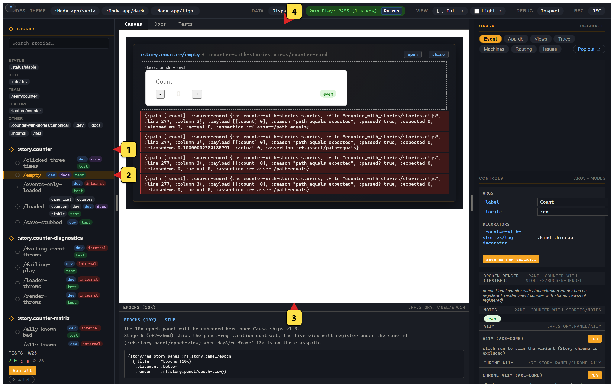

# 1. Your first story

Three lines of code; one registered variant; one canvas paint.

```clojure
(ns counter-with-stories.stories
  (:require [re-frame.story :as story]
            [counter-with-stories.views]))   ; loads the view registry

(story/reg-story :story.counter
  {:doc       "The counter — every state, all in one place."
   :component :counter-with-stories.views/counter-card
   :args      {:label "Count"}
   :tags      #{:dev :docs}
   :substrates #{:reagent}})

(story/reg-variant :story.counter/empty
  {:doc    "Fresh counter at zero."
   :events [[:counter/initialise 0]]
   :play   [[:rf.assert/path-equals [:count] 0]]
   :tags   #{:dev :docs :test}})
```

Save. Reload. Open `#/stories`. You're in.



## What just happened

- `reg-story` registers the **parent story** — a logical group of variants that share a component, default args, decorators, tags. It carries no state on its own; it's a registry entry.
- `reg-variant` registers **one variant** — one scenario, one frame, one canvas paint.

The id grammar is locked. Stories live under `:story.<dotted-path>`. Variants live under `:story.<path>/<variant-name>`. The sidebar tree is built from the dotted path — no separate `:title` field.

Three slots in `reg-variant` carry the meat:

- `:events` — a sequence of regular event vectors. They dispatch in source order through the same router that the live app uses. By the time the canvas renders, the variant frame's `app-db` is exactly what those events left behind.
- `:args` — the variant's prop overrides. Resolved through a three-layer chain (see below).
- `:play` — the assertion sequence. Runs after `:events` settle. Records its results; doesn't throw.

A variant body is **plain EDN**. No fn slots; no closures; no JSX-shaped DSL. The `:component` is a view-id keyword, not a function ref. That's the contract that lets variants round-trip through MCP, through visual-regression services, through agent input pipelines.

## Three-level args + schema-derived controls

Args resolve through a three-layer chain:

```
global-args   ← set once via (story/configure! {:rf.story/global-args {...}})
     ↓
story-args    ← the :args slot on reg-story (parent default)
     ↓
variant-args  ← the :args slot on reg-variant (per-scenario override)
     ↓
cell-overrides ← live edits from the controls panel
```

Deep-merge, left-to-right. Variants that don't say anything inherit; variants that override win. Modes (next chapter) sit between global and story for a fourth point of leverage.

The **controls panel** in the right-side pane auto-derives editors. If the parent story carries `:argtypes {:label {:control :text}}`, the panel renders a text input wired to dispatch a cell-override. If you've gone further and tagged the schema in `re-frame.schemas` (see [Guide 04a — Schemas](../guide/04a-schemas.md)), the panel reads the schema directly — a `:keyword` schema becomes a select, an `:int` schema with `:max`/`:min` becomes a number-input or slider, an `:enum` becomes a radio group. **No `argTypes` plumbing**; the schema is the source of truth.

A variant can also **declare its own schema inline** via the `:rf/schema` slot — useful when one variant exercises a narrower or stricter shape than the component-wide registered schema:

```clojure
(story/reg-variant :story.counter/labelled
  {:rf/schema [:map
               [:label  :string]
               [:colour [:enum :red :green :blue]]
               [:count  [:int {:min 0 :max 99}]]]
   :args      {:label "Count" :colour :green :count 0}
   :events    [[:counter/initialise 0]]})
```

The args editor renders one row per `:map` entry (`:colour` as a select, `:count` as a number-input clamped 0–99). Schema-violation rows flag args that don't conform. One declaration; two pieces of UI.

## Decorators — three kinds

Decorators wrap the canvas with reusable concerns: layout, theming, mock data, fx mocking. Three kinds:

- **`:hiccup` decorators** — wrap the rendered tree. The closure lives at the decorator's registration site, not the variant body.
  ```clojure
  (story/reg-decorator :app/centered-layout
    {:kind :hiccup
     :wrap (fn [body _ref-args]
             [:div {:style {:display "flex" :justify-content "center"}} body])})

  (story/reg-variant :story.counter/loaded
    {:decorators [[:app/centered-layout]]
     :events     [[:counter/initialise 7]]})
  ```
- **`:frame-setup` decorators** — patch the variant's frame at allocation time. Used when several variants share an "assume the user is logged in" setup. The events dispatch before the variant's own `:events`; the patch merges into the variant frame's `app-db`. Pure data, no closures.
- **`:fx-override` decorators** — stub a network call. The marquee shape is **`force-fx-stub`**, MSW-flavoured, which Story ships built-in:
  ```clojure
  (story/reg-variant :story.counter/save-stubbed
    {:events     [[:counter/initialise 5]
                  [:counter/save]]
     :decorators [[story/force-fx-stub-id
                   :counter/sync-to-server
                   {:ok? true}]]
     :play       [[:rf.assert/effect-emitted :counter/sync-to-server]]})
  ```

Variant bodies reference decorators by id; closures live on the decorator registrations. This is what keeps variant bodies serialisable.

## Play sequences + assertions

The `:play` slot is a sequence of regular event-vectors. They dispatch through the same router as `:events` — but the seven canonical assertion events don't throw on failure; they append a record to `[:rf.story/assertions]` in the variant frame's `app-db`.

The seven:

| Event id | Payload | Semantics |
|---|---|---|
| `:rf.assert/path-equals`     | `[path expected]` | `(= (get-in @app-db path) expected)` |
| `:rf.assert/path-matches`    | `[path malli-schema]` | Malli validates the value at `path` |
| `:rf.assert/sub-equals`      | `[sub-vec expected]` | `(= @(subscribe sub-vec) expected)` |
| `:rf.assert/dispatched?`     | `[event-or-pred]` | Did this event dispatch during play? |
| `:rf.assert/state-is`        | `[machine-id state]` | Is the machine in `state`? |
| `:rf.assert/no-warnings`     | `[]` | No `:warning` trace events since play start? |
| `:rf.assert/effect-emitted`  | `[fx-id]` (or `[fx-id pred]`) | Was this fx-id emitted? |

The **record-don't-throw** shape is the design call. A play sequence with eight assertions where three fail still runs all eight; you get the full picture, not the first failure. Tests then read the accumulator:

```clojure
(deftest counter-loaded
  (cljs.test/async done
    (-> (story/run-variant :story.counter/loaded)
        (story.async/then
          (fn [result]
            (is (story/assertions-passing? result))
            (story/destroy-variant! :story.counter/loaded)
            (done))))))
```

`run-variant` returns a promise (CLJS) or future (JVM) of `{:frame :app-db :assertions :rendered-hiccup :elapsed-ms :snapshot :lifecycle}`. The same result map the MCP surface returns when an agent asks for a preview. Same shape; same vocabulary.

## Beyond counter: a five-state login form

Counter is the simplest possible variant body — one event in `:events`, one `:rf.assert/path-equals` in `:play`. The login-form testbed at [`tools/story/testbeds/login_form/`](https://github.com/day8/re-frame2/tree/main/tools/story/testbeds/login_form) is the richer shape — five variants over the five FSM states the [welcome page](index.md#a-scenario-before-the-tour) opened with:

```clojure
;; The :submitting variant — a request is in flight.
(story/reg-variant :story.login/submitting
  {:doc        "Inputs disabled, button reads 'Signing in…'. The
                fx-stub records the request and resolves nothing
                so the canvas locks at :submitting."
   :events     [[:login/flow [:login/submit {:email    "ada@example.com"
                                              :password "correct-horse"}]]]
   :decorators [[story/force-fx-stub-id :rf.http/managed {}]]
   :play       [[:rf.assert/state-is      :login/flow :submitting]
                [:rf.assert/effect-emitted :rf.http/managed]]
   :tags       #{:dev :docs :test}})
```

The `:events` slot dispatches a real submit event into the FSM. The `force-fx-stub` decorator intercepts the `:rf.http/managed` call the machine's `:issue-request` action emits, so the request never resolves and the canvas locks at `:submitting`. The play sequence asserts the FSM state and that the fx was emitted. Same EDN shape; richer domain.

Open `http://127.0.0.1:8030/login-form/#/stories` after `npm run test:examples` builds it, and the five variants — `/idle`, `/submitting`, `/error`, `/submitting-retry`, `/authenticated` — show up in the sidebar. The `:Workspace.login/all-states` workspace mounts all five side-by-side. The five FSM states from the tutorial's index page, in one panel paint.

Next: [mode tabs](02-mode-tabs.md) — Canvas, Docs, Tests, viewport, a11y, locale.
