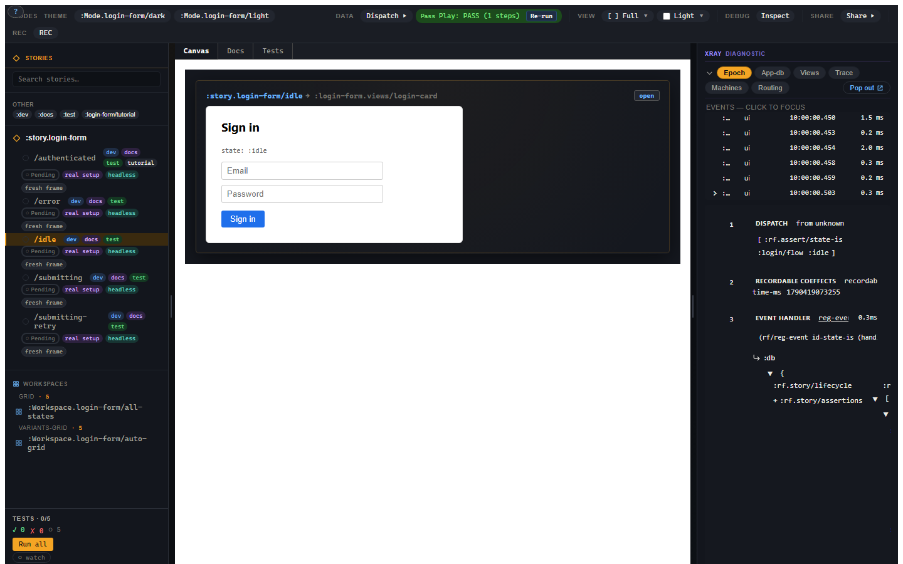

# 1. Your first variant

You want the first useful state on screen quickly. This chapter registers one
login-form story, one variant, and enough setup/assertion data to prove the
state is what it claims to be. By the end, you will have a state rendering in
the Story shell and you will know why it is isolated from every other state.

## The smallest useful Story file

Start with a `stories.cljs` namespace. Requiring the app namespaces matters:
their `reg-event-*`, `reg-sub`, and `reg-view` calls have to run before Story can
refer to their ids.

```clojure
(ns my-app.stories
  (:require [re-frame.story :as story]
            [my-app.events]
            [my-app.subs]
            [my-app.views]))

(story/reg-story :story.login
  {:doc        "The login form and its important states."
   :component  :my-app.views/login-card
   :args       {:heading "Sign in"}
   :tags       #{:dev :docs}
   :substrates #{:reagent}})

(story/reg-variant :story.login/idle
  {:doc    "Fresh form, no input typed, no request in flight."
   :setup  [[:login/flow [:login/dismiss]]]
   :script [[:assert [:rf.assert/state-is :login/flow :idle]]]
   :tags   #{:dev :docs :test}})
```

Open your app's `#/stories` route (the one the install page mounts the shell
on), select `/idle`, and the form appears on the canvas.

To follow along without an app of your own, run the shipped testbed: from
`implementation/`, `npx shadow-cljs watch :examples/login-form`, then open
`http://localhost:8043/index.html#/stories`. The testbed registers these states as
`:story.login-form` in `tools/story/testbeds/login_form/stories.cljs`; this
tutorial uses the shorter `:story.login` your own app would, so
`:story.login/idle` here is `:story.login-form/idle` there.



This is the first payoff: the view is not reimplemented in the story file. The
variant names a registered view id and supplies the state needed to render it.

## `reg-story` is the parent

The parent story groups variants that share a view and defaults.

```clojure
(story/reg-story :story.login
  {:component :my-app.views/login-card
   :args      {:heading "Sign in"}})
```

The `:component` value is a view id keyword, not a function. That is one of
Story's important differences from a render-function story format. The function
stays where it belongs, in the app's view registry. The Story body stays data.

The story id is also the navigation structure. `:story.login` is the parent;
`:story.login/idle` and `:story.login/error` are variants under it. There is no
separate `title: "Forms/Login/Error"` string to keep in sync with the id.

## `reg-variant` is the state

The first three fields you will use constantly are `:setup`, `:script`, and
`:args`.

`:setup` establishes the precondition. These are real event vectors dispatched
through the app's real event pipeline. In the login testbed, `[:login/flow
[:login/dismiss]]` is a small way to seed the login machine into `:idle`.

`:script` is the behaviour or expectation you want Story to run after setup.
The tutorial starts with an assertion step:

```clojure
[:assert [:rf.assert/state-is :login/flow :idle]]
```

`:assert` is the checkpoint step: it runs the assertion at that exact point in
the script and records the result, pass or fail, before the runner continues.
Later chapters also spell it `[:dispatch-sync [:rf.assert/...]]`, which sends
the same assertion event down the plain dispatch rail and records the same row.

`:args` supplies view inputs. A variant can override the parent story's args,
and live Controls edits can override both. The precedence chain is:

```text
global < mode < story < variant < live control override
```

Most variants start with only `:setup` and `:script`; args become important when
you want to explore presentation inputs.

## A schema on the view gives you Controls

`:args` are view inputs, so the view is where a valid input is defined. Give the
view a Malli props schema under `:rf/props` on its registration:

```clojure
(ns my-app.views
  (:require [re-frame.core :as rf]))

(rf/reg-view ^{:rf/props [:map [:heading {:optional true} [:string {:min 1}]]]}
          login-card [{:keys [heading]}]
  [:section
   [:h3 (or heading "Sign in")]
   [login-form]])
```

The story file does not change. Select `/idle` and look at Controls in the
right-hand rail: Story reads the schema off the variant's `:component` and
derives a control for each arg, so `:heading` gets a text field. Clear the field
and the row shows an inline `schema:` error, with a banner saying the arg
violates the component's schema: an empty heading is not a valid render of this
view. Without a schema, Story can only guess a control from the value, and the
Schema validation panel below Controls reports "no schema registered for the
variant's :component".

Controls follow the schema's shape: `:string` gives a text field, `:int` and
`:double` a number field, `:boolean` a checkbox, `[:enum ...]` a select, and
`:map`, `:vector`, `:set` and `:tuple` nest their children. `:rf/props` is the
canonical key; a `:schema` key in the same place also works. Where a derived
control is not the one you want, the story's or variant's `:argtypes` wins.

## Every variant gets a frame

This is the rule that makes Story more than a component gallery:

**Every variant runs in its own frame.**

That frame has its own `app-db`, queue, subscriptions, trace records,
interceptors, and lifecycle. Selecting `/idle` does not warm up `/error`.
Putting five variants in a grid does not give you one app-db being frantically
mutated behind the curtain. It gives you five isolated app instances, each with
the same registered app code and different state.

This is why Story can render application states instead of only component
states. The login view can subscribe, dispatch, read machine state, emit effects,
and behave like the real app because it is running inside a real frame.

## Assertions record results

The canonical `:rf.assert/*` assertions are ordinary events. They record
assertion rows in the variant frame instead of throwing on the first failure.

The common assertions are:

| Assertion | Use it for |
|---|---|
| `:rf.assert/path-equals` | checking a path in `app-db`. |
| `:rf.assert/path-matches` | checking a path against a schema. |
| `:rf.assert/sub-equals` | checking a real subscription value. |
| `:rf.assert/dispatched?` | checking that a script dispatched an event. |
| `:rf.assert/state-is` | checking a registered machine's state. |
| `:rf.assert/no-warnings` | checking the run emitted no warnings. |
| `:rf.assert/effect-emitted` | checking that an effect id was emitted. |

The record-don't-throw rule is boring until a failure happens, and then it is
lovely. A variant can collect multiple failures in one run, keep the shell
alive, and hand you the full set of facts instead of one stack trace and a
half-run scenario.

## The first troubleshooting loop

If the sidebar is empty, the stories namespace probably was not required by the
dev entry point.

If the canvas says the component cannot be resolved, check that `:component`
matches a registered view id.

If Test mode says no assertions were recorded, check that the variant's
`:script` actually carries an assertion step, for example:

```clojure
[:assert [:rf.assert/state-is :login/flow :idle]]
```

You now have one named state. The next problem is the usual one: real UIs do not
have one state. They have a whole little family of them, and at least one is
waiting to embarrass you in a demo.
