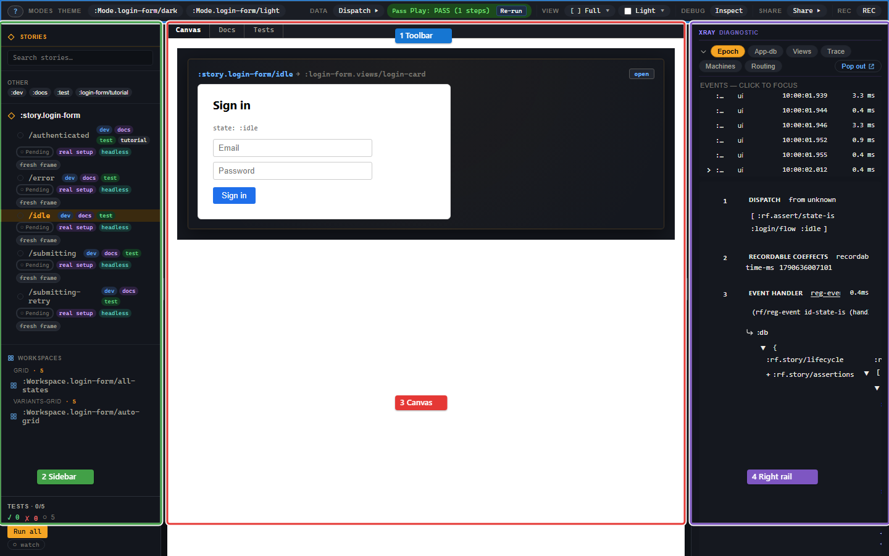

# Your first variant

Keep a rejected login as a named example, then check that the login machine
and its error message agree. This exercise uses the shipped testbed, so the
events, subscriptions and view are already available.

From the repository root:

```powershell
npm ci --prefix implementation
cd implementation
npm run dev -- :examples/login-form
```

Open `http://localhost:8043/index.html#/stories` and select
`:story.login-form/error`. The canvas shows a rejected login with the form
enabled again. The pending and authenticated variants are available without
editing the application or sending a real request.

[](../images/story/story-tutorial-01-first-variant.png)

The sidebar selects a named state (2). The canvas renders it (3). The
toolbar controls presentation and replay (1); the right rail edits inputs
and opens runtime evidence (4).

## The smallest useful Story file

The testbed's `tools/story/testbeds/login_form/stories.cljc` requires
`login-form.events`, `login-form.subs` and, in its ClojureScript branch,
`login-form.views`. Those namespaces register the application code.

The parent groups the view and shared defaults:

```clojure
;; cf. tools/story/testbeds/login_form/stories.cljc
(rf.story/reg-story :story.login-form
  {:component :login-form.views/login-card
   :args {:heading "Sign in"}
   :tags #{:dev :docs}
   :substrates #{:reagent}})
```

`:component` is the registered view id. The variant supplies the state:

```clojure
;; This namespace requires [re-frame.story :as rf.story].
(rf.story/reg-variant :story.login-form/error
  {:doc "A rejected password leaves the form ready to retry."
   :decorators [[rf.story/force-fx-stub-id :rf.http/managed {}]]
   :setup [[:login/flow
            [:login/submit {:email "ada@example.com" :password "wrong"}]]
           [:login/flow
            [:login/failure {:failure {:status 401}}]]]
   :script [[:assert [:rf.assert/state-is :login/flow :error]]]
   :tags #{:dev :docs :test}})
```

`:setup` dispatches the application's real events in order: submit, then
failure. The decorator intercepts the HTTP effect, records its call and sends
no reply, so setup chooses exactly when the failure arrives. The view renders
the state those events reached. `:script` then checks the machine state.

This is the same shape as the shipped variant; it is not a new mock view.
The testbed's parent also selects its app image so it can coexist with
other apps in combined test builds.

## Add a useful expectation

Append this registration to that same testbed namespace, outside its
`register-all!` function:

```clojure
(rf.story/reg-variant :story.login-form/error-message
  {:extends :story.login-form/error
   :script [[:assert [:rf.assert/state-is :login/flow :error]]
            [:assert [:rf.assert/sub-equals
                      [:login/error] "Invalid credentials."]]]
   :tags #{:dev :docs :test}})
```

After hot reload, select `error-message` and open **Tests**. Expect two passing
assertions: the machine is in `:error` and the real subscription returns
the message. `:extends` keeps the parent's setup and HTTP stub; this child
runs its own script. The same registration can run under `rf.story/is`
in a [test namespace](04-the-variant-is-a-test.md#using-story-from-tests).

## Use this shape in your app

Require application registrations before declaring stories. Keep shared
events and subscriptions in `.cljc` if the same variants should run on the JVM:

```clojure
(ns my-app.stories
  (:require [re-frame.story :as rf.story]
            [my-app.events]
            [my-app.subs]
            #?(:cljs [my-app.views])))
```

Use your own registered view and event ids in the declarations. A story id
is an unqualified keyword such as `:story.login-form`; its variants use
that name as their namespace, such as `:story.login-form/error`.
The [registration reference](api/registration.md#ids-and-bodies) describes
the other id forms and body keys.

## A schema on the view gives you Controls

The login card declares a `:rf/props` schema with a string `:heading`.
Story derives its heading field in **Controls** from that schema. Change
the heading and the canvas updates; it is a view input, independent of the
login machine's state.

## Troubleshooting

| Symptom | Cause | Fix |
| --- | --- | --- |
| The new variant is absent | The form is inside a function that was not called, or its namespace was not loaded | Put the exercise registration at namespace level and confirm hot reload. |
| `:rf.error/variant-id-shape` | The variant id does not use the Story namespace form | Use `:story.login-form/error-message`. |
| `:rf.error/variant-shape` | A body key or value has the wrong shape | Read the named field; use `:setup`, `:script` and `:tags` as shown. |
| The form sends an actual HTTP request | The effect was not stubbed | Include the decorator, or inherit from the testbed's error variant. |
| Machine assertions cannot find the state in app-db | Machine snapshots live in runtime state | Use `state-is`, or `sub-equals` on the projection subscription. |
