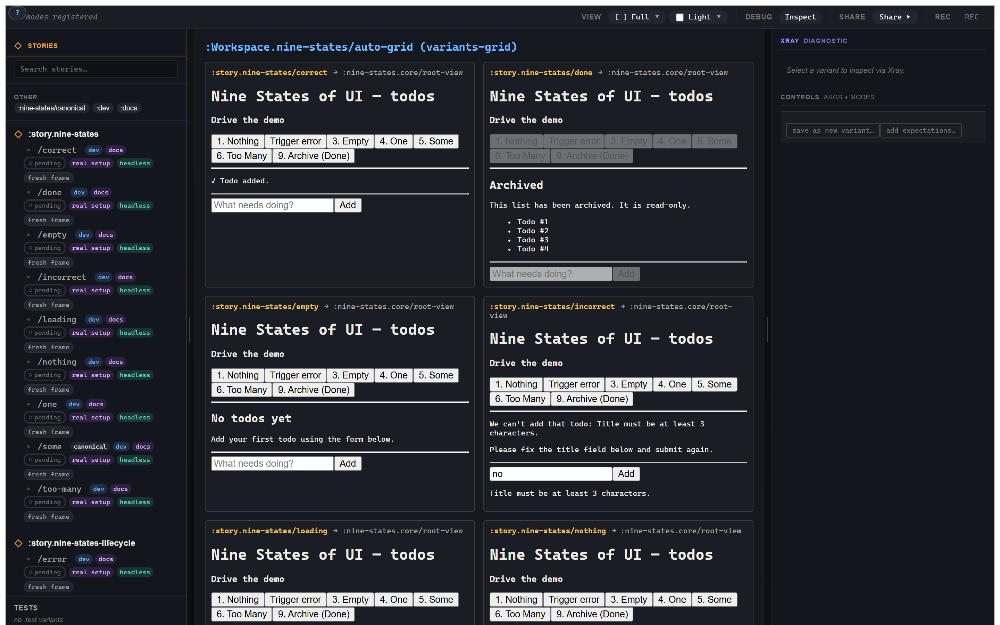
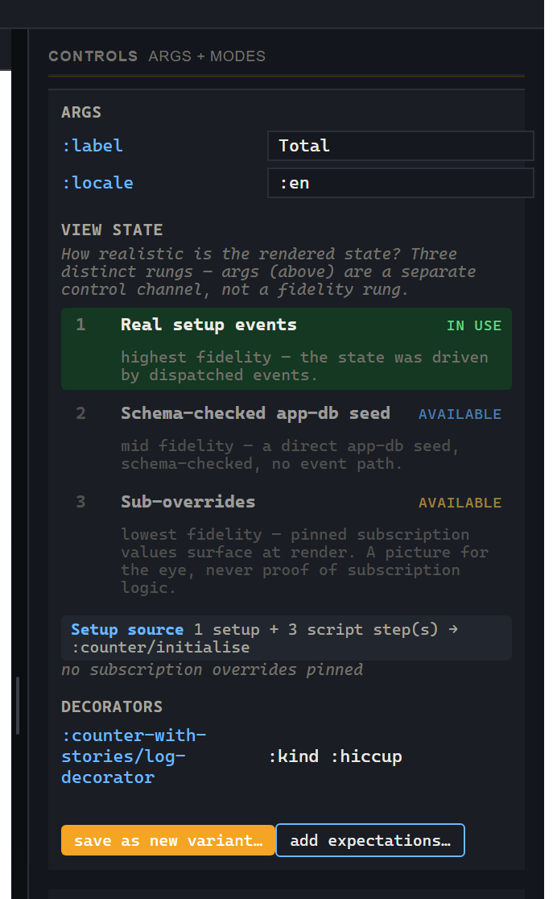

# 2. Every state, side by side

> **What you'll build.** A workspace that mounts every counter variant on one page; then the nine_states *wall of nine* as the showcase; plus the controls panel that derived itself from a schema, with zero per-story plumbing.

## The wall of nine

Here's a confession that every honest UI developer will recognise. When you build a list view, you build the happy path: a few items, rendered nicely. You ship it. And then the bug reports start, and every single one of them is about a state you *never designed*: the empty list looks broken, the one-item list has a dangling comma, the 4,000-item list locks the browser, the "you typed an invalid filter" state shows a blank screen. The happy path was never the problem. The problem was the eight states you never looked at.

So let me introduce the guest star of this tutorial: **nine_states**. It is a todos list rendered in all nine of its canonical UI states, on one screen:

> Nothing · Loading · Empty · One · Some · Too Many · Incorrect · Correct · Done

Nothing-fetched-yet. Mid-fetch. Fetched-but-empty. Exactly one item. A handful. More than the threshold (search + truncation kick in). A rejected form submission. An accepted one. The archived, read-only end state. Nine faces of one view, all visible at once, all real. That grid is the single most useful thing a workshop does, and it's what this chapter builds toward.



## Workspaces — many variants on one page

The mechanism is `reg-workspace`. A workspace mounts a set of variants in a layout. Two shapes matter most.

**Explicit grid** — you list the variants, in order, and pick a column count:

```clojure
(story/reg-workspace :Workspace.counter/all-states
  {:doc      "Every named counter state, side by side."
   :layout   :grid
   :variants [:story.counter/empty
              :story.counter/loaded
              :story.counter/clicked-three-times
              :story.counter/save-stubbed]
   :columns  2
   :tags     #{:docs}})
```

**Auto-grid** — you point `:for` at a parent story and the workspace enumerates *every* variant of it:

```clojure
(story/reg-workspace :Workspace.counter/auto-grid
  {:doc     "Auto-enumerated — pulls every variant off :story.counter.
            New variants appear here without touching this workspace."
   :layout  :variants-grid
   :for     :story.counter
   :columns 2
   :tags    #{:docs}})
```

The contrast is exactly the Storybook 8 "list your subcomponents explicitly" versus a `*`-glob, except here it's first-class: `:variants-grid` with `:for` means **a new variant appears in the grid the moment you register it**, with zero maintenance on the workspace. For a wall-of-nine that's going to grow to a wall-of-twelve, that's the slot you want.

There are other layouts — `:tabs`, `:prose` (interleave documentation with cells), and `:custom` — and we'll cover composition and modes properly in [chapter 7](07-workspaces-modes-composition.md). For now, `:grid` and `:variants-grid` are the two that earn their keep on day one.

## Frame-per-cell — why the grid can't lie

Recall the first load-bearing rule: each variant runs in its own frame. In a grid, that rule gets a second teeth: **two cells of the same variant are independent by construction.** Increment the counter in cell A and cell B does not move. There is no opt-in, no `isolate: true` flag — there is simply no shared mutable state for the cells to fight over.

This is the structural payoff that lets a wall-of-nine be *honest*. In nine_states, each of the nine states is its own variant, its own frame, its own `app-db`. The grid is a true side-by-side because nothing is shared:

```clojure
(story/reg-workspace :Workspace.nine-states/all-states
  {:doc      "Every canonical state, side by side in render order."
   :layout   :grid
   :variants [:story.nine-states/nothing
              :story.nine-states/loading
              :story.nine-states/empty
              :story.nine-states/one
              :story.nine-states/some
              :story.nine-states/too-many
              :story.nine-states/incorrect
              :story.nine-states/correct
              :story.nine-states/done]
   :columns  3
   :tags     #{:docs}})
```

Subscriptions, by the way, do not reach across frames — a sub computes against *its own* frame's `app-db` and nothing else. (If you've internalised re-frame2's "frames are isolated contexts" rule, this is just that rule, applied to a grid.)

There is one knob worth knowing about and not belabouring: `:isolation`, which defaults to `:isolated`. The `:shared` setting serialises cells through one frame for the rare view that hardcodes a frame-provider. Default isolated; reach for `:shared` only when a view forces your hand.

## Controls that derived themselves



This is the single largest authoring win Story has over Storybook, so let me set it up as a contrast.

In Storybook, getting a nice control for an argument means writing `argTypes`:

```js
// Storybook — per-story plumbing
argTypes: { size: { control: { type: 'range', min: 0, max: 100 } } }
```

You write that for *every* story that wants the slider. The schema of the component and the controls of the story are two separate things you keep in sync by hand.

In Story, you write the view's Malli schema **once** — on the view — and *every* story of that view gets the right widget for free. Write `[:int {:min 0 :max 100}]` on the view's props schema, and a slider appears on every counter story, bounded to 0–100, with no per-story `:argtypes` at all. The schema is the source of truth; the control is the consequence.

The widget mapping derives mechanically from the schema shape:

| Malli schema | Control widget |
|---|---|
| `:string` | text input |
| `[:int {:min .. :max ..}]` | bounded slider |
| `:boolean` | toggle |
| `[:enum ...]` | select |
| `[:map ...]` | labelled group (recursive) |
| `[:vector X]` | repeater |
| `[:tuple ...]` | fixed-arity row |

The override channel, `:argtypes`, still exists for the edge cases a schema genuinely can't express — but you'll reach for it almost never. The aha here is bigger than controls: **schemas pay for themselves several times over.** The one Malli schema you write drives validation, *and* controls, *and* the auto-docs table ([chapter 7](07-workspaces-modes-composition.md#mode-tabs--dev--docs--test)), *and* visual-regression keying ([chapter 8](08-snapshot-identity-and-sharing.md)). Write it once; collect the dividend four times.

## The args chain, in anger

[Chapter 1](01-first-variant.md#the-args-chain-briefly) introduced the precedence ladder as theory. The controls panel is where you watch it work live. Edit `:label` in the controls panel and a **cell-override** dispatches `:story/set-arg`; the resolved arg map recomputes and the cell re-renders — and *only* that cell, because of frame-per-cell.

Recall the full ladder:

```
global  <  mode  <  story  <  variant  <  cell-override
```

Five points of leverage, later wins. The story sets `:label "Count"`; the `:loaded` variant overrides it to `"Total"`; a live edit in the controls panel beats both. Each layer is a different audience — the project default, a toolbar pivot, the scenario, the local experiment — and they compose cleanly because they're all just data being deep-merged.

## What you should see now

- The `all-states` grid renders one cell per listed variant.
- The `auto-grid` picks up a newly-registered variant with no edit to the workspace.
- The controls panel shows schema-derived widgets — a slider for a bounded int, a toggle for a boolean.
- Editing a control re-renders *only* that cell; sibling cells of the same variant don't move.

## Where we go next

Look at that wall of nine again. Here's the uncomfortable question: is every state on it equally *real*? Some are driven by genuine events through the real router. Some might be painted by pinning a value into a subscription. Those are not the same thing, and a workshop that pretended they were would be dangerous. [Chapter 3](03-fidelity-ladder.md): the fidelity ladder, and the badge that refuses to let a low-fidelity state pose as proof.
