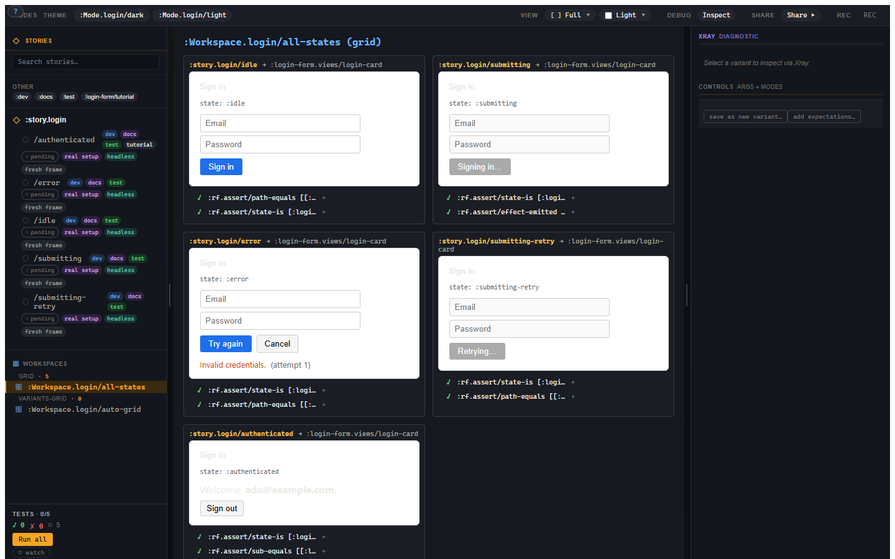
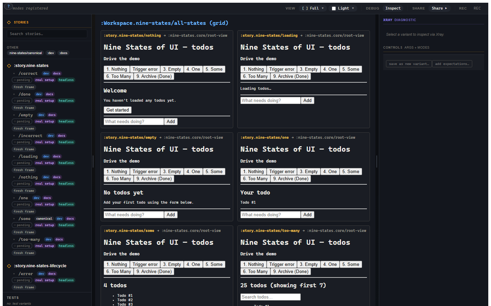

# 2. Every state, side by side

You like finding UI bugs before a customer does, which means you have to look
at the awkward states, not just the happy one. This chapter expands the login
form into five variants and puts them in a workspace grid. You will also see
how Controls lets you edit explicit inputs without turning the story file into
a second app.

## Five login states

The login-form testbed carries five variants:

```clojure
:story.login/idle
:story.login/submitting
:story.login/error
:story.login/submitting-retry
:story.login/authenticated
```

They are intentionally mundane. That is good. Loading, error, retry, and
success states are where visual bugs hide because nobody wants to keep driving
the app through them by hand. A workshop earns its keep when those states are
one click away.

The error variant looks like this:

```clojure
(story/reg-variant :story.login/error
  {:doc "Server rejected credentials. Form re-enabled; the error is visible."
   :setup [[:login/flow
            [:login/submit {:email "ada@example.com"
                            :password "wrong"}]]
           [:login/flow
            [:login/failure
             {:failure {:status 401
                        :message "Invalid credentials."}}]]]
   :decorators [[story/force-fx-stub-id :rf.http/managed {}]]
   :script [[:dispatch-sync [:rf.assert/state-is :login/flow :error]]
            [:dispatch-sync
             [:rf.assert/path-equals
              [:rf/runtime :machines :snapshots :login/flow :data :error]
              "Invalid credentials."]]]
   :tags #{:dev :docs :test}})
```

The setup is real behaviour: submit, then receive a failure event. The HTTP
effect is stubbed at the effect boundary, not by editing the view. The variant
therefore gets the error state through the same machine path the app uses.

## Workspaces

A workspace arranges variants together. The simplest useful form is an explicit
grid:

```clojure
(story/reg-workspace :Workspace.login/all-states
  {:doc      "The five login states side by side."
   :layout   :grid
   :variants [:story.login/idle
              :story.login/submitting
              :story.login/error
              :story.login/submitting-retry
              :story.login/authenticated]
   :columns  3
   :tags     #{:docs}})
```

Open the workspace and all five states render together.



Each cell gets its own frame. If a cell dispatches an event, it mutates that
cell's frame, not the grid's other frames. You can review states without
accidentally testing a shared global app-db.

There is also `:variants-grid`, which auto-enumerates variants under a parent
story:

```clojure
(story/reg-workspace :Workspace.login/auto-grid
  {:layout  :variants-grid
   :for     :story.login
   :columns 3})
```

Use an explicit grid when the order is part of the story you want to tell. Use
`:variants-grid` when you want every variant under a parent to appear without
maintaining the list by hand.

## The bigger wall

The `nine_states` example is the same idea made more aggressive: one todos
view rendered as Nothing, Loading, Empty, One, Some, Too Many, Incorrect,
Correct, and Done.



This is where Story starts paying rent. You stop asking "can I navigate to the
empty state?" and start asking "does every state this screen can present look
professional on the same page?"

## Controls

The right-hand Controls region edits explicit world inputs: args, view state
overrides, setup/network/effect summaries, and save-authoring actions.

For ordinary args, Story derives controls from the view's schema where it can:

| Schema shape | Control |
|---|---|
| boolean | toggle |
| enum | select or segmented control |
| bounded number | slider plus numeric input |
| string | text input |
| map | nested field editor |
| vector | repeatable editor when the schema supports it |

The important rule is that Controls edits **inputs**, not arbitrary component
internals. If you change `:heading`, you are changing an arg. If you pin a
subscription value, you are creating a view-state override. If you save the
current canvas state, Story tells you which slices can be represented as a
variant and which are only carried forward or not captured yet.

## Save current as variant

Story has two different "make this permanent" gestures, and they solve
different problems.

**Save current state as variant** is an authoring gesture. You have edited
controls or selected a useful state and want a named variant in source.

**Promote a run to a regression variant** is a testing gesture. A generated or
recorded run exposed a failure and you want to turn that evidence into a
curated variant.

The UI keeps those paths separate. If they were one button, it would feel
convenient for about four minutes and then become another tiny chaos machine in
the toolbar.

You now have a state matrix. The next question is whether each state is proof,
illustration, or something in between.
