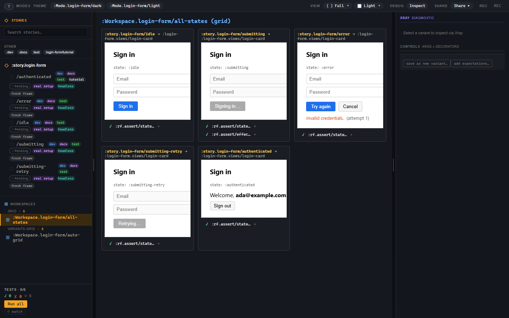
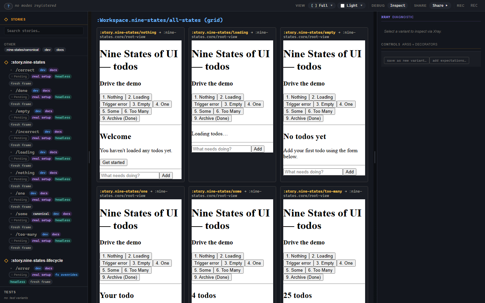

# Compare states side by side

Put the login form's normal and failure states in one workspace. This makes
it easy to compare disabled fields, error messages and retry controls without
recreating each state by hand.

```clojure
;; In a namespace requiring [re-frame.story :as rf.story].
;; These variants ship in tools/story/testbeds/login_form/stories.cljc.
(rf.story/reg-workspace :Workspace.login-form/all-states
  {:doc "The five login states side by side."
   :layout :grid
   :variants [:story.login-form/idle
              :story.login-form/submitting
              :story.login-form/error
              :story.login-form/submitting-retry
              :story.login-form/authenticated]
   :columns 3
   :tags #{:docs}})
```

Open **all-states** under Workspaces in the login testbed's sidebar.

[](../images/story/story-tutorial-02-workspace-grid.png)

## Five login states

| Variant | What to compare |
| --- | --- |
| `idle` | Empty enabled fields and the Sign in button. |
| `submitting` | Disabled fields and Signing in while the stub holds the request. |
| `error` | Error message, enabled fields and Cancel. |
| `submitting-retry` | Retrying label after a previous rejection. |
| `authenticated` | Welcome banner in place of the form. |

Each cell has its own frame and machine state. Try **Cancel** in the error
cell: that cell returns to idle; the other four retain their state. Reopen
the workspace to restore its declared starting states.

Frames isolate application state. The cells still share the page's CSS,
focus and portals. A dialog mounted into `document.body` appears outside
its cell. The [workspace guide](07-workspaces.md#what-the-cells-share)
explains these limits.

## Workspaces

An explicit `:grid` preserves your chosen order. For a growing collection,
`:variants-grid` enumerates a parent's variants:

```clojure
(rf.story/reg-workspace :Workspace.login-form/auto-grid
  {:layout :variants-grid
   :for :story.login-form
   :columns 3})
```

The [workspace reference](api/registration.md#workspace-body) also describes
`:tabs` and `:prose`.

## The bigger wall

The `nine_states` example compares Nothing, Loading, Empty, One, Some,
Too Many, Incorrect, Correct and Done for one todos view.

[](../images/story/story-tutorial-08-nine-states.png)

Scroll the workspace to compare the remaining cells. Each uses the same view
with a different declared state.

## Controls

For a selected variant, [Controls](controls.md) edits view inputs and lets
you keep a useful combination as a new variant.

## Save the current state as a variant

Controls' **save as new variant…** creates a declaration extending the
selected variant. Copy it into your stories namespace to keep it across
reloads. This saves an authored state; [promoting a run](04-the-variant-is-a-test.md#promoting-a-run)
preserves an executed scenario and its expectations.

## Troubleshooting

| Symptom | Cause | Fix |
| --- | --- | --- |
| `:rf.error/workspace-shape` | A layout's required field is missing, or both `:for` and `:variants` were given | A grid needs `:variants`; an automatic grid uses one source of variants. |
| Cells are empty or show an unknown view | Referenced variants or their view were not registered | Require their namespaces before opening the workspace. |
| Cell interactions affect each other | The view hardcodes an internal frame provider | Use the variant frame, or review such views serially with `:variants-grid :isolation :shared`. |
| Text or colours differ from the app | The app supplies inherited styles outside the view | Supply those styles through a decorator. |
