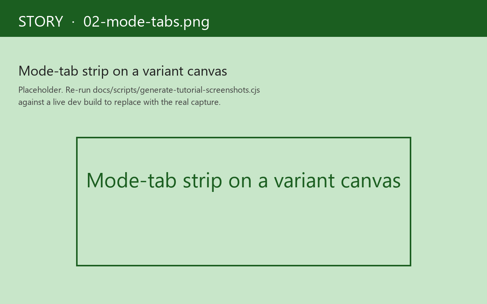
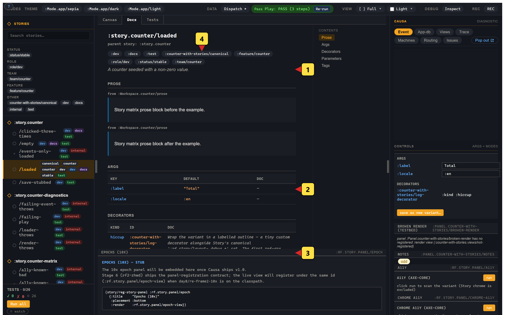
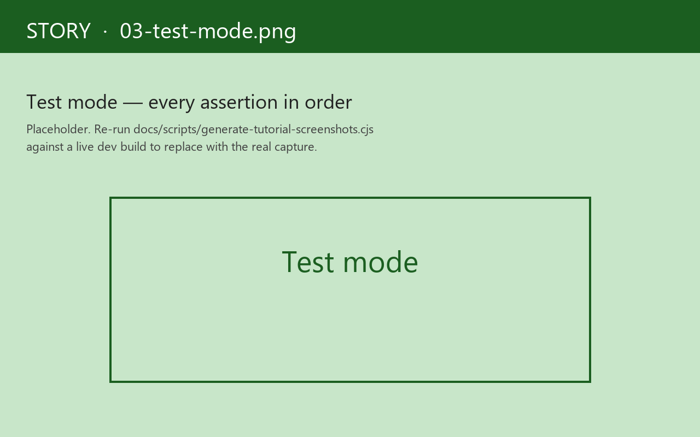

# 2. Mode tabs

Every selected variant carries a strip of **mode tabs** at the top of the canvas. Three core modes — Canvas, Docs, Tests — and four orthogonal toolbars — viewport, background, a11y, locale.

## Canvas / Docs / Tests

The three core modes are mutually exclusive. The chip you click swaps the canvas content.

- **Canvas** — the default. The variant's component renders inside its frame; controls, decorators, the live trace strip all apply.
- **Docs** — an auto-generated documentation pane: the parent story's `:doc`, the variant's `:doc`, the resolved args table, the resolved decorators table, the resolved parameters, the variant's tags. The args table reads from the three-layer args walk; the decorators table reads from the resolved decorator chain. No `MDX` plumbing; the doc surface is read off the registrations.
  
- **Tests** — the variant auto-runs on entry. The pane shows each `:play` assertion in order, with a green/red chip and the full record (path, expected, actual). The pane is a microcosm of the chrome-level test widget: a Run-all button, a counts headline, per-assertion drill-down.
  

Selection is **per-variant** and persists across reload in `localStorage` under `re-frame.story/active-mode-tab/<variant-id>`. Open a variant where you were on *Tests* last time; you're on *Tests* again.

## Viewport — responsive at the panel level

A second strip below the mode tabs picks the **viewport**: mobile / tablet / desktop / wide, plus a *custom* slot. The canvas frame's size adjusts; the rendered component sees the resized viewport. Useful for responsive design — flip three sizes side-by-side without resizing the browser window.

Viewport is independent of mode tabs — *Canvas* with mobile viewport, *Docs* with desktop viewport, etc.

## Background — design context

The third strip is the background-colour picker — *light*, *dark*, *checker*, *brand*, plus custom hex. The canvas's surrounding chrome paints in the picked colour; the component renders on top. This is the chrome equivalent of opening a design tool's artboard and changing the canvas colour to compare contrast.

Background and `:Mode.app/dark` (the args-Mode primitive, see [chapter 4](04-workspaces.md)) are distinct. Background paints the *chrome*; a dark-mode Mode passes `{:theme :dark}` into the component's args. You can run a `:Mode.app/dark` variant on a *checker* background to see which is the component's own dark and which is the chrome.

## A11y — axe-core, opt-in

A11y is **opt-in** because axe-core is heavy and most variants don't need it on every render. Toggle it on per-variant via the a11y chip; the panel runs an axe pass on the rendered canvas and renders the results inline — violations in red, passes in green, manual checks in yellow.

Story 1.0 ships axe-core *vendored locally* — there's no CDN hit, no network roundtrip. The companion bead [rf2-20w5i](https://github.com/day8/re-frame2) tracked the vendor-and-opt-in switch; the upshot is a11y is now a tab away with zero install. (Production builds DCE the entire axe-core path; the prod bundle carries no a11y bytes.)

## Locale

The locale strip cycles through any locales the parent story declares — `:en-AU`, `:fr-FR`, `:ja-JP`, etc. The canvas re-renders with the locale set as a cofx; views that read `(rf/locale)` swap their strings.

Story doesn't ship a translation engine — the parent story just declares which locales are interesting, and the runtime takes it from there. If your app uses `formatjs` or `tongue` or any other i18n surface, point it at the locale strip's selection.

## What "orthogonal" means

The four toolbars compose: viewport × background × a11y × locale. *Mobile, dark chrome, a11y-on, ja-JP* is a coherent picked state. The Story shell encodes that picked state into the URL fragment so reload preserves it; the *share* button (see [chapter 5](05-snapshot-identity.md)) serialises it for paste-into-issue.

The mode tabs sit on top: each picked toolbars-state has its own *Canvas* / *Docs* / *Tests* views. So *Tests* mode with mobile viewport is "run the play assertions against a 375-wide canvas." The shell does this for you; you just click the chips.

## When you wouldn't use mode tabs

Some variants are deliberately *Canvas-only* — design references, sample compositions, pinned screenshots. Tag the variant `:canvas-only` and the Docs/Tests chips are disabled (with an explanatory tooltip). The :test-runner skips them; the :docs export skips them.

Tag inverts: `:test`-tagged variants always run in Tests mode at least once per session, even if you stay on Canvas in the UI. The chrome's test widget aggregates the run; the widget headline is "Tests · 3/5" with chips for `✓ ✗ ○ ` (passed / failed / un-run).

Next: [the recorder + Test Codegen](03-recorder-codegen.md) — the hero feature.
