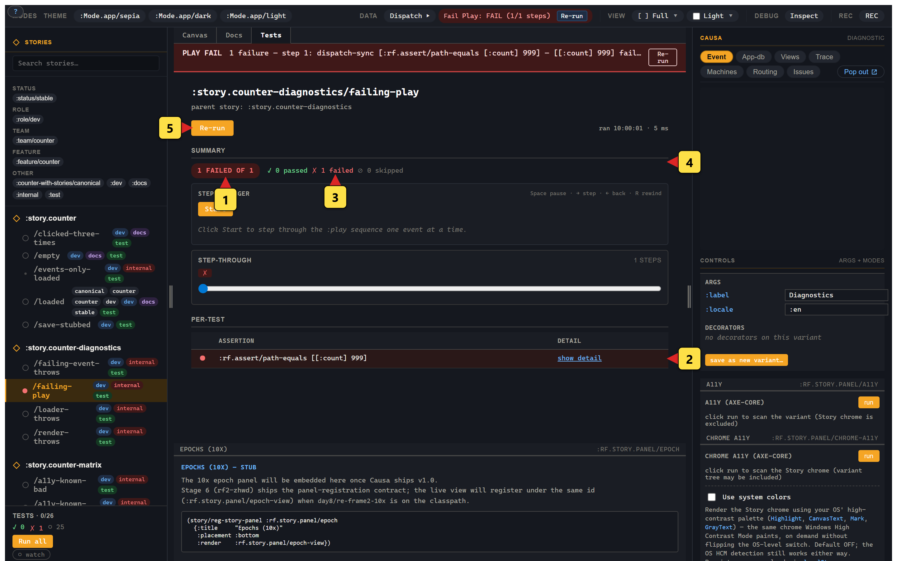

# 2. Mode tabs

> **What you'll build.** A working mental model of the chrome surrounding a single variant: the *Canvas / Docs / Tests* tab strip at the top of the canvas, plus the four orthogonal toolbars (viewport, background, a11y, locale) that sit alongside it. You'll know what each tab and toolbar does, when to reach for it, and which are free and which cost network egress.
>
> **You should have working before you start.** Chapter 1 finished — you have at least one variant rendering in the playground. If you have several variants and a few of them are `:test`-tagged, the chapter's much more interesting because the *Tests* tab actually has something to show.

If chapter 1 was about getting a single variant to paint, this chapter is about everything *around* the canvas. The lens, not the picture. We're going to spend the chapter clicking around chrome, because the value of a component playground is largely in the secondary affordances: can you flip to docs for this state? Can you run its tests inline? Can you resize the viewport without resizing the browser? Can you pick a locale? An a11y check?

Storybook spent five years iterating on this layout. We borrowed the shape, because the shape is good. We diverged on a couple of details where re-frame2's substrate let us, and we'll call those out.


*(1) The Canvas / Docs / Tests chip row at the top. (2) The viewport selector. (3) The background-colour picker. (4) The a11y panel in the right rail (the chrome-a11y surface). (5) The dispatch-console chip — Story doesn't ship a built-in locale chip; the toolbar slot is project-extensible.*

## Canvas / Docs / Tests

The three core modes sit at the top of the canvas, mutually exclusive. The chip you click swaps the canvas content. This is the *cardinal axis* of the chrome — pretty much every other surface composes with these three.

### Canvas

The default. The variant's component renders inside its frame; controls, decorators, the live trace strip, all apply. This is what chapter 1 showed you, and it's where you'll spend 80% of your playground time. The Storybook 7+ equivalent is the *Canvas* tab; the gesture is identical.

### Docs

The Docs tab renders an auto-generated documentation pane: the parent story's `:doc`, the variant's `:doc`, the resolved args table, the resolved decorators table, the resolved parameters, the variant's tags. The args table reads from the four-layer args walk; the decorators table reads from the resolved decorator chain. There's no MDX file you have to author and keep in sync. The doc surface is read off the registrations.

We're going to spend a moment on why there's no MDX. Storybook's Docs mode lets you author standalone Markdown-with-JSX (`.mdx`) files for prose around your stories, which is a great feature with a bad failure mode: the prose drifts out of sync with the implementation. If you rename an arg, the prose-mode docs still talk about the old name. If you delete a variant, the MDX still embeds it. The drift is silent until someone reads the docs and gets confused.

Story's Docs mode is *generative* — every section comes from data that the registrations already carry. The `:doc` string on `reg-story` and `reg-variant` is the only prose surface we ask you to write, and it's right next to the code it describes. The cost of writing rich Docs prose is therefore lower; the cost of letting prose go stale is impossible-by-construction.

If you actually need richer per-story documentation (worked-example walkthroughs, embedded screenshots, links out), use a `:prose` workspace (chapter 4) that mixes prose blocks and variant cells. The `:prose` layout is Storybook's MDX-equivalent, except it round-trips as data.


*(1) The variant's `:doc` string at the top. (2) The resolved-args table with the four-layer breakdown. (3) The decorator stack. (4) The tag chips at the bottom.*

### Tests

The Tests tab auto-runs the variant's `:play-script` on entry. The pane shows each step in order, with a green/red/grey chip and the full record (path, expected, actual, reason on failure). At the top, an aggregate badge — *3 passed, 0 failed, 0 skipped* — plus a re-run button. The pane is a microcosm of the chrome-level test widget that aggregates across all `:test`-tagged variants; same data, different scope.

This is the surface that matters for *integrating Story into your testing story* (sorry, unavoidable pun). The pattern: tag every variant that exercises a meaningful state with `:test`. The chrome runs them in the background on every load and shows you the aggregate in the sidebar. The CI runner — `serve-and-run-story-play-scripts.cjs` — discovers every variant whose body carries a non-empty `:play-script`, navigates to each, waits for the terminal status, and asserts in CI. Same variants you wrote for visual inspection are running as tests in CI.



*(1) The aggregate status pill at top. (2) The single `:rf.assert/path-equals` row with `data-status=fail`. (3) The pass / fail / skipped counts. (4) The summary section with expected / actual breakdown. (5) The Re-run button.*

Selection across the three tabs is **per-variant** and persists across reload in `localStorage` under `re-frame.story/active-mode-tab/<variant-id>`. Open a variant where you were on *Tests* last time, you're on *Tests* again. This is a quality-of-life detail that pays for itself the first time you spend a morning debugging an assertion failure and don't want to keep re-clicking the *Tests* tab every time hot-reload bounces.

## Viewport — responsive at the panel level

A strip below the mode tabs picks the **viewport**: mobile / tablet / desktop / wide, plus a *custom* slot where you can pin a pixel size. The canvas frame's size adjusts; the rendered component sees the resized viewport. Useful for responsive design — flip three sizes side-by-side without resizing the browser window or breaking out the Chrome device emulator.

Viewport is independent of mode tabs. *Canvas* with mobile viewport, *Docs* with desktop viewport, *Tests* with mobile viewport — all coherent picked states. The play-script runner respects the viewport setting too, which means *running your tests at mobile sizes* is the gesture *click the mobile chip, click Re-run*. If you've ever spent an afternoon debugging a "works on desktop, broken on mobile" CSS regression, the value of this is obvious.

## Background — design context

The third strip is the background-colour picker — *light*, *dark*, *checker*, *brand*, plus a custom hex slot. The canvas's surrounding chrome paints in the picked colour; the component renders on top. This is the chrome equivalent of opening a design tool's artboard and changing the canvas colour to compare contrast — Storybook has roughly the same affordance via the `backgrounds` parameter.

A subtle point that's worth getting right: **background is separate from a Mode that says `:theme :dark`**. Background paints the *chrome* (the colour behind the component); a `:Mode.app/dark` Mode passes `{:theme :dark}` into the component's args, so the *component* renders its dark variant. You can — and you sometimes will — run a `:Mode.app/dark` variant on a *checker* background to see which colour is the component's own dark and which is the chrome bleeding through. The two axes compose; that's the point.

## A11y — axe-core, opt-in

A11y is **opt-in** because axe-core is a 600-kB JS payload and most variants don't need it on every render. Toggle it on per-variant via the a11y chip; the panel runs an axe pass on the rendered canvas and renders the results inline — violations in red, passes in green, manual checks in yellow.

A specific note on the engine: at v1.0, axe-core loads from a public CDN with an explicit consent prompt the first time you click the chip. The script tag carries SRI `integrity` + `crossorigin="anonymous"` so a compromised mirror fails closed, and the consent persists in `localStorage` (`:rf.story.a11y/cdn-opt-in`) so you only see the prompt once. The reason for CDN-with-opt-in instead of vendoring 600 kB into Story's bundle: most users don't run a11y checks on most variants, and the dev-build size matters. Production builds DCE the entire axe-core path; the prod bundle carries zero a11y bytes either way.

There are actually two a11y panels sharing the engine:

- `:rf.story.panel/a11y` — scoped to the *variant's* DOM root. The default. Catches violations in your component.
- `:rf.story.panel/chrome-a11y` — scoped to *Story's chrome itself*. We dogfood axe-core against the Story shell because that's the right way to ship an a11y panel.

The two panels share the engine and the consent decision (one click enables both); their state is independent so chrome violations don't pollute the per-variant panel.

## Locale

The locale strip cycles through any locales the parent story declares — `:en-AU`, `:fr-FR`, `:ja-JP`, etc. The canvas re-renders with the locale set as a cofx; views that read `(rf/locale)` swap their strings.

Story doesn't ship a translation engine. The parent story declares which locales are interesting via its `:locales` slot (or registered as Modes with `:axis :locale`), and the runtime takes it from there. If your app uses `formatjs` or `tongue` or `taoensso.tempura` or whatever other i18n surface, point it at the locale strip's selection. We're agnostic on which i18n library you use; we just give you a chrome-level switch that sets the cofx.

## Open in editor

Look at the top-right of any variant canvas — there's a small **`open`** chip. Click it. Your editor — VS Code by default — opens at the variant's source file, on the exact line `reg-variant` was called. This is a navigation affordance, not a development environment; the point is *jump from "this variant looks wrong in the playground" to "the code I need to edit" without scrolling through search results*.

The chip works by building a URI in the editor's custom scheme — `vscode://file/...`, `cursor://file/...`, `idea://open?file=...` — and handing it to the OS. The browser doesn't navigate the tab; the OS handler chain matches the scheme and launches the registered editor. If the editor isn't installed (or its URI handler isn't registered), the click silently no-ops.

**Pick your editor.** The default is VS Code. If you use something else, configure it once at boot:

```clojure
(story/configure!
  {:rf.story/editor :cursor       ; or :idea, :windsurf, :zed, :vscode (default)
   :rf.story/project-root "C:/Users/me/code/my-app"})
```

The supported keywords are `:vscode`, `:cursor`, `:windsurf`, `:zed`, and `:idea` (the JetBrains family — IDEA, WebStorm, PyCharm all answer to the `idea://` scheme).

**Custom editor.** If you use an editor whose URI scheme we don't ship, pass a `{:custom "<uri-template>"}` form with placeholders the chip substitutes per click:

```clojure
(story/configure!
  {:rf.story/editor {:custom "myeditor://open?path={file}&row={line}&col={column}"}})
```

The placeholders are `{file}` (alias `{path}`), `{line}`, and `{column}`. Missing placeholders in the template are left alone, so `"subl://open?path={path}&line={line}"` is a valid Sublime-Text template that omits the column.

The chip refuses to navigate to `http:` / `https:` / `javascript:` / `data:` / `vbscript:` schemes regardless of what a custom template resolves to — those are launch-time no-ops because *launching the OS-side editor is the only thing this affordance does*; anything else would be a surprise.

**About `:project-root`.** Editors' URI handlers resolve `<path>` against the filesystem, and a relative path lands nowhere good — VS Code in particular silently fails on relative paths. Source-coords stamped at registration time are classpath-relative (e.g. `"src/app/views.cljs"`); `:project-root` is the on-disk root the chip prepends so the URI ships an absolute path. Set it once to the directory above your build's source-paths and forget about it. If you skip the slot, the chip ships the file string verbatim — useful for tests, generally not what you want in the playground.

## What "orthogonal" buys you

The four toolbars compose. *Mobile, dark chrome, a11y-on, ja-JP* is a coherent picked state, and it's the kind of state you actually want to inspect — "does the Japanese translation overflow on mobile in dark mode with the a11y panel flagging contrast issues?" That's a real question with a real answer once you can pick the combination.

The Story shell encodes the picked state into the URL fragment so reload preserves it; the *share* button (chapter 5) serialises it for paste-into-issue. You can DM a colleague a URL that says *here, look at this combination*, and they'll see exactly what you see.

The mode tabs sit on top of all four toolbars. Each picked-toolbars state has its own *Canvas / Docs / Tests* views. So *Tests* mode with mobile viewport is "run the play assertions against a 375-wide canvas." The shell does this for you; you just click the chips.

> ☝️ **Note on the Storybook lineage.** Storybook ships viewport / background / locale as separate `addons`, each with its own configuration shape and registration ceremony. We took the same affordances and built them into the chrome directly because the substrate gave us no good reason to spin out plugin contracts. Less ceremony; same gestures. We don't think of this as a feature war — Storybook's plugin model has its own virtues — but for the re-frame2 reader the absence of plugin scaffolding is the right default.

## When you wouldn't use mode tabs

Some variants are deliberately *Canvas-only* — design references, sample compositions, pinned screenshots. Tag the variant `:canvas-only` and the Docs/Tests chips are disabled (with an explanatory tooltip). The CI test runner skips them; the docs export skips them. This is the escape hatch for "I want this variant to exist but I don't want it noisily failing tests because there are no tests to run."

Tag inverts the other way too: `:test`-tagged variants always run in Tests mode at least once per session, even if you stay on Canvas in the UI. The chrome's sidebar test-widget aggregates the run; the widget headline is "Tests · 3/5" with chips for `✓ ✗ ⊘` (passed / failed / skipped).

## You should now see

After working through this chapter:

- Clicking *Docs* on any variant should show an auto-generated docs pane with at least the `:doc` strings and an args table.
- Clicking *Tests* on a `:test`-tagged variant should auto-run its `:play-script` and show pass/fail chips per step.
- Picking a different viewport size should resize the canvas — you'll see the component re-flow at the new width.
- Clicking the a11y chip should prompt for axe-core consent the first time; subsequent clicks should run the scan and surface results inline.
- The picked combination of (mode-tab, viewport, background, a11y, locale) should persist across reload.

## When it doesn't work

- **The *Tests* tab is greyed out / shows "no tests registered".** The variant's `:play-script` slot is empty or missing. If you wrote `:play [[:rf.assert/path-equals [:count] 0]]` instead of `:play-script [[:dispatch-sync [:rf.assert/path-equals [:count] 0]]]`, that's the symptom. The `:play` slot was retired in favour of `:play-script` per rf2-0wrud; the new shape is *step-tuples* with `:dispatch-sync` wrapping any event vector you want fired. Fix the slot name and the step shape and the tests light up.

- **A11y chip click does nothing visible.** First-time click triggers a consent prompt that's easy to dismiss without noticing. Re-click; read the prompt; accept. If you're in a CSP-locked environment where the axe-core CDN is blocked, you'll see a console error and the panel will stay empty — for those cases either whitelist the CDN or skip a11y in Story (run it elsewhere).

- **Locale switcher is empty.** The parent story didn't declare any locales. Add a `:locales #{:en-AU :ja-JP}` slot on `reg-story`, or register `reg-mode`s with `:axis :locale`.

- **You picked mobile viewport but the component still renders desktop-wide.** Your component likely doesn't use a responsive style that reacts to its containing element's width — a common gotcha if you've wired media queries against the *window* rather than against a container query. Viewport in Story resizes the *canvas frame*, not the browser window. Either use container queries or test responsive components in a separate browser-resize step.

## Where we go next

Chapter 3 is the hero chapter. You're going to click *record* on a canvas, tap through a variant's interaction once, click *stop*, and watch a complete `:play-script` body materialise in a modal. Paste it into your variant. You now have a test for the interaction you just performed. This is the gesture Storybook 9 made their flagship feature; Story's incarnation is cleaner because the output is EDN.

Next: [the recorder + Test Codegen](03-recorder-codegen.md).
