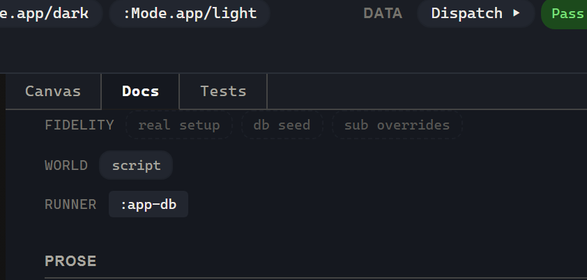

# 3. The fidelity ladder

> **What you'll build.** The same view state reached three different ways — real setup events, a schema-checked db-seed, and a pinned subscription override — and you'll learn to read (and trust) the fidelity badge on each.

## The trustworthy-looking lie

Picture a screenshot in your design-review channel. It shows the error state of a form: red border, "Invalid password," the works. It looks like proof that the error state works. Now suppose I tell you that screenshot was produced by hand-feeding the string `"Invalid password"` directly into a prop, with no validation logic anywhere in the path. The form's actual error handling could be completely broken and this screenshot would look identical.

That screenshot is not proof. It's worse than not-proof — it's a *liability*, because it looks like proof and isn't. This is the precise weakness Storybook can fall into: visual examples that look trustworthy but are disconnected from real application state and effects. You paint a convincing picture by reaching around the machinery, and now you have a green-looking artifact that tells you nothing about whether the machinery works.

Story's position, stated in the vision doc as **Honest Fidelity**, is not "low-fidelity views are forbidden." Low-fidelity views are useful and legitimate — sometimes you genuinely just want to see how the error layout *looks* and you don't care whether you reached it honestly. The rule is narrower and sharper: **a lower-fidelity view is never presented as stronger proof than it is.** You're allowed to fake the state. You are not allowed to forget that you faked it, and the tool won't let you.

## The three rungs

Every variant has a **fidelity**: a set drawn from `#{:real-setup :db-seed :sub-overrides}`. You don't type it — Story *computes* it from the world inputs you actually used. There are three rungs, highest to lowest:

1. **`:real-setup`** (highest fidelity) — real events drive real state through the real router, cofx, and schema path. The state is real because the machinery actually ran.
2. **`:db-seed`** (middle) — a schema-checked `{path → value}` direct seed. It bypasses event and cofx validation, but it *must* validate against the registered app-db schema; a violation fails the run.
3. **`:sub-overrides`** (lowest) — pin a subscription's value by its exact query vector. This is render-path only: it never writes `app-db` and never calls `compute-sub`.

Let's walk them with real examples.

## Rung 1 — real setup

This is the rung nine_states lives on entirely, and it's why nine_states is such a good showcase. Every one of its nine states is reached by dispatching real events into the `:ui/nine-states` machine:

```clojure
;; Empty / One / Some / Too Many — same path, different cardinality.
(story/reg-variant :story.nine-states/some
  {:doc    "State 5 — Some. A small, manageable list."
   :setup  [[:nine-states.app/initialise]
            [:nine-states.story/load {:n 4}]]
   :tags   #{:dev :docs}})
```

`:nine-states.story/load` issues a *real* `:rf.http/managed` fetch (resolved deterministically by the Story frame's canned-success stub), the reply folds back through `:fetch-succeeded`, and the machine's `:always`-cascade picks the cardinality bucket from the item count. Four items lands `:some`; zero lands `:empty`; twenty-five lands `:too-many`. The state is *real* — the machine genuinely transitioned, the fetch genuinely ran. Fidelity: `#{:real-setup}`. Nothing to disclose, because nothing was faked.

## Rung 2 — db-seed

Sometimes a precondition is real but tedious to reach by events — a dozen dispatches to get the form into one specific shape. The middle rung lets you seed `app-db` directly while keeping the schema honesty:

```clojure
(story/reg-variant :story.todos/one-pinned
  {:db-seed {:todos [{:id "t1" :title "Buy milk" :done? false}]}
   :tags    #{:dev :docs}})
```

The runtime merges the seed into the frame's `app-db` *before* any setup runs, then schema-validates the seeded slices against the registered app-db schemas. This is the deal: direct seeding skips event/cofx validation, so in exchange it *must* clear the schema. A seed that violates a registered schema fails the run with `:rf.error/story-db-seed-invalid`, whose data names the offending path, value, and schema. You can't quietly seed garbage; the schema floor catches it. Fidelity: `#{:db-seed}` (or both, if a real-setup step runs on top).

## Rung 3 — sub-overrides (the design-variant rung)

The lowest rung is the pure design variant: paint a state with *zero* events by pinning subscription values directly.

```clojure
{:args          {:message "Invalid password"}
 :sub-overrides {[:login/state]    :error
                 [:login/error]    [:arg :message]
                 [:login/attempts] 1}}
```

When the view derefs `@(rf/subscribe [:login/state])`, it gets `:error` — no events, no app-db write, no `compute-sub`. The `[:arg :message]` placeholder pulls from `:args`, so the controls panel can drive the override value live. Fidelity: `#{:sub-overrides}`.

Now the part to dwell on, because it's the load-bearing boundary of the whole chapter.

!!! warning "The honesty rule"

    A `:sub-overrides` value does **NOT** satisfy `:rf.assert/sub-equals`.

    `:rf.assert/sub-equals` evaluates the subscription through `compute-sub`
    against the frame's real `app-db`. An override never touches `app-db` and
    never calls `compute-sub` — so an overridden value is invisible to the
    assertion. Subscription *correctness* is proven by real setup, a schema-checked
    db-seed, or `compute-sub` — **never by an override.**

This is the mechanism that keeps the tool from lying to you. You can pin `[:login/state] :error` to *look at* the error layout, but you cannot then claim `:rf.assert/sub-equals [:login/state] :error` as proof that your subscription computes `:error` — because it didn't compute anything; you pinned it. The boundary is structural, not a lint rule: the override carriage and the assertion's evaluation path simply don't intersect.

There's a smaller honesty check too. If you pin a value the real derivation could *never* produce — one that violates the subscription's own output schema — Story validates the pinned value against that schema and reports the violation rather than silently painting it. You can't fake a state that's structurally impossible.

## Reading the badge



Every selected variant (and every `variant × mode` cell) carries a compact **fidelity badge**: real-setup, db-seed, or sub-overrides. A few precision points the spec is firm about:

- **Fidelity is not a status.** Pass / fail / cannot-run are statuses; fidelity is a different axis entirely, with its own label and colour.
- **World inputs are not fidelity.** Args, network stubs, fx-overrides — those are *world inputs*, shown as an adjacent chip group with a different label.
- **Runner requirements are not fidelity.** Headless / DOM / browser is a third, separate group.

These three chip groups sit next to each other and mean different things; the spec is careful not to collapse them. And the badge has a deliberate tone: it stays *calm* during exploration (poking at a low-fidelity state shouldn't feel like a scolding) and becomes *explicit* the moment you save it, share it, run it as a test, or otherwise claim proof from it. Cheap exploration isn't punished; dishonest proof is prevented. That's the whole posture in one sentence.

## What you should see now

- A `:real-setup` variant shows the highest-fidelity badge; its `:rf.assert/sub-equals` assertions can pass.
- A `:db-seed` variant shows the middle badge; an invalid seed fails the run with a named schema error instead of painting silently.
- A `:sub-overrides` variant paints with no events and shows the lowest badge; a `:rf.assert/sub-equals` against the pinned value does *not* pass on the strength of the override.

## Where we go next

You've been writing `:script` with `:rf.assert/*` since [chapter 1](01-first-variant.md), without my making a fuss about it. And you just learned that the tool tracks, precisely, how trustworthy each state's *proof* is. Put those two facts together and a question almost asks itself: if the variant carries setup, behaviour, and assertions, and the tool is this careful about what counts as proof… isn't the variant already a test? [Chapter 4](04-the-variant-is-a-test.md): the reveal.
