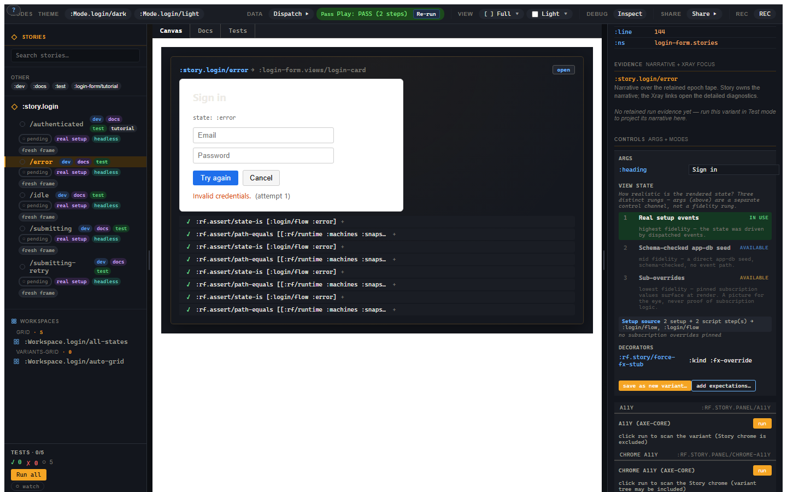

# 3. The fidelity ladder

You want fast UI-state exploration, but you also want to know when the state is
real. This chapter explains Story's fidelity labels: real setup events,
schema-checked app-db seed, and subscription overrides. The point is not to
ban cheap states; the point is to stop cheap states from wearing a fake badge
that says "proved".

## The screenshot that lies

A screenshot of an error state can be useful and still prove almost nothing.
If you painted it by feeding `"Invalid credentials"` straight into the view,
the screenshot proves the red text renders. It does not prove the login flow can
reach the error state, that the machine transitioned correctly, or that the
subscription computes the right value.

Story's answer is **honest fidelity**. Low-fidelity states are useful. They are
just labelled as low fidelity.



## The three rungs

Story computes fidelity from the inputs you use. You do not hand-author the
badge.

| Rung | Meaning |
|---|---|
| `:real-setup` | Real events drove real state through the event pipeline. Highest fidelity. |
| `:db-seed` | App-db was seeded directly, then schema-checked. Useful, but it bypasses event/cofx validation. |
| `:sub-overrides` | Subscription values were pinned for render. Fast design-state exploration, not proof of subscription logic. |

Args are not a fidelity rung. Args are explicit view inputs. Network stubs and
effect overrides are world inputs. Runner requirements such as headless, DOM,
or browser are also a different axis. The UI separates these chips because
collapsing them would make a neat little lie.

## Rung 1: real setup

The login error variant uses real setup:

```clojure
:setup [[:login/flow
         [:login/submit {:email "ada@example.com"
                         :password "wrong"}]]
        [:login/flow
         [:login/failure
          {:failure {:status 401
                     :message "Invalid credentials."}}]]]
```

The event handler runs. The state machine transitions. Subscriptions compute
from the resulting `app-db`. The view renders what the app actually reached.

That is the state you want when the variant is making a behavioural claim.

## Rung 2: schema-checked app-db seed

Sometimes you need a state that would take twenty setup events to reach and the
twenty events are noise for the point of the example. A db seed lets you place
state directly:

```clojure
(story/reg-variant :story.profile/with-avatar
  {:db-seed {:profile {:name "Ada"
                       :avatar-url "/avatars/ada.png"}}
   :tags #{:dev :docs}})
```

The tradeoff is explicit. You skip the event/cofx path, so Story schema-checks
the seeded data. If the seeded slice violates the registered app-db schema, the
variant does not quietly render garbage.

Use this when the state is legitimate but tedious to reach.

## Rung 3: subscription overrides

The fastest design-state path is to pin the value a subscription returns:

```clojure
(story/reg-variant :story.login/error-painted
  {:sub-overrides {[:login/state] :error
                   [:login/error] "Invalid credentials."
                   [:login/attempts] 1}})
```

This is excellent for UI exploration. You can show loading, empty, error, or
permission-denied states before the full event path exists.

It is not proof of the subscription.

```clojure
[:rf.assert/sub-equals [:login/state] :error]
```

does not pass because you pinned `[:login/state]`. `sub-equals` computes the
subscription against the real frame db. Overrides feed the render path. Those
paths intentionally do not intersect.

That boundary is the difference between a tool that helps you design and a tool
that quietly trains you to trust pictures.

## Upgrading fidelity

A good workflow is to start cheap and upgrade when the state becomes important.

1. Use args or sub-overrides to design the shape.
2. Move important state to a db seed if the app-db shape is the thing you care about.
3. Replace the seed with real setup events when the behaviour matters.
4. Add assertions once the state is worth keeping.

You do not need every visual state to be highest fidelity. You do need every
state to say what kind of thing it is. Story's badge is not there to scold you;
it is there to prevent the future bug report that starts with "but the story
was green."
