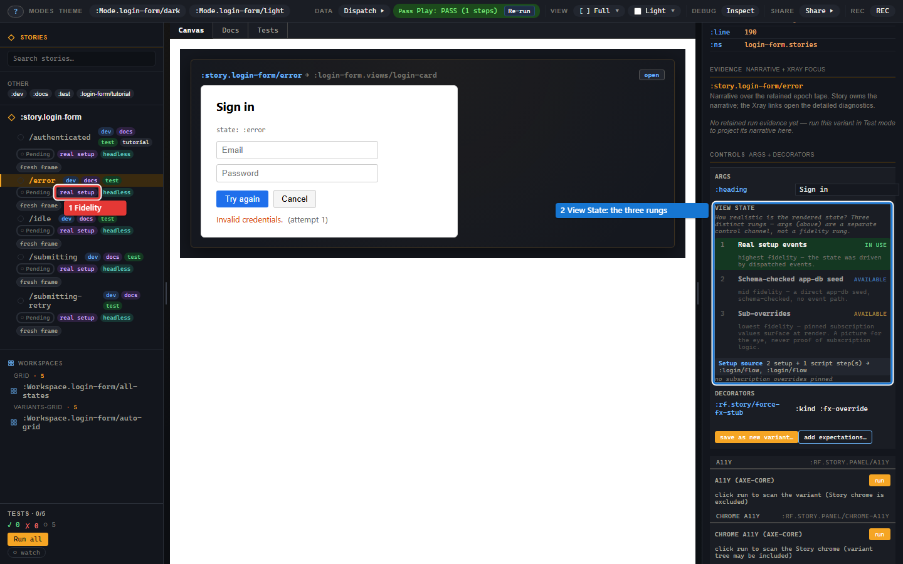

# Choose how a variant reaches its state

Use real setup events when a variant should prove behaviour. Use a db seed
or subscription pins when you need a state for design work before its event
path is convenient or available.

Story labels these inputs so a reviewer can tell what a visible state proves:

| State input | What it establishes |
| --- | --- |
| `:real-setup` | Application events ran through the real event pipeline. |
| `:db-seed` | App-db was seeded directly and checked against registered schemas. Event and coeffect validation were bypassed. |
| `:sub-overrides` | The view received pinned subscription values. The real subscription logic was not exercised by those pins. |

A variant can use more than one of these inputs. Args and effect or network
stubs are separate inputs; they do not lower the fidelity of real setup.

[](../images/story/story-tutorial-03-controls-and-fidelity.png)

## Rung 1: real setup

The login error variant dispatches submit and failure, with HTTP stubbed:

```clojure
;; Requires [re-frame.story :as rf.story] and login-form.stories.
(rf.story/reg-variant :story.login-form/verified-error
  {:extends :story.login-form/error
   :script [[:assert [:rf.assert/state-is :login/flow :error]]
            [:assert [:rf.assert/sub-equals
                      [:login/error] "Invalid credentials."]]]})
```

The application reaches `:error`. The assertions then check the machine
and the subscription computed from it. The stub controls the outside world;
the handlers, transitions and subscriptions still run.

## Rung 2: schema-checked app-db seed

A seed writes app-db before setup and the script. Its keys can be top-level
keys or path vectors. For example, this inline test demonstrates a login
help preference stored directly in app-db:

```clojure
(rf.story/run
  {:db-seed {[:login-help :message] "Use your work account."}
   :script [[:assert-db [:login-help :message] "Use your work account."]]})
```

The resolved result is `:pass`. This tests seeded data; it does not prove
an event can produce that preference. A seed violating a registered app-db
schema fails with `:rf.error/story-db-seed-invalid` before the script.

Machine snapshots are stored in runtime state, so an app-db seed cannot set
the login machine's state. Use real setup for this testbed's machine states.
Use a seed in a view variant when the view's state actually lives in app-db.

## Rung 3: subscription overrides

To try error presentation while leaving the actual machine idle:

```clojure
(rf.story/reg-variant :story.login-form/error-painted
  {:extends :story.login-form/idle
   :sub-overrides {[:login/state] :error
                   [:login/error] "Invalid credentials."
                   [:login/attempts] 1}
   :tags #{:dev :docs}})
```

The view displays the pinned error. The machine remains in the idle state
created by setup. `sub-equals` reads the real subscription against the
frame's state; it would still see `:idle` for `[:login/state]`.
This separation lets a picture stay useful without pretending to test logic.

When a subscription declares an output schema, Story checks the pin against
it. An invalid pin raises `:rf.error/story-sub-override-invalid`.
Pins are a development feature: a release/static build renders real
subscription values instead.

## Upgrading fidelity

Replace the painted variant's `:extends` with the real error scenario,
remove `:sub-overrides`, and add the two assertions in `verified-error`
above. Now the same visible state checks the event path and derived message.

View State's upgrade buttons can generate a starting declaration. Fill in
its setup or seed and review the resulting state before keeping it.
Important behaviour should have explicit assertions; a fidelity label alone
is not a test verdict.

## Troubleshooting

| Symptom | Cause | Fix |
| --- | --- | --- |
| A pin changes the canvas but `sub-equals` still fails | Pins apply only to rendering | Reach the expected state with setup, or test the real subscription's actual value. |
| `:rf.error/story-db-seed-invalid` | Seeded app-db violates a registered schema | Read the violating paths and correct the seed. |
| `:rf.error/story-sub-override-invalid` | A pin violates its subscription output schema | Use a value the subscription can return. |
| A static catalogue shows a different state | Its variant relied on development-only pins | Use real setup or an app-db seed for published states. |
