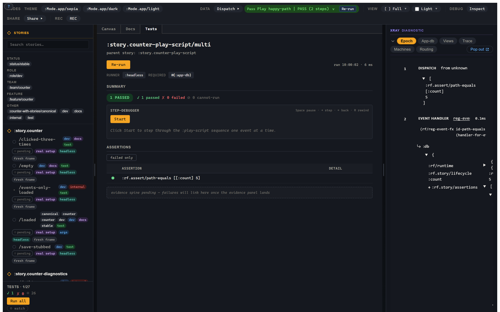

# 4. The reveal: the variant *is* a test

> **What you'll land.** You've been writing tests since chapter 1. The same `reg-variant` body you render is the thing you run. Three verbs do it: `run` / `is` / `explain`. This chapter is where the *test* face arrives — and it turns out you built it three chapters ago without noticing.

## The punchline you set up three chapters ago

Go back and look at the very first variant you wrote:

```clojure
(story/reg-variant :story.counter/empty
  {:setup  [[:counter/initialise 0]]
   :script [[:dispatch-sync [:rf.assert/path-equals [:count] 0]]]
   :tags   #{:dev :docs :test}})
```

It has a precondition (`:setup`). It has behaviour (`:script`). It has an assertion (`:rf.assert/path-equals`). Read that again with fresh eyes: **that is a test.** It always was. You wrote it to *look at* a counter, and the same EDN, untouched, is a passing assertion-bearing test.

This is the central move in Story, and it's why the index promised "one artifact, six faces." The workshop canvas and the test runner are not two code paths that happen to agree. They drive the **same normalized plan** — the *One Path* principle from the vision doc. The green dot in the sidebar and the rendered counter on the canvas are the same artifact wearing two faces. There is no `Counter.test.cljs` shadowing your `Counter.stories.cljs`, because there's nothing to shadow: the story *is* the test.

## The three verbs

The public execution surface is exactly three verbs:

```clojure
(story/run     target opts)   ; run the plan; return the unified run-result
(story/is      target opts)   ; the predicate face for cljs.test / clojure.test
(story/explain target)        ; the plan's :explain map
```

- **`run`** executes the plan and hands you back the full run-result (we'll dissect it below).
- **`is`** is the same execution, reported per-assertion into `cljs.test` / `clojure.test` — this is the verb your test suite calls.
- **`explain`** doesn't run anything; it returns the *plan* — source chain, merge decisions, resolved args, final setup/script order, checks, required runner, platforms, tags. It's how you answer "what is this variant, really, after all the inheritance and composition resolved?"

The `target` is either a keyword (a registered variant) or a map (an inline plan, written on the spot and never registered). The shape is identical both ways — a registered variant and an equivalent inline map run through the same compiler and produce equivalent results. The variant-versus-plan distinction is real for *authoring* (one registers, one doesn't) but it deliberately does not leak into the verbs.

!!! note "Shipping runtime, in one honest aside"

    `run` / `is` / `explain` and the unified `:status` run-result below are the
    normative target contract ([`017`](https://github.com/day8/re-frame2/blob/main/tools/story/spec/017-Testing-Story.md)).
    The shipping runtime entry point you'll see in today's testbed tests is
    `story/run-variant`, which returns a promise resolving to a result keyed with
    `:lifecycle` (rather than `:status`). The migration to the three-verb surface
    is landing; the contract this chapter teaches is the one the tool is converging
    on, and `story/assertions-passing?` reads the result the same way under both.
    Everywhere else in this tutorial uses the target vocabulary.

## Run it from a unit test

Here's a variant being run as an ordinary `cljs.test` unit test. This is grounded in the shipping `counter_with_stories` test suite:

```clojure
(ns my-app.stories-test
  (:require [cljs.test :refer-macros [deftest is]]
            [re-frame.story :as story]
            [my-app.stories]))   ; loads the registrations

(deftest counter-empty-passes
  (let [result (story/run :story.counter/empty)]
    (is (story/assertions-passing? result))))
```

That test runs **headless**, under `npm run test:cljs`. No browser, no Playwright. This matters more than it looks: in re-frame2, the default home for a Story/behaviour test is a fast CLJS unit test, not a browser test. The migration that moved this project's own Story coverage onto unit tests pulled the overwhelming majority of assertions out of Playwright and into headless CLJS — because the variant's behaviour is `app-db` and effects, and you can prove `app-db` and effects without a DOM. Reach for the browser only when the assertion genuinely needs a DOM (a click, a visibility check), which is the subject of [chapter 5](05-recorder-and-cannot-run.md).




## The four-bucket plan (a peek under the hood)

When you author a variant, you write ergonomic top-level keys: `:setup`, `:args`, `:script`, `:checks`, `:assertions`. The plan compiler lowers them into one normalized plan organized around four buckets:

| Bucket | Authored? | Holds |
|---|---|---|
| `:world` | yes | context/harness — frame, setup, args, view-arg schema, network stubs, fx-overrides, fidelity, decorators, platforms. |
| `:script` | yes | ordered behaviour under test — dispatches, waits, interactions, checkpoints. |
| `:expect` | yes | judgement — checks and assertions. |
| `:evidence` | **no** | derived proof from the epoch tape — traces, effects, renders, sub-runs, schema failures, narrative, hashes. |

`:evidence` is never authored; it's *derived from the run*. That distinction — you write `:world` / `:script` / `:expect`, the run produces `:evidence` — is the whole shape of the tool in four words. `story/explain` is how you *see* the lowering:

```clojure
(story/explain :story.counter/loaded)
;; => the plan's :explain map: source chain, merge decisions, resolved
;;    args + substitutions, final setup order, final script order,
;;    checks, terminal assertions, required runner, platforms, tags.
```

When a variant inherits from another or composes a fragment ([chapter 7](07-workspaces-modes-composition.md)), `explain` is how you confirm what actually resolved — it shows both the *source* location and the *normalized* location of every field. Composition without explanation would be hidden global state; `explain` is the receipt.

## The unified run-result

Every runner — Story's Test mode, CI, `clojure.test`, MCP — returns **one shape**:

```clojure
{:status            :pass        ; :pass | :fail | :cannot-run | :error
 :assertions        [...]        ; one record per assertion
 :checks            [...]
 :app-db            {...}        ; final settled db (redacted where marked)
 :epoch-tape        [...]        ; the evidence source (chapter 6)
 :narrative         [...]        ; the scrubbable span/beat projection
 :schema-violations [...]
 :warnings          [...]
 :effects           [...]
 :plan-hash         "..."        ; identity of the plan (chapter 8)
 :run-hash          "..."}       ; identity of the run's behaviour (chapter 8)
```

One shape, consumed by everything. This unification is not bookkeeping — it fixed a real class of bug the spec calls **"false GREEN,"** where a run's top-level state and its assertions slot could disagree (the run says pass; an assertion buried in the list says fail). With one shape and one source of truth, they *can't* disagree.

The invariant that enforces it is worth naming: `tape-shows-failure?`. A run **must not** report `:pass` while the epoch tape carries failure evidence — an unconsumed schema violation, a non-`:ok` epoch outcome, an error effect. The runner asks this of the *projected evidence*, not of some sibling accumulator, so no second bookkeeper can drift and report green over a red tape. The status and the evidence are computed from the same tape, so they agree by construction.

## Assertions: terminal versus checkpoint

There are two places an assertion can live, and the difference is *when* it runs:

- An assertion in the **`:assertions`** slot is **terminal**: it auto-runs after the script settles, against the *final* state.
- An `[:assert …]` step *inside* `:script` is a **checkpoint**: it must be true *at that exact point* in the script.

```clojure
{:setup      [[:counter/initialise 0]]
 :script     [[:dispatch [:counter/inc]]
              [:assert [:rf.assert/path-equals [:count] 1]]   ; checkpoint: true here, now
              [:dispatch [:counter/inc]]]
 :assertions [[:rf.assert/path-equals [:count] 2]]}           ; terminal: true at the end
```

One firm rule: `[:assert …]` is **illegal in `:setup`**. Setup establishes preconditions; it does not judge. Put a verdict in setup and the plan compiler rejects it with `:rf.error/story-assert-in-setup` before anything runs — the fix is to move the assertion to `:script` (as a checkpoint) or to `:assertions` (terminal).

Assertions come in families — dispatchable (the canonical seven), DOM, and tape-evaluated (schema errors, browser-tier oracles) — and the family decides *how* it's evaluated and *which runner* can prove it. That's the bridge to [chapter 5](05-recorder-and-cannot-run.md) (`:cannot-run`) and [chapter 6](06-xray-earned-at-failure.md) (the tape).

## Checks — reusable assertion packs

When the same expectation recurs across variants — "no runtime errors," "no warnings" — wrap it once as a check:

```clojure
(story/reg-check :check/no-runtime-errors
  {:assertions [[:rf.assert/no-warnings]]})

(story/reg-variant :story.counter/loaded
  {:setup  [[:counter/initialise 7]]
   :checks [:check/no-runtime-errors]
   :script [[:dispatch-sync [:rf.assert/path-equals [:count] 7]]]})
```

Checks are the *inheritable* expectation form — they flow down an `:extends` chain, where ordinary `:assertions` do not. We'll lean on that property in [chapter 7](07-workspaces-modes-composition.md#composition--context-flows-down-verdict-is-local), where composition gets its full treatment.

## Where we go next

Writing `:script` by hand is fine, but you shouldn't have to. The recorder writes it for you — tap through a flow in the canvas and out comes a paste-ready EDN script. And the recorder is also the cleanest way to meet the most honest word in the entire tool: `:cannot-run`. [Chapter 5](05-recorder-and-cannot-run.md).
