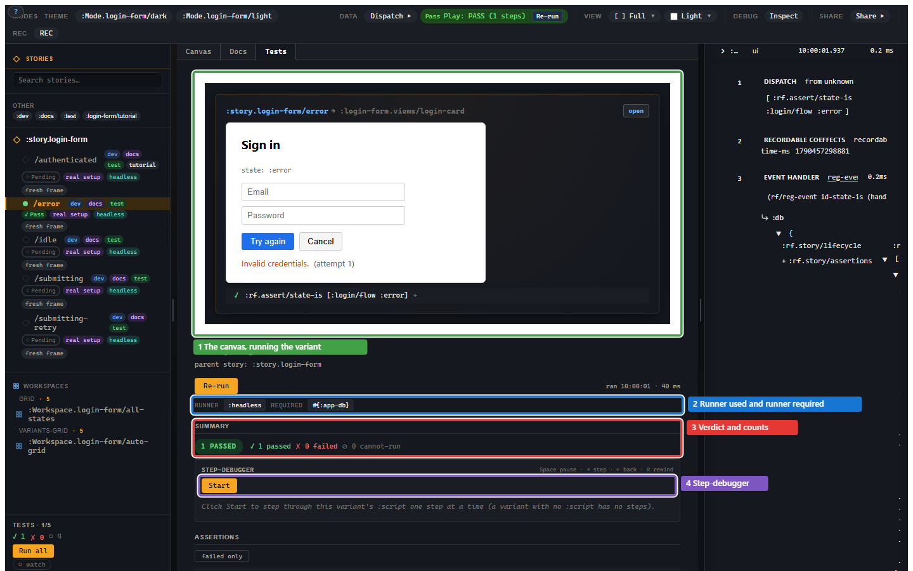

# 4. The variant is a test

You already wrote setup and assertions, so you are closer to a test than you
may have noticed. This chapter shows the Test mode UI and the three execution
verbs: `story/run`, `story/is`, and `story/explain`. The useful idea is that a
variant does not need a second encoding to become a regression test.

## The reveal

Look again at the error variant:

```clojure
(story/reg-variant :story.login/error
  {:setup  [...]
   :script [[:dispatch-sync [:rf.assert/state-is :login/flow :error]]
            [:dispatch-sync
             [:rf.assert/sub-equals
              [:login/error]
              "Invalid credentials."]]]
   :tags #{:dev :docs :test}})
```

It has preconditions. It runs behaviour. It records assertions. That is a
test. It also renders in the workshop, appears in Docs mode, can be shared, and
can be inspected with Xray. Same artifact, different faces.



## Test mode

The Test tab runs the selected variant and shows:

- the runner used;
- the evidence required;
- pass/fail/cannot-run counts;
- one row per assertion;
- the step debugger;
- promotion controls for turning a useful run into a regression variant.

The sidebar also tracks test status, so a state matrix can tell you which
variants have passed without opening each one.

This is not a replacement for unit tests. It is a way for the examples you
already maintain to participate in the test suite.

## The three verbs

The public execution surface has three verbs:

```clojure
(story/run     target opts) ; returns a future/promise of the run result
(story/is      target opts) ; reports through clojure.test / cljs.test
(story/explain target opts) ; returns the compiled plan explanation
```

`target` can be a registered variant id:

```clojure
(story/run :story.login/error)
```

or an inline plan:

```clojure
(story/run
  {:setup [[:login/flow [:login/dismiss]]]
   :script [[:dispatch-sync
             [:rf.assert/state-is :login/flow :idle]]]})
```

Inline plans are useful for one-off tests that do not deserve a permanent place
in the Story sidebar. Registered variants are useful when the state should be
visible, documented, reviewed, or shared.

## Using Story from tests

On the JVM, `story/is` blocks until the run resolves and reports per assertion:

```clojure
(ns my-app.login-stories-test
  (:require [clojure.test :refer [deftest]]
            [re-frame.story :as story]
            [my-app.stories]))

(deftest login-error-story-passes
  (story/is :story.login/error))
```

In CLJS, runs are async, so use the usual `cljs.test/async` shape:

```clojure
(ns my-app.login-stories-test
  (:require [cljs.test :refer-macros [deftest async]]
            [re-frame.story :as story]
            [my-app.stories]))

(deftest login-error-story-passes
  (async done
    (-> (story/is :story.login/error)
        (.then (fn [_result] (done))))))
```

If you want the raw result instead of test reports, call `story/run` and inspect
the resolved map.

## The run result

Every runner returns one result shape. The important keys are:

```clojure
{:status     :pass        ; :pass | :fail | :cannot-run | :error
 :assertions [...]
 :checks     [...]
 :app-db     {...}
 :effects    [...]
 :warnings   [...]
 :evidence   {...}
 :plan-hash  "..."
 :run-hash   "..."}
```

The top-level `:status` is not allowed to report `:pass` while the run contains
unconsumed failure evidence. Schema failures, assertion failures, errors, and
cannot-run rows all roll up into the status. The whole point is to kill the
classic false green: a test that says pass because the one place you looked was
green while the evidence elsewhere was red.

## Explain

`story/explain` does not run the variant. It shows what the variant becomes
after inheritance, composition, args, checks, setup, and script are normalized.

That matters the first time a composed variant surprises you. Instead of
guessing which parent or fragment contributed a field, read the explanation:
source chain, merge decisions, final setup order, final script order, runner
requirements, tags, platforms, and source coordinates.

You can see the same explanation in the Story inspector. It is boring and
explicit. Composition without a receipt is just global state wearing a clever
moustache.

## Checks and assertions

Assertions in `:script` are checkpoints. They run at that point in the script.

Assertions in `:assertions` are terminal. They run after the script settles.

Checks are named assertion packs:

```clojure
(story/reg-check :check/no-runtime-warnings
  {:assertions [[:rf.assert/no-warnings]]})

(story/reg-variant :story.login/error
  {:checks [:check/no-runtime-warnings]
   :setup  [...]
   :script [...]})
```

Checks are the inheritable expectation form. Ordinary assertions are local to
the variant. That rule keeps a parent variant from silently forcing its verdict
onto every child.

You now have a variant that renders, documents itself, and runs. The next
problem is how to author scripts without hand-writing every click and wait.
