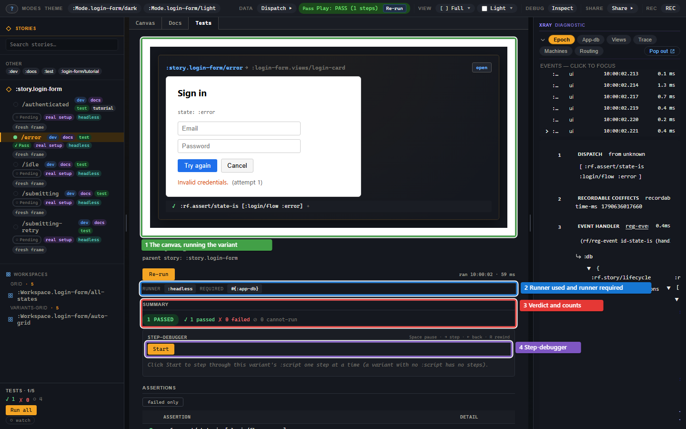

# Run the variant as a test

Keep the scenario and its expectations in one registration. Story's
**Tests** tab makes the result visible while you develop; `rf.story/is`
reports the same scenario through your test framework.

```clojure
;; Requires [re-frame.story :as rf.story] and login-form.stories.
(rf.story/reg-variant :story.login-form/error-message
  {:extends :story.login-form/error
   :script [[:assert [:rf.assert/state-is :login/flow :error]]
            [:assert [:rf.assert/sub-equals
                      [:login/error] "Invalid credentials."]]]
   :tags #{:dev :docs :test}})
```

## Test mode

Select `error-message` and open **Tests** above the canvas. Its setup and
script run again. Expect two passing checks: the machine state and the
message derived from it.

[](../images/story/story-tutorial-04-test-mode.png)

Read the verdict (3) and then the assertion rows. **show detail** compares
expected and actual. On a failure, **open in Evidence →** selects the
associated beat; the [failure walkthrough](06-xray-earned-at-failure.md)
follows it into Xray.

**Re-run** repeats the same declarations. **Step-debugger** runs the script
under Step, Back, Play, Pause and Rewind controls. **Step-through** inspects
states from the last run rather than executing another one.

## Using Story from tests

On the JVM, install the plain-atom adapter with a reset fixture, require
`re-frame.epoch` for run evidence, and load the portable story namespace:

```clojure
;; A repository test using the shipped testbed.
(ns my-app.login-stories-test
  (:require [clojure.test :refer [deftest testing use-fixtures]]
            [re-frame.epoch]
            [re-frame.story :as rf.story]
            [re-frame.substrate.plain-atom :as plain-atom]
            [re-frame.test-support :as ts]
            [login-form.stories]))

(use-fixtures :each
  (ts/make-reset-runtime-fixture {:adapter plain-atom/adapter}))

(deftest rejected-login-is-visible
  (rf.story/is :story.login-form/error-message))
```

`is` blocks until the result is available and reports each assertion to
`clojure.test`. This uses the `error-message` registration you added to the
testbed's stories namespace. In your app, require your own portable stories
namespace instead of the testbed. Keep Story on the test classpath too.

The JVM loads `.clj` and `.cljc`, not `.cljs`. Put application events,
subscriptions and story declarations in `.cljc` for shared headless tests;
require views only in `#?(:cljs …)` branches. No browser is needed for
the machine and subscription assertions above.

In ClojureScript, use an async fixture and await the returned promise:

```clojure
(ns my-app.login-stories-test
  (:require [cljs.test :refer-macros [deftest async use-fixtures]]
            [re-frame.epoch]
            [re-frame.story :as rf.story]
            [re-frame.substrate.plain-atom :as plain-atom]
            [re-frame.test-support :as ts]
            [login-form.stories]))

(use-fixtures :each
  (ts/make-reset-runtime-fixture {:adapter plain-atom/adapter :async? true}))

(deftest rejected-login-is-visible
  (async done
    (-> (rf.story/is :story.login-form/error-message)
        (.then (fn [_result] (done))))))
```

## The Tests widget

The sidebar counts `:test` variants with a script, assertions or checks.
**Run all** runs them serially. **watch** re-runs affected registrations
after hot reload. A tag groups tests; it does not add expectations.

The equivalent JVM suite is:

```clojure
(deftest every-test-variant-passes
  (doseq [id (sort (rf.story/variants-with-tags #{:test}))]
    (testing (str id)
      (rf.story/is id))))
```

Keep runs of the same variant serial: each run resets its frame.

## The three verbs

| Call | Use |
| --- | --- |
| `(rf.story/run target opts)` | Obtain the result for your own tooling; CLJS returns a promise, JVM a `CompletableFuture`. |
| `(rf.story/is target opts)` | Run and report assertions through `cljs.test` or `clojure.test`. |
| `(rf.story/explain target opts)` | Inspect the assembled plan without running it. |

A target is a registered variant id or an inline plan map. `run` and `is`
default to `:headless`. [Runner selection](runners.md) explains DOM tests
and `:runner :auto`. The JVM `is` timeout defaults to 30 seconds;
`{:timeout-ms 5000}` changes it.

## The run result

| Status | Meaning | Action |
| --- | --- | --- |
| `:pass` | Assertions passed and no unconsumed failure evidence remains. | Keep the scenario if it protects useful behaviour. |
| `:fail` | An expectation failed or the run retained unconsumed failure evidence. | Read expected/actual and inspect Evidence. |
| `:cannot-run` | The runner lacks required capability or evidence. | Use a suitable host or supply the missing evidence. |
| `:error` | The plan or execution errored. | Read the named error and its phase before changing expectations. |

`is` reports `:fail`, `:cannot-run` and `:error` as unsuccessful tests.
When outcomes differ, `:error` takes precedence over `:fail`, then
`:cannot-run`, then `:pass`. The
[runtime reference](api/runtime.md#the-execution-verbs) lists result keys
and exact options. `run` resolves a result for errors rather than rejecting
its promise.

## Checks and assertions

`:script` assertions are checkpoints at that step. `:assertions` run
after the script settles. Both are local to the variant; a child does not
inherit its parent's script or ordinary assertions.

Use a check for an expectation shared by related variants:

```clojure
(rf.story/reg-check :check/no-runtime-warnings
  {:assertions [[:rf.assert/no-warnings]]})

(rf.story/reg-variant :story.login-form/quiet-error
  {:extends :story.login-form/error
   :checks [:check/no-runtime-warnings]
   :assertions [[:rf.assert/state-is :login/flow :error]]})
```

Checks inherit through `:extends`. Controls' **add expectations…** can
generate a declaration, including the capabilities each expectation needs.

## Promoting a run

**promote run → regression variant…** generates a declaration from the
executed scenario, preserving its script and expectations. It normally
extends the selected variant to keep setup. Choose a descriptive id, review
the captured inputs and copy it into source. Registering it only in the
shell does not survive reload.

Promotion preserves a failed expectation; fix the cause and re-run it.
An intentionally incorrect assertion should instead be corrected, as in
the [diagnostic exercise](06-xray-earned-at-failure.md#the-failure-path).

## Explain

Use `rf.story/explain` or the right rail's Explain panel when inheritance,
composition or args produce a surprising plan. It shows source chains,
merge decisions, final setup/script order and runner requirements. It throws
on a plan error, such as `:rf.error/story-compose-conflict`, before execution.

## Accessibility beside the example

The a11y panel scans the variant canvas with axe-core after you enable the
CDN-loaded engine. Report violations and incomplete checks separately;
an incomplete check needs human review. A stored browser scan can supply
evidence to `:rf.assert/a11y`. Merely choosing the browser runner does
not perform a scan. Pixel comparison uses
[an external capture tool](08-local-visual-review.md).

## Troubleshooting

| Symptom | Cause | Fix |
| --- | --- | --- |
| No tests registered | The variant has no script, assertions or checks | Add an expectation; a `:test` tag alone does not create one. |
| Cannot run a click on the JVM | The host has no DOM | Run browser interaction in a browser; keep state/effect checks headless. |
| A green final state still produces `:fail` | Earlier failure evidence remains | Inspect schema/error evidence and declare only failures intentionally expected by the test. |
| A parent expectation vanished in a child | Scripts and ordinary assertions are local | Add the child's assertion or use an inherited check. |
| `:rf.error/no-adapter-installed` | The test omitted runtime setup | Install the adapter with the fixture shown above. |
| JVM test cannot load the stories namespace | Registrations are in `.cljs` or absent from the classpath | Move shared declarations to `.cljc` and include their source path. |
