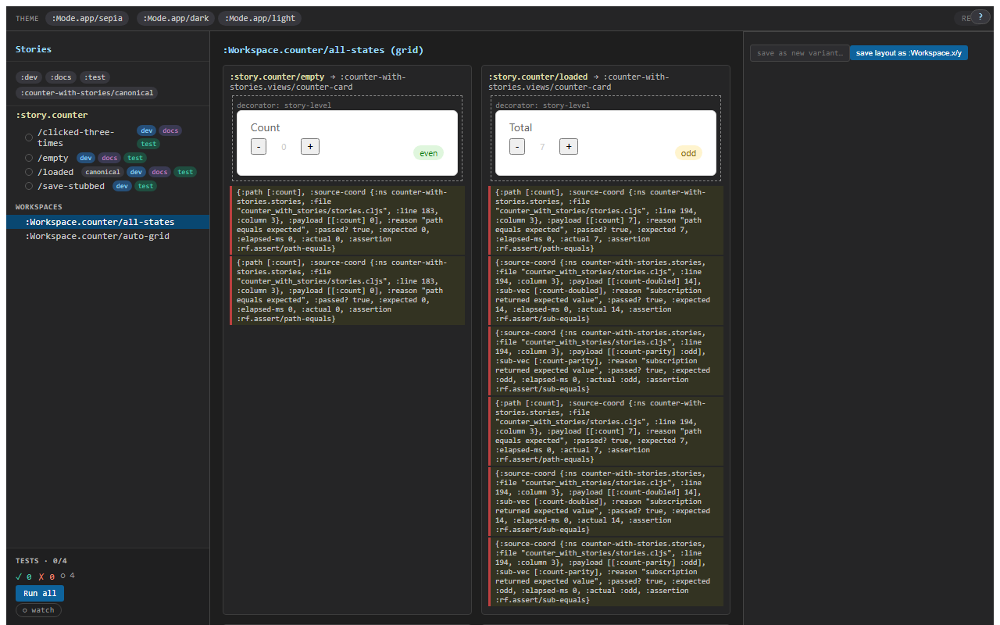

# 4. Workspaces + args editor

A workspace is a layout that arranges variants on one page. Five layouts ship; two of them carry most of the workload.



## Two common shapes

- **`:grid`** — explicit list of variant ids, in order, in a grid. The variant grid you reach for when a story has, say, four named states and you want a screenshot showing all of them.
  ```clojure
  (story/reg-workspace :Workspace.counter/all-states
    {:layout   :grid
     :variants [:story.counter/empty
                :story.counter/loaded
                :story.counter/clicked-three-times
                :story.counter/save-stubbed]
     :columns  2})
  ```
- **`:variants-grid`** — auto-enumerated from a parent story id. New variants land here without touching the workspace.
  ```clojure
  (story/reg-workspace :Workspace.counter/auto-grid
    {:layout  :variants-grid
     :for     :story.counter
     :columns 2})
  ```

Three less-common layouts also ship: `:stack` (vertical), `:overlay` (compare two variants in alternate-rows mode), and `:custom` (you pass a hiccup tree with `(story/variant-cell <id>)` placeholders).

## Per-cell args + modes

Each variant cell in a workspace can carry **per-cell overrides**: args that apply only to this cell. So the same `:story.counter/loaded` variant can render as `{:n 7}` in one cell and `{:n 99}` in another:

```clojure
(story/reg-workspace :Workspace.counter/big-numbers
  {:layout   :grid
   :columns  3
   :cells    [{:variant :story.counter/loaded :args {:n 1}}
              {:variant :story.counter/loaded :args {:n 50}}
              {:variant :story.counter/loaded :args {:n 999}}]})
```

The runtime allocates **a separate frame per cell**. Three loaded-cells = three frames, all independent. Per-cell time-travel (next chapter) is per-frame, so you can rewind one cell without affecting the other two.

## Modes — saved tuples

A **Mode** is a Chromatic-style saved tuple of args that any variant can render against:

```clojure
(story/reg-mode :Mode.app/dark
  {:args {:theme :dark :background "#1e1e1e" :foreground "#e0e0e0"}})

(story/reg-mode :Mode.app/light
  {:args {:theme :light :background "#ffffff" :foreground "#1a1a1a"}})
```

When a variant renders against `:Mode.app/dark`, the mode's `:args` deep-merge into the variant's effective args between the global layer and the story layer (i.e., the mode sits *between* `global-args` and `story-args` in the four-layer chain).

Each `(variant × mode)` cell has its own **snapshot-identity** — visual-regression services key off it. Dark mode and light mode become two screenshots from one variant body. (See [chapter 5](05-snapshot-identity.md) for the snapshot-identity contract.)

## The args editor

In the right-side controls panel, every resolved arg gets an editor row. The editor row is auto-derived from the registered schema (or the `:argtypes` fallback). Editing a value dispatches a `:rf.story/cell-override` event that adds a cell-local override; the canvas re-renders against the new effective args.

The editor row honours the schema's constraints. An `:int {:min 0 :max 99}` is a number-input clamped 0–99. An `:enum [:a :b :c]` is a radio group. A `:map` is a nested editor. A `:string` is a text input.

The cell-overrides are *cell-local* — clicking on a different variant or workspace cell discards them. To make an override stick, click *save as new variant…* (see [chapter 3](03-recorder-codegen.md)).

## Sharing a workspace state

The workspace + active mode + cell-overrides are **transit-shareable**. The *share this layout* button serialises the picked state into a URL fragment; whoever opens the URL sees the same grid in the same state.

This is the v1 sharing primitive — it's what lets you paste "look at this grid" into a chat message and have the reader see exactly what you see. The URL is small; the embedding is forgiving. For the larger / off-network case, the QR-code share affordance (next chapter) does the same thing with a render-to-image step.

## Workspaces are layouts, not state

A workspace doesn't hold any runtime state of its own — it's just an ordered list of `(variant + per-cell args)` tuples. So:

- New variant added under `:story.counter` → an `:variants-grid` workspace picks it up immediately.
- Workspace renamed → all the sidebar links auto-update.
- A variant deletion that leaves a workspace with a dangling reference → the cell renders a "this variant no longer exists" placeholder; the rest of the workspace renders normally.

The contract is "workspaces are layouts over variants"; everything follows from that.

Next: [snapshot identity + QR sharing](05-snapshot-identity.md).
