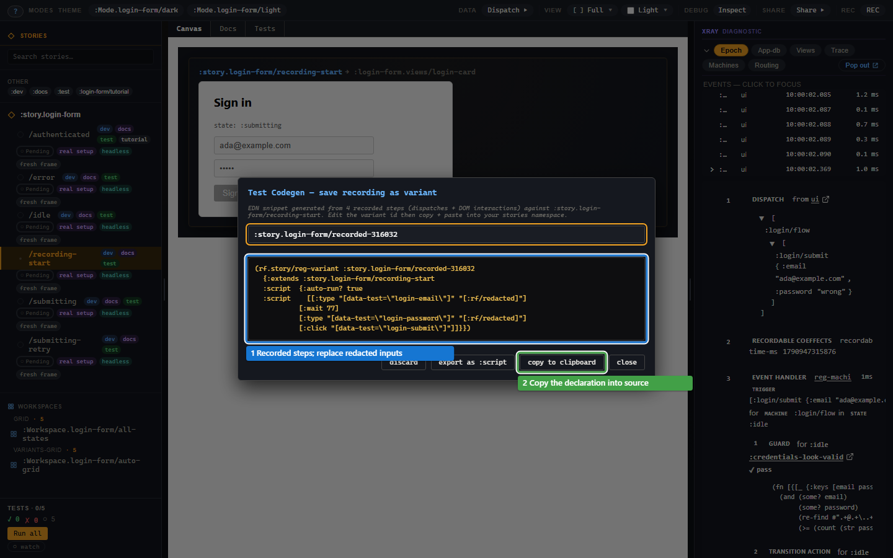

# Record an interaction

Use the recorder to turn canvas interaction into a script, then edit it
into a repeatable test. A recording supplies actions; add assertions for
the behaviour you want to preserve.

## Recording a script

Give the login form a starting variant whose HTTP effect cannot leave the
test:

```clojure
;; In the testbed namespace, which requires [re-frame.story :as rf.story].
(rf.story/reg-variant :story.login-form/recording-start
  {:extends :story.login-form/idle
   :decorators [[rf.story/force-fx-stub-id :rf.http/managed {}]]
   :tags #{:dev :test}})
```

1. Select `recording-start` and press **REC** in the toolbar.
2. Keep **DOM on** to record browser gestures. Type `ada@example.com` and
   `wrong`, then press **Sign in**.
3. Press **REC** again, or **stop** in the overlay.
4. Inspect the generated form in **Test Codegen**.

[](../images/story/story-tutorial-11-recorder.png)

Email and password fields are redacted. The recorded form therefore needs
edited test inputs before it can replay meaningfully. Keep synthetic values,
remove incidental pauses and add a useful expectation:

```clojure
(rf.story/reg-variant :story.login-form/submit-from-form
  {:extends :story.login-form/recording-start
   :script [[:type "[data-test=login-email]" "ada@example.com"]
            [:type "[data-test=login-password]" "wrong"]
            [:click "[data-test=login-submit]"]
            [:assert [:rf.assert/state-is :login/flow :submitting]]
            [:assert [:rf.assert/effect-emitted :rf.http/managed]]]
   :tags #{:dev :test}})
```

Open **Tests** on this variant. Expect the form to show Signing in and both
assertions to pass. The stub holds the request, so the test checks submission
and effect emission without pretending that a server accepted the login.

DOM gestures replay the events the view dispatches. The recorder omits those
dispatches as separate steps to avoid doing the same action twice.
**DOM off** records dispatched events instead, which is useful when the
claim belongs in a headless state test.

## What belongs in setup and script?

Setup establishes the state the viewer should land on. Script is the
behaviour to observe or test. A rejected-login display uses submit and
failure as setup. A rejection-interaction test puts them in its script:

```clojure
(rf.story/reg-variant :story.login-form/rejection-interaction
  {:extends :story.login-form/recording-start
   :script [[:dispatch [:login/flow
                        [:login/submit {:email "ada@example.com"
                                        :password "wrong"}]]]
            [:assert [:rf.assert/state-is :login/flow :submitting]]
            [:dispatch [:login/flow [:login/failure {:failure {:status 401}}]]]
            [:assert [:rf.assert/state-is :login/flow :error]]]
   :tags #{:dev :test}})
```

This second version tests the real event path without depending on DOM
selectors. Both examples control the outside world and declare what they
expect.

## The shapes of script

`:script` accepts a vector of steps or a map with `:script`, an optional
`:name` and `:auto-run?`. A bare vector auto-runs. Setting
`:auto-run? false` leaves the play manual; the normal test verbs skip it.
Use `:plays` for several named scripts instead of `:script`.
The [script reference](api/script.md#script-shapes-and-plays) gives exact
forms and selection rules.

## The steps

Dispatch, assertion and DOM steps are enough for most scenarios. Dispatch
steps settle before the next step. Setup accepts only dispatches; checkpoints,
DOM gestures and waits belong in the script. A known step with malformed
arguments raises `:rf.error/story-bad-step`.

The recorder can insert checkpoints with **+ assert**. **export as :script**
offers a replay preview and optional final app-db checks. Review generated
checks: an incidental state change is not necessarily behaviour worth testing.
The [reference](api/script.md#the-grammar-tagged-step-forms) lists every step.

## Waiting without flakiness

Use `[:wait-until [:queue-empty]]` or a declared db condition rather than
a fixed pause. The runner checks it after the preceding dispatch settles;
an unmet condition fails the step rather than waiting indefinitely.
A machine state is in runtime state, so check it with `state-is`, not an
app-db wait.

`run` and `is` honour fixed `:wait` steps, but deterministic replay
checks report them as `:cannot-run`. Remove recorder pauses that are not
part of the interaction's meaning.

## Cannot-run

The DOM script needs a browser document. A headless run reports
`:cannot-run` for its DOM steps, and `is` treats that as an unsuccessful
test. It does not mean the login code failed. The
[runner guide](runners.md) shows how to choose a host that can perform
the step and distinguish missing capability from a failed expectation.

## Runner capability ladder

Story's runner ids are `:headless`, `:hiccup`, `:cljs-reactive`,
`:dom` and `:browser`. Their capabilities are enumerated in
[the runtime reference](api/runtime.md#runner-capabilities).

## Privacy at the recorder boundary

The recorder replaces text from password, email and tel inputs, and
credential/payment autocomplete fields, with `"[:rf/redacted]"`.
Sensitive events are removed from generated scripts. Matching typed strings
are also redacted from retained event payloads. Replace redacted values with
synthetic inputs when building a replay; classification does not manufacture
usable credentials.

## Troubleshooting

| Symptom | Cause | Fix |
| --- | --- | --- |
| Replayed form never submits | Redacted email/password are not valid test inputs | Replace them with the synthetic values shown above. |
| Headless run says `:cannot-run` | Recorded steps need a DOM | Run them in the browser, or keep an event-based version of the test. |
| Setup raises `:rf.error/story-assert-in-setup` | An assertion was placed before the script | Move it to `:script` or terminal `:assertions`. |
| Setup raises `:rf.error/story-setup-step-unrunnable` | It contains a wait or DOM gesture | Use a setup event; put the gesture in the script. |
| A selector matches no element | The component or selector changed | Inspect the canvas and update the selector; prefer stable data attributes. |
| The recording disappears after reload | Only the live shell held it | Copy the reviewed registration into source. |
