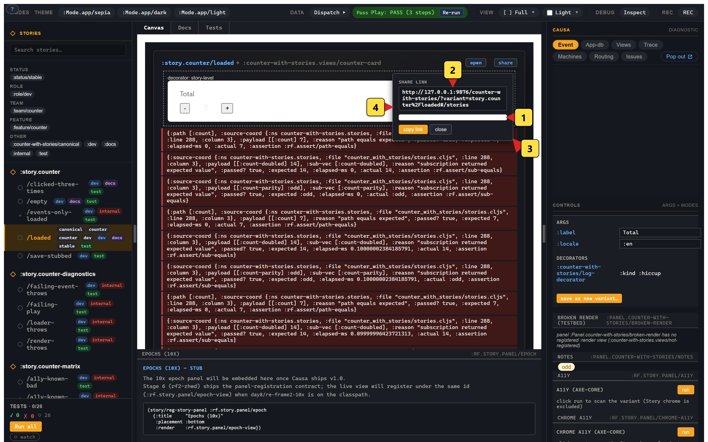

# 5. Snapshot identity + QR sharing

> **What you'll build.** A conceptual model of how Story keeps your visual-regression baselines stable across variant renames, plus practical understanding of the *share via QR* affordance. No new code in this chapter; the snapshot-identity machinery is already running against every variant you've registered. We're going to look at it.
>
> **You should have working before you start.** Chapters 1–4. The chapter's payoff lands harder if you've felt the *pain* it's solving — try renaming a Storybook story sometime and watch Chromatic forget the baseline.

So here's a scenario. It is going to feel mundane until the bill comes due.

You're three weeks into building the login form. Five variants are pinned to Chromatic (or Argos, or Percy, or your in-house diff tool): `:story.login/idle`, `/submitting`, `/error`, `/submitting-retry`, `/authenticated`. Two weeks of baselines. The design team has signed off on each one. The visual-regression service is happy. Your team is happy. Everyone is happy.

Then a teammate looks at the names and pushes back. *Submitting-retry* is awkward; what's wrong with calling it `:story.login/retrying`? You agree; it's a five-second edit; you push. CI runs Chromatic against the new build.

Forty-eight new buckets land in the dashboard. Forty-eight old buckets get archived. The diff service shows every "new" screenshot as a 100%-novel image — *because the bucket key is the variant slug and the slug just changed*. Two weeks of baselines, gone. Not because the pixels changed, but because the *name* did.

This is the trade-off Storybook 9 ships and most playground tools after it: **identity-by-slug**. Rename anything and the diff service forgets. The conventional wisdom in the JS community is that you just don't rename things, which is, frankly, a bizarre concession for an industry that otherwise believes deeply in refactoring. Names are bad on day three of a project because nobody knew on day three what the thing would turn into; if you can't fix them on day eighty without losing two months of baselines, the cost of the playground tool has quietly leaked out into the surrounding development culture. Don't rename. Don't restructure. Don't move that variant to a better-named parent story. Your baselines are *fragile*.

Story's snapshot identity is **content-based** — a hash of what's rendered, not what it's called. Renames are free. The bucket key tracks the *picked state*, not the *name path*. Same screenshot, same hash, same bucket. We are not going to be cleverer than the visual-regression services about merging slug histories or whatever else they could plausibly do upstream; we're just going to give them a different key.

## What identity tracks

Every variant cell — the `(variant × mode × per-cell args)` tuple — has a **snapshot identity**: a content hash of everything that determines what the canvas will render. The hash is the join key visual-regression services use to bucket screenshots; it's how Story tells Chromatic, Argos, Percy, Lost Pixel, or your in-house diff tool *this screenshot is the same scenario as last week's — diff them*.

Concretely, on the five-state login form:

- Renaming `:story.login/submitting-retry` → `:story.login/retrying` doesn't change the identity. **Same bucket; baselines preserved.**
- Renaming a top-level `:Mode.login/dark` → `:Mode.login/midnight` doesn't change the identity either. **Same bucket; baselines preserved.**
- Changing the `:heading` arg from `"Sign in"` to `"Welcome back"` *does* change the identity. **New bucket; new baseline required.**

The contract: **identity tracks content; name tracks lineage.** Both are stable, separately.

The hash itself is a SHA-256 of a transit-printed tuple — `:resolved-args`, `:mode-args`, an `:events-fingerprint`, and a `:decorators-fingerprint`. Crucially, the *variant slug itself is not part of the input.* The fingerprint hashes what the variant *produces*, not what it's called. The hash is deterministic across machines, build tags, and load orders — the contract on `:resolved-args` enforces sorted-keys and canonical types so two readers computing the same identity will agree byte-for-byte.

## A worked rename — `:submitting-retry` → `:retrying`

Walk through the rename on the login-form testbed.

**Before** (the variant body in `tools/story/testbeds/login_form/stories.cljs`):

```clojure
(story/reg-variant :story.login/submitting-retry
  {:doc        "The user corrected the typo and re-submitted."
   :events     [[:login/flow [:login/submit {:email "ada@example.com" :password "wrong"}]]
                [:login/flow [:login/failure {:failure {:status 401}}]]
                [:login/flow [:login/retry  {:email "ada@example.com" :password "correct-horse"}]]]
   :decorators [[story/force-fx-stub-id :rf.http/managed {}]]
   :play-script [[:dispatch-sync [:rf.assert/state-is :login/flow :submitting-retry]]]
   :tags       #{:dev :docs :test}
   :substrates #{:reagent}})
```

The fingerprint Story computes for this variant under `:Mode.login/dark` (canonical, sorted, transit-printed) is roughly:

```clojure
{:resolved-args          {:heading "Sign in", :theme :dark}
 :mode-args              {:theme :dark}
 :events-fingerprint     "sha256:f3a1…"
 :decorators-fingerprint "sha256:9c40…"}
```

Notice the slug `:story.login/submitting-retry` is nowhere in that tuple. The SHA-256 of the whole thing is, say, `e2b7f4…a1`. That's the bucket key. Chromatic has two weeks of baselines pinned to `e2b7f4…a1`.

**After** the rename, the variant body is identical except for the slug:

```clojure
(story/reg-variant :story.login/retrying
  {:doc        "The user corrected the typo and re-submitted."
   :events     [...]   ; unchanged
   :decorators [...]   ; unchanged
   :play-script [[:dispatch-sync [:rf.assert/state-is :login/flow :submitting-retry]]]
   :tags       #{:dev :docs :test}
   :substrates #{:reagent}})
```

Re-run the fingerprint computation on the new variant. The `:resolved-args` are the same `{:heading "Sign in", :theme :dark}`. The `:events-fingerprint` is the same `sha256:f3a1…` because the events sequence is identical. The `:decorators-fingerprint` is the same. The SHA-256 is *still* `e2b7f4…a1`.

Chromatic, Argos, Percy, Lost Pixel — every one of them keys on the hash. The bucket continuity holds. Your two weeks of baselines are intact.

(One nit: if your assertions still pin the *machine* state name `:submitting-retry`, you'd want to rename the machine state separately. The variant identity is decoupled from internal naming, but your tests aren't.)

## QR sharing — local-vendored encoder

Story's *share via QR* button renders the snapshot identity (plus the picked workspace, active modes, and cell-overrides) into a QR code, displayed inline. Scan with a phone; the phone opens a URL into your locally-served Story instance at that exact picked state.



*(1) The QR code itself, scannable from any phone camera. (2) The full share URL string above the QR. (3, 4) The popover hosts the Copy-as-image and Copy-as-URL affordances — both wired into the standard `navigator.clipboard` flow.*

The motivating use case: design review against a real device. You've built the login form's `:error` variant; the design lead wants to see it on the actual phone they were thinking about, not the Chrome device emulator. Click the QR. Scan with the phone. The phone opens the variant on your dev server at the same picked state — same args, same mode, same workspace overrides. Two seconds, instead of the usual "let me get my laptop on the same WiFi as your phone."

The QR encoder is **vendored locally** via the `qrcode-generator` npm package (MIT, ~52 KB unpacked, zero deps) per rf2-20w5i. There's no network roundtrip when you open the popover, no third-party tracking, no leaking the share URL (which encodes your variant state and cell-overrides) to anyone. The encoder lives at `re-frame.story.qr/qr-svg-string` and the popover splices the SVG inline. Production builds short-circuit before the encoder code is reachable; the prod bundle carries no QR bytes.

Two affordances on the QR popover:

- *Copy as image* — for embedding in design docs.
- *Copy as URL* — same content, text-shaped, for chat / issue trackers.

This is one of those features where the implementation is small (a few dozen lines of glue around a vendored encoder) and the user value is disproportionate. We make this trade often in Story; we'll keep making it. Cheap-but-good is the right default for a developer-session tool.

## Snapshot artefacts in the static build

Story's `story-static` artefact (built via `npm run story:build` from `implementation/`) materialises one HTML page per `(variant × mode)` cell, named by snapshot identity. Visual-regression services consume the static build directly — each PNG comes with a stable identity, and diffs are by identity.

A few snapshot-identity hygiene rules worth internalising:

- **Don't read non-deterministic values during render.** `(js/Date.)`, `(rand)`, `(.now js/performance)` — any of these inside a view body inflates the identity for the same picked args, because the fingerprint walks rendered output. Push them out (cofx, decorator-driven mocks). Story emits a warning trace for non-determinism if it can detect it; it can detect the common shapes but not all of them.

- **`:large?`-tagged slots are elided from the fingerprint.** A 2 MB image payload in `:cart/preview-image` doesn't change the identity if only its byte content changes. Useful for variants that exercise large-payload behaviours without dirtying every diff.

- **`:sensitive?`-tagged values participate in the fingerprint as a hash of the value, not the value itself.** Story honours the path-level privacy contract — secrets don't leak into snapshot identities the diff service receives.

These three rules turn out to cover almost everything you'll hit in practice. The "non-deterministic value during render" gotcha is the most common; the path-marks integration is the most quietly important if you handle credentials anywhere.

## Why content-based identity is unusual

Storybook's identity is path-based — slugs, story titles, mode names. Visual-regression buckets follow the slug. Rename anything and you've broken bucket continuity. The JS community has worked around this with naming-convention discipline ("don't rename") and ad-hoc bucket-migration scripts, but the underlying primitive doesn't help.

Story's identity is *content-based*. Stable identity follows the content. Renames are free. The trade is that an args-tweak is a new identity — which is the point: you *want* the diff service to flag that the picked state changed, because that's a real visual difference.

A second trade worth naming: **the agent self-healing loop relies on this.** When an agent generates a new variant via the MCP write surface — say, prompted with "give me an `:error` variant where the server returns 503 instead of 401" — the bucket continuity for the *existing* `:story.login/error` snapshot is determined by the content hash, not the agent's chosen name. The agent can generate-then-name without worrying about colliding bucket keys, and a human can rename what the agent produced without breaking the diff service's history.

The pattern composes: humans rename freely, agents generate freely, the diff service stays anchored to what's actually rendered. The cost we pay is one extra layer of indirection (`name → content-hash → bucket` instead of `name → bucket`); the cost we save is "everyone has to internalise that names are immutable, forever." For a pre-alpha tool that's going to live with us for years, this is the trade we want to make.

## You should now see

There is no explicit "you should now see" for this chapter — the snapshot identity machinery is already running against every variant you've registered. To verify it's working:

- Call `(story/snapshot-identity :story.counter/empty)` at the REPL (or in cljs-test); you should get a SHA-256 string back.
- Rename a variant slug; recompute the identity; the hash should be unchanged.
- Edit a variant's `:args` slot; recompute; the hash *should* change.
- Click the *share via QR* button on any variant; a QR code should appear inline (no network calls).

## When it doesn't work

- **Two readers / two machines / two CI runs compute different identities for the same variant.** Most common cause: a `js/Date.` or `(rand)` snuck into a view body. The fingerprint walks rendered output; non-determinism in the render inflates the hash. Search the variant's render path for time / random / performance reads.

- **Identity changed but you didn't think you changed anything.** Check `:resolved-args` carefully. A change to `:argtypes` doesn't change identity. A change to `:doc` doesn't change identity. A change to `:tags` doesn't change identity. A change to *any value that survives into args*, or to the `:events` sequence, or to the `:decorators` chain, *does* change identity. Print `(story/snapshot-identity variant-id {:debug? true})` to see the input tuple verbatim.

- **The QR popover loads but the QR code is blank.** The encoder failed; almost always a CSP issue with inline SVG. Check the console; whitelist `data:` URIs if your CSP is strict.

- **Chromatic / Argos / Percy is still rebucketing on rename.** They're keying off the slug, not the snapshot identity. The integration shape is: your visual-regression service should consume the `story-static` artefact's filenames (which are snapshot identities), not the variant slug. If you're feeding it slugs, switch to identities and watch the rebucket noise drop to zero.

## Where we go next

Chapter 6 is short. We've talked about time-travel as a Causa feature throughout the tutorial; chapter 6 spells out *what changes when you time-travel inside Story*, because the per-variant frame isolation makes the gesture qualitatively different from time-travel against a single host app.

Next: [time-travel in Story](06-time-travel.md).
