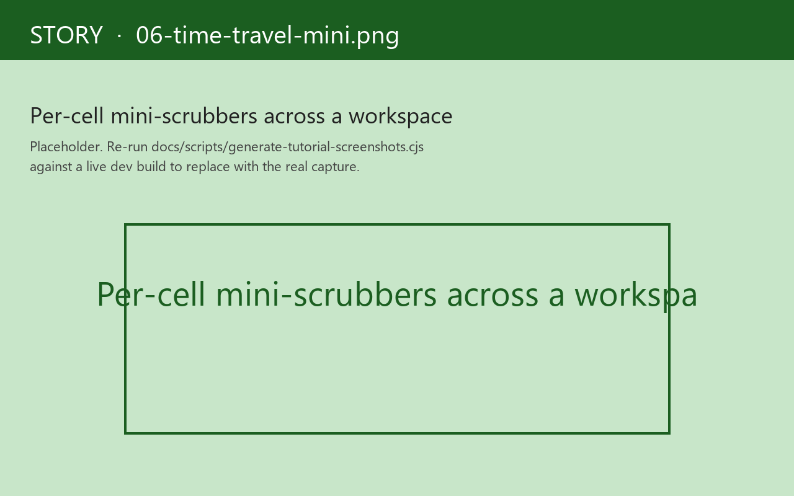

# 6. Time-travel in Story

The same time-travel surface [Causa](../causa/03-time-travel.md) renders against the host app, Story renders against each variant frame. Every variant has its own ring buffer of epochs; rewinding one doesn't affect another.

The Story shell's right-side panel carries a scrubber per active cell. Drag backwards to passively scrub the cell; click *restore* to actively rewind the cell's frame.

## Why per-variant matters

Storybook's interaction recorder runs sequentially against one canvas. To compare two scenarios you re-mount the page.

Story's frame-per-variant isolation makes parallel time-travel natural. A workspace of four variants is four independent epoch buffers. Rewinding *empty* doesn't affect *loaded* or *clicked-three-times* or *save-stubbed*. You can rewind one cell while watching the play sequence in another.

## What you'd reach for it for

- **"My play sequence asserts something that's wrong at step 4. Why?"** — open the variant in Canvas mode, run the play step-by-step, scrub backwards from the failing assertion. The epoch one back from the failure is the state the assertion ran against.
- **"I want to capture the canvas at three points in the variant's lifecycle."** — `:play` it; the runtime records an epoch per step; scrub to each, screenshot.
- **"I'm tuning a play sequence."** — write the events, scrub through them, see what each one did to `app-db`. Edit. Re-run. The buffer is fresh each session.

## The six failure modes, again

`restore-epoch` against a variant frame has the same six failure modes as against the host app's frame (see [Causa chapter 3](../causa/03-time-travel.md)):

- Unknown frame
- Unknown epoch
- Schema mismatch
- Missing handler
- Version mismatch
- Concurrent-drain rejection

Story renders the failure mode inline at the scrubber — same red toast, same `:reason` / `:explain` / `:missing-id` / `:expected`-`:got` payload. The runtime's contract is what's stable; Story just paints.

## Per-cell scrubbing in a workspace

In a `:grid` workspace, every cell gets a *mini-scrubber* affordance — a small thumbnail rail at the bottom of the cell with epoch markers. Dragging it scrubs that cell. The right-side panel scrubber is the "currently focused cell" scrubber; click any other cell to switch focus.

This is heavy on screen real estate when you have eight cells. The shell hides the mini-scrubbers behind a *show scrubbers* toggle; default off. The picked state is per-workspace.

## When time-travel isn't the right tool

Two cases:

- **"I want to replay the variant from the start with a tweaked arg."** That's not time-travel; that's *re-run with override*. Edit the arg in the controls panel; the variant re-runs from the start with the new arg. Time-travel is for *examining what already happened*, not for re-running with changes.
- **"I want to time-travel the trace bus, not the app-db."** Story doesn't expose a trace-bus rewind because the trace bus is a log, not a state. To re-render the trace from a different angle, use the right-side Trace strip's filters (the same `:op-type` / tag / free-text filters Causa offers).

The point of time-travel here, as in Causa, is that *the runtime already recorded the state*. Story is just renaming the runtime's epoch buffer into a UI gesture.

Next: [multi-substrate side-by-side](07-multi-substrate.md).
