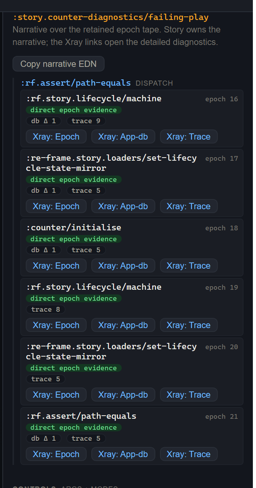

# 6. Xray, earned at the moment of failure

> **What you'll build.** A deliberately failing variant, then a walk down the evidence spine — author-level script spans over epoch-level beats — and time-travel back to the exact beat where it broke. This chapter delivers the *replay* face.

## A failing run must not greet you with an EDN blob

Here is a small test of a debugging tool's character. A run goes red. What's the *first* thing the tool puts in front of you?

A bad tool dumps an app-db diff, or a trace tree, or — the worst — a raw EDN blob the size of a phone book, and invites you to go fishing. You spend the next ten minutes scrolling through state you don't care about looking for the one thing that's wrong. A good tool answers a different question first: *what failed, and why?*

Story's vision doc names this principle **Beautiful Failure**: a failing run should produce a readable path from intent to cause, not a log dump. And it pins the order explicitly — a failure-state hierarchy:

1. **What failed** — the assertion, in human terms.
2. **Which authored step or assertion** it belongs to.
3. **Whether the runner could actually observe** the evidence (the `:cannot-run` check from [chapter 5](05-recorder-and-cannot-run.md)).
4. **The causal span and its epoch beats.**
5. **The relevant Xray panel.**
6. **Raw details**, last.

That order is normative. A failed run *must not* first confront you with a diff or a blob. It leads with the readable thing and lets you descend toward the raw thing only when you ask.

## The evidence spine — a two-level narrative

The central artifact of diagnosis is the **evidence spine**, and the key idea is that evidence is a *narrative*, not a log dump. The spine has two levels:

- **Spans** (the author level) — your `:script` steps. "Dispatch `:counter/init`." "Assert `:count` is 999."
- **Beats** (the epoch level) — the committed epochs each step produced: db changes, effects, trace events, renders, sub-runs, schema failures.

A span sits *over* its beats. And here's the load-bearing detail: because a `[:dispatch …]` step settles to a fixed point, **one dispatch step may span several epoch beats** — a handler that re-dispatches produces a cascade of committed epochs, all attributed to the one authored step you wrote. Pure assertion and wait steps that commit nothing produce empty spans. Every epoch lands in exactly one span; none are invented, none dropped.

All of this is projected from **one retained epoch tape**. That's the part that makes it trustworthy: there is a single source of truth, so the UI, CI, the docs, and an agent cannot disagree about what happened. The spine you read while debugging is *the same evidence* the test verdict was computed from.

Let's make it concrete. Here's a deterministically-red variant, drawn from the counter diagnostics testbed:

```clojure
(story/reg-variant :story.counter-diagnostics/failing-play
  {:doc    "Deterministic failing assertion: init to 1, assert 999."
   :setup  [[:counter/initialise 1]]
   :script [[:dispatch-sync [:rf.assert/path-equals [:count] 999]]]
   :tags   #{:dev :test :internal}})
```

The run fails, predictably. On the spine you see the failed assertion row; expand it to its span; the span points at the beat that committed `:count` as `1`; and the gap between "expected 999, got 1" is right there, attributed to the exact step you wrote. You never went fishing.



!!! note "Floor-state, honestly"

    The *navigation projection* behind the spine — the pure functions that flatten
    spans-over-beats into an addressable beat sequence (below) — ships today, and so
    does the two-level **spine UI** in the Story shell (above): the failed span
    expands over its epoch beats, each beat carrying its db diff and a one-gesture
    Xray link. Per the north-star spec
    ([`018`](https://github.com/day8/re-frame2/blob/main/tools/story/spec/018-Story-UI-North-Star.md)
    §6) the remaining refinement is the scrub slider above the spine, which is still
    converging. The data is real and JVM-testable, the spine is rendered, and the
    evidence is right there in the run-result.

## Earned at failure — the no-fourth-mode discipline

You might expect a debugging-heavy tool to have a big "Evidence" tab front and centre. Story deliberately does not. Evidence is **not a fourth top-level mode** — the mode tabs stay *Dev / Docs / Test*, and the first screen stays render-first and calm. Poking at variants shouldn't feel like staring into a diagnostics console.

But — and this is the tension the spec resolves carefully — *at the moment of failure*, evidence must feel primary. A failed assertion, a selected result row, an Xray link must reach the causal evidence in **one gesture** (the spec's X1 budget). The no-fourth-mode decision fails outright if a developer debugging a red variant has to go *hunting* for the cause.

So the discipline is: **you don't pay the Xray complexity tax until you need it.** The calm workshop is the default; the deep diagnostic surface is one gesture away the instant something breaks. It's earned, not always-on.

And there's a clean ownership boundary that makes this work, stated once in the spec:

- **Story owns** the evidence spine, the Explain panel, and the surrounding inspector chrome (title, chip row, selection, the focus commands).
- **Xray owns** the diagnostic interiors: [app-db diffing](../xray/09-app-db-diff.md), views/subscription invalidation, trace and epoch detail, the machine and routing inspectors, and [time-travel](../xray/03-time-travel.md).

Story brought you here; Xray shows you the detail. Story does not build a second app-db/trace inspector to compete with Xray — it embeds Xray and links into it.

## Time-travel — the scrub backbone

The two-level narrative is a *tree* (spans over beats), but when you debug you move *linearly* — beat, next beat, next beat. Four pure navigation helpers flatten the tree into an addressable beat sequence, and this is the navigation math that ships today, JVM-testable, independent of any UI:

| Helper | Returns |
|---|---|
| `(story/narrative-beats narrative)` | the ordered beat vector; each beat carries its 0-based scrub address. |
| `(story/beat-count narrative)` | how many scrubbable beats — the slider's extent. |
| `(story/beat-at narrative idx)` | the beat at scrub position `idx`. |
| `(story/beat-epoch-ids narrative)` | the ordered `:epoch-id`s; the Nth is the `restore-epoch` target for scrub position N. |

Combine `beat-epoch-ids` with `restore-epoch` and you have a scrub: move to position N, restore that epoch, look at `app-db` *as it was at that beat*. This is the move that fuses testing and storytelling — **the same evidence produces the test verdict *and* a scrubbable causal storyboard.** Test mode and Docs mode are built on the identical spine.

nine_states is the perfect time-travel showcase, because its transitions are discrete and named. Scrub the load cascade:

```
:nine-states.story/load
  → [:fetch-started]       (→ :loading)
  → [:rf.http/managed ...]  (a real fx — shows in Xray's Side Effects)
      → canned reply
      → [:fetch-succeeded ...]
          → :resolving → :always-cascade picks the cardinality bucket
```

Restore-epoch onto the `:resolving` microstep and watch the `:always`-cascade choose `:some` from the item count. Because the machine's transitions are discrete and named, every beat is a meaningful, inspectable moment — exactly what time-travel is for. (Xray's [time-travel guide](../xray/03-time-travel.md) covers the scrub interaction in depth.)

## Reading a schema failure

One more diagnostic, because it's the net-new fail mechanism worth knowing. `:rf.assert/schema-error` is **tape-evaluated** — it is not dispatched into the frame; it's minted by the result boundary against the epoch tape. A schema violation in the tape *fails the run*. (And a variant can legitimately *expect* a violation via the `consumed-selectors` set — "yes, this input is supposed to be rejected.")

```clojure
(story/reg-variant :story.counter-matrix/schema-invalid
  {:doc    "Deliberately invalid args against the parent story schema."
   :args   {:label 42}                 ; :label should be a string
   :setup  [[:counter/initialise 4]]
   :tags   #{:dev :test :internal}})
```

The run surfaces the exact failing key — `:label`, expected string, got `42` — on the evidence spine and in Xray's schema timeline, while the shell stays interactive. You get the *one* thing that's wrong, named, not a wall of valid state you have to scan past.

## Where we go next

Now that you can *diagnose* a failure, let's talk about arranging the workshop itself: the two different things confusingly both called "mode," composition that keeps variant bodies DRY without Storybook's decorator opacity, and the capstone — turning the failure you just diagnosed into a permanent regression variant that lives in the grid. [Chapter 7](07-workspaces-modes-composition.md).
