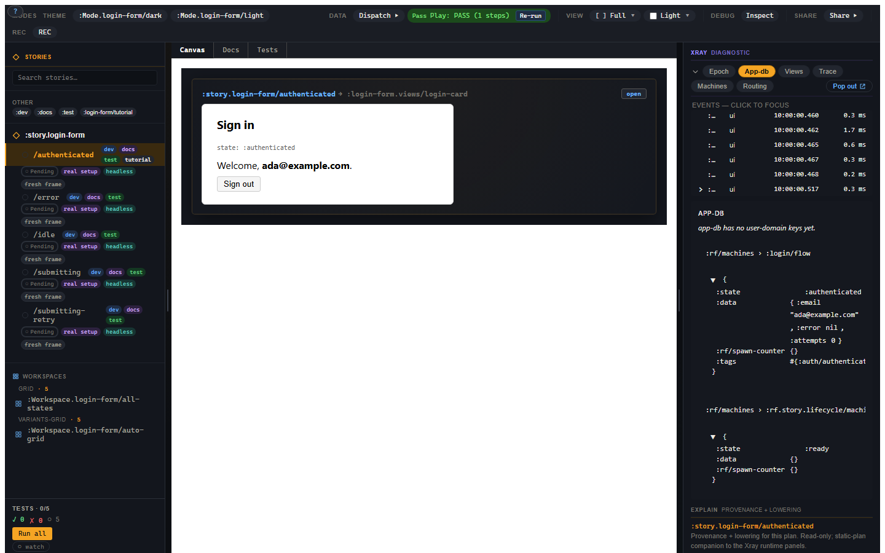

# 6. Xray, earned at failure

You have a failing variant and you do not want a giant EDN blob as your prize.
This chapter shows the diagnostic boundary: Story tells you which variant,
script step, expectation, and run result matter; Xray shows the runtime detail
behind that moment. The goal is a short path from "red" to "cause".

## Story owns the example

Story knows:

- which variant you selected;
- which setup and script ran;
- which assertions passed, failed, or could not run;
- which args and world inputs were active;
- which evidence belongs to this run.

That is the narrative layer. It should answer the first human question:

> What failed?

It should not open with an app-db dump. That is how tools punish honesty.

## Xray owns the deep panels

Story embeds Xray in the right-hand rail. The panel chips are the familiar Xray
surfaces:

- Epoch;
- App-db;
- Views;
- Trace;
- Machines;
- Routing.

Story does not build another app-db inspector or trace viewer. That would create
two tools that can disagree about the same run, and then everyone gets to spend
an afternoon saying "interesting" in a meeting. Story brings the run into focus;
Xray handles the detailed runtime inspection.

## The failure path

A good failure flow looks like this:

1. Test mode shows the failing assertion.
2. The assertion row names the expected and actual value.
3. The evidence/narrative points at the relevant script span.
4. The span points at the epoch beats produced by that step.
5. The Xray link opens the right panel at the right runtime fact.

Not every visual refinement of this path is final, but the boundary is: Story
owns the author-facing run narrative, and Xray owns runtime diagnosis.

## What the epoch tape buys you

re-frame2 records committed epochs: what event ran, what app-db changed, which
effects were emitted, which subscriptions and views ran, which trace events were
produced, and where schema failures appeared.

Story projects that evidence for the selected variant. Xray lets you inspect it
in detail. This is why a Story failure can be better than an ordinary component
test failure: the run is not just red, it is red with a retained causal record.

For a login failure, Xray can show:

- the `:login/flow` dispatches in order;
- the machine snapshot under `[:rf.runtime/machines :snapshots :login/flow]` (in runtime-db);
- the effect stub for `:rf.http/managed`;
- the final error data in app-db;
- the assertion event that recorded the verdict.

## Evidence is not a fourth top-level mode

The Story shell has Canvas, Docs, and Tests. It does not have a fourth
"Evidence" tab.

The default workshop stays focused on states, examples, and tests. Evidence
becomes primary when a run needs it: a failed assertion, an Inspect gesture, or
a selected Xray panel brings it forward.

Story stays calm until the moment it must be specific. Debugging a red variant
surfaces evidence without a hunt, and ordinary state review is never drowned out
by evidence shouting over it.

## Schema failures

Schema violations are especially important because final state can hide them. A
handler may roll back a bad value or recover to a valid db, while the trace still
contains the violation that should fail the run.

Story treats schema failure evidence as part of the run. That means "the final
app-db looks clean" is not enough to wash away a schema error emitted earlier.
The trace remembers. Xray shows it. Story's result should not green-light it.

You now have a diagnostic path. The next thing to learn is how to keep a growing
variant library organized without smuggling behaviour through hidden globals.
