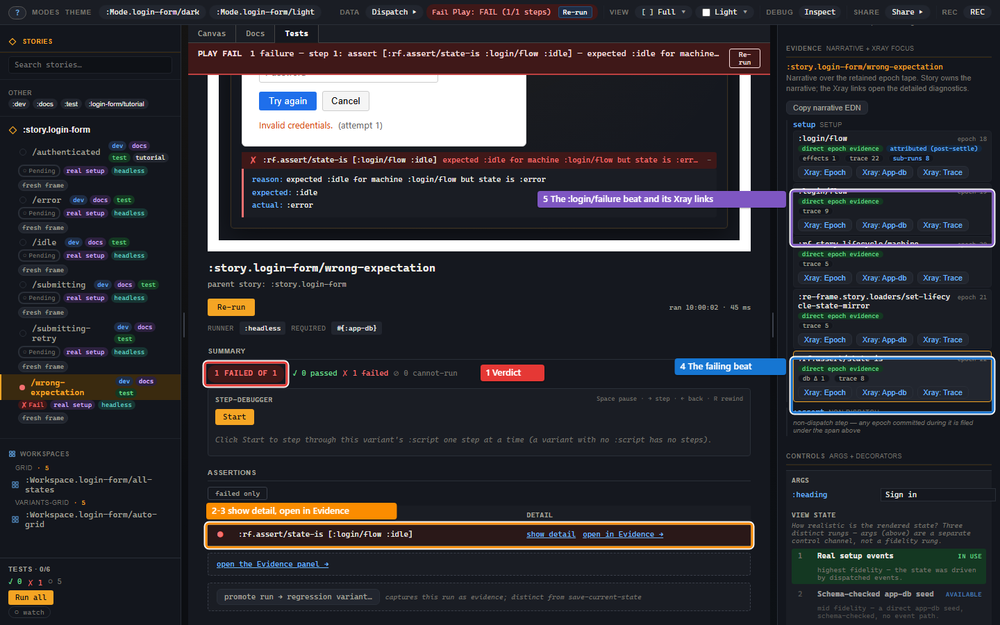
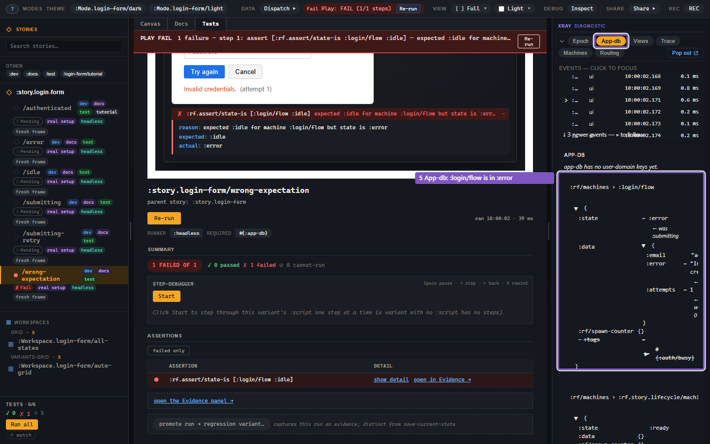

# Diagnose a failed test with Xray

Story names the failed expectation. Xray shows the application events and
state changes behind it. Follow one failure into Xray, identify why it
happened, then re-run the same scenario.

## The failure path

In the login testbed's stories namespace, add this diagnostic exercise:

```clojure
;; Intentionally wrong: this exercise makes a visible failure.
(rf.story/reg-variant :story.login-form/wrong-expectation
  {:extends :story.login-form/error
   :script [[:assert [:rf.assert/state-is :login/flow :idle]]]
   :tags #{:dev :test}})
```

The correct expectation for this setup is:

```clojure
[:assert [:rf.assert/state-is :login/flow :error]]
```

Keep the wrong expectation briefly to inspect the failure:

1. Select `wrong-expectation` and open **Tests**. Expect one failed assertion.
2. Press **show detail**. Compare expected `:idle` with actual `:error`.
3. Press **open in Evidence →**. The right rail selects the associated beat
   in the run's narrative.
4. Find the setup's second `:login/flow` beat, whose payload is
   `:login/failure`. Choose **Xray: App-db**.

[](../images/story/story-tutorial-09-failing-run.png)

[](../images/story/story-tutorial-07-xray-embed.png)

The machine moved from `:submitting` to `:error` when setup delivered
`:login/failure`. The scenario did what it declared; its expectation was
wrong. Change `:idle` to `:error` and re-run. Expect a pass.

For an application regression, keep the correct expectation and fix the
handler, transition or derived value that violates it. A
[named regression variant](04-the-variant-is-a-test.md#promoting-a-run)
keeps that reproduction in the test suite.

## Read the evidence

The narrative groups setup and script steps into spans. Events within them
have beats with epoch ids and counts for state changes, effects, traces,
subscription runs and renders. A non-dispatch step may have no separate
beat; its recorded verdict can be associated with the preceding span.

**Xray: Epoch**, **Xray: App-db** and **Xray: Trace** select that beat's
frame and epoch. Inspect the event's payload, state change and emitted
effects, then follow a source link to the code responsible.

Direct epoch evidence was recorded while the event ran. Subscription and
render evidence labelled **attributed (post-settle)** was matched afterwards.
Use it to investigate re-renders while keeping that attribution limit in mind.

**Copy narrative EDN** gives a bug report the executed sequence and evidence.
Docs mode shows the first beats of the same run. Evidence is a right-rail
panel, beside the canvas, rather than another main mode tab.

## Xray in the right rail

The rail observes the selected variant's frame and offers Epoch, App-db,
Views, Trace, Machines and Routing. Select another variant and the observed
frame changes. **Pop out** opens the full Xray shell for its other panels.

For a story that usually needs machine diagnosis:

```clojure
(rf.story/reg-story :story.login-form
  {:component :login-form.views/login-card
   :xray-panel :machines})
```

A variant's `:xray-panel` wins over the parent's. Clicking a rail chip
overrides the initial choice for the session. The `:xray` preset map can
also choose the full shell's panel and initial filters.
The [registration reference](api/registration.md#story-body) records the forms.
Static catalogues omit Xray.

Story disables Xray's global shortcuts so the shell's own shortcuts work.
Use panel controls inside the embed and its pop-out.

## Schema failures

A valid final state does not erase a violation from an earlier event.
Story keeps schema-failure evidence in the result. Unconsumed violations
prevent a pass, even when a handler rolled back or a later event repaired
the value. Xray's schema records identify the location, path, value and schema.

Use `:rf.assert/schema-error` only when a test deliberately expects a
specific violation. The [assertion reference](api/script.md#schema-error)
describes matching and consumption; the
[Xray schema exercise](../xray/06-schema-timeline.md) shows the runtime view.

## Troubleshooting

| Symptom | Cause | Fix |
| --- | --- | --- |
| Evidence is empty | The variant has not run, or the host did not retain epochs | Re-run in the development shell and check epoch collection. |
| A script checkpoint has no event beat | It did not dispatch application work | Inspect the preceding setup/dispatch span and the assertion's associated beat. |
| An Xray link cannot show an old epoch | The capture was reset or evicted | Re-run the scenario and inspect its new capture. |
| Xray shows another variant | The selected frame changed | Select the failed variant again and follow its Evidence link. |
| State-is fails despite a plausible app-db | Machine state lives in runtime state | Inspect the machine snapshot, not only ordinary app-db paths. |
| A repaired db still gives a schema failure | The run retains an earlier violation | Fix its source or declare the specific expected violation. |
