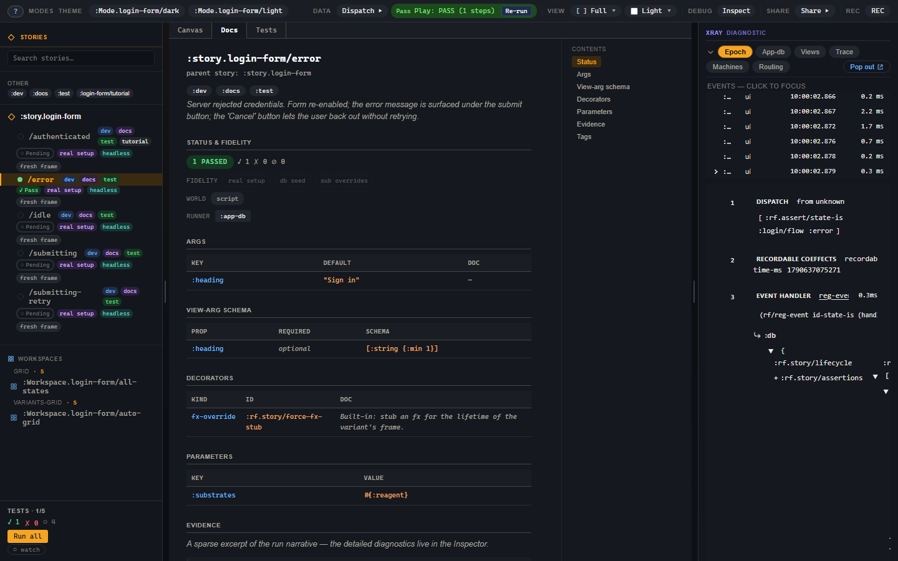

# Docs mode

Docs mode, the **Docs** tab above the canvas, turns the selected variant into
a documentation page. The page is built from the registration itself, so it
stays in step with the variant the canvas renders and the test runner runs.

Under the variant's id, parent story and `:doc`, the page's sections are:

| Section | What it shows |
|---|---|
| Status & fidelity | The last run's status, the fidelity rung, the world inputs and the runner requirements. |
| Prose | The prose blocks of any `:prose` workspace that shows this variant. |
| Args | Every resolved arg, with its default and its `:argtypes` description. |
| View-arg schema | The view's `:rf/props` schema, when it has one. |
| Decorators | The resolved decorator stack, outermost first. |
| Parameters | The variant's `:modes`, `:substrates` and `:platforms`, or its story's where it declares none. |
| Evidence | The first two beats of the last run, each with **Inspect in Xray**. |
| Tags | The tags, as chips that toggle the sidebar's tag filter. |

A Contents list beside the sections jumps between them. Select a story
header in the sidebar, rather than a variant, and Docs mode shows every
variant's sections one after another under the story's `:doc`.

## Writing the page

Most of the page comes from what the variant already declares. Three things
are written for it:

- the `:doc` strings on the story and on each variant;
- a `:doc` on an arg's `:argtypes` entry, which the Args section shows beside
  the arg, as in `{:heading {:control :text :doc "The card's title."}}`;
- the prose of a `:prose` workspace that includes the variant
  ([Workspaces](07-workspaces.md#prose)), which the Prose section repeats.

Status and Evidence come from the variant's last run in Test mode. Until it
has run, the Evidence section says there is no evidence yet and points you at
the Tests tab; the full narrative is in the Evidence panel
([chapter 6](06-xray-earned-at-failure.md#the-failure-path)).

## Try it on the login error

Select the error variant, open **Tests** to obtain a run, then open **Docs**.
Compare its Args and Decorators with Controls and its registration. The
Evidence section comes from that same run, so its Inspect button takes Xray
to the corresponding event rather than a newly executed scenario.

## Troubleshooting

| Symptom | Cause | Fix |
| --- | --- | --- |
| Evidence says no run is available | No result has been stored for this variant | Open Tests and run it. |
| A section is absent | The registration supplies no corresponding data | Add the relevant doc, arg description or prose workspace. |
| All variants appear instead of one | A story header is selected | Select the individual variant in the sidebar. |
