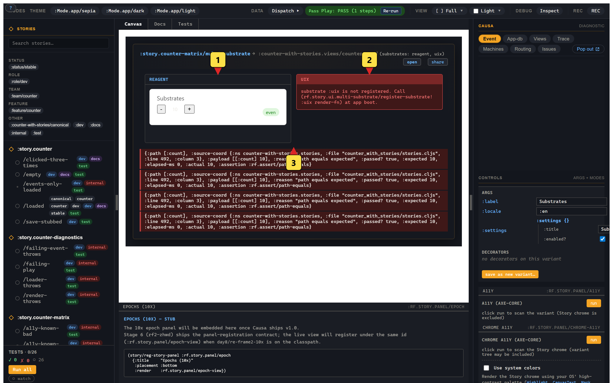

# 7. Multi-substrate side-by-side

> **What you'll build.** A `:substrates` slot on `reg-story` that pivots the variant grid to render under multiple view substrates side-by-side. You'll know which audiences this chapter is for, and (more importantly) the shape of view code that has to hold up under all of them.
>
> **You should have working before you start.** Chapters 1–6. Concretely, you need view code that's *substrate-agnostic* — registered via `reg-view`, no substrate-specific imports inside the view body. If your views are still importing `reagent.core` directly inside their bodies, this chapter won't help yet; come back after you've moved to `reg-view`.

We need to be upfront about the audience here. Most apps pick one view substrate at `init!` time and stay there for the life of the project. If you've picked Reagent (or UIx, or Helix, or Reagent-slim), and you're going to stay on it, the multi-substrate machinery in this chapter is genuinely not something you'll need. You can read this chapter as a curiosity, or skip it and treat the tutorial as complete after chapter 6.

The audience this chapter *is* for:

- **Adapter authors.** When you're writing a new adapter (or fixing a regression in an existing one), you compare the same variant under your new adapter and the canonical Reagent. Visual divergence is a bug in the new adapter, with very high probability. The diff is per-variant, per-arg-tuple, per-mode — a tiny budget for differences.

- **Component-library maintainers.** A re-frame2 component library that ships across substrates lives or dies on whether `:re-com/dropdown` renders the same way under all four. Side-by-side is the regression test that doesn't exist anywhere else in the ecosystem, because no other framework has multi-substrate adapters in the first place.

- **Apps migrating substrates.** When a project moves from Reagent v1 to Reagent v2, or from Reagent to Reagent-slim for bundle-size reasons, or from any substrate to any other substrate, side-by-side variants are the safety net during the rolling migration.

If none of those three describe you, treat this chapter as background. If one of them does, the chapter's the daily diff.

## How to declare it

re-frame2 ships with four view-substrate adapters: **Reagent**, **Reagent-slim**, **UIx**, and **Helix**. Story's `:substrates` slot on `reg-story` (or per-variant on `reg-variant`) declares which substrates the parent story exercises:

```clojure
(story/reg-story :story.counter
  {:component  :counter-with-stories.views/counter-card
   :substrates #{:reagent :uix :helix}
   :args       {:label "Count"}})
```

Now every variant under `:story.counter` mounts under all three substrates, side-by-side, in a tri-cell layout. Pick whatever subset you need; the runtime picks the layout dimensions based on the cardinality.



*The `:story.counter-matrix/multi-substrate` variant declares `:substrates #{:reagent :uix}`. (1) The Reagent cell renders the counter card. (2) The UIx cell projects an "unsupported substrate" notice — this testbed only registers the Reagent renderer with the substrate registry, so unsupported substrates fail loudly rather than silently. (3) The whole multi-substrate render group, framed by the canvas.*

## What you see

Three columns. Same variant. Three substrates rendering it. If a substrate-specific behaviour diverges — Reagent's r-atom mount semantics vs UIx's signal mount, say — the three columns diverge visibly. That's the entire point of the side-by-side: visual confirmation of behaviour parity.

The three columns aren't independent renders of three different variants; they're the *same variant body* mounted under three different substrate adapters, each in its own frame, each computing its own snapshot identity. Visual-regression services key off the `(variant × substrate)` pair as separate buckets — so a regression in only the UIx adapter doesn't pollute the Reagent baselines.

## The contract on substrate-agnostic views

For `:substrates` to work, your view registration must be substrate-agnostic. Concretely:

- **No `:require` of substrate-specific libraries from inside the view body.** No `reagent.core`, no `uix.core`, no `helix.dom`. The substrate-specific libs may be needed at the *adapter* level, but not in your view code.

- **Use `reg-view`, not `defn` returning hiccup.** `reg-view` is the substrate-agnostic registration macro; the adapters interpret the registered body. A bare `defn` returning Reagent-flavoured hiccup will work under Reagent and break under UIx because the hiccup conventions differ subtly between substrates.

- **For host-specific affordances, guard them.** Reagent's `[:>]` shape, UIx's `$` shape — if you genuinely need substrate-specific code (rare, but happens), guard it behind `(case (rf/substrate) :reagent ... :uix ...)`. Most apps never need this.

Views that *do* need substrate-specific code aren't covered by `:substrates`; they live under a single-substrate parent story. The adapter chapters at [Guide 19 — Adapters](../guide/19-adapters.md) walk the gotchas in detail.

The discipline of writing substrate-agnostic views is, frankly, also a discipline you should be aiming at *in general* — it pays for itself even if you never multi-substrate. Substrate-agnostic views are easier to test, easier to read, less coupled to the host React conventions, and (the kicker) immune to the periodic React-internal breaking changes that ripple through every framework downstream. We are not subtle about wanting you to write them this way regardless of multi-substrate.

## What the side-by-side diff is for

Three audiences, the same primitive, slightly different uses:

- **Adapter author writing a new substrate.** The diff is your validation suite. You implement the adapter; you run an existing variant grid; you visually inspect the new column against the canonical Reagent column. Where they diverge, you have a bug. The diff replaces the manual test plan you'd otherwise have to write.

- **Component-library maintainer.** The diff is your regression test. Every release, you run the variant grid across substrates; visually-identical = no regression. The CI pipeline can run the static-build artefact through visual-regression services per `(variant × substrate)` pair and gate the release on byte-stable diffs.

- **Project mid-migration.** You're moving from Reagent to UIx. You want to know which components are safe to flip and which aren't. The diff tells you: anywhere the columns diverge is somewhere you haven't yet ported correctly. Work your way through, one component at a time, until the diff goes clean. Then you can flip the adapter at `init!` and delete the old substrate.

## What's deferred

Two surfaces aren't in v1.0:

- **Per-substrate args.** You can't currently say "use these args under Reagent and those args under UIx." Args are substrate-agnostic. If the substrates need different args to produce the same output, the registered view is doing something host-specific that probably should be factored out. (If we built per-substrate args, we'd be giving you the rope to hang yourself with.)

- **Cross-substrate snapshot identity.** Today every substrate produces its own snapshot identity, because the rendered DOM is hashed. A future `:semantic-fingerprint` slot would let visual-regression diff *intended output* rather than *rendered output*; the spec rev is open. Today the right tool is human visual review against the side-by-side.

We'd rather ship the smaller, sharper primitive and grow into it than ship a feature-rich version that locks us into the wrong abstractions. Pre-alpha posture.

## You should now see

After working through this chapter:

- A story with `:substrates #{:reagent :uix}` should render two columns when selected, one per substrate.
- Visual divergence between columns should be obvious at a glance — that's the design.
- Adding a substrate to the `:substrates` slot should immediately add a column on next render.
- Removing a substrate should remove the column.

## When it doesn't work

- **Only one column shows up.** Most common cause: only one substrate is *registered* in the host app's boot. The `:substrates` slot on a story is the intersection of `(registered substrates × declared substrates)`; if you've only `init!`'d Reagent, that's all you'll see regardless of what's declared. Check `(story/registered-substrates)` at the REPL.

- **One column renders, the others say "substrate not supported".** Same root cause as the above, but more transparent — the adapter for that substrate isn't on the classpath. Add the adapter dep to `:dev` and re-cycle the build.

- **The columns look subtly different in ways you can't explain.** Welcome to substrate semantics. Reagent uses r-atoms with batched updates; UIx uses signals; Helix uses hooks; the mount lifecycles differ. The cases where you see visible divergence are *real* — that's information about your view code's portability. Read the differences; either fix the substrate-specific behaviour or accept that this variant is single-substrate.

- **The variant's `:play-script` runs against only one substrate.** Correct — play-scripts run per frame, and the multi-substrate render allocates multiple frames. The CI runner's gate is per `(variant × substrate)` to match. If you want a play-script to assert across substrates, that's a `cljs-test` against multiple `run-variant` calls, not a play-script feature.

---

## That's Story

We've covered:

- **The three load-bearing rules** — frame-per-variant, EDN bodies, record-don't-throw. Internalise these and the rest of Story makes sense as a consequence.
- **The daily affordances** — variants, mode tabs, the recorder, workspaces. The 80% of the playground you'll reach for in a normal week.
- **The differentiators** — snapshot identity (content-based, rename-safe), time-travel (per-variant Causa embed), multi-substrate (same variant, several adapters). These are the bets re-frame2's substrate let us make that weren't available to upstream Storybook.
- **The agent surface** — story-mcp, the EDN-first variant body, the recorder's data output. The self-healing loop that wasn't a use case five years ago and is going to matter more every year.

If you want to look at a worked example end-to-end, [`tools/story/testbeds/counter_with_stories/`](https://github.com/day8/re-frame2/tree/main/tools/story/testbeds/counter_with_stories) wires every macro and every authoring shape against the canonical counter app — five variants, several workspaces, every assertion shape, every decorator kind, plus passing integration tests. It's the closest thing to a reference implementation of the patterns this tutorial walks.

For the richer five-state login form we kept gesturing at, [`tools/story/testbeds/login_form/`](https://github.com/day8/re-frame2/tree/main/tools/story/testbeds/login_form) is the runnable testbed — the variant set that pulls together FSM-driven scenarios, `force-fx-stub`-mocked HTTP, and the full chrome surface in one place.

Or, more usefully than any worked example: open `#/stories` against your own app, register one variant, and see how it feels. The point of a playground tool is its ergonomics, and ergonomics need to be felt rather than read about. The twelve-line `stories.cljs` from chapter 1 is enough to get there. We'd rather you experience the surface than read another chapter about it.

Welcome to Story. Tell us what's awkward; we're listening.
