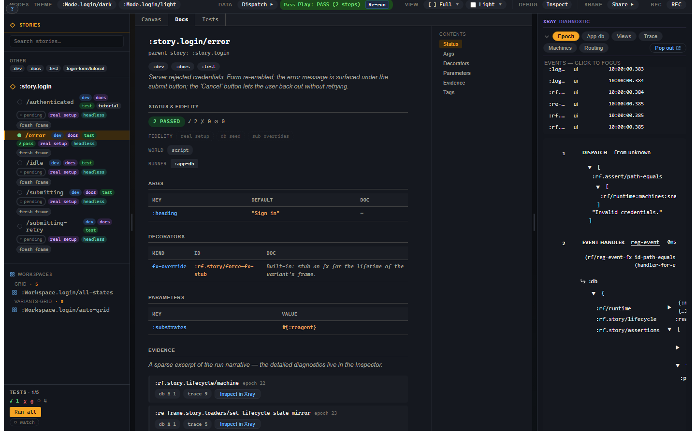

# 7. Workspaces, modes, composition

You have more variants than you want to copy-paste. This chapter explains the
organizational tools: workspaces for layout, mode tabs for Canvas/Docs/Tests,
toolbar modes for environment pivots, and composition for shared setup. The
design goal is reuse without the classic "a decorator did something somewhere"
mystery.

## Three things people call modes

There are two real Story concepts and one browser habit that often get mashed
together in conversation.

**Mode tabs** are the tabs above the canvas:

- Canvas;
- Docs;
- Tests.

They change how the selected artifact is presented.

**Toolbar modes** are registered arg tuples:

```clojure
(story/reg-mode :Mode.login/dark
  {:doc  "Dark theme."
   :axis :theme
   :args {:theme :dark}})
```

They change the environment the artifact renders in.

**Browser modes** such as viewport and background are chrome selections. They
are useful for review, but they are not the same thing as `reg-mode`.

Keeping those drawers separate prevents a surprising amount of nonsense.

## Docs mode

Docs mode renders the selected variant as executable documentation.



The page is built from the same registered variant:

- `:doc` becomes prose;
- tags become chips;
- args and view schemas become tables;
- decorators and parameters are listed;
- status and fidelity are visible;
- evidence excerpts appear after a run.

This is the important drift-killer: a documented state is not a Markdown
example that someone has to keep in sync. It is the same state the canvas and
test runner use.

## Workspaces

Workspaces are layout artifacts. The common layouts are:

| Layout | Use it when |
|---|---|
| `:grid` | You want explicit variants in a specific order. |
| `:variants-grid` | You want every variant under a story parent. |
| `:tabs` | You want one variant visible at a time. |
| `:prose` | You want prose interleaved with rendered variants. |
| `:custom` | You have a registered view that owns the layout. |

Most projects start with `:grid` and `:variants-grid`. The more editorial
layouts become useful when a component or workflow deserves real documentation.

## Toolbar modes

Toolbar modes are saved args:

```clojure
(story/reg-mode :Mode.app/light
  {:axis :theme
   :args {:theme :light}})

(story/reg-mode :Mode.app/dark
  {:axis :theme
   :args {:theme :dark}})
```

Modes with the same `:axis` are mutually exclusive. Turning on dark turns off
light. The active mode args sit in the args precedence chain below story and
variant args:

```text
global < mode < story < variant < live control override
```

That gives you the Storybook globals gesture without hiding it in code. A mode
is just named data.

## Extends

`:extends` specializes another variant:

```clojure
(story/reg-variant :story.login/error-after-filled-form
  {:extends :story.login/filled
   :script [[:dispatch-sync [:login/flow [:login/submit]]]]
   :assertions [[:rf.assert/state-is :login/flow :error]]})
```

The inheritance rule is:

**context flows down, verdict is local.**

That means:

| Field | Rule |
|---|---|
| `:setup` | parent then child, appended in order. |
| args, decorators, network, frame/world inputs | inherited with field-specific merge rules. |
| `:checks` | inherited. |
| `:script` | child-only. |
| ordinary `:assertions` | child-only. |
| tags | union. |

A child inherits the world the parent established. It does not silently run the
parent's behaviour or inherit the parent's verdict. That rule prevents a parent
variant from becoming a spooky action at a distance.

## Fragments and checks

Use a fragment for reusable setup/script/world context:

```clojure
(story/reg-fragment :fragment.login/filled-form
  {:setup [[:login/flow
            [:login/type {:email "ada@example.com"
                          :password "correct-horse"}]]]})
```

Use a check for reusable expectations:

```clojure
(story/reg-check :check/no-runtime-warnings
  {:assertions [[:rf.assert/no-warnings]]})
```

Compose them explicitly:

```clojure
(story/reg-variant :story.login/submits
  {:compose [:fragment.login/filled-form
             :check/no-runtime-warnings]
   :script [[:dispatch-sync [:login/flow [:login/submit]]]]
   :assertions [[:rf.assert/state-is :login/flow :authenticated]]})
```

Fragments are intentionally flat. A fragment does not compose another fragment.
That keeps composition easy to explain and keeps cycle detection from becoming
the tutorial's least charming character.

When two composed fragments conflict on a strict field such as an effect
override, the variant owns the decision by stating the wanted value. The closest
authoring site wins; equal-distance disagreement is an error. If that sentence
feels wonderfully boring, good. Merge rules should not be exciting.

## Explain is the receipt

When composition is involved, use `story/explain` or the Explain panel. It shows
the source chain, merge decisions, setup order, script order, checks, assertion
locations, runner requirements, and source coordinates.

If a composition system cannot explain itself, it is not a composition system.
It is a rumour.
